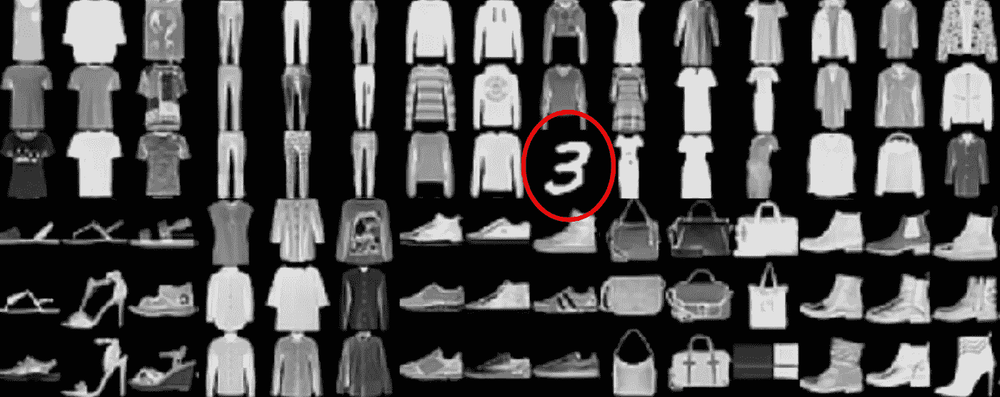
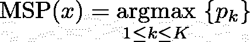
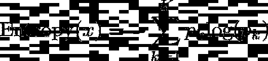
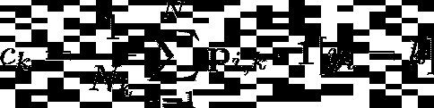
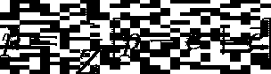
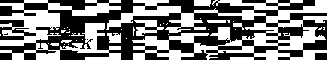
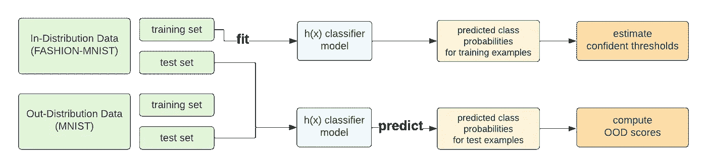
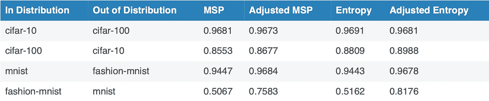
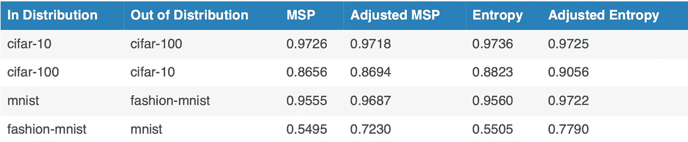

# 简单的调整改进了任何分类器的分布外检测

> 原文：<https://pub.towardsai.net/a-simple-adjustment-improves-out-of-distribution-detection-for-any-classifier-5e96bbb2d627?source=collection_archive---------0----------------------->

*作者:乌莉娅娜·特卡琴科，乔纳斯·穆勒，柯蒂斯·g·诺斯卡特*

作者原创图片

任何试图在真实世界数据集(不是我们在学校工作的完美策划的数据)上训练 ML 模型的人可能都处理过数据中的异常值。大多数异常值和非分布(OOD)检测算法的问题是，它们做了一个很大的假设，即一个模型在所有类别中都是一样有信心的，但大多数时候，这个假设是错误的。例如，在 ImageNet 上训练的模型通常对`bananas`过于自信(预测概率接近 1 ),但对数据集中十个不同但非常相似的`lizard`类信心不足(预测概率低，接近 0)。

在本文中，我将向您展示一种**对模型预测概率的新颖而简单的调整，这种调整可以通过基于真实世界数据训练的模型来改进 OOD 检测**。这里第一次介绍，这种独特的方法植根于理论，只需几行代码就可以运行。

## 背景

识别测试数据中并非源于训练数据分布的异常值对于部署可靠的机器学习模型至关重要。虽然已经提出了许多特殊的(例如，生成的)模型来用于这种分布外(也称为异常/新奇)检测的任务，但是这些模型通常专用于特定的数据类型，并且实现起来并不简单。取而代之的是，更简单的食品检测方法已经变得相当 popular⁴ ⁶.，这种方法对带有类别标签的数据使用已经训练好的分类器 KNN distance⁵ ⁷和 Mahalanobis 距离⁴等方法利用训练好的神经网络的中间特征表示来识别 OOD 实例。

一个更简单的方法是仅使用由训练的分类器输出的预测的类概率，并量化它们的不确定性作为明显性的度量。两种特别流行的面向对象方法是最大软最大概率(MSP)⁶或 Entropy⁴ ⁵.与大多数其他方法相比，MSP 和熵需要更少的模型信息，并且需要更少的计算来识别异常值。在这里，我们介绍一个简单的改进这些基线方法，以提高其有效性。

# 基于基线预测的 OOD 检测方法

考虑图像`x`和分类器模型`p = h(x)`，其中`p`是该图像属于每个类别`k ∈ {1,…,K}`的模型预测概率向量。基于`p`，可以[为`x`计算](https://arxiv.org/pdf/1610.02136.pdf)两个简单的 OOD 分数。

**最大软最大概率(MSP)** —量化模型在其预测的最可能类别中的置信度:

示例 x 的 MSP 分数

**熵** —量化模型的概率预测在所有 K 类中的平均分布程度:

示例 x 的熵值

尽管事实上这些分数没有明确地估计认知 uncertainty⁴.，但是已经显示出这些分数对于检测 OOD images⁶非常有效

# 改进基线方法的简单调整

模型预测概率`p`会受到估计误差的影响。经过训练的模型可能会偏向于预测特定的类，尤其是当原始数据集中的类不平衡时。为了解决这些问题，我们使用*类置信阈值⁴* 来调整预测概率，根据调整后预测的 MSP/熵形成新的 OOD 分数。

## 计算类别置信度阈值

设`yᵢ`表示我们训练数据中第 I 个例子的类别标签，而`pᵢₖ`表示这个例子`xᵢ`属于类别`k`的概率。根据我们的模型，我们计算一个*置信阈值*向量，其第 k 个元素定义为:

类别`k`的置信阈值，其中`Nₖ`表示标记为类别`k`的训练样本的数量

置信度阈值是我们的模型在标记为某类的示例中预测的该类的平均概率。因此，该向量代表了我们的模型预测特定类别(例如标记为该类别的示例)的倾向，并已被证明是确定概率预测可靠性的自然阈值⁴.

## 调整噪声的模型预测概率

对于任何新的示例`x`，其预测的概率向量`p = h(x)`随后由类别置信度阈值调整如下:

由类别置信度阈值调整的预测概率向量

这里,`cࠡ`是置信阈值向量中的最大值(以确保非负概率),而`Z`是归一化常数(以确保所有类别的概率总和为 1):

最大置信阈值向量`cࠡ` 和归一化常数`Z`

值得注意的是，虽然置信阈值向量`c`总是使用训练预测的概率和标签来计算。可以使用这些阈值来调整任何模型输出预测概率(即，对于额外的测试数据)。

## 计算调整后的 OOD 分数

通过简单地将调整后的预测概率`p̃`代替`p`插入各自的 MSP/熵公式中，就可以提高`x`的 OOD 分数。因此，这种调整后的 OOD 检测过程仍然非常简单，并且易于在实际部署中实现。

## 基准绩效

遵循标准的 OOD 基准程序，现有的图像分类数据集被成对分组，其中:一个数据集用于训练 Swin Transformer⁸分类器，并被视为分布内训练数据，而第二个数据集的样本与第一个数据集的测试数据混合(以 50-50 的比例)作为分布外图像。每种 OOD 评分方法都应用于测试集中的所有图像(不知道它们的来源或标签),以产生这些图像的等级，我们使用 AUROC 评估这些分数检测 OOD 示例的程度。

作者的原始图像，用于评估食品检测分数的输入/输出分布数据设置

我们基于流行的图像分类数据集考虑两种不同的 OOD 检测问题:CIFAR-10⁵对 CIFAR-100⁵和 MNIST⁶对 FASHION-MNIST⁷.我们的第一个基准依赖于这些数据集的原始版本，其中类自然以相等的比例出现。

我们还运行了第二个基准测试，其中我们在每个训练集中引入了类别不平衡。这里，我们为 CIFAR-10、MNIST 和时尚-MNIST 创建新的不平衡训练集，其中在每个训练集中:6 个类每个包含总样本的 2 %, 4 个类每个包含样本的 22%。我们还为 CIFAR-100 创建了一个不平衡的训练集，其中 90 个类每个都有 0.63%的样本，10 个类每个都有 4.25%的样本。这使我们能够评估我们的 OOD 分数在标记的训练数据中以不相等的比例出现的设置中的表现，这在现实世界的应用中是常见的情况。

## 改进基线方法结果

表 1 和表 2 列出了针对每个基准设置，通过调整和原始(未调整)OOD 评分方法实现的 AUROC 性能。对于许多 in-distribution / OOD 数据集对，我们提出的调整带来了明显的改善。

表 1:原始(平衡)数据集的分布外检测性能(AUROC)(越高越好)。

表 2:不平衡数据集的分布外检测性能(AUROC )(越高越好)。

只需对训练好的分类器输出的预测概率进行微小调整，熵和基于 MSP 的分布外检测分数的性能都得到了提高。

在任何数据集上运行该 OOD 方法的代码已经在[这里](https://github.com/cleanlab/cleanlab/blob/master/cleanlab/outlier.py)可用。

# 参考

[1]杨军，周，王，李，刘.广义非分布检测综述. *arXiv:2110.11334* 。2021.

[2] Ran，x，Xu，m .，Mei，l .，Xu Q，和 Liu Q .通过具有可靠不确定性估计的变分自动编码器检测非分布样本。*神经网络*。2022.

[3]曹，s .和张，z .用于分布外检测的深度混合模型.IEEE/CVF 计算机视觉和模式识别会议文集。2022.

[4] Kirsch，a .，Mukhoti，j .，van Amersfoort，j .，Torr，P. H. S .，和 Gal，y .关于食品检测中的缺陷:熵被认为是有害的。*深度学习中的不确定性和鲁棒性 ICML 研讨会*。2021.

[5] Kuan，j .和 Mueller，j.《回到基础:再访分布外检测基线》。*关于分配转移原则的 ICML 研讨会。* 2022 年

[6] Hendrycks，d .和 Gimpel，k.《在神经网络中检测错误分类和非分布样本的基线》.在 2017 年国际学习代表大会上。

[7] Angiulli，f .和 Pizzuti，c.《高维空间中的快速异常值检测》。2002 年欧洲数据挖掘和知识发现原理会议。

[8] Lee，k .、Lee，k .、Lee，h .和 Shin，j.《用于检测分布外样本和对抗性攻击的简单统一框架》。神经信息处理系统进展，31，2018。

[9] Fort，s .，Ren，j .和 Lakshminarayanan，b.《探索分布外检测的极限》。神经信息处理系统进展，34，2021。

[10] Krizhevsky，a .从微小图像中学习多层次特征。2009.

[11]邓，l .用于机器学习研究的手写数字图像 mnist 数据库.IEEE 信号处理杂志，29(6):141–142，2012

[12] Xiao，h .，Rasul，k .和 Vollgraf，R. Fashion-mnist:一种用于机器学习算法基准测试的新型图像数据集。arXiv 预印本 arXiv:1708.07747，2017。

[13] Liu，z .，Lin，y .，Cao，y .，Hu，h .，Wei，y .，Zhang，z .，Lin，s .，和 Guo，B. Swin transformer:使用移位窗口的分层视觉转换器。2021 年 IEEE/CVF 计算机视觉国际会议论文集。

[14] Northcutt C，Jiang L，Chuang I .自信学习:估计数据集标签中的不确定性.人工智能研究杂志。2021.