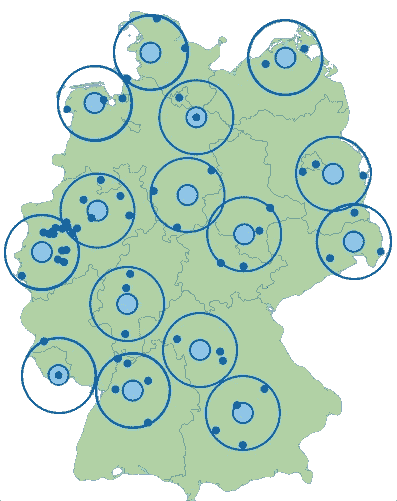

# 一种简单可扩展的数据摘要聚类算法

> 原文：<https://pub.towardsai.net/a-simple-and-scalable-clustering-algorithm-for-data-summarization-5eb7e20ad037?source=collection_archive---------3----------------------->


【来源:[https://D1 m 75 rqqgidzqn . cloudfront . net/WP-data/2020/01/17162345/clustering-algorithms-in-Machine-learning . jpg】](https://d1m75rqqgidzqn.cloudfront.net/wp-data/2020/01/17162345/clustering-algorithms-in-Machine-Learning.jpg)

## [机器学习](https://towardsai.net/p/category/machine-learning)

## 冈萨雷斯启发式搜索 *k* 中心

# 介绍

在大数据时代，设计以有意义的方式总结数百万个数据点的高效程序的需求比以往任何时候都更加迫切。最成功的方法之一是[](https://en.wikipedia.org/wiki/Cluster_analysis)**[**无监督学习框架**](https://en.wikipedia.org/wiki/Unsupervised_learning) 。粗略地说，假设有一些点与点之间的距离的概念来捕捉两个点有多相似或不相似，那么聚类算法的目标如下:**

> **聚类算法计算给定点的一个小子集，该子集可以作为所有点的一组**代表**。**

**让我们试着让事情更正式一点。假设我们有 N 个点**

***{p(1)，p(2)，…，p(N)* }，**

**并且它们之间的距离的一些概念被表示为**

***D(p(i)，p(j))* ，对于 *1 ≤ i，j ≤ N* 。**

**我们重申，在高层次上，我们希望做到以下几点:**

> **在{p(1)，…，p(N)}中选择 k 个点，这些点以尽可能好的方式总结了所有点。**

**我们现在讨论“以最好的方式总结”是什么意思。量化一组 *k* 中心是否良好的标准方法是通过定义一个成本函数，该函数以某种方式总结了所有点到所选中心中最近的中心的距离。更正式地说，给定一组 *k* 中心的 *C* ，通常会研究三个主要目标。**

*   **[*k*-中值](https://en.wikipedia.org/wiki/K-medians_clustering)目标:这里我们最小化 *C* 中每个点到其最近中心的平均距离(对应于*L1*-最小化)。**
*   **[*k*-意为](https://en.wikipedia.org/wiki/K-means_clustering)目的:这里我们最小化 *C* 中每个点到其最近中心的均方距离(对应*L2*-最小化)。**
*   **[*k*-中心](https://en.wikipedia.org/wiki/Metric_k-center)目标:这里我们最小化 *C* 中一个点到其最近中心的最大距离(对应于*l-无穷大*-最小化)。**

**在本文中，我们关注最后一个目标，提出一个非常简单快速的算法，由 [Teofilo Gonzalez](https://en.wikipedia.org/wiki/Teofilo_F._Gonzalez) 于 1985 年提出，假设 P 不等于 NP，该算法恰好为问题提供了一个紧近似因子。**

# **k 中心问题**

**我们感兴趣的是下面这个问题，被称为 *k* 中心问题。输入包括**

*   **度量空间【T20(P，D)】，其中 *P = {p(1)，…，p(N)}* 是一组 *N* 点， *D* 是这些点之间的距离函数，并且**
*   **整数参数 *k* ，表示允许我们开设的中心数量。**

**目标是计算具有 *k* 个点的 *P* 的子集 *C* ，使得任何点到 *C* 的最大距离最小。更正式地，给定子集 *C* 的目标等于 *P* 中所有点 *p* 上的 *max D(p，C)* ，其中 *D(p，C) := min{ D(p，c): c in C }，*并且目标是最小化这个目标函数*。***

**一个等价的，也许更简单的表述目标的方法是:计算一个子集*C*P，它有 *k* 个点和最小可能半径 *r* ，这样如果我们考虑半径 *r* 的球在 *C* 中的点周围，这些球的并集覆盖了 *P* 中的所有点。在数学符号中，这将意味着 *{p: D(p，C) ≤ r} = P* 。**

****

**k = 15 时 k 中心实例和中心选择的示例[来源:[https://www-M9 . ma . tum . de/games/kcenter-game/img/kcenter . png]](https://www-m9.ma.tum.de/games/kcenter-game/img/kcenter.png)**

# **冈萨雷斯启发式**

**设 *P = {p(1)，…，p(N)}* 表示输入点集。Gonzalez 启发式算法是一种贪婪算法，它首先选择一个任意中心，然后为了进行下一次中心选择，它会选择离目前选择的点最远的点。就这么简单！**

**我们现在用伪代码描述这个算法。**

```
1\. Let Z = P;  S = emptyset;
2\. Select an arbitrary point p of P;
3\. Set Z = P - {p};  S = S + {p};
4\. For i = 2,...,k:
      Let p' be a point in Z that maximizes D(p',S);
      Set Z = Z - {p'};   S = S + {p'};
5\. Return S;
```

****观察:**假设两点之间的距离可以在常数时间内计算出来，算法的总运行时间为 *O(nk)* 。**

**实际上，这是一种非常快速且易于实现的算法，可扩展并可应用于非常大的数据集。除了速度之外，假设 P 不等于 NP，它也恰好是该问题的理论上的最优算法。更准确地说，我们现在将对它进行理论分析，并表明它总是成功地返回一个其成本与最佳成本相差在 *2* 以内的解决方案；换句话说，就是一个 *2* - [的近似算法](https://en.wikipedia.org/wiki/Approximation_algorithm)。此外， *2* 的这个因子是紧的，意味着假设 P 不等于 NP，人们不能期望更好的近似因子；Hsu 和 Nemhauser (1979)证明了这一结果。**

> **注:如果你有兴趣了解更多关于近似算法的知识，你可以在这里查看我的一篇文章。**

## **定理:Gonzalez 启发式算法是 k 中心问题的 2-近似算法。**

**为了证明上述定理，我们用 OPT 来表示给定情况下的最优成本。设 *c(1)，…，c(k)* 是具有相应聚类 *C(1)，…，C(k)* 的中心的最优选择；换句话说，每个聚类 *C(i)* 包含与任何其他 *c(j)* 相比更接近 *c(i)* 的所有数据点，对于不同于 *i* 的 *j* ，任意地打破束缚。设 *s(1)，…，s(k)* 为冈萨雷斯启发式算法的选定中心，以算法选择它们的顺序给出。我们将展示半径为 *2* 的球选择围绕点 *{s(1)，…，s(k)}* 覆盖所有数据点。我们做一些案例分析:**

****(1)** 假设每个点 *s(i)* 都属于最优解的一个截然不同的簇。换句话说，假设算法计算的点集 *{s(1)，…，s(k)* }会“命中”最优解的每个聚类。对于每一个 *i = 1，…，k* ，设 *g(s(i))* 表示最接近 *s(i)* 的最优解的中心。通过前面的讨论，我们有 *{g(s(1))，g(s(2))，…，g(s(k))} = {c(1)，…，c(k)}* 。**

**而且，对于每一个 *i* ，我们有 *D(s(i)，g(s(i))) ≤* OPT，因为我们假设 *{c(1)，…，c(k)}* 是中心的最优选择。因此，对于每个 *i* ，我们知道簇*C(g(s(I)))】*中的每个点都在距离 *s(i)* 的 *2* OPT 之内，因为对于簇*C(g(s(I))))*中的每个点 *p* ，通过三角形不等式我们知道 *D(s(i)，p) ≤ D(s(i)，g 我们得出结论，每个点都在距离选定中心 *2* OPT 的范围内。***

****(2)** 假设在某次迭代 *i* 中，点 *s(i)* 属于一个最优聚类 *C(j)* 已经被算法在某次先前迭代 *t < i* 中选择的某个点 *s(t)* 所“命中”。由于 *s(i)* 和 *s(t)* 属于同一个簇 *C(j)* ，由三角形不等式可知**

***D(s(i)，s(t)) ≤ D(s(i)，c(j)) + D(c(j)，s(t))≤*OPT*+*OPT*= 2*OPT。**

**通过算法做出的贪婪选择，在第 *i* 次迭代开始时，算法在迄今为止尚未选择的所有点中选择了与集合 *{s(1)，…，s(i-1)}* 具有最大可能距离的点。上面的计算现在意味着这个距离最多是 *2* 最优。这意味着所有剩余的点距离选定的中心最多 *2* OPT。**

**在这两种情况下，我们显示所有点都在距离所选中心组 *2* OPT 的范围内。因此，该算法实际上是一个针对中心问题的近似算法。**

# **结论**

**在这篇短文中，我们描述了一种非常简单的贪婪聚类方法，这种方法被证明是非常高效和快速的。该算法的任何合理实现都可以轻松扩展到数百万个点，因此它提供了一种非常方便的方式来获得大数据集的小摘要！作为一个额外的奖励，它是理论上最干净和最容易分析的算法之一，并且它给出了问题的一个紧密的近似因子！你还能要求什么？！**

## **参考**

*   **Teofilo F. Gonzalez:最小化最大集群间距离的集群。Theor。计算机。Sci。38: 293–306 (1985)**
*   **许文莲，乔治. l .内姆豪泽:简单和困难的瓶颈选址问题。谨慎。应用数学。1(3): 209–215 (1979)**