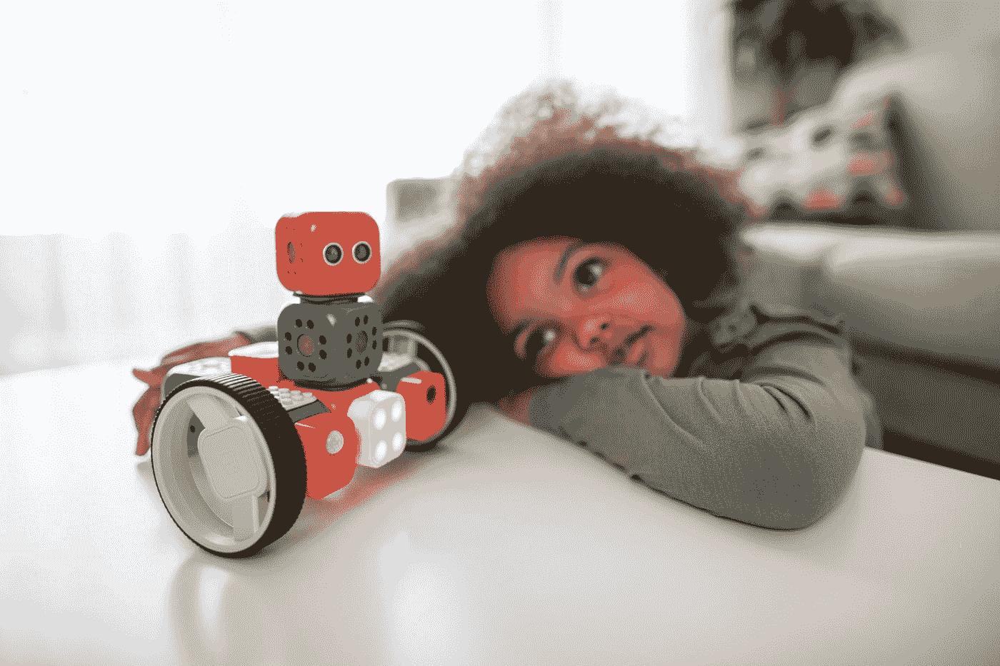

# 定义人类和人工智能的简单方法

> 原文：<https://pub.towardsai.net/a-simple-approach-to-define-human-and-artificial-intelligence-4d91087d16ff?source=collection_archive---------3----------------------->

费利克斯·米特迈尔在 [Unsplash](https://unsplash.com?utm_source=medium&utm_medium=referral) 上的照片

## [人工智能](https://towardsai.net/p/category/artificial-intelligence)，[观点](https://towardsai.net/p/category/opinion)

## 在你开始担心人工智能之前，你应该考虑分析人类智能和人工智能之间的关系。

我最近开始在麻省理工学院(MIT)学习一门令人兴奋又令人困惑的哲学在线课程，名为思维与机器。

该课程是一个全面、严谨的 12 周学习路径，介绍当代心灵哲学，探索意识、现实、人工智能(AI)等。这无疑是我经常光顾的最深入的在线哲学课程之一。

在麻省理工学院开始学习哲学的第一个效果是，我提出了更具挑战性的问题……第二个效果是，我写了更多关于这些问题的文章。

此时此刻，我正在探索精神和身体之间的关系，计算机思考的能力，我们感知现实的方式，以及对意识科学存在的看法。

作为第一个结果，我开始特别关注一个与我作为人工智能专家的日常工作密切相关的具体问题:什么是智能？

在本文中，我将探讨人类和人工智能的概念，以找到相关的相似之处和不同之处。

[克劳福德·乔利](https://unsplash.com/@crawford?utm_source=medium&utm_medium=referral)在 [Unsplash](https://unsplash.com?utm_source=medium&utm_medium=referral) 上的照片

# 一个很久的问题…

建造能够模拟生物运动的装置的想法可以追溯到旧石器时代晚期，特别是人类完全自主的运动。

制作带有活动手臂的原始玩偶是模仿生物姿态的最初尝试之一。阿基米德是这种新“艺术”的大师。

奇异的文学，今天被称为科幻小说，推测人造的有知觉的生物可以被制造出来。

近几十年来，机器人技术使科幻小说成为一门成熟的科学，被称为“人工智能”或机器人技术。

这些研究的目的是创造一个具有决策能力和随意移动的有知觉的生物——一个有知觉的生物，并且在一定程度上独立于人类。，但这里真正的问题是…

沃洛季米尔·赫里先科在 [Unsplash](https://unsplash.com?utm_source=medium&utm_medium=referral) 上的照片

# 什么是智能？

智力一词来自拉丁语 intelligentĭa，而后者又来源于 inteligere。这是一个由另外两个术语组成的词:*intus*(“between”)和*Legere*(“choose”)。所以，智力的词源学起源[指的是懂得选择的人:智力允许选择/选出解决一个问题的最佳选项。](https://www.bartleby.com/essay/Description-Of-The-Word-Of-Intelligence-PKQSQDKVG5YW)

智力是形成个人所有智力特征的集合，也就是说，认识、理解、推理、思考和解释的能力。智力是人类和其他动物的主要区别之一。

从词源上看，“智能”一词源于拉丁语*intelli TIA*，由 *intelligere* 创造而来，其中前缀 *inter* 意为“之间”，而 *Legere* 意为“选择”因此，这个术语的原意是指个人在呈现给他的各种可能性或选项中进行选择的能力。

为了在各种选择中选择最佳和最合适的机会，一个人需要最大限度地评估假设的所有优点和缺点，这需要推理、思考和理解的能力，也就是形成智力的基础。

在构成智力的能力中，还有记忆、判断、抽象、想象和概念的功能和使用。

智力的概念和定义根据他们所指的群体而有所不同。比如在心理学中，所谓“心理智能”就是学习和关联的能力，即个体的认知；而在生物学领域，“生物智能”将是适应新的栖息地或情况的能力。

在 [Unsplash](https://unsplash.com?utm_source=medium&utm_medium=referral) 上由 [Austin Distel](https://unsplash.com/@austindistel?utm_source=medium&utm_medium=referral) 拍摄的照片

# 智力类型

然而，当观察到智商低，但在职业生涯中取得巨大成功的人时，智商的概念开始受到质疑。与此同时，被认为“更聪明”的人面临着可怕的情况。

心理学家[哈沃德·加德纳](https://scholar.google.se/citations?user=1wy2kLAAAAAJ&hl=en&oi=sra)提出了 [**多元智能**](https://d1wqtxts1xzle7.cloudfront.net/53347555/2011_MI_Chapter_24_Cambridge_Handbook_of_Intelligence.pdf?1496263682=&response-content-disposition=inline%3B+filename%3DThe_Theory_of_Multiple_Intelligences.pdf&Expires=1606585645&Signature=IrU-nFCtYZUWsue8Mf4LzL6VnbhWfzoDcEQiBpKxdbQ1HJpeTNR4kK-c0ZccveHEJlMMGjeQdIYHKxSjQ8DCl3kz8lLHL7QtOg2sxdZZUkLGf0Y4hEQLCph~BilLhaH0HJE-IzUIpeq9LdtVz95QqQA18IDvshMbMWyuPD~qMoU8MrvDCRXoCNJiHKcK0l1sqM0x2JvjqKnbaj36PxLMCqMyfCPmatX4VCSWtzHUtA3~UFBeqmlvGg8Q3uZS0POqrh1dyMc1gSUNUjdkO3xDhDqK7~~ZihpYDbw2B99tO0okdooa0ujnWbqNCqBeURHiwtj~STaqMWj8YS0rkaMT4Q__&Key-Pair-Id=APKAJLOHF5GGSLRBV4ZA) 理论，该理论声称，智力是大脑内存在的至少八个不同心理过程的集合。

根据这一理论，每个人都有一点这种“智慧”在一些人中，总有一种特定类型的过程比其他人更发达，使其在特定领域或活动领域中脱颖而出。

*   **语言智能**:能够通过口头和书面轻松表达自己的人。除了注意力高度集中之外，智力更发达的人更容易学习其他语言。
*   **逻辑智能**:在一般逻辑工作中，如数学运算或科学工作中，容易运用逻辑的人。他们通常记忆力很好，能快速解决复杂的问题。他们也可以被认为更有组织性和纪律性。
*   **空间智能**:容易理解和操纵视觉世界的人，如 2D 或 3D 图像。建筑师和图形艺术专业人士很好地发展它们。
*   **运动智能**:能用身体完成复杂动作的人对空间、距离和环境深度有着奇妙的概念。
*   音乐智能:除了创作新歌或和声之外，还能快速识别和再现不同类型声音模式的人。这是人类中罕见的智慧之一。
*   **人际智能**:容易领导的人，基于对观点和他人意图的理解。他们被认为是非常活跃的人，享受责任，并发现很容易说服别人做他们想做的事。
*   **内省智能**:能够观察、分析和理解自己的人。他们也可以影响人，但更主观，用想法而不是行动。
*   自然智能:能够快速识别和区分自然界中不同模式的人。

由 [Unsplash](https://unsplash.com?utm_source=medium&utm_medium=referral) 上的[摄影板](https://unsplash.com/@aplaceforcreation?utm_source=medium&utm_medium=referral)拍摄

# 情商

情商的概念存在于心理学中，是由美国心理学家丹尼尔·戈尔曼创造的。

一个情商高的人能够识别自己的情绪，即使在令人沮丧的情况下也能激励自己坚持自己的目标。

情商的其他特征包括控制冲动，将情绪引导到适当的场合，激励他人，练习感恩，以及其他可以鼓励他人的品质。

照片由 [NeONBRAND](https://unsplash.com/@neonbrand?utm_source=medium&utm_medium=referral) 在 [Unsplash](https://unsplash.com?utm_source=medium&utm_medium=referral) 上拍摄

# 人工智能

智慧是指知道如何选择最佳方案来解决某个问题。根据它们的属性和过程，有几种智能类型，如[生物智能](https://edukalife.blogspot.com/2015/07/what-is-meaning-of-artificial.html)，操作智能[，心理智能](https://edukalife.blogspot.com/2015/07/what-is-meaning-of-artificial.html)。

人工智能也是一个形容词，用来形容手工、艺术或人类的创造力。人造的也可以指非自然的或虚假的东西。

人工智能是关于由人类创造的构成非生命理性代理的特定系统而开发的。在这种情况下，理性被理解为最大化预期结果的能力。

因此，人工智能包括设计当在物理架构上执行时产生最大化性能的结果的设计。

这些是基于由所述架构感知和存储的特定条目序列的过程。

具有人工智能的设备可以执行类似于人类行为的各种过程，例如对每个输入执行响应，根据动作在所有可能的状态中搜索状态，或者通过形式逻辑解决问题。

《人工智能》也是史蒂文·斯皮尔伯格的电影，他的处女作发生在 2001 年。他的论点是基于一个机器人的故事，当它被创造出来代替人类的孩子时，会表现出有感情。

人工智能或 AI 是计算机科学的一个分支，研究开发能够模拟人类推理系统(即智能)的技术机制和设备。

与人工智能相关的研究进展缓慢，但它在设备如何解释和合成人类语音或动作方面取得了重大成果。机器达到尽可能接近人类智能的概念还有很长的路要走。

机器人神童在 [Unsplash](https://unsplash.com?utm_source=medium&utm_medium=referral) 上的照片

# 人类智能对人工智能

人工智能和人类智能之间有几个不同之处，从认知到情感和心理问题。

谈人工智能(AI)和人类的差异可以缩小，因为前者是后者创造的。然而，我们将告诉你更多的差异，以便你更好地理解人工智能几乎不可能超越人类的自然智能，人类的自然智能研究认知功能，如记忆、解决问题、学习、规划、语言、推理和感知。

尽管今天两者都在改善社会方面发挥着巨大的作用，但还是有明显的不同。

人工智能是人类智慧创造的一项创新，旨在以更少的努力更快地执行特定的任务。

人类智能最擅长多任务处理，可以将情感元素、社会互动和自我意识融入认知过程。后者的特点是高度复杂，如概念形成、理解、决策、沟通和解决问题。它也很大程度上受到主观因素的影响，如动机。

人类智力或 HI 通常通过智商测试来测量，智商测试通常包括工作记忆、语言理解、处理速度和感知推理。

与人类相比，[计算机能以更快的速度处理更多的信息](https://googlewizz.com/artificial-intelligence-v-s-human-intelligence/)。例如，如果人类的大脑可以在五分钟内解决一个数学问题，那么 AI 可以在一分钟内解决十个问题。

> **认为机器会像人一样思考的观点确实揭示了对人类思维本质的误解。尤里克·奈塞尔。**

人工智能在决策方面非常客观，因为它使用纯粹收集的数据进行分析。然而，人的决定会受到不仅仅基于数字的主观因素的影响。

另一个区别可能是，人工智能通常会产生准确的结果，因为它们是基于一套编程规则进行操作的。当涉及到人类智力时，通常会有“人为错误”的空间，因为特定的细节可能会在某一点或另一点丢失。

总的来说，人类的智能在应对环境变化时非常灵活。这使人们能够学习和掌握各种技能。另一方面，人工智能需要更长的时间来适应新的变化。

人类的智力可以支持多任务处理，多样化和同步的角色就是证明。相比之下，人工智能只能同时执行几项任务，因为一个系统一次只能学习一项职责。

人工智能仍然在自我意识方面努力，而人类随着成熟自然地意识到自己，并努力建立自己的身份。

作为人类，考虑到我们可以处理抽象信息，有自我意识，并能感同身受，我们在与他人互动方面要好得多。在它的道路上，人工智能还没有掌握拾取相关社会和情感线索的能力。

人类智能的一般功能是创新，因为它可以创造、合作、产生想法和实施。至于人工智能，它的总体作用更多的是优化，因为它根据它被调度的方式有效地执行任务。这些是机器和人类的主要区别。

[GR Stocks](https://unsplash.com/@grstocks?utm_source=medium&utm_medium=referral) 在 [Unsplash](https://unsplash.com?utm_source=medium&utm_medium=referral) 上拍照

# 结论

与人类能够思考的时间相比，智能机器能够达到人类智能水平的想法相对较新。然而，先进的技术不仅应用于计算机科学，而且应用于生物学和工程学等领域，已经成为我们社会的基础。

但是，从计算机系统模拟人类智能成为一个具有挑战性的目标，以创造敏感和可进化的机器。
在建立人类智能和人工智能之间的关系时，我们必须从一个假设出发，即存在一个计算模型，我们有更多关于它的操作和记忆能力的信息，这可能导致我们以一种普遍的方式考虑人工智能在未来是否会超越人类智能的可能性。

人类智能的一般功能是创新，因为它可以创造、合作、产生想法和实施。至于人工智能，它的总体作用更多的是优化，这些可以被认为是机器和人类之间的主要区别。

# 参考资料:

*   智能一词的描述— 900 字|巴特比。[https://www . Bartleby . com/essay/Description-Of-The-Word-Of-The-Of-Intelligence-pkqsqdkvg 5 yw](https://www.bartleby.com/essay/Description-Of-The-Word-Of-Intelligence-PKQSQDKVG5YW)
*   人工智能的意义是什么…[https://edukalife . blogspot . com/2015/07/what-is-meaning-of-artificial . html](https://edukalife.blogspot.com/2015/07/what-is-meaning-of-artificial.html)
*   人工智能 V/S 人类智能！— Google-Wizz。[https://Google wizz . com/artificial-intelligence-v-s-human-intelligence/](https://googlewizz.com/artificial-intelligence-v-s-human-intelligence/)
*   你有多聪明？问题 5 —你是…[https://www.quizony.com/what-kind-of-smart-are-you/5.html](https://www.quizony.com/what-kind-of-smart-are-you/5.html)
*   人工智能和人类的区别…[http://www . author stream . com/Presentation/fuge NX 2008-4014030-差异-人工智能-人类/](http://www.authorstream.com/Presentation/FuGenx2008-4014030-difference-artificial-intelligence-human/)
*   人工智能和人类的区别…[http://www . difference between . net/science/difference-been-artificial-intelligence-and-human-intelligence/](http://www.differencebetween.net/science/difference-between-artificial-intelligence-and-human-intelligence/)
*   哈沃德·加德纳， [**多元智能理论**](https://d1wqtxts1xzle7.cloudfront.net/53347555/2011_MI_Chapter_24_Cambridge_Handbook_of_Intelligence.pdf?1496263682=&response-content-disposition=inline%3B+filename%3DThe_Theory_of_Multiple_Intelligences.pdf&Expires=1606585645&Signature=IrU-nFCtYZUWsue8Mf4LzL6VnbhWfzoDcEQiBpKxdbQ1HJpeTNR4kK-c0ZccveHEJlMMGjeQdIYHKxSjQ8DCl3kz8lLHL7QtOg2sxdZZUkLGf0Y4hEQLCph~BilLhaH0HJE-IzUIpeq9LdtVz95QqQA18IDvshMbMWyuPD~qMoU8MrvDCRXoCNJiHKcK0l1sqM0x2JvjqKnbaj36PxLMCqMyfCPmatX4VCSWtzHUtA3~UFBeqmlvGg8Q3uZS0POqrh1dyMc1gSUNUjdkO3xDhDqK7~~ZihpYDbw2B99tO0okdooa0ujnWbqNCqBeURHiwtj~STaqMWj8YS0rkaMT4Q__&Key-Pair-Id=APKAJLOHF5GGSLRBV4ZA)
*   奈塞尔，乌里克。"机器对人的模仿。"*科学* 139，第 3551 号(1963):193–97。2020 年 11 月 28 日访问。[http://www.jstor.org/stable/1710006.](http://www.jstor.org/stable/1710006.)