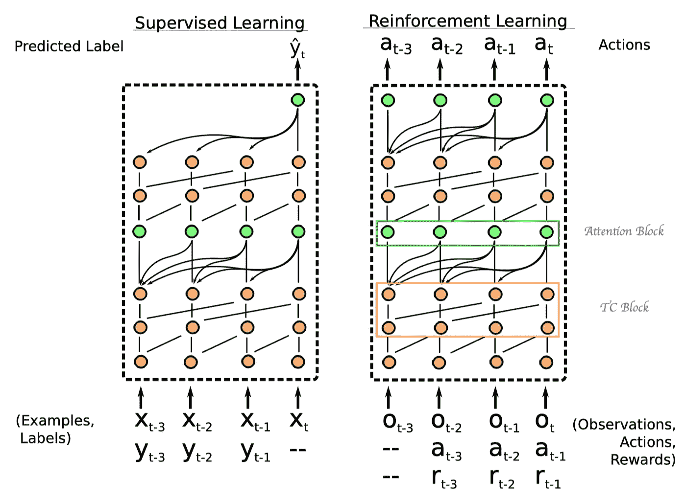
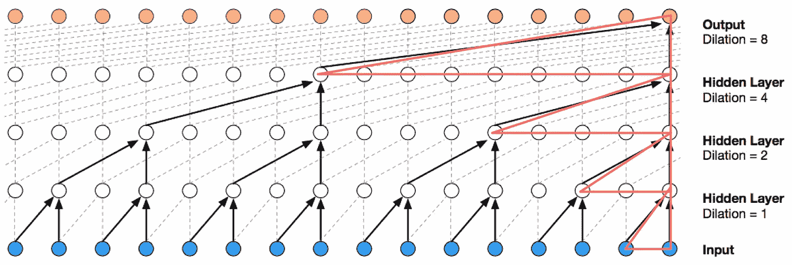
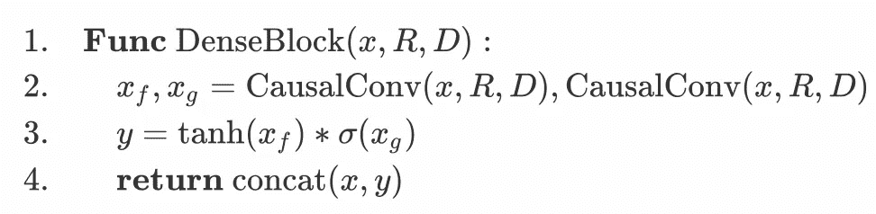
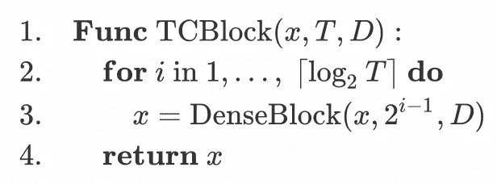

# 一个简单的神经注意力元学习者——蜗牛

> 原文：<https://pub.towardsai.net/a-simple-neural-attentive-meta-learner-snail-1e6b1d487623?source=collection_archive---------0----------------------->

一只攀爬的蜗牛试图看看外面的世界|来源:Pinterest

## 潜入蜗牛| [向着艾](https://towardsai.net)

# 介绍

传统的强化学习算法训练一个智能体去解决一个单一的任务，期望它能很好地推广到来自相似数据分布的未知样本。元学习训练元学习者如何分配相似的任务，希望通过学习一种捕捉到要求它解决的问题的本质的高级策略，将其概括为一种新颖但相关的任务。

闫端等人在 2016 年构造了一个元学习器，即 RL，作为一个递归神经网络，除了正常接收的观察值外，它还接收过去的奖励，动作和终止标志作为输入。尽管这种方法简单且普遍，但在实践中却很难令人满意。Mishara 等人假设，这是因为传统的 RNN 架构通过将信息从一个时间步长到下一个时间步长保持在隐藏状态来传播信息；这种时间线性依赖性限制了它们对输入流执行复杂计算的能力。相反，他们提出了一个**S**simple**N**eural**A**ttent**I**ve meta-**L**leaker(蜗牛),它结合了时间卷积和自我关注，从收集的经验中提取有用的信息。这个通用模型已经在各种实验中显示了它的功效，包括一些拍摄的图像分类和强化学习任务。

在本文中，我们将首先介绍 SNAIL 的结构组件，特别是时间卷积和注意力。然后我们讨论它们的优缺点，看看它们是如何互补的。像往常一样，这篇文章以讨论我自己的想法结束。

## 简单神经注意力元学习者

首先是 SNAIL 的整体架构

图一。绿色节点表示注意块，橙色节点表示时间卷积块。来源:一个简单的神经注意力元学习者

现在让我们更深入地看看每个组件。

**时间卷积**

图二。扩张的因果卷积。来源:wave net:Rar 音频的生成模型

在讨论时间卷积(TC)的结构之前，我们首先引入一个*密集块*，它应用一个具有内核大小 *2* 、膨胀率 *R* 和 *D* (例如 16 个)滤波器的单个因果 1D 卷积，然后将结果与其输入连接起来。

密集块的伪代码

因果 1D 卷积滤波器由图 2 中的红色三角形表示，膨胀率从上到下为 8，4，2，1。请注意，1D 卷积应用于序列维度，数据维度被视为通道维度。因果卷积有助于概括时间信息，就像二维卷积概括空间信息一样。在第三行中，我们使用门控激活功能，这已经在 LSTM 和 GRUs 中广泛使用。

TC 块由一系列密集块组成，这些密集块的膨胀率呈指数增加，直到它们的接收场超过期望的序列长度 *T* ，使得最后一层中的节点捕获所有过去的信息。

TC 块的伪代码。

**注意**

注意块执行键值查找；我们在缩放后的点积注意力之后设计这个操作，这已经在[以前的文章](https://medium.com/towards-artificial-intelligence/attention-is-all-you-need-transformer-4c34aa78308f?source=friends_link&sk=a259e84597d542f812a155711e9c8e97)中介绍过，这里，为了完整起见，我们只提供伪代码

注意块的伪代码

请注意，SNAIL 使用密集连接(在密集和注意块的末尾连接 *x* 和 *y* )来防止渐变消失问题。

## 时间回旋与注意的合作

与传统的 rnn 相比，由于扩展的因果卷积支持指数扩展的感受野而不损失分辨率或覆盖范围，时间卷积提供了对过去信息的更直接、高带宽的访问。这允许它们在固定大小的时间上下文上执行更复杂的计算。然而，为了扩展到长序列，膨胀率通常呈指数增长，因此所需的层数与序列长度成对数关系。他们有限的能力和位置依赖性在元学习者中是不受欢迎的，元学习者应该能够充分利用越来越多的经验。

相比之下，软注意允许模型从潜在的无限大的上下文中精确定位特定的信息。然而，缺乏位置依赖性也是不可取的，特别是在强化学习中，观察、动作和奖励本质上是连续的。

尽管存在各自的缺点，但时间卷积和注意力是相辅相成的:前者以有限的上下文大小为代价提供高带宽访问，而后者在无限大的上下文上提供精确访问。通过将 TC 层与因果注意力层交错，SNAIL 可以对其过去的经验进行高带宽访问，而对其可以有效使用的经验数量没有限制。通过在一个端到端训练的模型中的多个阶段使用注意力，SNAIL 可以学习从它收集的经验中挑选出哪些信息，以及容易做到这一点的特征表示。简而言之，时间回旋学习如何聚集上下文信息，注意力从中学习如何提取特定的信息片段。

## 讨论

**蜗牛如何做决定？**

我个人认为 SNAIL 使用 T 大小的小批量做决策，除了上一集的观察-动作对之外，还包括当前的观察。我不明白的是，作者声称蜗牛维持着内部状态:

> *至关重要的是，遵循 meta-RL 中的现有工作(段等人，2016；王等，2016)，我们跨情节边界保留了蜗牛的内部状态，这使得它具有跨越多个情节的记忆。观察结果还包含一个指示发作终止的二进制输入。*

欢迎在 [StackOverflow](https://ai.stackexchange.com/questions/11557/what-is-the-internal-state-of-a-simple-neural-attentive-meta-learnersnail) 上讨论这个问题。

# 参考

严端等 RL:通过慢速强化学习实现快速强化学习

Fisher Yu 等.通过扩展卷积进行多尺度上下文聚合

一个简单的神经注意元学习者

你所需要的只是关注

Aaron van den Oord 等人. wave net:Rar 音频的生成模型