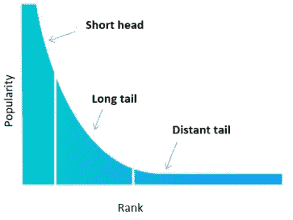
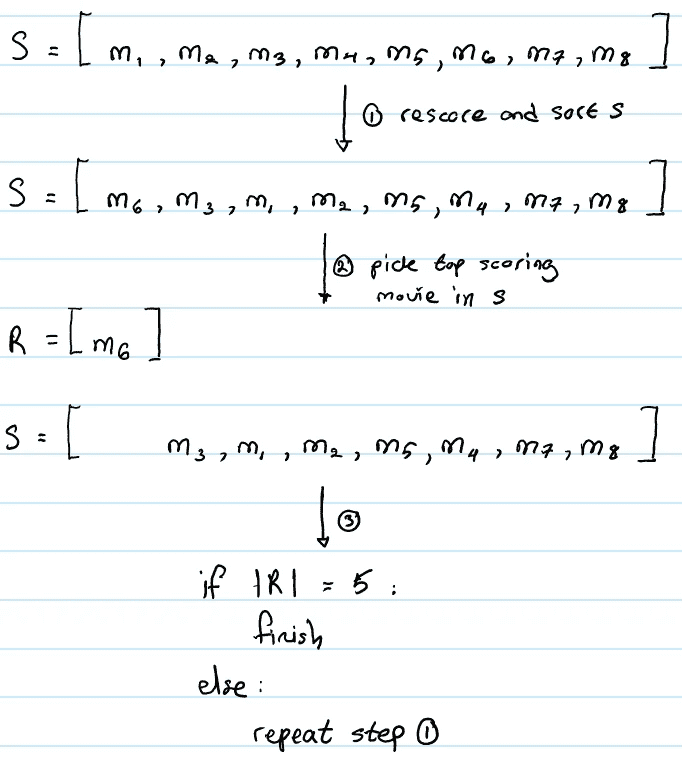
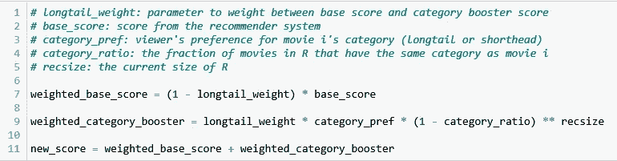
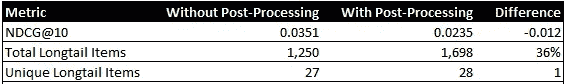

# 一种提高协同推荐系统公平性的简单后处理步骤

> 原文：<https://pub.towardsai.net/a-simple-post-processing-step-to-improve-the-fairness-of-collaborative-recommender-systems-4cfbdb47c4ea?source=collection_archive---------1----------------------->

# 介绍

在本文中，我将描述一种算法，它可以作为一个后处理步骤来减轻基于协同过滤的推荐系统中固有的流行度偏差。本文内容基于[1]的工作。可以在这个[存储库](https://github.com/hsm207/fair-recsys)中找到重现结果和图形的代码。

我假设读者熟悉推荐系统环境中的协同过滤概念。

# 动机

基于协同过滤的推荐系统倾向于强调受欢迎的项目，即接收来自用户的许多交互的项目(例如评级、购买、喜欢)。这是有问题的，原因如下:

1.  不是每个人都想追随主流人群的口味。例如，一些人更喜欢穿小的独立品牌生产的服装，而不是优衣库、安德玛或 Urban Outfitters 的服装
2.  这使得新的或利基生产者很难得到用户的注意，因为他们得到的互动少于受欢迎的生产者得到的互动

也就是说，围绕一堆受欢迎的商品产生推荐是一个不错的策略:如果有相当大一部分人喜欢一件商品，如果你认同这个群体(或者至少发现它与你的需求相关)，你很可能也会喜欢它。

# 问题陈述

为了使事情更具体，我们将遵循[1]并使用[movie lens 2000 万数据集](https://grouplens.org/datasets/movielens/20m/) t 来改变推荐系统，从电影观众和制片人的角度产生更公平的推荐。

我们希望推荐系统产生用户实际上想要观看的 10 部电影推荐，同时平衡显示不太知名(不一定是坏的)电影的需要，以促进观众的新项目发现和对制片人的公平。

# 方法学

## 概观

[1]中提出的解决方案的出发点是根据电影获得的收视率将电影分为“短头”和“长尾”。

短头指的是受欢迎的电影，而长尾是不太受欢迎的电影。值得注意的是，在这种情况下，电影被认为是“长尾”，因为与“短头”电影相比，它的交互次数相对较少。如果一部电影的互动少得多，甚至为零，那么它应该被归类为一个遥远的尾巴，需要另一种推荐技术来呈现给用户。

作者建议按照电影获得的总评分降序排列每部电影，并将总评分的 80%归类为短头，其余归类为长尾。下图有望使这一分类更加清晰:

图 1:根据互动次数对电影进行分类。来源:[1]

推荐系统的设计、构建和测试将照常进行，而不考虑产生公平的推荐。

只有在考试的时候，公平才会发挥作用。在测试时，[1]生成了 100 部潜在电影的列表以推荐给观众。按照下一节描述的步骤，这个列表缩小到 10 部电影。

## 创建建议

假设我们有一组推荐系统认为观众会喜欢的 8 部电影。按照设计，这个列表已经按照最有可能观看的节目进行了排序。我们的任务是确定这 8 部电影中的哪 5 部将真正向观众展示。

图 2 显示了这个选择过程:

图 2:如何创建推荐列表

在图 2 中， *S* 是来自推荐系统的 8 部电影。我们将向观众推荐 5 部电影。我们反复对 *S* 中的电影进行重新评分，去掉得分最高的电影(放入 *R* )，直到 *R* 有 5 部电影。

## 评分功能

上一节提到了在 *S* 中反复重新评分电影的必要性。下面是实现(数学推导可以在[1]中找到):

图 3:如何对电影 I 进行重新评分

在图 3 中的所有术语中，`category_pref`可能需要更多的解释。

假设电影 I 是短头电影，那么`category_pref`是观众对被分类为短头的电影的偏好的度量，这可以根据他们的历史观看作为短头的总观看的分数来估计。当电影 I 是长尾巴电影时，类似的计算也适用。

如果电影的类别与观众的偏好一致，图 3 中的评分功能可以提高电影的评分。例如，如果短头电影的分数为 0.70，但观众对长尾电影的偏好为 0.90，那么如果在 *R* 中没有其他长尾电影，则该电影的新分数为 0.80。这增加了电影 I 作为第一部向观众展示的长尾巴电影被包括在 *R* 中的机会。增强的程度由`longtail_weight`参数控制。

值得注意的是，由于第三项被提升到 *R* 的长度的幂，随着 *R* 变大，`weighted_category_booster`的值迅速下降到 0。

# 结果

我通过首先在 MovieLens 20M 数据集的子集上训练 ALS 模型来测试这种方法的有效性。我使用长尾偏好 0.5 作为分界点，将测试用户分成两组，并从每组中随机挑选 250 个用户。

像[1]一样，我计算了有和没有后处理步骤的 NDCG@10 作为代理，以检查重新排列推荐不会严重损害推荐系统的性能。我通过计算处理之间总的和唯一的长尾电影来评估后处理步骤的影响。结果如下:

图 4:长尾项的后处理步骤的结果

结果与[1]一致:NDCG 指标略有下降，推荐的长尾电影的代表性明显增加。当然，这些结果应该用在线 A/B 测试来验证。

# 结论

本文提出了一个简单的后处理步骤来提高基于协同过滤的推荐系统的公平性。这里提出的思想可以扩展到包括可以有效地描述用户偏好的其他电影特征，例如将对低预算电影的偏好加入到评分函数中，以便更容易向真正喜欢电影的人呈现小众电影。

这个方法非常简单，我真的很想知道它在真实环境中的表现。如果你遇到过已经在生产系统上测试过的类似技术，请在评论中告诉我。

# 参考

[1].[利用个性化重新排序管理推荐系统中的流行度偏差](https://arxiv.org/abs/1901.07555)；Abdollahpouri 等人。艾尔。2019