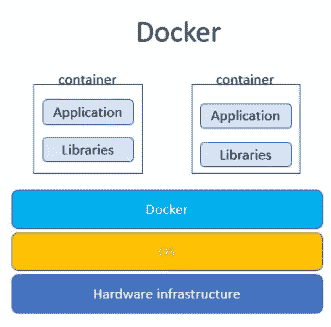
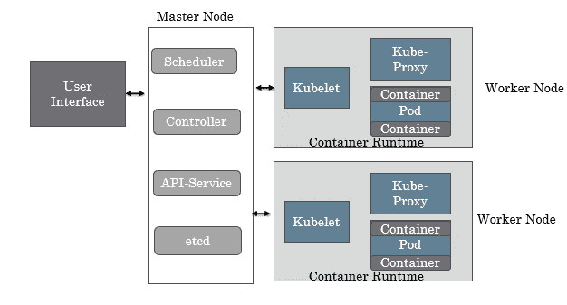
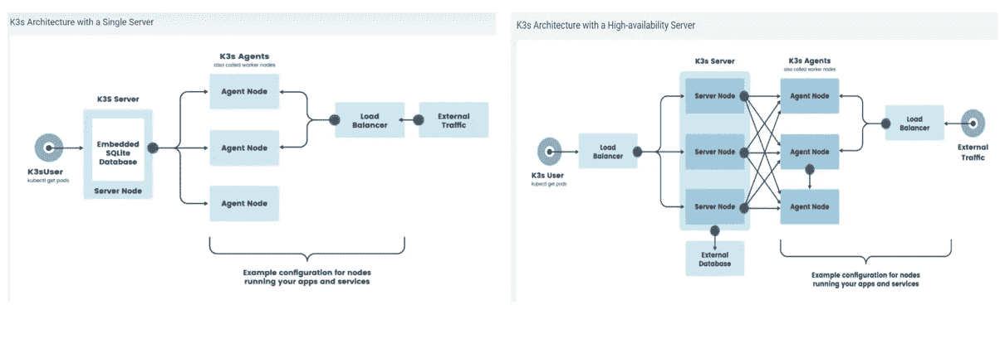

# 对 Kubernetes 的简单概述

> 原文：<https://pub.towardsai.net/a-simplistic-overview-of-kubernetes-e2caac67d6d8?source=collection_archive---------1----------------------->

## [DevOps](https://towardsai.net/p/category/devops)

## Kubernetes- K8s、K3s 和 MicroK8s 的简单易懂指南

***什么是 Kubernetes-K8s，我们为什么需要它们以及 Kubernetes 是如何工作的，什么是 K3s 和 MicroK8s，K3s 和 MicroK8s 的异同？***

***你想运行你的深度学习解决方案的多个实例，有几个组件比如数据。预处理、进行推理，并将信息写入数据库或文件。***

如何轻松扩展和部署您的解决方案？

以下是您在扩展和部署解决方案时需要的一些东西

*   **有效利用硬件计算资源**
*   **平衡负载，分配网络流量，实现稳定部署**
*   **自动管理装载存储系统，帮助进行存储协调**
*   **自动推出和回滚，轻松部署您的解决方案**
*   **为您的解决方案管理高可用性容错**
*   **安全管理密码和证书等敏感信息**
*   **指定应用程序每个组件的 CPU 和内存利用率**

这些都是 Kubernetes 使用**容器提供的特性。**

容器有助于在不同的计算环境中可靠地部署和运行应用程序。



Docker(图片由作者提供)

**容器是标准化的包，由应用程序和运行应用程序所需的所有依赖项组成，如运行时库、系统工具、配置设置等**。多个容器可以运行在共享同一 OS 内核的同一操作系统上。应用程序及其依赖项被打包在它们自己的容器中。

Kubernetes 支持

*   **容器编排**
*   **通过基于资源利用率和利用率规则设置动态添加容器进行部署和扩展**
*   **通过自动备份和替换节点中的故障容器，实现容错/自我修复**
*   **负载均衡**

**Kubernetes 由集群组成，集群是 Kubernetes 架构的基本构建模块。**这些集群由代表单个计算机主机的节点组成。

## 简而言之的库伯内特建筑

Kubernetes 是一个基于节点的架构，包括

*   **用户界面:**包括 kubetcl、CLI(命令行界面)、web 仪表板或 API，用于部署、管理和监控 Kubernetes 的集群资源。
*   **主节点:在控制器、调度器、API 服务器和 etcd** 的帮助下控制和管理工作节点。**连接到用户界面，执行控制平面服务**。这些控制平面服务管理和操作 Kubernetes 集群。
*   **工作节点:接收并执行主节点传达的任务。工作者节点由 Kube-proxy 和 Pod 组成。**



Kubernetes 建筑(图片由作者提供)

## Kubernetes 组件

主节点运行集群。**为了确保集群不会停机，主节点会应用一个复制策略**。**为了实现高可用性，主节点副本被添加到集群中**，因此，如果当前活动的主节点由于某种原因关闭，则副本主节点可以启动并作为新的主节点运行。高可用性模式使所有主节点副本保持同步。

**etcd** :集群的**状态数据存储在 etcd 中，这是一个一致且高度可用的键值存储，用于存储所有集群数据**。在完成任何 API 服务之后，集群的新状态被写入 etcd 密钥存储。

**API 服务** : **API 服务管理主节点的所有管理任务。它提供了支持应用程序生命周期编排的所有 API**。API 服务从用户界面(UI)接收 REST 调用，从 etcd 访问集群状态，在 API 处理完成后，再次更新集群的新状态 etcd 密钥存储。

**调度器:负责根据对象配置文件中定义的部署需求和可用的计算能力，在何时何地部署容器**

**控制器** : **控制回路，负责监控和响应节点故障**。每当集群的当前状态低于其定义的状态时，控制器就会采取行动，如重新创建丢失的 pod、负载平衡

Worker 节点是应用程序的运行时

pod:由一个或多个容器组成的组，这些容器共享相同的计算资源，如内存、存储和网络。pod 使用 Docker、rklet 等容器运行时来运行容器，这是 pod 的本地容器运行时

**Kubelet** : **使用容器运行时接口**在主节点和容器之间进行通信的服务

**Kube-Proxy** : **每个节点的网络代理**。它收集集群级别的容器指标、容器日志，将 DNS 记录分配给 Kubernetes 资源

## Kubernetes 如何创建集群？

Kubernetes 是一个容器编排器，管理部署在 Kubernetes 中的容器化应用程序的生命周期。

**为你的应用程序创建一个容器**

容器映像是一个随时可以运行的软件包，它包含应用程序运行所需的所有相关库和配置。容器是不可变的，如果您需要更改代码，您需要用代码更改构建一个新的映像。

**像 Docker 这样的容器运行时负责运行容器**

**pod 是在 Kubernetes 中管理的最小可部署计算单元。它由一个或多个具有共享资源的容器和运行容器的规范**组成。pod 提供了运行容器的环境。

**创建一个 Kubernetes 部署**

**部署描述了 pod 和副本集的更新。**副本集是复制的 pod，它通过声明所需的状态和所需的副本运行数量来支持 pod 的扩展。每当部署的当前状态与所需状态不同时，就会启动 pod 副本。

**您可以使用 Kubectl** 创建一个部署。 **Kubectl 是一个用于处理 Kubernetes 集群的 Kubernetes CLI**。它用于在 Kubernetes 上部署和管理应用程序，并用于编写脚本和构建更高级别的框架。

您可以使用 create deployment 命令使用 **Kubectl 来创建部署**

```
**$ kubectl create deployment my-deployment --image=nginx**
```

或者 **Kubectl apply 命令，提供一个 YAML 文件，该文件在 Kubernetes 集群上应用 YAML 文件中指定的部署**

```
*# Apply the Resource Config*
**kubectl apply -f deployment.yaml**
```

**创建 Kubernetes 服务**

服务是一种抽象，它定义了一组逻辑单元和访问它们的策略，称为微服务。创建的每个服务都分配有一个唯一的 IP 地址，并与服务的生命周期相关联。pod 被配置为与服务对话，并且与服务的通信将被自动平衡负载。

**可以使用自签名证书或使用 Kubernetes secrets** **存储和管理敏感信息(如密码或 ssh 密钥)来保护服务。**

一旦创建了服务，您就可以使用

```
**kubectl get services**
```

## Kubernetes 是如何工作的？


Kubernetes 中主节点和工作节点的工作(图片由作者提供)

**用户请求发送到 Kube-Proxy，一个网络代理和一个负载平衡器**,用于工作节点上的 Kubernetes 服务。它将网络流量路由到正确的 Pod。

Kubelet 是与主节点和容器通信的服务，运行在 Pod 级别。它使用 Docker 之类的容器运行时连接到容器，并向 API 服务器执行注册。

**API 服务接收用户 REST 调用并访问集群状态**。

**调度器从 etcd 查询集群的状态，etcd 是一个分布式的、高可用性的密钥库，用于将处理分发到工作节点中的容器**。

**控制器管理 Kubernetes 集群和当前运行的 pod 的状态**。**当一个 pod 离线时，控制器动作，并启动复制集中定义的新 pod。**

## Kubernetes 部署模型

Kubernetes 有 4 种流行的部署模型。

1.  **单节点安装**:最简单的 Kubernetes 配置，用于培训和开发，很少用于生产。
2.  **单个主节点，单个节点上有 etcd，多个工作节点:**用于生产。pod 运行在单独的工作节点上，如果任何一个 pod 出现故障，可以帮助实现冗余。
3.  **为 HA 配置多个主节点，具有单个节点 etcd 和多个工作节点:**企业级配置作为冗余应用于主节点和工作节点。如果主节点关闭，那么主节点副本将接管，成为新的主节点，从而实现高可用性。
4.  **多主节点、多工作节点和多节点 etcd:** 完整的企业级解决方案，主节点、工作节点和 etcd 数据存储具有高可用性。通常用于任务关键型应用。

## K3s 是什么？

*   **由 Rancher 开发的 K3s，一款完全 CNCF** (云计算原生计算基金会)**认证的轻量级、易于安装的 Kubernetes** 。
*   **打包成一个二进制文件，整合了运行 Kubernetes 所需的所有流程，并删除了第三方存储驱动程序和云提供商**。二进制文件小于 50MB，内存小于 300MB
*   **低资源使用率** : K3S 可以在任何具有 512MB 内存的设备上运行，以便在主节点和工作节点上运行
*   **安全性是默认建立的**。
*   **非常适合边缘计算、物联网、开发、基于 ARM 的架构**,如具有受限计算的 Jetsons 或 Raspberry pie。
*   **默认存储后端是 sqllite3** 而不是使用 K8s 的 etcd 不过 etcd3，Postgres，MySql 还是有的。
*   **在具有嵌入式 SQLite 数据库和高可用性(HA)的单节点 K3s 服务器上运行。K3s 群集包含两个或更多服务器节点和一个外部数据存储。**



来源:https://rancher.com/docs/k3s/latest/en/architecture/

**MicroK8s**

*   **Ubuntu Canonical 开发了 Microk8s，这是一款轻量级的、CNCF 认证的 Kubernetes，就像 K3s 一样，以简化 Kubernetes 的部署。**
*   **像 K3s 这样的 MicoK8s 也支持 x86 和 ARM 架构。**
*   **micork 8 非常适合离线开发原型和开发，并且在资源受限的环境中工作良好，如开发环境、Edge 和 IoT** 。
*   **MicorK8s 使用最少的组件实现轻量级 Kubernetes，附加组件可提供额外的功能。**
*   K8s 使用 etcd 作为默认数据存储， **MicroK8s 支持 dqlite** (分布式 SQLite)，k3s 使用 SQLite 3 作为默认数据存储并支持 MySQL Postgres，和 SQLite。
*   **K3S 和 MicroK8s 的区别在于，MicroK8s 将所有上游 K8s 二进制文件打包在一个 snap 包中，提供开箱即用的安全补丁和升级，同时保持平台兼容性。**

## 结论:

Kubernetes 是一个跨平台、开源的容器编排引擎，通过管理 pod 故障和 ReplicaSets 中指定的自我修复来自动部署、扩展和管理容器化的应用程序。K3s 和 Micr0K8s 是其轻量级版本，旨在用于资源受限的环境。K8s 使用 etcd 作为默认数据存储，K3s 使用 sqllite3 作为默认数据存储，MicorK8s 使用 dqlite 作为默认数据存储。

## 参考资料:

[](https://kubernetes.io/docs/concepts/services-networking/service/) [## 服务

### 一种将运行在一组 pod 上的应用程序公开为网络服务的抽象方式。有了 Kubernetes，您不需要…

kubernetes.io](https://kubernetes.io/docs/concepts/services-networking/service/) [](https://kubernetes.io/docs/tasks/run-application/run-stateless-application-deployment/) [## 使用部署运行无状态应用程序

### 这个页面展示了如何使用 Kubernetes 部署对象运行应用程序。目标创建 nginx 部署…

kubernetes.io](https://kubernetes.io/docs/tasks/run-application/run-stateless-application-deployment/)  [## 创造

### 在集群中创建非机密的键-值对数据会创建一个具有指定名称的部署。创建一个…

kubectl.docs.kubernetes.io](https://kubectl.docs.kubernetes.io/references/kubectl/create/) [](https://rancher.com/docs/k3s/latest/en/architecture/) [## 体系结构

### 本页介绍高可用性 K3s 服务器群集的体系结构，以及它与单节点服务器群集的不同之处…

rancher.com](https://rancher.com/docs/k3s/latest/en/architecture/) [](https://www.civo.com/blog/k8s-vs-k3s) [## k3s 和 k8s 有什么区别——Civo.com

### 对于那些不了解情况的人来说，Kubernetes 是一个“容器编排平台”。这实际上意味着采取…

www.civo.com](https://www.civo.com/blog/k8s-vs-k3s) [](https://github.com/k3s-io/k3s) [## k3s-io/k3s

### 轻质 Kubernetes。生产就绪，易于安装，一半的内存，所有的二进制小于 100 MB。太好了…

github.com](https://github.com/k3s-io/k3s) 

[https://microk8s.io/docs](https://microk8s.io/docs)