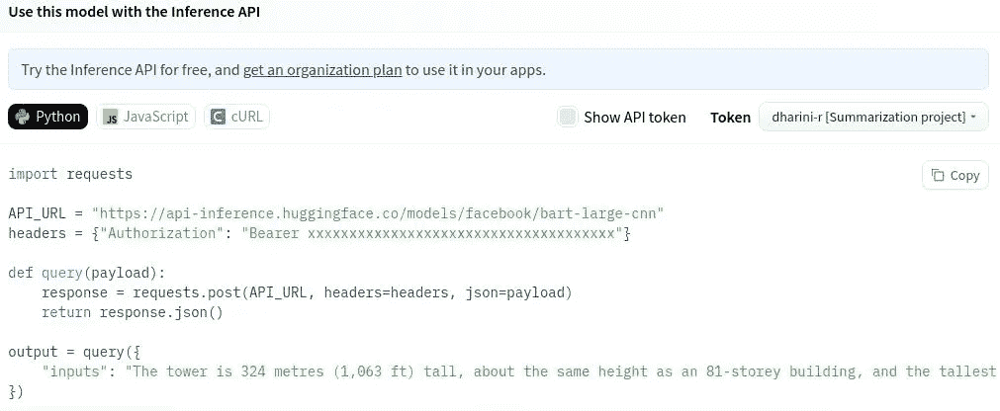
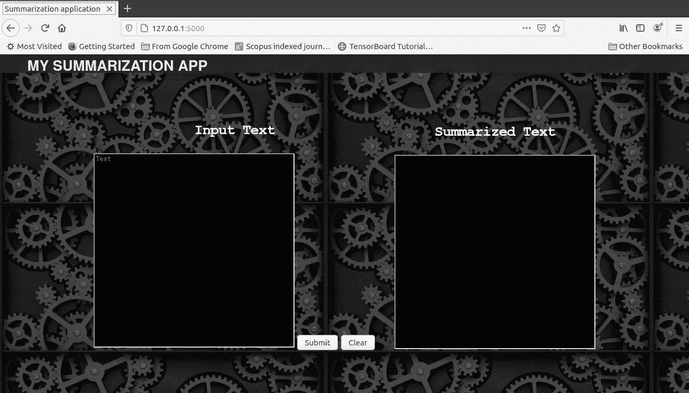
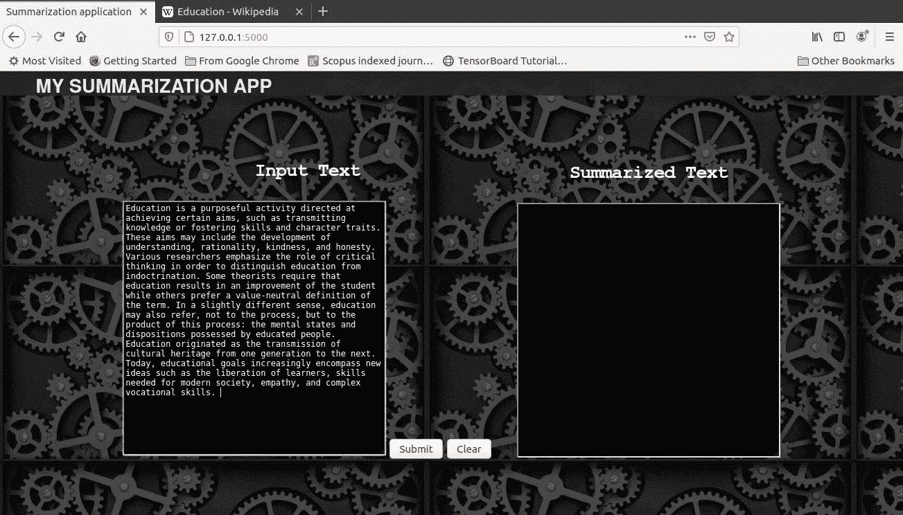
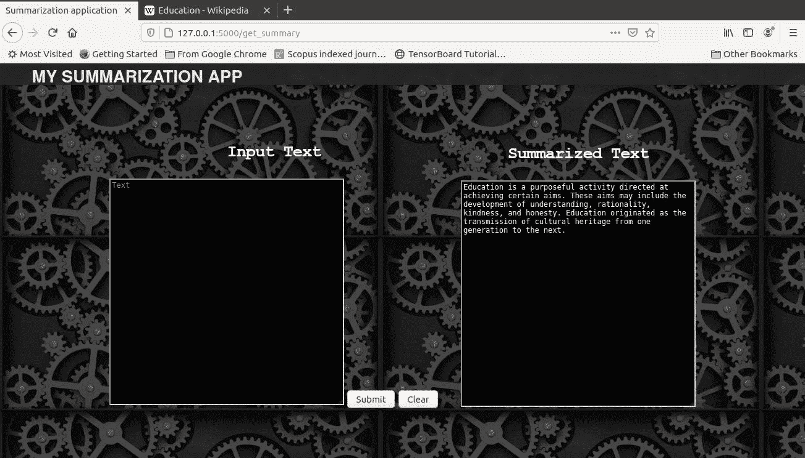

# 一步一步从头开始用 Python 构建文本摘要 Webapp

> 原文：<https://pub.towardsai.net/a-step-by-step-approach-to-building-a-text-summarization-webapp-in-python-from-scratch-5d6754306f3b?source=collection_archive---------0----------------------->

## 使用拥抱脸推理 API，Flask，HTML & CSS

帕特里克·托马索在 [Unsplash](https://unsplash.com?utm_source=medium&utm_medium=referral) 上的照片

***目的是什么？*** 构建一个可以获取输入文本并显示其[摘要](#e4e2)的 web 应用程序。

***我们要用什么？*** [抱紧脸加速推理 API](https://huggingface.co/docs/api-inference/index) ， [Python Flask 框架](https://flask.palletsprojects.com/en/2.2.x/)， [HTML](https://en.wikipedia.org/wiki/HTML) ， [CSS](https://en.wikipedia.org/wiki/CSS) 。

***是怎么做到的？*** 通过 *c* 执行以下步骤。

> **三步流程**
> 
> [**1。从拥抱人脸库中识别文本摘要模型的推理 API。**](#a577)
> 
> [2**。用 HTML 和 CSS 构建前端。**](#7ba3)
> 
> [**3。用 Python Flask 构建后端，并包含摘要任务。**](#280f)

TT**ext summary**是从给定的一组句子中提取摘要的任务。摘要可以有两种类型——抽象摘要**或摘录摘要**。摘要包含从给定输入中提取的**个单词，**将它们放在一起形成一个摘要。抽象摘要生成摘要**不仅通过复制输入中的单词，还基于对文本的理解创造新单词。******

**我们将使用 [**拥抱面部加速推理 API**](https://huggingface.co/docs/api-inference/index) **构建一个抽象摘要应用程序。**要通过向模型提供输入来利用模型，并获得模型的输出，我们只需进行 API 调用。**

> **加速推理通过 API 调用实现了对机器学习模型的**【即插即用】**类型的使用。**

**请参考下面的博客链接，通过一个实现演示来理解推理 API 的工作及其好处。**

** [## 即插即用的 ML 模型，带有来自拥抱脸的“加速推理 API”

### python 实现的 4 步指南

blog.jovian.ai](https://blog.jovian.ai/plug-and-play-ml-models-with-accelerated-inference-api-from-hugging-face-964d25d9dd65) 

我们项目的 web 应用程序部分可以很容易地用`Flask`框架构建。Flask[帮助开发 web 应用程序，并呈现 HTML 文件，可以在 web 浏览器中查看。](https://www.tutorialspoint.com/flask/index.htm)

 [## 欢迎使用 Flask - Flask 文档(2.2.x)

### 欢迎阅读 Flask 的文档。开始安装，然后了解快速入门概述。有…

flask.palletsprojects.com](https://flask.palletsprojects.com/en/2.2.x/) 

我们的 web 应用程序的前端是用 HTML 和 CSS 构建的。超文本标记语言(HTML)和级联样式表(CSS)分别用于设计网页的结构和网页的呈现。

看了我们将要使用的所有东西的要点之后，让我们对我们将要构建的东西有一个概念。我们的网络应用将会有

*   一个前端——一个网页，**获取用户输入的**文本，**显示摘要**作为输出。
*   后端——用户输入**输入到模型中，从模型**中提取和**结果**。

现在，请确保完成构建摘要应用程序的 3 步流程。

## 1.从拥抱脸中识别并利用文本摘要模型

*   对于我们的项目，我们将使用 Lewis 等人提供的模型`[facebook/bart-large-cnn](https://github.com/facebookresearch/fairseq/tree/main/examples/bart)` [[BART](https://github.com/facebookresearch/fairseq/tree/main/examples/bart):自然语言生成、翻译和理解的去噪序列间预训练
*   要使用模型的推理 API，从拥抱人脸库中选择[模型](https://huggingface.co/facebook/bart-large-cnn)，然后点击`Deploy`按钮下的`Inference API`。
*   单击它，我们将看到一个 python 脚本，可以用于推理，如下所示。

从拥抱脸中选择推理 API

*   需要一个`Access Token`来获得`API_URL and headers.`
*   在[拥抱脸](https://huggingface.co/join)中创建一个配置文件，并通过以下路径`Profile -> Settings -> Access Tokens Tab.`创建一个新的访问令牌
*   新创建的访问令牌可以用来代替`Bearer and headers`
*   现在让我们进入项目的下一部分，创建一个 web 应用程序。

## 2.用 HTML 和 CSS 构建前端。

*   前端的代码由两部分组成
    —一个静态文件
    —一个 HTML 文件

T **何静态**文件包含对**我们前端的临时起意**的定制。顾名思义，静态文件的内容不会根据用户的输入或动作而改变。静态文件可以包括任何内容，如图像、视频、级联样式表(CSS)、flash 文件等。这些不是像典型的 HTML 响应一样由 web 服务器动态生成的，因为它们保持静态。

*   在所需的位置，创建两个名为`static`和`templates`的文件夹
*   在`static` 文件夹中，创建一个名为`main.css,`的新文件，其中 CSS 是用于设置 HTML 样式的级联样式表。
*   `main.css`由 HTML 代码中的标签及其相应的样式和格式组成。关于如何使用 CSS 的更详细的教程，请参考这个[链接](https://www.w3schools.com/css/css_intro.asp)。
*   下面给出了静态文件`main.css` 的代码，并附有解释。

*   正如我们所看到的，上面的 CSS 文件包含了 HTML 代码中使用的大多数标签的基于外观的格式和定制。

**代码解释**

*   第 2 行到第 9 行—包含针对标签`header`的样式和格式。
*   第 11 至 25 行—包含标签`h1.`的格式
*   第 28 到 34 行——具有`body`标签的样式，以及一个名为`image.gif`的背景图像
*   第 35 至 39 行——用于`container`的格式
*   第 41 行到第 47 行——标记的样式，它指定了一些内容的划分
*   第 49 到 64 行—标签`h2`和`h3`的格式
*   第 68 行到第 77 行——在标签`parent`和`child.` 的帮助下，包含旨在并排放置两个文本框的格式。让我们继续用 HTML 代码创建前端。

构建 HTML 的目的是提供一个结构化的令人愉快的用户界面，一个供用户输入的空间和一个显示摘要的空间。

*   在已经创建的名为`templates,`的文件夹中，创建一个名为`index.html`的新文件。
*   下面给出了`index.html`的代码，并附有解释。

**代码解释**

*   第 4 到 11 行 HTML 的标题
*   第 9 行—我们添加了静态文件的源(`main.css`)。
*   第 10 行——我们给我们的网页起了一个名为`Summarization Application`的标题。
*   第 13 到 42 行 HTML 的主体
*   第 14 到 19 行—包含`header`标签，用于提供网页的介绍部分。在我们的例子中，我们给出了“我的摘要应用程序”
*   第 23 行和第 34 行—创建了两个文本框并并排放置
*   第 25 到 31 行——为获取输入数据并将其发送到后端而创建的表单。我们利用`form action`指定提交的数据必须发送到`get_summary`后端编写的方法进行处理。
*   第 27 行——用于输入的文本框被创建，并以变量名`input_text`命名，该变量名在后端用于处理输入数据。
*   第 29 和 30 行—按钮`Submit` 和`Clear`被创建。
*   第 38 行——创建了一个用于显示输出的名为`result`的文本框，它在后端用于存储汇总文本。
*   构建了 web 应用程序的前端之后，让我们继续构建后端。

## 3.用 Python Flask 构建后端，并包含摘要任务。

后端的工作是

*   从前端获取输入，
*   通过将输入数据发送到摘要模型并收集其输出(摘要),利用拥抱脸的推理 API
*   将摘要发送到前端

让我们将我们的后端 python 文件命名为`app.py,`，请参考下面给出的代码，后面是解释。

*   我们要记住，前端和后端要用通用的变量名连接起来。
*   摘要模型的输入是
    —要摘要的文本(从前端获得)
    —摘要的最小长度(初始化)
    —摘要的最大长度(初始化)

**代码解释**

*   首先，让我们使用命令`pip install flask`安装`Flask`
*   第 6 行—包括静态文件的路径
*   第 7 行到第 9 行— `index`方法来呈现`index.html`文件
*   第 12 行到第 38 行— `get_summary`方法
*   第 15 行和第 16 行—分别包括推理 API 和身份验证令牌的 URL。确保在`Bearer`部分粘贴您的认证令牌。
*   第 25 行—使用变量`input_text`指定前端的输入
*   第 26 和 27 行—用变量`min_len`和`max_len`指定摘要的最大和最小长度
*   第 30 到 33 行—将查询发送到模型，包括输入变量。结果存储在`output`变量中。
*   第 36 行——使用变量`result`将保存在`output[“summary_text”]`中的模型摘要发送到前端。
*   我们可以看到，连接前端和后端的常用变量名是`input_text, get_summary, result.`
*   该项目的完整代码在这个 [GitHub 链接](https://github.com/dharini-projects/Summarization_Web_App)中给出。

## 汇总应用程序

*   运行`app.py` python 代码时，前端(使用`main.css`和`index.html`文件创建)在本地主机`http://127.0.0.1:5000.`中呈现
*   在浏览器中打开本地主机链接将为我们提供 web 应用程序。
*   下面给出了输出的屏幕截图。

*   我们可以看到`Summarization Application`作为我们的页面标题，`MY SUMMARIZATION APP`作为标题内容，两个并排的文本框带有标题`Input Text`和`Summarized Text,`两个按钮`Submit`和`Clear.`
*   如果在左侧框中给出一个输入文本并按下`Submit`按钮，则调用`get_summary`方法并利用摘要模型。
*   在下面的截图中，我们可以看到输入的文本被粘贴，点击了`Submit`按钮。

*   结果调用了`get_summary`方法，地址栏的变化可以在下面的截图`(http://127.0.0.1:5000/get_summary)`中看到。

*   当调用`get_summary`方法时，使用摘要模型的推理 API，输出显示在`Summarized Text`文本框中。

万岁！！！我们已经成功地为自然语言处理中最流行的摘要任务创建了一个 Web 应用程序。

## 摘要

我们有一个关于摘要的**介绍**，我们将如何构建提取文本摘要的 web 应用程序，以及要使用的所有元素的要点。我们开始了解开发 web 应用程序的简单 **3 步流程**，从为任务从拥抱脸中选择一个**模型** **开始。接下来，我们通过一个构建**前端**的代码示例理解了 HTML 和 CSS 的用法。接下来，我们用一个构建**后端**的代码示例来推断 Flask 的用法。最后，我们看到了我们努力工作的成果，有回报的**摘要网络应用**。同样的过程可以扩展到使用来自拥抱脸的模型来构建任何其他类型的**自然语言处理任务**。继续你的任务并取得成功！！！！****