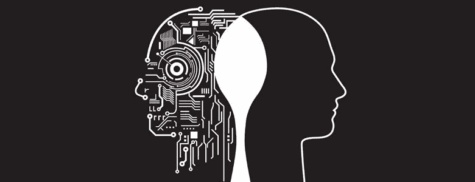

# 2021 年人工智能伦理与偏见综述

> 原文：<https://pub.towardsai.net/a-summary-of-ai-ethics-and-bias-in-2021-26545345bc00?source=collection_archive---------3----------------------->

## [人工智能](https://towardsai.net/ai/artificial-intelligence)

## *对于人工智能领域的偏见和伦理来说，今年是重要的一年。这里是最大的故事。*

图片来自[凯捷](https://www.capgemini.com/2020/01/ai-is-good-as-long-as-we-enact-ethics-controls/)

# 计算机视觉

## [图像生成算法将女人和比基尼联系起来，将黑人和武器联系起来](https://onezero.medium.com/men-wear-suits-women-wear-bikinis-image-generating-algorithms-learn-biases-automatically-eee3d8a56f2e)

【2021 年 1 月，OneZero(中型)【付费墙】

根据一篇[新的研究论文](https://arxiv.org/pdf/2010.15052.pdf)，当在流行的算法训练数据集 ImageNet 上训练时，OpenAI 的 iGPT 和谷歌的 SimCLRv2 等最先进的图像处理算法带有明显的种族和性别偏见。超过 50%的时候，这些算法生成穿着性感服装(低胸上衣、比基尼)的女性面孔，而大约 40%的时候生成穿着西装的男性面孔。

## [OpenAI 发布名为“Dall-E”的新图像生成器](https://www.cnbc.com/2021/01/08/openai-shows-off-dall-e-image-generator-after-gpt-3.html)

*2021 年 1 月，美国消费者新闻与商业频道*

Dall-E 基于短字幕生成图像，就在 OpenAI 推出他们的 GPT-3 文本生成器几个月之后。

## [麻省理工学院 CSAIL 发布新的癌症风险评估工具，最大限度地减少偏差](https://news.mit.edu/2021/robust-artificial-intelligence-tools-predict-future-cancer-0128)

*2021 年 1 月，麻省理工学院新闻*

该大学发布了一个工具，在美国、欧洲和亚洲的数据集上表现良好。麻省理工学院与世界各地的几个机构合作，在不同的数据集上测试他们的产品，以确保最小的偏差。算法本身也已经使用对抗方法去偏置。

## [脸书声称能够根据 x 光胸透预测新冠肺炎的结果](https://venturebeat.com/2021/01/15/facebook-claims-its-ai-can-anticipate-covid-19-outcomes-using-x-rays/)

*2021 年 1 月，VentureBeat*

纽约大学和脸书大学的研究人员创建了三个模型，通过使用胸部 x 光图像来预测新冠肺炎患者的长期结果。然而，来自多个组织的最近一项研究发现，使用胸部 x 光的算法往往会表现出对特定性别、社会经济和种族群体的偏见。

## [保险公司 Lemonade 因使用面部识别验证保险索赔而受到审查](https://www.vox.com/recode/22455140/lemonade-insurance-ai-twitter)

【2021 年 5 月，Vox

柠檬水，一家较新的保险公司，在他们在 Twitter 上解释了他们的方法后，受到了抨击。该公司使用“非语言线索”并制作“细致入微的简介”来识别风险。

## [脸书 AI 给视频中的黑人男子贴上“灵长类动物”标签](https://www.nytimes.com/2021/09/03/technology/facebook-ai-race-primates.html)

【2021 年 9 月，纽约时报【付费墙】

该社交网络在观看了包含黑人男性的特定视频后，会询问用户是否愿意“继续观看关于灵长类动物的视频”。

# 社交网络

## [抖音因涉嫌以相关方式使用面部识别技术和人工智能支付 9200 万美元的诉讼费用](https://www.nytimes.com/2021/12/05/business/media/tiktok-algorithm.html)

*2021 年 2 月，纽约时报【付费墙】*

抖音选择不打官司，而是以 9200 万美元和解。据称，该公司使用面部识别技术来确定创作者的性别、种族和年龄。

## [脸书的广告投放算法仍然存在性别偏见](https://www.theverge.com/2021/4/9/22375366/facebook-ad-gender-bias-delivery-algorithm-discrimination)

*2021 年 4 月，即将来临*

脸书在广告投放方面有着悠久的历史。2016 年，他们[允许广告商拒绝黑人和拉美裔人观看某些广告](https://www.propublica.org/article/facebook-lets-advertisers-exclude-users-by-race) (ProPublica)。2019 年，一项[诉讼](https://www.hud.gov/sites/dfiles/Main/documents/HUD_v_Facebook.pdf)(美国住房和城市发展部)针对脸书在住房和招聘广告中的“红线”(排除特定性别或居住在特定地区的人)提起。根据一项新的研究，2021 年，什么都没有改变。

## [火狐报告发现 YouTube 持续推送错误信息和仇恨内容](https://assets.mofoprod.net/network/documents/Mozilla_YouTube_Regrets_Report.pdf)

【2021 年 7 月，Mozilla 基金会

一项针对 YouTube 算法的众包调查显示，推荐算法经常推送那些延续“COVID 散布恐慌、政治错误信息、暴力或图形内容、仇恨言论和垃圾邮件/诈骗”的视频。

## [抖音的算法审查亲 BLM 的信息](https://www.nbcnews.com/news/us-news/tiktok-algorithm-prevents-user-declaring-support-black-lives-matter-n1273413)

【2021 年 7 月，NBC

抖音将包含“黑色”一词的帖子标记为“不当内容”，但不会对关于“白人至上”或“新纳粹主义”的帖子这样做该公司随后为该事件道歉，称他们的算法“被错误地设置为标记短语，而不考虑词序。”

## [研究发现，推特的算法偏向右倾政治](https://www.bbc.com/news/technology-59011271)

*2021 年 10 月，BBC*

Twitter“算法上放大”了政治权利，但不知道为什么。在[内部研究](https://blog.twitter.com/en_us/topics/company/2021/rml-politicalcontent)中，他们强调了确定他们的平台对更广泛的社区的影响的重要性，并且现在正在寻求解决这个和类似的问题。

# 大型语言模型(LLM)

## [谷歌训练一个万亿参数的 LLM，可能包含高偏差](https://venturebeat.com/2021/01/12/google-trained-a-trillion-parameter-ai-language-model/)

*2021 年 1 月，VentureBeat*

谷歌使用开关变压器训练了一个 1.6 万亿参数的大型语言模型，但没有测试它的算法偏差。先前对逻辑推理模型的研究表明，这些模型延续了现实世界中常见的刻板印象，并导致“普遍的性别、种族和宗教偏见”。2020 年末，谷歌解雇了人工智能伦理研究员蒂姆尼特·格布鲁(Timnit Gebru )(纽约时报，付费墙)，因为她发表了一篇关于 LLMs 偏见的论文。

## OpenAI 的 GPT-3 模型展示了反穆斯林偏见

*2021 年 7 月，斯坦福以人为中心的人工智能(海)*

在最近的一项研究中(自然简报，付费墙)，OpenAI 的 GPT-3 LLM 显示出明显的反穆斯林偏见。该模型用于完成研究人员提供的句子，但返回了刻板印象和种族主义的反应。

## [DeepMind 首次推出地鼠接近人类水平的阅读理解能力](https://fortune.com/2021/12/08/deepmind-gopher-nlp-ultra-large-language-model-beats-gpt-3/)

【2021 年 12 月，财富

DeepMind 发布了一款超 LLM，在各种性能指标上击败了 OpenAI 的 GPT-3 模型。DeepMind 伦理团队强调算法对刻板印象的抵制和更低的能源使用/碳足迹。

# 一般

## [亚马逊电商算法传播新冠肺炎疫苗误传](https://venturebeat.com/2021/01/26/university-of-washington-researchers-say-amazons-algorithms-spread-vaccine-misinformation/)

【2021 年 1 月，VentureBeat

华盛顿大学最近进行的一项研究和算法审计揭示了亚马逊监管算法中的排名偏差，即“错误信息的健康产品通常排名更高。”

## [Airbnb 将黑人和白人房东的收入差距扩大了 20%](https://www.morningbrew.com/emerging-tech/stories/2021/06/15/airbnb-failed-antidiscrimination-teamand-let-racial-disparities-slip-cracks)

*2021 年 3 月，晨酿*

Airbnb 的“智能定价”算法考虑了几个变量，并确定了一个有竞争力的夜间价格。根据新的研究，它最初是为了减少黑人和白人主持人之间的收入差距，但结果却恰恰相反。

## [GitHub Copilot 40%的时间都会生成易受攻击的代码](https://cyber.nyu.edu/2021/10/15/ccs-researchers-find-github-copilot-generates-vulnerable-code-40-of-the-time/)

*2021 年 10 月，纽约大学*

GitHub Copilot 是一项自动生成代码供程序员使用的人工智能技术，它生成错误或容易被利用的代码的时间高达 40%。一项新的研究显示 GitHub 显然没有进行“对 ML 生成代码的安全性的系统检查”

# 创业公司

## [梅奥诊所支持的数据隐私初创公司 TripleBlind】](https://healthcareglobal.com/technology-and-ai-3/mayo-clinic-invests-data-privacy-startup-tripleblind)

【2021 年 4 月，全球医疗保健

TripleBlind 是一家数据隐私初创公司，允许公司在加密数据上运行模型，它得到了梅奥诊所的支持。他们的支持者现在包括埃森哲风险投资公司、奥克塔风险投资公司和下一代风险投资公司等。

## [Clearview AI 在 B 轮融资中融资 3000 万美元，尽管技术存在争议](https://www.nytimes.com/2021/07/21/technology/clearview-ai-valuation.html)

【2021 年 8 月，纽约时报【付费墙】

Clearview AI 是一家总部位于纽约的初创公司，它从互联网上废弃了数十亿张照片(未经明确同意)，以建立一种面部识别算法，供执法部门使用。该公司的产品在加拿大被认定为非法，目前正在接受英国和澳大利亚的调查。

## [Pave 在 B 轮融资中筹集了 4600 万美元用于员工薪酬基准测试](https://venturebeat.com/2021/08/10/employee-compensation-benchmarking-startup-pave-raises-46m/)

*2021 年 8 月，VentureBeat*

Pave 利用人力资源数据帮助公司确定薪酬差距。他们的数据允许人力资源部门根据经验水平、建议和审批流程进行快速、匿名的比较。Pave 得到了 YC 连续性公司、Bessemer Venture Partners 和 Andreessen Horowitz 等公司的支持。

## [Relyance AI 在 A 轮融资中筹集了 2500 万美元，用于确保代码层面的隐私合规性](https://techcrunch.com/2021/09/15/relyance-ai-scores-25m-series-a-to-ensure-privacy-compliance-at-the-code-level/)

*2021 年 9 月，TechCrunch*

Relyance AI 是一家总部位于加州的初创公司，它将隐私视为源代码的变化——每次 DevOps 管道中发生变化时，他们都会运行类似 check 的编译器，检查敏感数据的内部流动，并审核结果。门罗风险投资公司和不寻常风险投资公司支持首轮融资。

# 法律和政策

## [欧洲为基于风险的人工智能规则制定计划，以促进信任和接受](https://techcrunch.com/2021/04/21/europe-lays-out-plan-for-risk-based-ai-rules-to-boost-trust-and-uptake/)

*2021 年 4 月，TechCrunch*

欧盟立法者制定了一项基于风险的提案来监管人工智能的高风险实施。

## [最高法院裁决允许记者和研究人员在技术平台上检查偏见时有更大的自由](https://news.northeastern.edu/2021/06/03/supreme-court-ruling-clears-path-for-researchers-journalists-who-test-facebook-and-other-platforms-for-discrimination/)

【2021 年 6 月，新闻@东北

美国最高法院放宽了一项“为违反网站服务条款创造了刑事和民事责任潜力”的法律，允许研究人员和记者研究社交媒体平台和其他服务的偏见，而不必担心后果。

## [中国通过新的个人数据隐私法](https://www.reuters.com/world/china/china-passes-new-personal-data-privacy-law-take-effect-nov-1-2021-08-20/)

【2021 年 8 月，路透社

中国通过新的个人信息保护和数据安全法收紧了有关数据和隐私的法规，这要求公司以更大的透明度和尽职尽责的态度存储和使用数据。

## [193 个国家首次通过人工智能伦理全球协议](https://news.un.org/en/story/2021/11/1106612)

*2021 年 11 月，联合国*

联合国在人工智能伦理方面“建立了第一个全球规范框架”，鼓励 193 个成员国定期报告他们的进展和做法。联合国的优先事项之一是数据隐私。

## [纽约市以新法律瞄准招聘中的人工智能偏见](https://news.bloomberglaw.com/daily-labor-report/nyc-targets-artificial-intelligence-bias-in-hiring-under-new-law)

*2021 年 12 月，彭博法律*

纽约市议会通过了一项措施，禁止自动就业决策工具，除非该技术事先经过“偏见审计”。公司还必须告知员工/候选人是否使用了此类工具进行决策。

# 其他的

[编码偏见](https://www.pbs.org/independentlens/documentaries/coded-bias/)，一部揭露面部识别算法和人工智能对隐私和自由的威胁的纪录片，于 2021 年 3 月在 PBS 首播。

*本帖原文可在* [*这里*](https://abhiraghunathan.com/posts/2021.html) *找到。*