# 条件随机场巡礼

> 原文：<https://pub.towardsai.net/a-tour-of-conditional-random-field-7d8476ce0201?source=collection_archive---------2----------------------->

## 机器学习

在本文中，我们将探索和深入条件随机场(CRF)。条件随机场是一种概率图形模型，在基因预测、部分图像识别等领域有着广泛的应用。它还被广泛用于自然语言处理(NLP)中的神经序列标记、命名实体识别、词性标注等领域。在计算单个序列项目的标签时，如果关于相邻标签的信息是必需的，则使用条件随机场。

图形模型是使用随机变量之间的条件依赖的图形的概率模型。有两种类型的图形模型，即贝叶斯网络和马尔可夫随机场。贝叶斯网络大多是有向无环图，而马尔可夫随机场是无向图，可能是循环的。条件随机场属于后一类。

从这里，我们将深入研究条件随机场的数学。为此，我们需要首先理解条件依赖的概念。如果变量 *y* 有条件地依赖于变量 *x，*，那么给定输入 *x，*，我们可以通过下面的表达式来识别它的类:

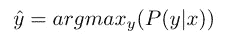

假设这是一个结构化预测的问题，即，我们需要识别顺序输入的标签序列，我们可以通过下面的表达式利用不同元素 *xi* 之间的条件独立性的概念。

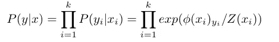

这里 *ϕ(.)*是激活函数，k 是序列长度， *Z(xi)* 是配分函数。之后， *P(y|x)* 可以写成:

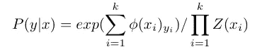

当我们使用贪婪解码时，上面的表达式给了我们一个表达式 *P(y|x)* 。在条件随机场的情况下，我们需要关于相邻标签的信息。该信息被合并到带有转换表 v 的表达式 *P(y|x)* 中。在 CRF 的另一个变体中，输入 x{i}上的上下文窗口也被用于计算标签信息。例如，如果有一个 3 的上下文窗口， *P(y|x)* 的表达式如下:

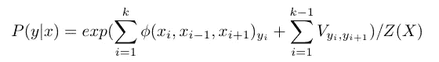

让我们分别考虑一元对数术语和成对转换术语的下列符号。

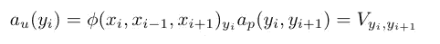

*P(y|x)* 的表达式可以写成:

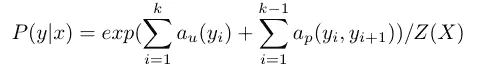

# 推理

我们知道， *Z(X)* 是一个配分函数。如果我们天真地计算配分函数，我们得到配分函数的表达式如下:

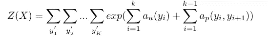

在上面的表达式中，我们可以看到，每次计算配分函数时，我们都在进行 K 求和。上述计算的计算复杂度大约为 *O(C^K、*，这是不可扩展的。为了降低复杂性，我们需要以稍微不同的方式排列 *Z(X)* 。

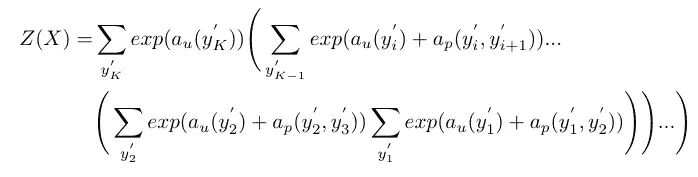

这种重新排列项的优点在下面给出的算法 1 中变得明显。我们引入另一类向量值函数α{i}(。)，它通过对 y{1}处的所有可能标签执行最内部求和来初始化。这种术语的重新排列允许我们利用动态编程的优势来降低任务的复杂性。下面给出了更详细的算法。

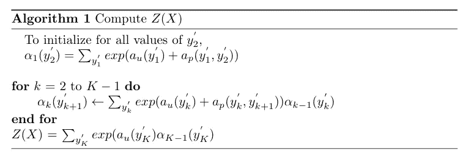

上述算法的计算复杂度为 *O(KC)，*其中 *C* 为每个位置的标签数。

再次，重新排列 *Z(X)* 的和，使得在给定序列的第*个*标签上执行最内部的和，并且从第 k 个标签遍历到序列的第一个标签。

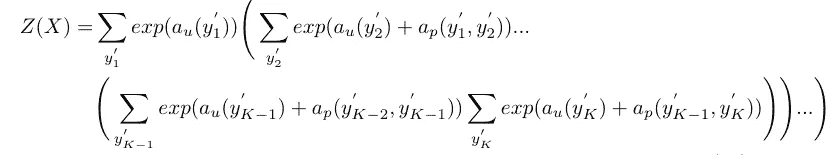

这次我们引入另一个向量值函数β(。).我们通过在第 k 个位置对所有可能的标签求和来初始化β函数，并迭代直到第 2 个位置的标签。

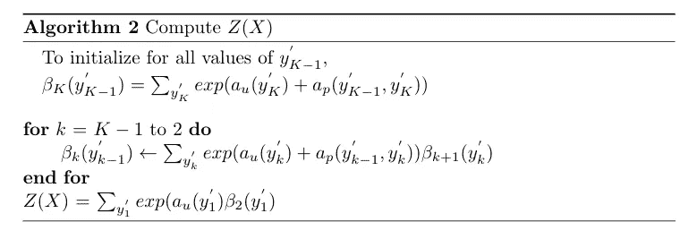

从算法 1(或 2)计算配分函数被称为 CRF 的向前-向后算法。计算α函数称为前向传递，而计算β函数称为后向传递。上述过程合在一起也称为信念传播。

在本文中，我们首先对图形模型进行了概述。然后我们讨论了什么是条件随机场及其应用——它的另一种基于上下文的变体。在进行推理时，我们看到了向前向后算法的必要性及其时间复杂性。除了这些主题，我们还应该研究 CRF 的损失函数以及反向传播在训练时的表现。这些话题可以在另一次讨论中涉及。

**参考资料和进一步阅读:**

1.  雨果·拉罗彻尔的 Youtube 系列讲座
2.  [http://www.cs.cmu.edu/~10715-f18/lectures/lecture2-crf.pdf](http://www.cs.cmu.edu/~10715-f18/lectures/lecture2-crf.pdf)
3.  [http://www . davidsbatista . net/blog/2017/11/13/Conditional _ Random _ Fields/](http://www.davidsbatista.net/blog/2017/11/13/Conditional_Random_Fields/)
4.  条件随机场:分割和标记序列数据的概率模型([论文](https://www.seas.upenn.edu/~strctlrn/bib/PDF/crf.pdf))