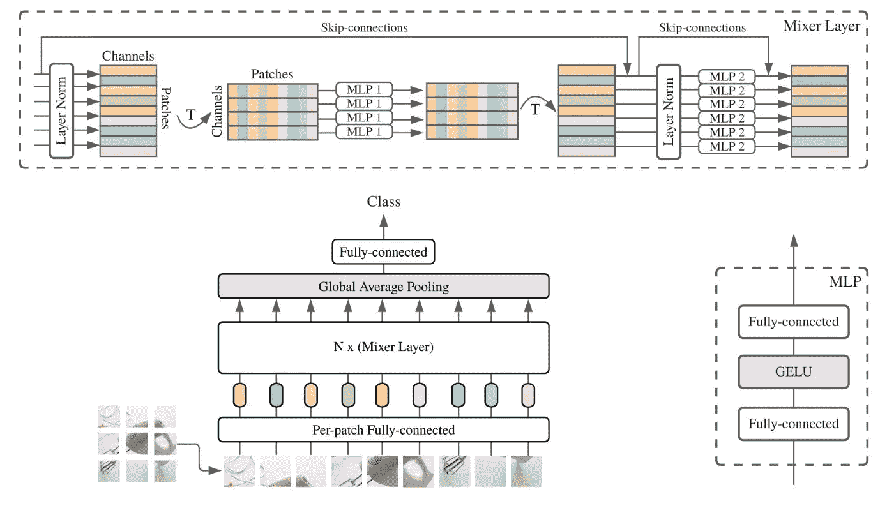
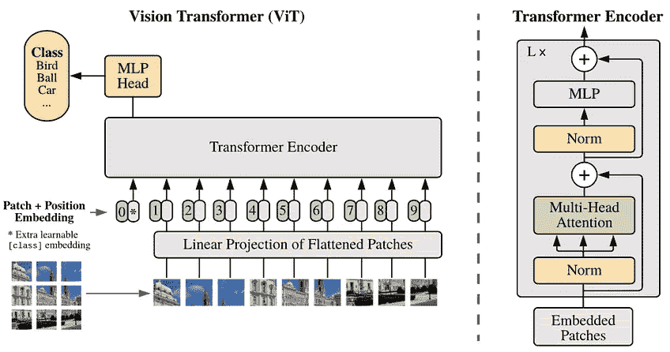
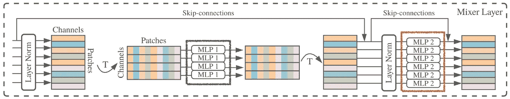
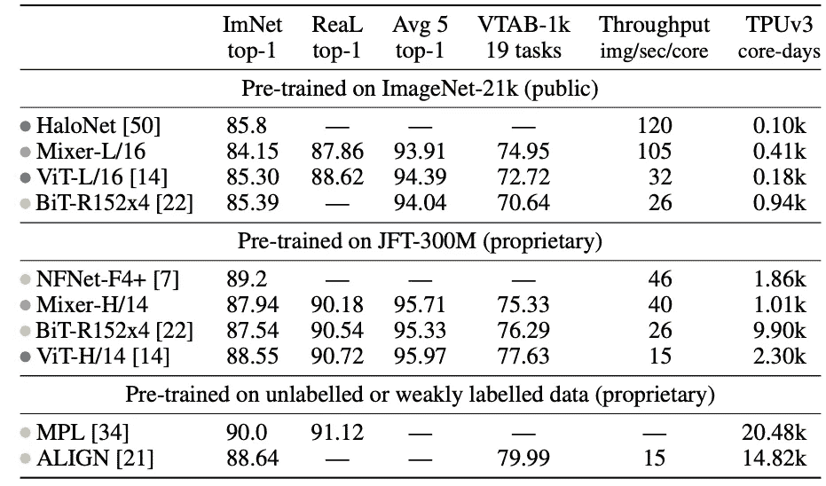
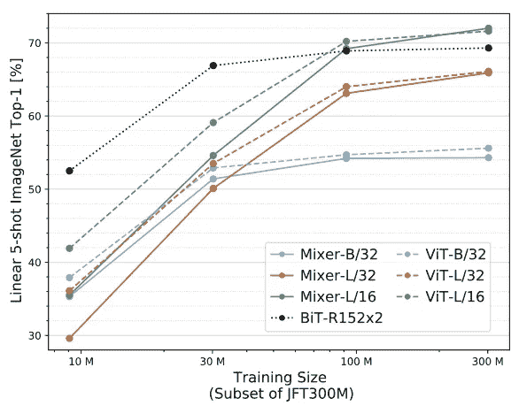

# 一种既不用 CNN 也不用注意力的有用的新图像分类方法

> 原文：<https://pub.towardsai.net/a-useful-new-image-classification-method-that-uses-neither-cnns-nor-attention-b0f2952334bf?source=collection_archive---------2----------------------->

## [计算机视觉](https://towardsai.net/p/category/computer-vision)

## [论文摘要] MLP 密炼机

在这篇文章中，我想介绍一下 MLP 混合器，它是由谷歌研究大脑团队(与视觉变形金刚(ViT)是同一团队)在 2021 年 5 月提出的。有趣的是，与最先进的模型(ViT 和 BiT)相比，基于 ViT 的 MLP 混合器可以在大数据集上训练快近三倍，并获得类似的结果。

MLP 混合器是基于多层感知器(MLP)，它迭代地应用于空间位置和特征通道，并作为一种既不使用 CNN 也不使用变压器的图像分类算法而受到关注。

仅使用 MLP 的优点是架构简单和计算速度。此外，MLP 混合器的计算复杂度与输入补片的数量成线性关系，不像视觉变换器(ViT)是输入补片数量的平方。

> *视觉变形金刚(ViT)延续了从模型中去除手工制作的视觉特征和归纳偏见的长期趋势，并进一步依赖于从原始数据中学习。*
> 
> *我们提出了 MLP 混合器，一种完全基于多层感知器(MLPs)的架构。MLP 混合器包含两种类型的层:一种是 MLPs 独立应用于图像面片(即“混合”每个位置的特征)，另一种是 MLPs 跨面片应用(即“混合”空间信息)。*
> 
> [*https://arxiv.org/abs/2105.01601*](https://arxiv.org/abs/2105.01601)

图 1: MLP 混频器架构。

# 点

基于简单多层感知器(MLP)的模型与 CNN 和注意力模型竞争，在大型数据集(1 亿个图像数据集)上速度快 3 倍。

MLP 混频器架构基于多层感知器(MLP)，仅依赖基本矩阵乘法例程、数据布局修改(整形和转置)和标量非线性。

当在大型数据集(约 1 亿张图像)上进行预训练时，它达到了与 CNN 和 transformers 相当的性能，并在准确性和成本之间进行了权衡。

# MLP 混频器架构

如图 2 所示，MLP 混合器在体系结构上类似于视觉变压器(ViT ),不使用自我注意。类似于 ViT，MLP 混合器首先将输入图像分成小的迷你小块，然后将所有小块馈送到全连接层，以获得潜在的嵌入表示。换句话说，图像中的每个小块对应一个向量。

图 2:(从左至右)视觉变压器(ViT)架构，MLP 混频器架构。

如图 3 所示，MLP 混合器由每个面片的线性嵌入、MLP 混合器块和图像类别分类器组成。与视觉转换器(ViT)相比，MLP 混合器模块不使用位置嵌入。这是由于下面描述的令牌混合 MLP 的特性。

图 3:MLP 混频器的结构。

该模型以线性投影的图像斑块作为输入，并保持“斑块×通道”的维数；如图 4 所示，MLP 混频器由两层 MLP 组成，即信道混合 MLP 和令牌混合 MLP，并且该块被表示为混频器层。混合器层仅依赖于基本的矩阵乘法、数据布局修改(形状改变和换位)和标量非线性。

图 4:混合器层的细节:令牌混合 MLP(绿色部分)，通道混合 MLP(橙色部分)。

令牌混合 MLP 和通道混合 MLP 允许补丁和通道输入维度的交互。

## 令牌混合 MLP；混合具有不同空间位置的面片的特征

令牌混合 MLP(绿色)对输入数据的每一列进行转置，并在所有行之间共享相同的 MLP 权重。因此，图像中所有面片的通道都是 1，并且完全连接层中的所有权重都是共享的。因此，不同的面片共享相同的通道权重。要混合面片，请使用单通道深度卷积。

## 通道混合 MLP；混合不同频道的功能

通道混合 MLP(橙色部分)再次转置每一行输入数据，并再次将其转换为面片。然后，所有面片共享 MLP 权重。因此，不同的信道共享相同的信道权重。要混合通道，请使用 1x1 卷积。

# 实验结果

如下表所示，与 ViT 和 BiT 等最先进的图像分类方法相比，所提出的方法以更低的计算成本实现了相同水平的精度。

此外，从图中可以看出，MLP 混合器在数据集大小和图像分类精度方面都有显著提高。随着数据集大小的增加，分类精度变得与 ViT 相当。

# 结论

MLP 混合器是一种基于称为多层感知器(MLP)的非常简单的模型的网络，但它提出了一些非常有趣的结果，例如训练的低计算成本和随着数据大小的增加而提高的分类精度。

谷歌研究，大脑团队还陈述了以下内容。

> *有希望的是，这些结果引发了进一步的研究，超越了基于卷积和自我关注转换器的成熟模型的领域*

# 参考

https://arxiv.org/abs/2105.01601MLP

https://arxiv.org/abs/2010.11929 的

[https://github . com/rwightman/py torch-image-models/blob/master/timm/models/MLP _ mixer . py](https://github.com/rwightman/pytorch-image-models/blob/master/timm/models/mlp_mixer.py)