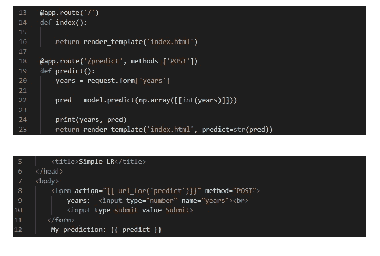
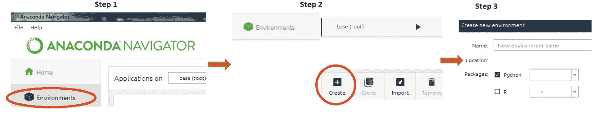
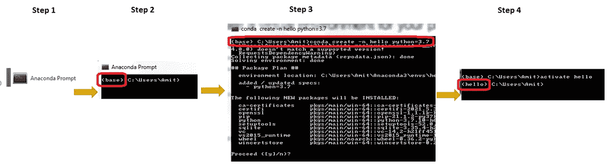
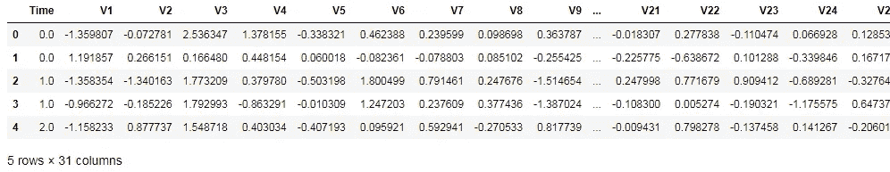
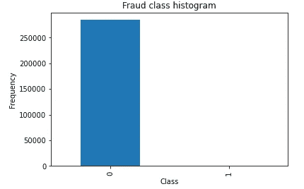
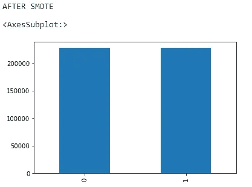
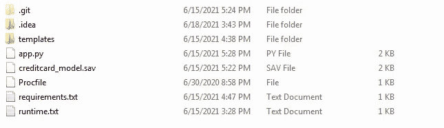
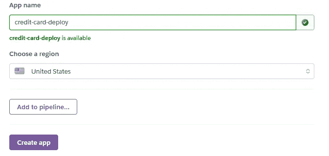

# 一个非常基本的端到端机器学习烧瓶模型，采用 Heroku 部署

> 原文：<https://pub.towardsai.net/a-very-basic-end-to-end-machine-learning-flask-model-with-heroku-deployment-d4ba6675f2f7?source=collection_archive---------1----------------------->

## [机器学习](https://towardsai.net/p/category/machine-learning)

## 带部署的简单线性回归模型



Flask 和 HTML5 文件。作者的照片

机器学习模型的部署在数据科学或机器学习之旅中非常重要。在本文中，我们将讨论和实现欺诈检测的不平衡数据，并试图通过过采样方法(即 SMOTE)使其平衡，以避免过拟合问题。

什么是不平衡数据？

通常，我们在监督分类算法中看到这种类型的问题，其中目标变量具有不平衡的类。例如，类是“是”和“否”，其中一个类的数量比另一个类多 90%。因此，这个问题使得该模型在真实场景中使用不可靠和不现实。

## 涵盖的主题:

*   **创造新环境**
*   **Jupyter 上的欺诈检测机器学习建模**
*   **需求文件和过程文件**
*   **HTML 文件**
*   **烧瓶应用文件**
*   **GitHub**
*   **Heroku 部署**

> ***创建新环境***

创建一个新的环境总是有一个好处，即只获取我们在机器学习项目建模中使用的库，作为将在部署部分使用的需求文件。我们可以通过两种方法在 anaconda 中创建一个环境。

*   **第一种方法:**蟒蛇 GUI 导航器



作者的照片

第一步:打开 Anaconda 导航器

**第二步:**点击创建按钮

**步骤 3:** 给出新环境的名称，然后单击 create。

*   **第二种方法:**用 Anaconda 提示



作者的照片

**第一步:**点击 Anaconda 提示符

**步骤 2:** 我们将看到默认环境是基本环境，我们必须创建一个新环境。

**第三步:**写下命令，然后按回车键，最后写下‘y’。

```
conda create -n hello python=3.7
```

**第四步:**要激活新的环境，我们要写' ***激活你好*** '我们会看到环境从基地变成' ***你好*** '。

> ***欺诈检测机器在 Jupyter 上学习建模***

我们将从 kaggle 和 link 中获取的不平衡数据在这里是。

在阅读了数据之后，很清楚地解释了总观察量是 284，807 次交易。目标变量被命名为包含两个类的类，即“0”和“1”。“0”或非欺诈类的计数是 284315，“1”或非欺诈类的计数是 492。目标变量的不平衡类观测值是显而易见的。

我们用 SMOTE 做一个 logistic 模型，让它平衡。

导入库

```
import pandas as pd
import matplotlib.pyplot as plt
import numpy as np
import seaborn as sns
%matplotlib inline
```

用熊猫图书馆读取数据

```
data = pd.read_csv("creditcard.csv")
data.head()
```



作者的照片

用 matplotlib 库绘制目标变量计数。

```
count_classes = pd.value_counts(data['Class'], sort = True).sort_index()
count_classes.plot(kind = 'bar')
plt.title("Fraud class histogram")
plt.xlabel("Class")
plt.ylabel("Frequency")
```



目标变量的计数。作者的照片

现在，我们将计算目标变量中的两个类，以了解为“1”的少数类的百分比。

```
# Count the number and finding the percentage of fraud cases
fraud = data[data['Class'] == 1]
valid = data[data['Class'] == 0]outlierFraction = len(fraud)/float(len(valid))print(outlierFraction)
print('Fraud Cases: {}'.format(len(data[data['Class'] == 1])))print('Valid Transactions: {}'.format(len(data[data['Class'] ==
                                                            0])))#output:
0.0017304750013189597
Fraud Cases: 492
Valid Transactions: 284315
```

我们可以从上面看到，欺诈交易的数量如此之少，以至于建模时数据是不平衡的。让我们使用 SMOTE 来平衡班级。SMOTE 对少数类进行过采样。

```
import imblearn
from imblearn.over_sampling import SMOTE
import warnings
warnings.filterwarnings('ignore')
from sklearn.model_selection import train_test_splitX_train,X_test,y_train,y_test = train_test_split(x, y, random_state=0, test_size=.20)
```

现在用 SMOTE 拟合训练数据。

```
# implement smote now
smote = SMOTE(random_state=0)
X_train,y_train = smote.fit_resample(X_train, y_train)print("AFTER SMOTE")
y_train.value_counts().plot.bar()
```



作者的照片

使用 SMOTE 后，这两个类是相同的，可以很好地对其进行预测。现在使用网格搜索 CV 来获得最佳参数以获得良好的精度。

```
#import Grid Search CV to find the parameters
from sklearn.model_selection import GridSearchCV# Logistic Regression log_reg_params = {"penalty": ['l1', 'l2'], 'C': [0.001, 0.01, 0.1, 1, 10, 100, 1000]}grid_log_reg = GridSearchCV(LogisticRegression(), log_reg_params)
grid_log_reg.fit(X_train, y_train)#Getting the best parameters for the modellog_reg = grid_log_reg.best_estimator_log_reg_score = cross_val_score(log_reg, X_train, y_train, cv=5)print('Logistic Regression Cross Validation Score: ',
         round(log_reg_score.mean() * 100, 2).astype(str) + '%')**#output:**
Logistic Regression Cross Validation Score:  97.19%
```

现在，用逻辑回归建立模型。

```
from sklearn.linear_model import LogisticRegression
from sklearn import metricslr = LogisticRegression()
model = LogisticRegression()
model.fit(X_train,y_train)y_pred = model.predict(X_test)print('Logistic Regression accuracy = ',
                           metrics.accuracy_score(y_pred,y_test))**#output:**
Logistic Regression accuracy =  0.9791264351673045
```

在这种情况下，我们获得了 97%的准确率。但我们必须在建模机器学习算法方面做很多事情，所以我们只是试图了解部署的所有步骤的基本步骤。

现在，用 joblib 库保存模型。

```
import joblib
from joblib import dump,loadjoblib.dump(model, 'creditcard_model.sav')#output:
['creditcard_model.sav']
```

现在，我们的模型被保存，我们将在我们的 flask 模型中使用这个文件。

> ***需求文件和*proc file**

*   **需求**文件包含了我们在 jupyter 模型和 flask 文件中使用过的所有库。

为了获得需求文件，我们需要在为模型创建的同一个工作环境中用 anaconda 提示符编写一个命令。

```
pip freeze > requirements.txt
```

在这个命令之后，requirements.txt 将被生成并保存在 jupyter 文件和模型文件被保存的同一个文件夹中。

*   Procfile 是一个基本的需求文件，告诉我们应用程序的容器要运行什么命令。

> ***HTML5 文件***

需要 HTML5 文件来用 flask 检查我们的模型，在 flask 中，我们将给出输入并呈现 HTML5 文件，然后返回预测。HTML5 代码的基本设计如下所示:

```
<!DOCTYPE html>
<html lang="en">
<head>
    <meta charset="UTF-8">
    <title>CreditCard</title>
</head>
<body>
    <form action="{{ url_for('predict')}}" method="POST">
        scaled_amount:  <input type="number" name="scaled_amount">
        scaled_time:  <input type="number" name="scaled_time">
        v1:  <input type="number" name="v1">
        v2:  <input type="number" name="v2"><br>
        v3:  <input type="number" name="v3">
        v4:  <input type="number" name="v4">
        v5:  <input type="number" name="v5">
        v6:  <input type="number" name="v6"><br>
        v7:  <input type="number" name="v7">
        v8:  <input type="number" name="v8">
        v9:  <input type="number" name="v9">
        v10:  <input type="number" name="v10"><br>
        v11:  <input type="number" name="v11">
        v12:  <input type="number" name="v12">
        v13:  <input type="number" name="v13">
        v14:  <input type="number" name="v14"><br>
        v15:  <input type="number" name="v15">
        v16:  <input type="number" name="v16">
        v17:  <input type="number" name="v17">
        v18:  <input type="number" name="v18"><br>
        v19:  <input type="number" name="v19">
        v20:  <input type="number" name="v20">
        v21:  <input type="number" name="v21">
        v22:  <input type="number" name="v22"><br>
        v23:  <input type="number" name="v23">
        v24:  <input type="number" name="v24">
        v25:  <input type="number" name="v25">
        v26:  <input type="number" name="v26"><br>
        v27:  <input type="number" name="v27">
        v28:  <input type="number" name="v28">
        <input type=submit value=Submit>
   </form>
    My prediction: {{ predict }}
</body>
</html>
```

上述代码的基本网站设计如下所示:


作者的照片

当我们在一个 HTML 文件中创建一个表单时，我们应该添加 action 和 method 参数，这样我们输入的值就可以用 flask 文件来呈现。

> ***烧瓶 app 文件***

在这个文件中，我们将使用我们保存的模型来渲染 HTML5 文件中的这些输入，并给出预测结果。

烧瓶代码如下所示:

```
from flask import Flask, render_template, request
import numpy as np
#import pickle
import joblibapp = Flask(__name__)
filename = 'creditcard_model.sav'
# model = pickle.load(open(filename, 'rb'))
model = joblib.load(filename)
# model = joblib.load('filename.pkl')[@app](http://twitter.com/app).route('/')
def index():

    return render_template('index.html')[@app](http://twitter.com/app).route('/predict', methods=['POST'])
def predict():
    scaled_amount = request.form['scaled_amount']
    scaled_time = request.form['scaled_time']
    v1 = request.form['v1']
    v2 = request.form['v2']
    v3 = request.form['v3']
    v4 = request.form['v4']
    v5 = request.form['v5']
    v6 = request.form['v6']
    v7 = request.form['v7']
    v8 = request.form['v8']
    v9 = request.form['v9']
    v10 = request.form['v10']
    v11 = request.form['v11']
    v12 = request.form['v12']
    v13 = request.form['v13']
    v14 = request.form['v14']
    v15 = request.form['v15']
    v16 = request.form['v16']
    v17 = request.form['v17']
    v18 = request.form['v18']
    v19 = request.form['v1']
    v20 = request.form['v20']
    v21 = request.form['v21']
    v22 = request.form['v22']
    v23 = request.form['v23']
    v24 = request.form['v24']
    v25 = request.form['v25']
    v26 = request.form['v26']
    v27 = request.form['v27']
    v28 = request.form['v28']

    pred = model.predict(np.array([[scaled_amount, scaled_time, v1,
                                                    ------, v28]]))print(pred)
    return render_template('index.html', predict=str(pred))if __name__ == '__main__':
    app.run(debug=True)
```

当我们想使用我们的本地主机来查看我们通过 flask 用 HTML 制作的网页时，下面的代码行有助于呈现该页面。

```
[@app](http://twitter.com/app).route('/')
```

flask 文件中的 predict 函数用于收集我们在 HTML 文件中插入的所有输入，并使用它们进行预测。然后，我们用反映的预测值再次呈现我们的 web 页面。

> ***GitHub***

对于部署，我们可以使用 GitHub 和直接 Heroku CLI 命令。这两种方法都适用于部署文件和制作应用程序。部署包含的文件应该包括模板文件夹中的 **procfile、requirements.text 文件、运行时文件、app.py 文件**，即 **flask python 文件**和 **HTML 文件**。



该文件夹包含用于部署的文件。作者的照片

> ***Heroku 部署***

将所有文件添加到 GitHub 后，我们可以将它连接到 Heroku 平台，并将我们保存的 GitHub 存储库部署到 Heroku。

第一步:点击创建应用程序按钮，并给出你的应用程序的名称。



在 Heroku 中创建应用程序的名称。作者的照片

步骤 2:现在选择部署方法。


作者的照片

第三步:然后连接 GitHub 并部署它。它将创建您的模型的应用程序。


作者的照片

第四步:打开应用程序，测试你的模型预测，并分享链接。

本文模型链接是[此处](https://young-journey-20828.herokuapp.com)。

> ***结论***

这篇文章给出了一个非常基本的概念，如何在 Heroku 平台上部署这个模型。在所有这些过程中，会遇到许多需要学习的东西。

我希望你喜欢这篇文章。通过我的 [LinkedIn](https://www.linkedin.com/in/data-scientist-95040a1ab/) 和 [twitter](https://twitter.com/amitprius) 联系我。

# 推荐文章

[1。NLP —零到英雄与 Python](https://medium.com/towards-artificial-intelligence/nlp-zero-to-hero-with-python-2df6fcebff6e?sk=2231d868766e96b13d1e9d7db6064df1)
2。 [Python 数据结构数据类型和对象](https://medium.com/towards-artificial-intelligence/python-data-structures-data-types-and-objects-244d0a86c3cf?sk=42f4b462499f3fc3a160b21e2c94dba6)3 .[Python 中的异常处理概念](/exception-handling-concepts-in-python-4d5116decac3?source=friends_link&sk=a0ed49d9fdeaa67925eac34ecb55ea30)
4。[为什么 LSTM 在深度学习方面比 RNN 更有用？](/deep-learning-88e218b74a14?source=friends_link&sk=540bf9088d31859d50dbddab7524ba35)
5。[神经网络:递归神经网络的兴起](/neural-networks-the-rise-of-recurrent-neural-networks-df740252da88?source=friends_link&sk=6844935e3de14e478ce00f0b22e419eb)
6。[用 Python](https://medium.com/towards-artificial-intelligence/fully-explained-linear-regression-with-python-fe2b313f32f3?source=friends_link&sk=53c91a2a51347ec2d93f8222c0e06402)
7 全面讲解了线性回归。[用 Python](https://medium.com/towards-artificial-intelligence/fully-explained-logistic-regression-with-python-f4a16413ddcd?source=friends_link&sk=528181f15a44e48ea38fdd9579241a78)
充分解释了 Logistic 回归 8。[concat()、merge()和 join()与 Python](/differences-between-concat-merge-and-join-with-python-1a6541abc08d?source=friends_link&sk=3b37b694fb90db16275059ea752fc16a)
的区别 9。[与 Python 的数据角力—第一部分](/data-wrangling-with-python-part-1-969e3cc81d69?source=friends_link&sk=9c3649cf20f31a5c9ead51c50c89ba0b)
10。[机器学习中的混淆矩阵](https://medium.com/analytics-vidhya/confusion-matrix-in-machine-learning-91b6e2b3f9af?source=friends_link&sk=11c6531da0bab7b504d518d02746d4cc)