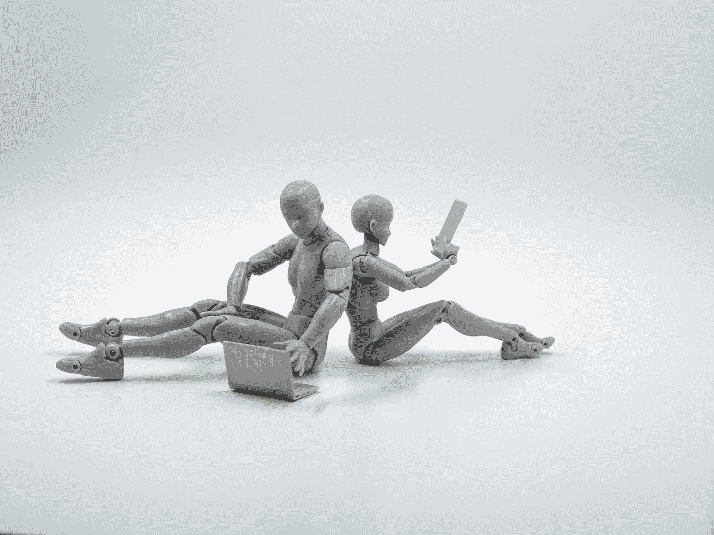

# —关于人工智能，作者人工智能🤖

> 原文：<https://pub.towardsai.net/about-ai-by-ai-d31963400ff5?source=collection_archive---------2----------------------->

## 声明:本文 90%使用 AI 生成

最近，我开始深入研究 [HuggingFace 库](https://huggingface.co/)，并想到用[文本生成管道](https://huggingface.co/docs/transformers/main_classes/pipelines)找点乐子。因此，我写了(…更确切地说是编辑了)这篇关于人工智能的采访风格的文章**，作者是人工智能**，在这里我展示了一系列文本，这些文本是用 [EleutherAI](https://www.eleuther.ai/) 的 [GPT 尼奥](https://huggingface.co/docs/transformers/model_doc/gpt_neo)模型生成的，使用问题作为提示**。**🤗

我不骗你！！！我的笔记本上有证据[在这里](https://github.com/royn5618/Medium_Blog_Codes/blob/master/TextGenerationExperiments/AI%20on%20AI.ipynb)，当我问它**人工智能是否能取代人类**时，它纠正了我的问题:

> 为什么人工智能需要取代人类？

所以不再拖延，让我们从 interview🎙️which 开始，然后是复制这个有趣练习的技术细节。

照片由[亚历山大·奈特](https://unsplash.com/@agk42?utm_source=medium&utm_medium=referral)在 [Unsplash](https://unsplash.com?utm_source=medium&utm_medium=referral) 上拍摄

## **问:什么是人工智能？**

> 人工智能是一个术语，我们用来指自动化任务的能力，通常称为人脑。绝大多数计算机科学和人工智能算法都是由人类设计和实现的，但大部分最常见的任务(例如图像、编码工具和各种视觉和听觉刺激)也可以建模。例如，我们可能会模拟人脑，如果它要使用人类驱动的能力来自动执行图像编码和颜色感知等任务，计算机通常会被训练来识别人类的这些任务。在这两种情况下，人工智能工具必须被专门设计来由人类解决这些任务，并且以类似于计算机计算能力的方式。人工智能这个术语是用来指思考和推理的能力。

布雷特·乔丹在 [Unsplash](https://unsplash.com?utm_source=medium&utm_medium=referral) 上的照片

## **问:人工智能有哪些应用？**

> 人工智能可以应用于许多行业，如医学、医药、制药/糖尿病等。它还可以应用于许多技术领域，例如教育、信息技术(It)、电信和电信。当然，人工智能的应用并不独特，但它们在许多现实世界的应用领域都很有用，如金融、医学、营销、IT、工程、软件等。

## **问:人工智能是否优于人类智能？**

> 这是排在第二位的问题:人类的智力仍处于婴儿期，因为它现在正处于发展的高峰期。
> 
> 但是人工智能有能力创造类似智能的东西，使计算机变得聪明。
> 
> 世界上最著名的人工智能公司，IBM 刚刚宣布他们的平台上已经有了人工智能，电脑可以运行人工智能。
> 
> 然而，人工智能在我们的日常生活中发挥了强大的作用。现在，顶级的机器学习公司有能力改变我们的生活，并正在使人工智能成为现实。

## 问:人工智能机器人会统治世界吗？

> 现实仍然是，机器人在生活中没有一席之地，即使它们可以将人类推向比任何其他物种想象的更高的水平。
> 
> 但是，在什么时候我们真的要问自己，我们是否真的有能力采取措施将人类推向更高的智能水平，这可能会也可能不会与我们的大脑竞争？
> 
> 这个问题从未有人回答过，我们也不敢

本·怀特在 [Unsplash](https://unsplash.com?utm_source=medium&utm_medium=referral) 上拍摄的照片

## **问:Waymo 表示，完全无人驾驶的汽车即将来到旧金山。安全吗？**

> 答案是肯定的——只要汽车不抛锚。

## **问:人工智能能取代人类吗？**

> 下一代 AI 将使用人工智能代替人类交互用于事物的事物，如信息检索、语音识别和基于计算机的推理。
> 
> 你根本不知道你在文章中面对的是什么。这是个好主意。但是这里可能有一些真正的困惑。
> 
> 问题是:“为什么人工智能需要取代人类？”这对科学家、政治家和新闻界来说是个好消息。麻省理工学院的约翰·布里梅洛(John Brimelow)在他的书《机器智能》(Machine Intelligence)中描述了人工智能在教育(和人机交互)中的应用，我们可以就它为什么有用和不有用进行大量辩论。还有一个问题:这个问题没有明确而令人信服的答案。

问:你刚才说人工智能是一个术语，我们用来指自动化任务的能力，通常称为人脑。人工智能是如何工作的？

> 几年来，研究人员一直试图了解我们的大脑如何在任务中变得更有效率。运行模拟和学习技能的能力是人工智能(AI)工作的原因，因为它在大脑中运行模拟。当您进行模拟训练时，您将获得一个自动化的真实环境，并执行该环境所需的任务。这些环境有许多不同的方法来实现它们的预期结果，从更普通的任务需求到更复杂的任务，并且有多种方法可以在模拟环境中执行任务。

**关于被采访人:**

照片由[奥其尔-额尔德尼·奥云梅格](https://unsplash.com/@chiklad?utm_source=medium&utm_medium=referral)在 [Unsplash](https://unsplash.com?utm_source=medium&utm_medium=referral) 拍摄

GPT-尼奥 125M 是一个变形金刚模型，使用伊柳瑟雷复制的 GPT-3 架构设计而成。GPT-尼奥指的是模型的类别，而 125 米代表这个特定的预训练模型的参数数量。GPT-Neo 125M 在 Pile 上进行训练，Pile 是由 [EleutherAI](https://www.eleuther.ai/) 为了训练这个模型而创建的大规模策划数据集。

**技术细节:**

由[布鲁克·卡吉尔](https://unsplash.com/@brookecagle?utm_source=medium&utm_medium=referral)在 [Unsplash](https://unsplash.com?utm_source=medium&utm_medium=referral) 拍摄的照片

以下是我如何生成这些文本的。我使用这些问题作为输入提示，通过 [EleutherAI](https://www.eleuther.ai/) 使用 GPTNeo 125M 模型生成文本。2.7B 太自负了，装不下我机器的内存😕我们会在 Colab 上看到的。🙄

*注意:答案经过编辑，以纠正微小的语法错误，并从末尾截断，以保持相关性。*

在这里找到笔记本[。它包含了我在本文中使用的文本。](https://github.com/royn5618/Medium_Blog_Codes/blob/master/TextGenerationExperiments/AI%20on%20AI.ipynb)

*感谢光临！*

**我的链接:** [中](https://medium.com/@nroy0110)|[LinkedIn](https://www.linkedin.com/in/nabanita-roy/)|[GitHub](https://github.com/royn5618)