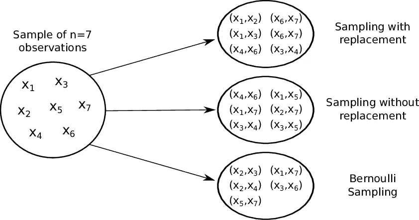
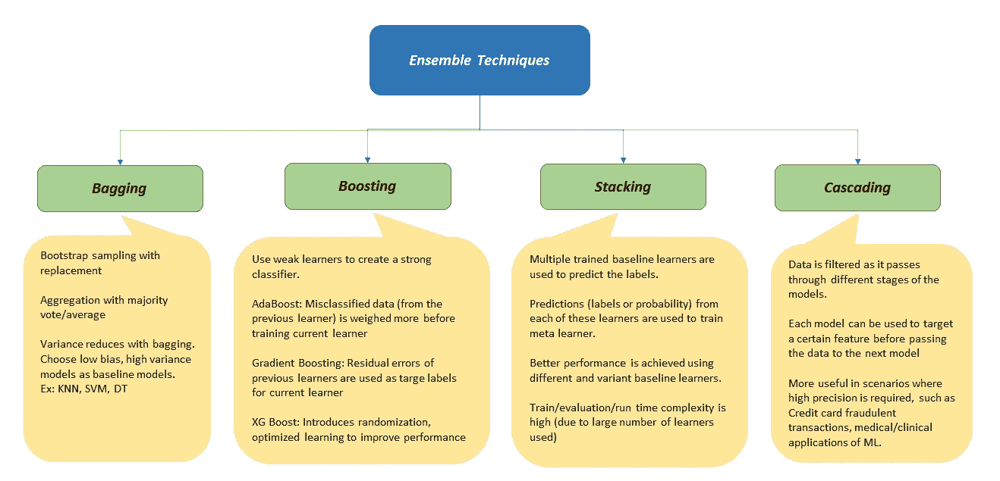
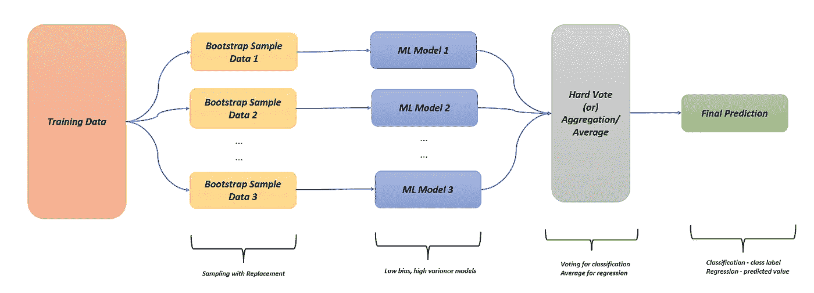
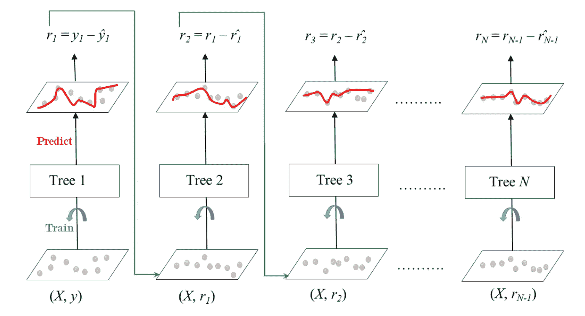
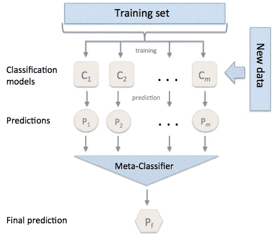
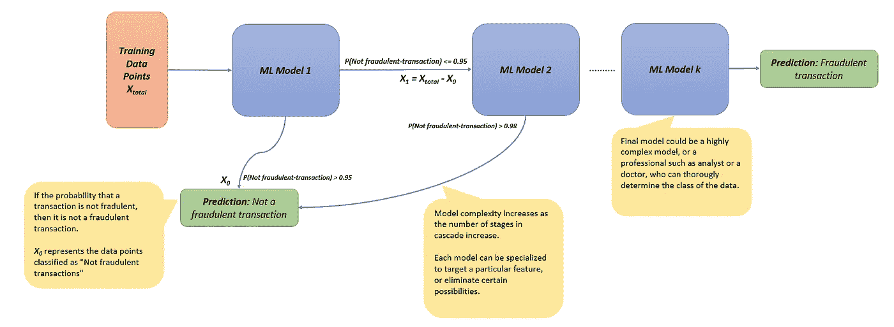
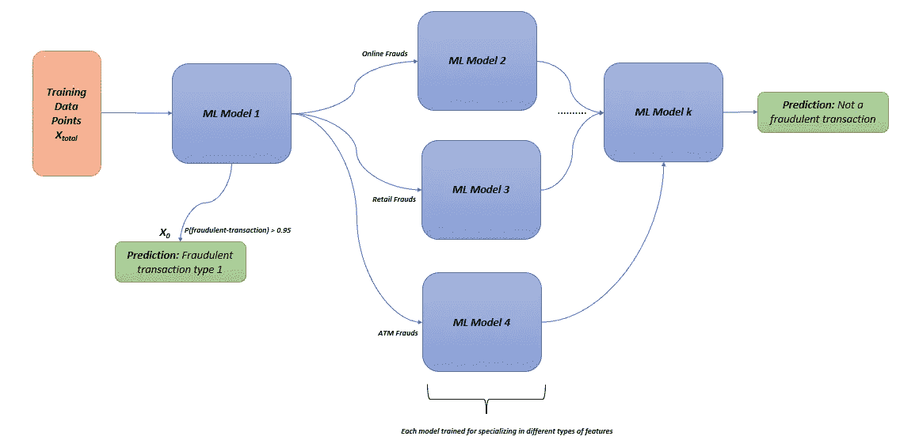

# 关于 ML 中的合奏技术。

> 原文：<https://pub.towardsai.net/about-ensemble-techniques-in-ml-6bf402bff620?source=collection_archive---------2----------------------->

## 你从概念上理解 ML 系综技术了吗？

这篇文章谈论了不同的集成技术，一个 ML 爱好者应该知道这些技术来提高他们模型的结果。这是一篇通读的文章，只关注概念上的理解(把代码留到以后)。

在 [Unsplash](https://unsplash.com?utm_source=medium&utm_medium=referral) 上由[Manuel n Geli](https://unsplash.com/@gwundrig?utm_source=medium&utm_medium=referral)拍摄的照片

如果你有一个采访或演示即将到来，或者如果你在这里了解合奏技术在几分钟内，那么这个职位是你的理想选择。所以现在开始…

## “合奏”的嗡嗡声

在过去的 20 年里，“*合奏*一直是一个流行语，不是因为它的语义——“一群音乐家*”，而是因为数据/ML 科学家。这是大多数科学家的首选解决方案，因为他们从这些技术中获益匪浅。*

## 什么是合奏技巧？

作为一名数据科学家，您手头有一些技术可以用来提高模型的性能。即****装袋******堆垛******级联*** 。使用来自多个基线模型的“组合”结果，我们可以通过最终模型实现更高的“广义”性能。*

## *集成技术如何提高模型性能？*

*这里有一个很好的类比来回答这个问题:*

*假设你在一家投资公司工作，你必须决定是否投资一家特定的公司。*

*   *去找你公司里最好的股票市场顾问，问问他是否应该投资 a 公司。假设他说*

> *我为这家公司做基本面分析。这家公司成功的可能性是 80%。*

*因为 80%的信心对于巨额投资来说是不够的，下面是你接下来可以做的事情:*

*   *去找公司里的另一位股市顾问，听听她对投资的看法。假设她说，*

> *我对这家公司进行了技术分析，这家公司成功的可能性是 85%。*

## *这是否增加了你的信心？*

*是啊！因为我们有两个最好的顾问说这家公司值得投资，至少有 80%的机会。*

*现在，如果你有 ***时间******资源*** 得到一个第三/第四/第五……的意见，你一定会选择去追求。*

*将这个类比移动到 ML 领域，你的顾问是经过**训练的**基线模型、**时间、**和**资源**，他们拥有训练模型的时间和计算能力。你是决定是否投资的最终模型。*

## *模型的“改进”性能意味着什么？*

*从广义上讲，它增加了模型的*精度，降低了模型的 ***偏差*** 和 ***方差*** 。**

**在继续学习技巧之前，请注意以下几点:**

*   **集成技术涉及**多个**机器学习模型**
*   **输入每个模型的数据可以是**相同/不同的**，这就引出了两种数据采样方法。**

## **随机采样/混合训练数据**

**传统的方法是使用整个训练数据在单个模型上进行训练/验证。**

****

**来源:[研究之门](https://www.researchgate.net/figure/Illustration-of-different-sampling-schemes-for-approximating-a-U-statistic-For_fig1_270824717)**

***集合*数据采样方式有以下几种:**

1.  ****替换取样****

*   **允许从每个模型的全部训练数据中随机抽样一个子集。**
*   **适用于大型数据集，在这种情况下，模型之间的数据协方差会更小。**

****2。无替换取样****

*   **允许数据均匀地分布在基线模型中，这样任何模型都没有公共数据。**
*   **适用于较小的数据集，在这种情况下，模型之间数据的结果协方差为 0。**

****3。伯努利采样:****

*   **每个数据点都要经过伯努利试验，伯努利试验决定该数据点是否必须是样本的一部分。如果使用随机抽样，这不是特别有用。**

# **已经简要介绍了技术！**

**这是所有合奏技巧的概览图:**

****

**集成技术概述**

## **引导聚集**

****

**图片来源:作者**

**这里有一点关于**自举采样**的步骤:**

*   **随机样本**用**替换用作模型输入的数据子集。**

**以下是完成**聚合**步骤的两种方法:**

*   ****硬投票**:输出所有预测标签的模式。对于分类任务非常有用。**
*   ****聚合**:输出所有模型结果的聚合。对回归有用。此外，我们还可以对不同模型的结果进行加权平均。**

**以下是关于**装袋**的几点注意事项:**

*   **装袋可以**减少**方差而不影响模型的偏差。这是因为该技术中的自举采样和聚集步骤。**
*   **bagging 优先选择**低偏差**和**高方差**模型作为学习器。鉴于前一点，偏差仍然很低，装袋后方差减少。**
*   ****低偏差**模型包括*决策树*、 *KNN* 和 *SVM* 。**

## **助推**

**提升包括用多个弱分类器创建一个强分类器。主要用于减少 ***偏差*** 。**

**模型是按顺序训练的，**难以**并行训练，这意味着训练的时间复杂度很高。常见的增压技术简述如下:**

****【AdaBoost】** 为了增加一个模型的性能，我们**增加**误分类**的权重/错误地**预测数据。这个加权的数据在下一次迭代中作为输入提供给下一个学习者。**

****

**来源:[科学直接](https://www.sciencedirect.com/science/article/pii/B9780128177365000090)**

**因为错误分类的数据现在权重更大，所以模型现在将给予这些数据点更大的重要性，并且其预测正确的概率将增加。**

**最后，使用投票机制来决定所有组合模型(弱学习者和强学习者)的输出。**

****梯度提升** 在这种情况下，我们基于前一个学习器的**残差**来训练连续的学习器。这是通过将**残差**设置为用于训练新模型的**目标标签**来实现的。**

****

**来源:[数据营](https://campus.datacamp.com/courses/machine-learning-with-tree-based-models-in-python/boosting?ex=5)**

**在分类的情况下，残差是根据类的概率计算的。概率是根据赔率计算的。([参考](https://towardsdatascience.com/https-towardsdatascience-com-what-and-why-of-log-odds-64ba988bf704))**

****Xtreme 渐变增强(XGB)****

**XGBoost 是残差梯度提升中最先进的算法。与传统的升压技术相比，它有几个优点:**

*   **并行处理:XGBoost 支持 GPU 和 Spark 兼容性。**
*   **基于现有模型进行训练:XGBoost 允许保存训练结果，并在任何其他情况下基于这些结果进行构建。**
*   **引入新的正则化参数，防止过度拟合并减少偏差。**

**引入了新的超参数，例如:
1。动态确定决策树的适当深度和复杂度。
2。允许行采样+列采样。
3。随机化参数
4。[牛顿树推进](https://arxiv.org/abs/1808.03064)优化学习树结构。**

## **堆垛**

*   **允许一起训练多个模型以获得预测。**
*   **第一个模型的结果被聚集并用作元学习者的训练数据。**

****

**来源: [MLXtend](http://rasbt.github.io/mlxtend/user_guide/classifier/StackingClassifier/)**

*   **每个基线模型的输出被用作元分类器的输入，并用实际输出进行训练。**
*   **使用不同的基线模型将导致堆叠分类器的更好的性能。**
*   **在竞争激烈的 ML 环境中很受欢迎(例如: *Kaggle* )**

## **级联**

*   **这种集成技术广泛用于关键应用，如信用卡交易中的欺诈检测和医疗诊断(例如:癌症检测)。**

****

**图片来源:作者**

**上图是 ML 模型如何级联的一种表示。**

*   ****注意**每个模型中的数据可能不同。**
*   **模型的复杂性随着模型数量的增加而增加。**
*   **每个模型都可以被训练为针对/分类一个特定的特征(见下面的例子)**

**考虑级联的另一种可能性，通过创建模型网络来定位特征并执行分类:**

****

**图片来源:作者**

**分类器网络可用于检测关键应用中的不同用例，这些应用需要较高的准确度和置信度。**

**总之，有了机器学习模型，你可以随心所欲地发挥创造力！**

**希望这有所帮助:)**