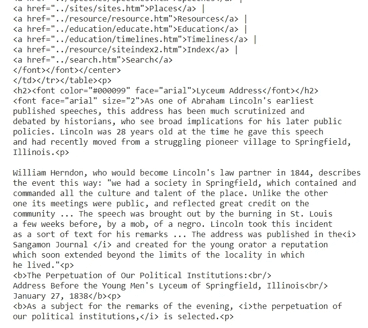
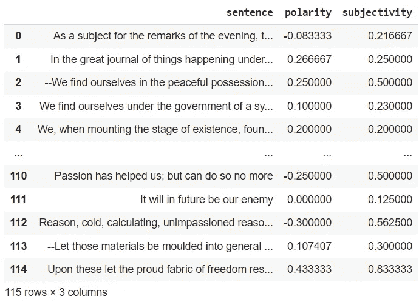
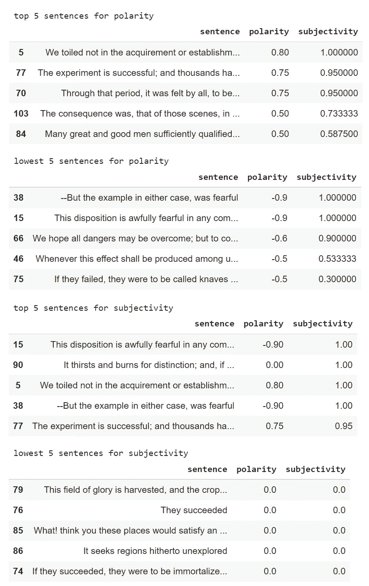
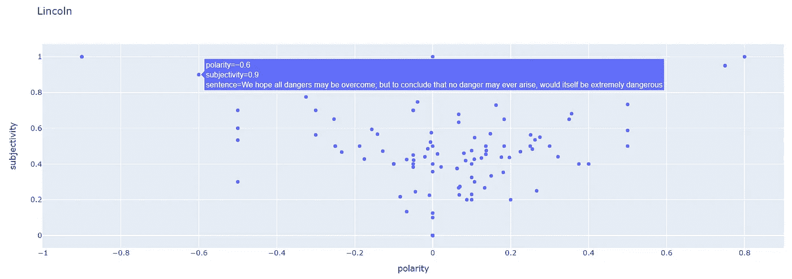

# 亚伯拉罕·林肯中学演讲，NLP 情感分析

> 原文：<https://pub.towardsai.net/abraham-lincoln-lyceum-speech-nlp-sentiment-analysis-3749f4ad4e22?source=collection_archive---------4----------------------->

## [自然语言处理](https://towardsai.net/p/category/nlp)

## 使用 TextBlob 执行情感分析。完整的代码可在我的回购[。](https://github.com/arditoibryan/Projects/tree/master/20210719_TextBlob_sentiment_analysis)

在本文中，我将解释一个简单的代码，它能够抓取包含亚伯拉罕·林肯演讲的 HTML 页面，然后，在清理数据后，我将对每个句子进行情感分析，以更好地理解数据。本文的目的是让您对这项技术的工作原理有一个基本的了解，以及基本的 NLP 数据处理是如何完成的。


亚伯拉罕·林肯吸血鬼猎人，2012

有很多软件可以进行情感分析，其中最先进的一个可以在 HuggingFace 库中找到。然而，为了简化和最小化复杂性，我将限制自己使用这个开源工具。

本文将遵循这些简单的步骤:

1.  导入库
2.  网络抓取演讲
3.  从代码中分离出语音
4.  清理文本
5.  把演讲分成句子
6.  执行情感分析
7.  打印结果
8.  使用散点图绘制交互结果

## 导入库

为了执行 web 抓取，我将使用 Beautifulsoup 库。据我所知，这是可用的最简单的 web 抓取库。它可以在大多数网站上运行，除非他们有防止网络抓取的保护措施。从简单的 HTML 中提取信息将是小菜一碟。

```
#download data
import requests
from bs4 import BeautifulSoup
```

## 网络抓取演讲

我要做的第一件事是连接到网站下载 HTML。我特意选择了一个包含林肯演讲的简单网站。

程序将把 HTML 保存在一个变量中。然后，我需要解析和清理字符串。

```
URL = '[http://www.abrahamlincolnonline.org/lincoln/speeches/lyceum.htm'](http://www.abrahamlincolnonline.org/lincoln/speeches/lyceum.htm')
page = requests.get(URL)#next step: parsing
soup = BeautifulSoup(page.content, 'html.parser')
soup
```



正如我们所看到的，文本还不能用于 NLP 任务

## 从代码中分离出语音

因为整个 HTML 页面包含的字符和信息比我需要的要多，所以通过打印演讲的第一句和最后一句的索引，我将能够直接从字符串中选择它。只有这样，我才会继续打扫。

```
#extract full speech, from beginning to end
print(str(soup).find('As a subject fo'))
print(str(soup).find('not prevail against')+len('not prevail against'))speech = str1[2285:23012]#show last 100 words
speech[-100:]Output:
2285
23009
As a subject for the remarks of the evening, <i>the perpetuation of\nour political institutions,</i> is selected.<p>\n\nIn the great journal of things happening under the sun, we, the\nAmerican People, find our account running, under date of the\nnineteenth century of the Christian era.--We find ourselves in the\npeaceful possession, of the fairest portion of the earth, as regards\nextent of territory, fertility of soil, and salubrity of climate.\nWe...
```

## 清理文本

有时候，清理字符串是非常复杂的，特别是如果它们的长度很大，我们无法手动检查(让我们想想大数据)。幸运的是，这次我没有遇到很多问题。首先，我将使用 regex 命令清除每个 HTML 组件中的文本，然后删除返回的字符串，然后只进行一些自定义编辑(删除圣路易斯的点)。

```
#clean speech from characters used in html
import redef cleanhtml(raw_html):
  cleanr = re.compile('<.*?>')
  cleantext = re.sub(cleanr, '', raw_html)
  return cleantextcleaned_speech = cleanhtml(speech).replace("\n" , " ")
#St. Louis would have split into a single sentence
cleaned_speech = cleanhtml(cleaned_speech).replace("St. Louis" , "St Louis")Output:
As a subject for the remarks of the evening, the perpetuation of our political institutions, is selected.  In the great journal of things happening under the sun, we, the American People, find our account running, under date of the nineteenth century of the Christian era.--We find ourselves in the peaceful possession, of the fairest portion of the earth, as regards extent of territory, fertility of soil, and salubrity of climate. We...
```

## 把演讲分成句子

现在这个演讲已经完全干净了，看起来像一个没有任何奇怪字符的常规字符串，我将把它分成句子，把每个句子存储在一个数组中。

```
#split sentences by . and put them in a list
sentences = cleaned_speech.split('.')Output:
['As a subject for the remarks of the evening, the perpetuation of our political institutions, is selected',  
'In the great journal of things happening under the sun, we, the American People, find our account running, under date of the nineteenth century of the Christian era',  
'--We find ourselves in the peaceful possession, of the fairest portion of the earth, as regards extent of territory, fertility of soil, and salubrity of climate',  
'We...
```

## 执行情感分析

我现在需要做的就是遍历每一个句子并进行情感分析。TextBlob 是一个非常简单的工具，使得执行任务非常容易。最后，我将把我的结果存储在一个数据集中。

```
from textblob import TextBlobdf = list()
for sentence in sentences:
  testimonial = TextBlob(sentence)
  #testimonial.sentiment (polarity, subjectvity)
  testimonial.sentiment.polarity
  df.append([sentence, testimonial.sentiment.polarity, testimonial.subjectivity])
dfimport pandas as pddf = pd.DataFrame(df)
df.columns=['sentence', 'polarity', 'subjectivity']
```



最终数据集的样本

## 打印结果

我现在将根据情感分析的结果打印出前 5 句和后 5 句。

```
print('\n', 'top 5 sentences for polarity')
display(df.sort_values('polarity', ascending=False)[0:5])print('\n', 'lowest 5 sentences for polarity')
display(df.sort_values('polarity', ascending=True)[0:5])print('\n', 'top 5 sentences for subjectivity')
display(df.sort_values('subjectivity', ascending=False)[0:5])print('\n', 'lowest 5 sentences for subjectivity')
display(df.sort_values('subjectivity', ascending=True)[0:5])
```



决赛成绩

## 使用散点图绘制交互结果

通过使用 plotly，我能够使用交互式图表来可视化我的结果:

```
import requests
from bs4 import BeautifulSoup
from textblob import TextBlob
import pandas as pd
import re
import plotly.express as pxfig = px.scatter(df, title='Lincoln', x='polarity', y='subjectivity', hover_data=['sentence'])
fig.show()
```



基于主观性和极性的结果散点图