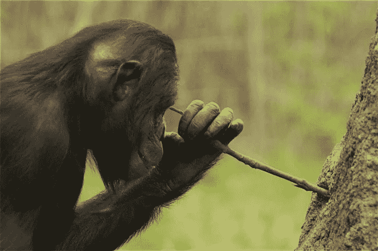
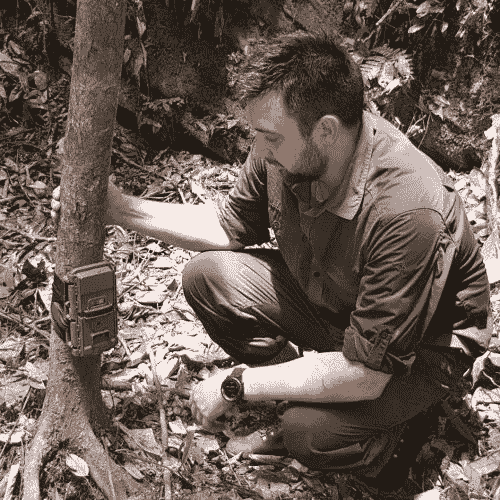
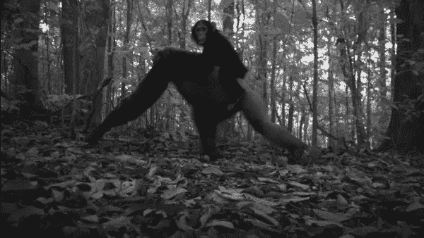
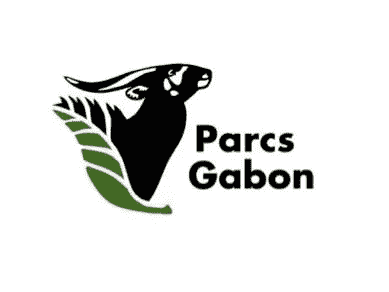
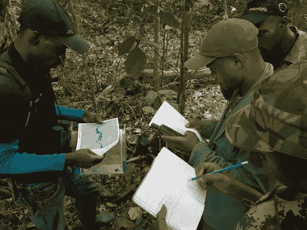

# 用于野生动物图像分类的无障碍人工智能项目获得谷歌资助

> 原文：<https://pub.towardsai.net/accessible-ai-for-wildlife-image-classification-project-receives-a-google-grant-1e6f57b2d97c?source=collection_archive---------0----------------------->

# 介绍

人类活动给全世界的自然栖息地带来了巨大的压力。许多物种发现在气候变化和环境恶化的时代很难生存。生物多样性保护工作者和研究人员正在努力通过监测和保护野生物种来缓解和逆转这些过程。他们越来越多地利用尖端技术来支持和简化他们的工作。相机陷阱已经成为实现这些目的的无处不在的工具，现在**机器学习**通过指数级提高野生动物**图像分类**的速度来提供进一步的进步。

作为 Appsilon Data Science 的 [AI for Good initiative](https://appsilon.com/ai-for-good/) 的一部分，我们有机会与斯特灵大学的专家合作，为加蓬**国家公园机构的生物多样性保护者的工作做出贡献。我们自豪地宣布，我们将在一个项目中使用我们的计算机视觉技能，该项目最近得到了**谷歌教育基金**的支持。请继续阅读，了解更多关于人工智能辅助的生物多样性保护和我们在加蓬保护野生动物的项目。**

# 相机陷阱——机遇与挑战

相机陷阱技术(动物的自动摄影)越来越便宜，也越来越容易被生物多样性保护主义者获得，并成为监测许多难以捉摸或稀有的陆地哺乳动物的黄金标准。通过自动识别照片中的动物[，机器学习方法正在彻底改变大型相机陷阱数据集(通常包含**数百万张**图像)的分析。](https://www.cambridge.org/core/journals/environmental-conservation/article/wildlife-insights-a-platform-to-maximize-the-potential-of-camera-trap-and-other-passive-sensor-wildlife-data-for-the-planet/98295387F86A977F2ECD96CCC5705CCC)

*加蓬洛佩斯国家公园的 Panthera 相机陷阱*

中非的加蓬是热带森林哺乳动物最后的避难所之一，是世界上 80%的极度濒危森林大象，以及大猩猩、黑猩猩、穿山甲、山魈和许多其他动物的家园。在其 13 个国家公园中使用摄像陷阱来监测哺乳动物数量，并为未受保护地区的土地管理提供信息(如伐木特许权或棕榈油种植园的生态影响评估)。最近在加蓬重新发现了斑点鬣狗和非洲狮，这表明还有很大的发现潜力。

*加蓬洛佩斯国家公园的黑猩猩母子*

最近在加蓬进行的一项大规模生物多样性监测项目(由加蓬国家公园管理局、 [Panthera Corp.](https://www.panthera.org/) 和斯特灵大学合作)发现，尽管技术进步显著，但土地管理者和环保主义者对分析相机陷阱数据的速度和难度越来越失望。如果分布、数量或种群结构(例如，雄性与雌性的比例)的变化几个月甚至几年都没有被注意到，延迟可能会对大象等濒危物种产生代价高昂的影响。摄像机还可以检测非法活动(例如保护区内的象牙偷猎者)，当务之急是快速检测到这些事件，以便通知执法部门。

# 现有解决方案及其局限性

学者和熟练的从业者已经描述并解决了快速分类大图像数据集的挑战。例如[诺鲁扎德等人](https://www.ncbi.nlm.nih.gov/pubmed/29871948)。(2018)发现深度学习技术可以自动识别坦桑尼亚北部塞伦盖蒂生态系统数据集中超过 99%的野生动物图像。他们表明，“自动、准确、廉价地收集此类数据有助于催化生态学、野生动物生物学、动物学、保护生物学和动物行为学等许多领域向‘大数据’科学的转变。”

[塔巴克等人](https://besjournals.onlinelibrary.wiley.com/doi/full/10.1111/2041-210X.13120)。(2018)为在资源受限的情况下利用机器学习进行野生动物图像分类提供进一步支持。首先，他们复制了 Norouzzadeh 等人(2018 年)的结果，显示使用美国数据集开发的图像分类模型的准确率为 98%。其次，作者表明，这个模型可以成功地重新用于来自加拿大和坦桑尼亚的样本数据集。这为开发一个可以在全球范围内使用的通用模型的想法提供了依据。第三，他们成功地在笔记本电脑上离线运行了这个模型。

这是一个快速发展的研究领域，还有其他解决方案旨在解决分析相机陷阱产生的大量数据的问题。虽然新颖，但它们往往没有考虑到自然资源保护者可利用的有限资源，不仅在非洲，而且在生物多样性保护资金不足的其他地区也是如此。

例如，[野生动物观察](https://www.wildlifeinsights.org/)是一个新的基于云的解决方案。它利用深度学习技术进行自动野生动物图像分类。然而，它需要接入高速互联网、专有数据管理系统和其他工具，这些都很昂贵，而且需要专门的信息技术知识。

Tabak 等人(2018)等学者提供的解决方案可以在基本机器上离线运行，但是，它们需要在使用数据科学工具(如 R 和计算机编程)方面的大量专业知识，并且它们不是独立的应用程序。这使得其他领域的专家无法使用它们。

总的来说，现有的工具通常要求用户具备一些计算机编程知识和/或快速互联网连接(例如，使用基于云的平台，如 [Zamba](https://zamba.drivendata.org/) 、Wildlife Insights 或 [Marco Willi 分类器](https://github.com/marco-willi/camera-trap-classifier))。这对许多自然资源保护者来说是一个很大的问题，他们很少在计算机编程方面有经验，并且经常在很少或没有互联网接入的偏远地区工作。此外，机器学习工具目前在非洲的重点是稀树草原物种，而这些可能不适合森林物种。为了让保护主义者充分利用相机陷阱在物种监测、保护和发现方面的巨大潜力，需要简单的软件工具，在没有互联网接入的基础硬件上实现尖端的机器学习算法。

# Appsilon 解决问题的方法

在 Appsilon 建立[人工智能促进良好计划的过程中，我们提倡一种](https://appsilon.com/ai-for-good/)[探索性方法](https://appsilon.com/ai-for-good-our-approach-to-tackling-climate-change-with-data-science/)。我在国际发展领域的工作经历让我相信，许多西方开发的、以技术为中心的解决方案并没有给这一人群之外的最终用户带来预期的结果，因为他们没有意识到应用这些解决方案的环境更加复杂的现实。设计师倾向于寻找一个令人兴奋的技术发展来解决问题，而不是相反。为了防止重蹈覆辙[，我们与各个领域的专家合作](https://appsilon.com/ai-4-good-data-science-for-biodiversity/)，在这些领域，机器学习和其他尖端技术解决方案可以[提供帮助](https://appsilon.com/ai4g-a-decision-support-system-for-disaster-risk-management-in-madagascar/)。为此，我们与生物多样性保护领域的世界级专家罗宾·怀托克博士和凯瑟琳·阿伯内西教授展开了合作，罗宾也是一名经验丰富的数据科学从业者。

我们一起着手将新的和现有的机器学习算法集成到一个**易于安装的**和**易于使用的**、**开源的**软件工具中，该工具能够**在没有互联网接入的情况下自动分析相机陷阱数据**。将使用最近整理的独特数据库创建新的算法，该数据库包含过去十年在中非拍摄的 160 万张带标签的图像。该项目最初将侧重于加蓬的中非森林物种，但也将扩大到包括整个中非林区。

自 2018 年 2 月以来，Robin 一直在加蓬国家公园管理局工作，领导一项大规模的生物多样性监测计划(由欧盟 ECOFAC6 计划资助)，该计划使用 200 个相机陷阱调查洛浦*和瓦卡国家公园(包括 7000 平方公里的连续森林)的哺乳动物种群。这个项目的目的是在两个国家公园以及整个国家公园管理局内建立长期的、科学严格的**生物多样性监测能力。Whytock 博士将利用过去两年与加蓬当地研究团队合作获得的经验，帮助我们设计和制造一种对当地保护管理人员真正有用的工具，这些管理人员的互联网接入有限，只有基本的计算技能，但他们越来越多地使用相机陷阱在更大的空间范围和更长的时间内监测野生动物。***

*加蓬 Lope 国家公园 Lope-Waka ECOFAC6 生物监测项目的 Brice Momboua 为生态卫士和研究助理提供关于相机捕捉方法的培训*

# 我们的计划

我们将很快进行一次紧张的冲刺**来创建该解决方案的试点版本，该版本将可用于 Windows 操作系统，并满足在加蓬工作的自然资源保护者的基本要求。我们将通过我们的 [AI for Good initiative](https://appsilon.com/ai-for-good/) 用我们自己的资金资助这个 MVP，并且用[谷歌教育](https://edu.google.com/programs/credits/research/)基金授予阿伯内西教授的谷歌云平台积分。我们将使用学分来训练我们的 ML 模型。**

除了这个 MVP，我们还想为野生动物图像分类建立一个完全**开源的多平台解决方案**，该解决方案将在全球**可用**。如果 MVP 成功，我们计划在今年下半年启动大规模项目。

[请务必在未来几周访问我们的博客](https://appsilon.com/blog/)，因为我们将发布关于我们进展的更新。这些更新将包括对我们用于构建 ML vision 模型和应用程序的方法的更具技术性的讨论，包括 UX/UI 设计方法，这将使我们能够满足非技术生物多样性研究人员的需求。

与此同时，如果您想了解野生动物保护背景下的图像分类模型，请查看我们的首席技术官 Marek Rogala 的[博客文章](https://appsilon.com/using-ai-identify-wildlife-camera-trap-images-serengeti/)，其中介绍了我们最近参加由 DrivenData 组织的 [Hakuna-ma 数据竞赛](https://www.drivendata.org/competitions/59/camera-trap-serengeti/page/145/)，该竞赛要求参与者构建一种能够跨时间和位置进行推广的野生动物检测算法。

感谢阅读！更多信息，请点击这里查看我的其他文章[，并在](https://medium.com/@tbaraslupski) [LinkedIn](https://www.linkedin.com/in/tadeusz-bara-slupski-31112a59/) 和 [Twitter](https://twitter.com/tbaraslupski) 上关注我。

*这篇博文的内容得到了 Robin Whytock 博士的大力支持。*