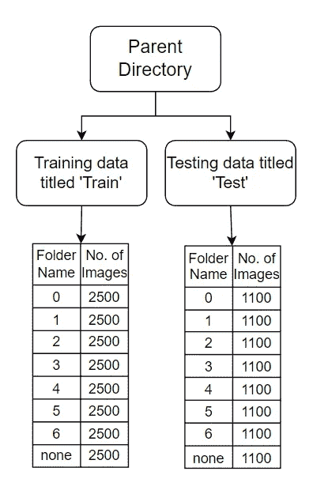
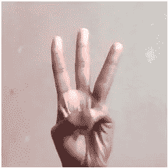
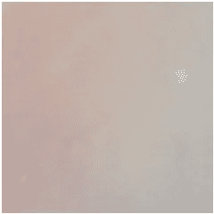
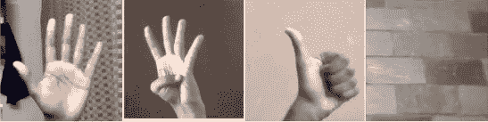
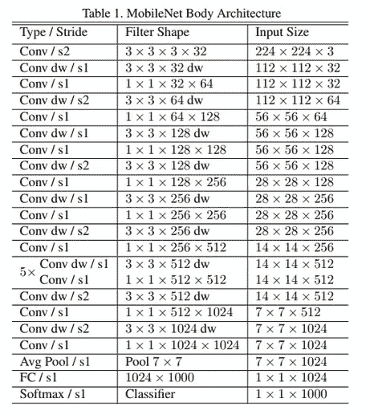
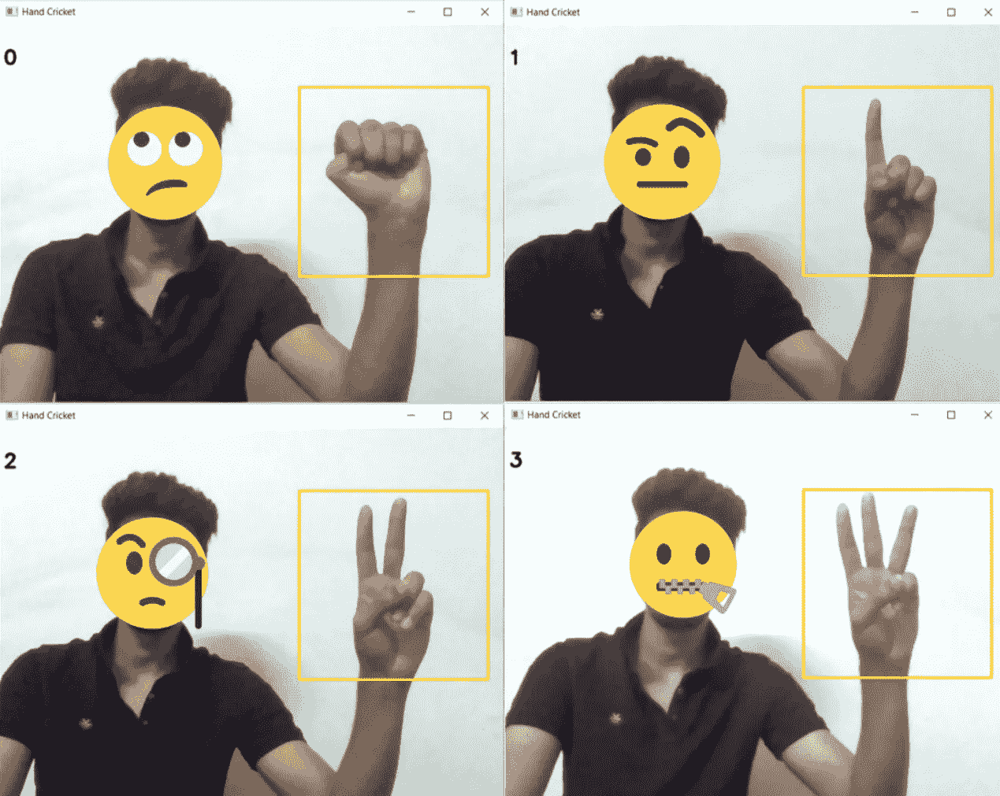
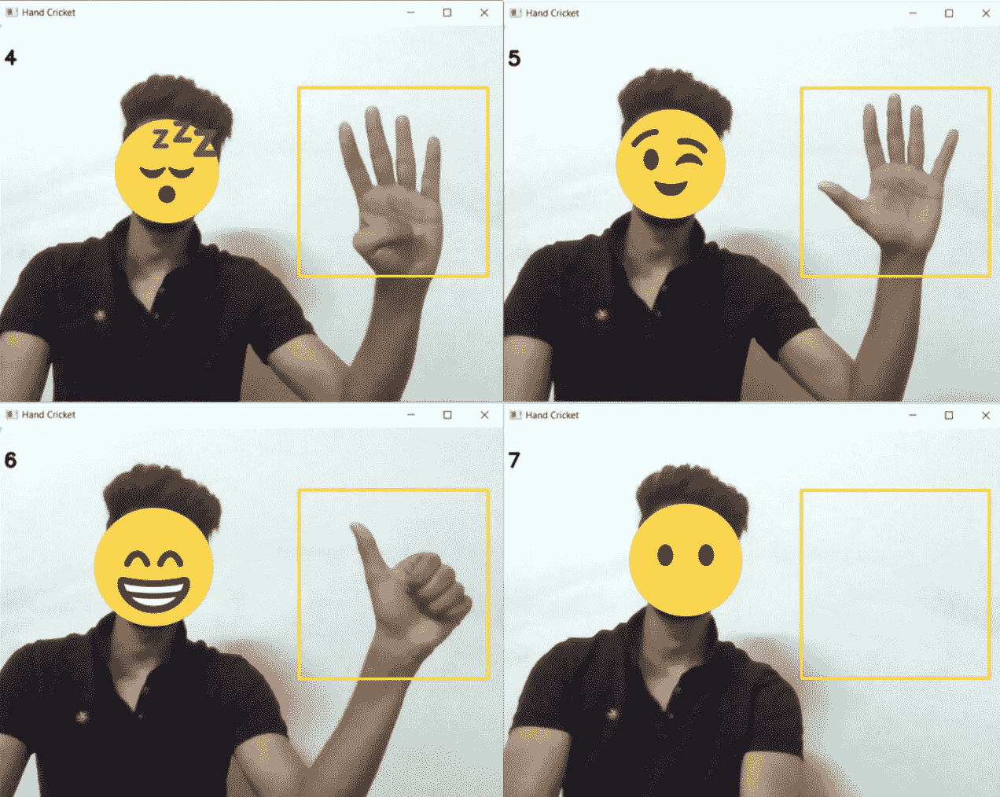
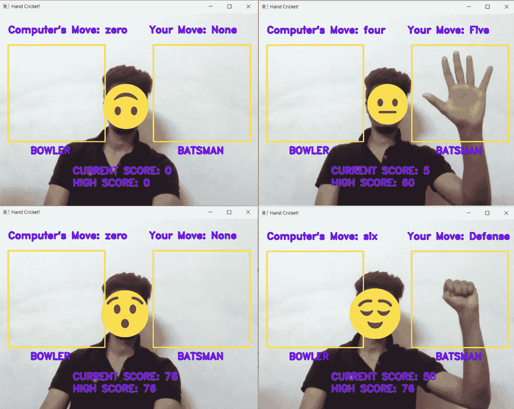

# 使用 CNN 和 OpenCV 的手板球仿真

> 原文：<https://pub.towardsai.net/achand-cricket-simulation-using-cnn-and-opencv-102f3d87142?source=collection_archive---------1----------------------->

我一直想在这方面努力很久了。从小到大，板球是我最喜欢的游戏之一，我觉得这是我回忆那些时刻的方式。对于那些不知道它如何工作的人，这里有一个游戏的简要描述:

*   手板球和石头剪刀布的游戏很相似。几分钟后你就会明白了。为了简单起见，我将尽量把规则限制在玩这个游戏所必需的范围内。
*   你需要两名球员来玩这个游戏——一名击球手和一名投球手。
*   在这里，击球手和投球手同时选择一个符号，就像石头剪刀布一样。每个符号都与特定的跑步/点数相关联。
*   这个游戏一共涉及到 7 个手势/符号
    ***-食指向上= 1 跑/1 分
    -食指和中指向上= 2 跑/2 分
    -食指、中指&无名指向上= 3 跑/3 分
    -食指、中指、无名指&小指向上= 4 跑/4 分
    -食指、中指、无名指、小指&拇指向上= 5 跑/5 分
    -只有拇指向上= 6 跑/6 分***
*   击球手和投球手可以自由选择他们想要的任何符号。
    **-投球手的目标:尝试选择与击球手相同的符号
    -击球手的目标:尝试选择与投球手不同的符号** **并得分/得分**

现在这里是击球手如何得分和投球手如何试图阻止他。

1.  击球手每移动一次，选择一个不同于投球手的数字，他就得到他选择的数字所指示的分数。
2.  上述规则的一个例外是闭合的拳头(防御)符号。这一步将使击球手得到由投球手选择的符号所指示的分数。
3.  如果击球手和投球手选择相同的手符号，游戏结束！

这里有一个简单的场景来说明这一点:

**-第一轮:**
击球手符号= 4 ( *指数，中， 环&小拇指向上* )
投球手符号= 2 ( *食指和中指向上* )
击球手得分= 4 分
**-第 2 轮:**
击球手符号= 5
投球手符号= 3
击球手得分= 9 分(4+5)
**-第 3 轮:**
击球手符号
**-第 4 轮:**
击球手符号= 0(防守)
投球手符号= 6
击球手得分= 16 分(4+5+1+6)
**-第 5 轮:**
击球手符号= 3
投球手符号= 3
***游戏结束！ 击球手的最终得分= 16 分***

*叹息*。这是令人筋疲力尽和相当复杂的，没有感谢我。为了你好，我希望你事先熟悉这个游戏。

现在我们知道了这个游戏是如何工作的，我们可以开始尝试复制这个游戏了。(我将使用 Python 编写代码片段)

这是一段很长的代码，请多包涵。该过程可分为以下步骤:

*   步骤 1:数据收集和格式化
*   步骤 2:加载数据并处理它
*   步骤 3:设计 CNN 模型架构
*   步骤 4:训练 CNN 模型计算手指数
*   步骤 5:实时测试模型以计算手指数
*   第六步:修改手板球的规则
*   步骤 7:实时实现训练好的 CNN 模型来模拟手板球

下面几节中的代码要求对 python、OpenCV 和 CNN 的熟练程度达到中等水平。我建议在继续阅读本节之前，先熟悉与上述主题相对应的更简单的代码。

我们开始吧！

# ***第一步:数据采集和格式化***

这个项目所需的数据必须是代表数字 0-6(包括 0 和 6)的图像。我已经收集好资料上传到 Kaggle: [手形符号](https://www.kaggle.com/datasets/abhinowww/hand-cricket-symbols)。我使用 python 的 OpenCV 库收集了这些数据。下面快速阅读一下我是如何做到的:[数据收集](https://medium.com/@abhi1achiever/data-collection-using-opencv-cc5aa7f27255)。

我总共收集了 28800 张尺寸为 240x240 像素的 jpg 图片。在这 28000 幅图像中，20000 幅存储在“train”文件夹中，其余 8800 幅存储在“test”文件夹中。为什么是 28000 张照片？为什么一列火车要考 20000:8800 的比例？为什么是 240x240 大小的图片？没有特别的原因！我只是不断收集越来越多的数据，同时测试模型如何实时工作。这些数字产生了一个足够好的模型，所以我坚持使用它们。不管怎样，继续前进！

训练和测试文件夹都包含另外 8 个名为“0”、“1”、“2”、“3”、“4”、“5”、“6”、“无”的文件夹。训练文件夹中的每个文件夹包含 2500 幅图像，测试文件夹中的文件夹包含 1100 幅图像。迷茫？我也会的。这里有一个更好的表示，使它更容易。

目录结构

我已经建立了这个结构，希望根据 train 文件夹中的数据训练模型，并根据 test 文件夹中的数据测试它。然而，我最终使用了所有的数据来训练模型，因为，我的最终目标是实时实现它，而不是报告模型所达到的精度。如果你们中的任何人对找出准确性感兴趣，类似于上面的结构可能会被证明是有用的。

有些人可能会注意到名为“无”的文件夹。此文件夹包含没有手形符号的图像。该文件夹中的图像用于建立用户不显示符号时的状态。它本质上包含了带有随机背景的图像。在机器学习方面，这是一个多类分类问题，其中每个符号都是一个特定的类。当用户没有选择手形符号时，有必要包括一个指示用户没有显示手形符号的状态的类来实时识别图像。

# ***第二步:加载数据并处理***

上一步会让我们将数据存储在工作目录中。我们现在必须将它引入环境中(以所需的格式将其存储在变量中)。

假设数据存储在名为“dataset”的文件夹中。我们使用 python 操作系统库中的函数遍历这个文件夹和其中的文件。每个文件夹中的每个图像都被转换成一个 NumPy 数组，并存储在一个名为‘images _ as _ numpyarr’的列表中。另一个称为“标签”的列表被维护，它存储由图像表示的数字，与存储在 images_as_numpyarr 列表中的图像在相同的索引处。

对于那些熟悉监督机器学习的人来说，标签列表用于通过标记数据来提供监督。

因此，images_as_numpyarr[0]将包含作为 NumPy 数组的图像像素数据，labels[0]将包含图像中显示的数字。

标签为类别 3 的样本图像

因此，如果这是第一张图像，images_as_numpyarr[0]会将此图像存储为 NumPy 数组，labels[0]会存储数字 3。

标签 0 到 6 表示正在显示的数字，而标签 7 表示没有数字正在显示(前面提到的“无”状态)。

标记为类别 7 的“无”状态的样本图像

标签列表会将上面的图像标记为数字 7(表示图像的类别),并将其存储在列表中。

如果找到以下图像，标签列表将为:

## 标签= [5，4，6，7]

样本图像

然后在第 21 行使用一个热编码技术对这些标签进行编码。

# 步骤 3:设计 CNN 模型架构

现在我们已经有了现成的数据，我们需要设计一个 CNN 模型并将数据输入其中。我没有从头开始构建一个架构，而是使用迁移学习来更容易地构建一个有效的模型。下面有一篇文章详细讲解:[迁移学习](https://medium.com/@silvershine1st/transfer-learning-for-cnn-7eed1d8a5305)。简单来说，就是使用一个预先训练好的模型(带权重)，修改最后几层来适应我们需求的过程。这种技术有助于减少构建和编译复杂架构的时间。

这里，我使用了一个叫做 MobileNet 的轻量级架构。这是建筑。

学分:[中等](https://medium.com/analytics-vidhya/image-classification-with-mobilenet-cc6fbb2cd470)

复杂？我理解你。目前，只需要理解 MobileNet 是预先构建和预先训练的(这意味着通过训练产生一些适当的权重)。我们将导入这个架构，修改最后几层(通常通过添加新层)并根据我们的数据训练模型。

这是代码。我已经在第 8 行中导入了 MobileNet 架构，并在最后添加了一些层(第 9–13 行)。然后我用 Adam optimizer 编译了它，学习率为 0.0001。我尝试用不同的参数进行训练，下面代码中的参数被证明足够好。

# 步骤 4:训练 CNN 模型计算手指数

现在我们已经准备好了架构，我们把图像和标签作为 NumPy 数组传入(第 4 行)。

images_as_numpyarr[0]的形状是 240x240x3 (240x240 是图像大小，3 表示通道数(RGB))，而 labels[0]的形状是 28800x8 (28800 是图像数，8 是分类中可能的不同类别数(0，1，2，3，4，5，6，7) (7 表示无类别))。

该模型被训练 2 个时期。这个过程在我的机器上花费了大约 50-60 分钟。根据您可用的处理能力，这个时间可能会有所不同。

然后，保存模型以检查所取得的进展，我们可以在下次处理时加载模型，而不是再次训练模型。

# 步骤 5:实时测试模型以计数手指

我们的模型终于可以实时计算手指的数量了。使用 OpenCV，我们可以使用我们的网络摄像头，让我们的模型检测显示的手指数量。

我们在屏幕的右边画一个正方形。在每一帧中，我们将提取这个方块并将其传递给我们的模型。然后，我们的模型返回一组概率。由于有 8 个可能的类别(0，1，2，3，4，5，6，7)，数组中的每个值代表图像在索引 x 处有一只手代表数字 x 的概率(除了索引 7 处的概率值代表图像中没有手的概率的 7)。数组中具有最大概率的值是模型预测将在图像中显示的值。我在屏幕的左上角显示了这个值。

手指计数模型:学分: [Canva](https://www.canva.com/)

手指计数模型:学分: [Canva](https://www.canva.com/)

# 第六步:我对板球的适应

我们现在有了一个能够数手指的模型。现在我们继续游戏的技术细节。这个项目是为了让一个人和一个机器人玩游戏而创建的。如果两个人想玩板球，他们可以亲自去，或者通过视频电话。所以下面的程序只能用来对付机器人。为了进一步简化，人类将永远扮演击球手，而机器人将永远扮演投球手。投球手将每秒从 0-6 中随机选择一个数字。击球手选择一个数字的那一刻(在指定区域用手示意一个数字)，这个数字就被加到他的得分上。由于计算机每一帧都会选择一个新的数字，因此很难跟上机器人的步伐。我们只需随机选择一个数字，甚至不规则，并希望它与机器人(投球手)选择的数字不匹配。

# 步骤 7:实时实现训练好的 CNN 模型来模拟手板球

如果你做到了这一步，拍拍自己的背，因为你有一些认真的奉献精神要学习。(我累坏了)

这是最后一段代码，它将计算手指的模型(第 44–49 行)与介绍部分(第 56–64 行)中描述的游戏规则结合起来。

我们再次使用 OpenCV 来访问网络摄像头，因为我们需要实时实现这一点。在屏幕的右半部分有一个供用户(击球手)使用的专用空间。用户的当前得分和最高得分显示在屏幕上(第 67-80 行)。

游戏开始了！(忽略当前和高分。因为每秒钟模型检测到一个由我(击球手)选择的数字，比如说 5，5 分被加到我的分数(击球手的分数)上。因此，每隔一秒钟，我的分数就会增加 5 分，直到机器人随机选择 5 分，这意味着击球手(我)的比赛结束。当这种情况发生时，我的当前分数被带回 0，我的游戏重新开始)

板球手办:演职员表: [Canva](https://www.canva.com/)

谢谢你坚持到最后。我在这个项目上投入了很多努力，我希望这对你来说也是一次学习经历。

下次见！再见。