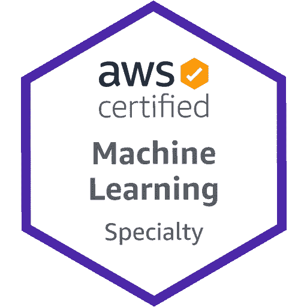
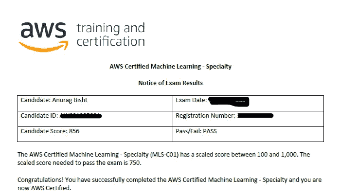
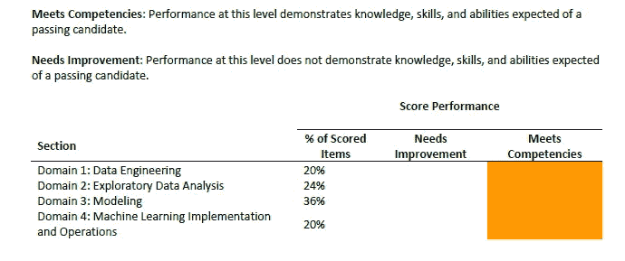

# 像专家一样通过 AWS 认证机器学习专业考试

> 原文：<https://pub.towardsai.net/acing-the-aws-certified-machine-learning-specialty-exam-like-a-pro-1d8251345e7a?source=collection_archive---------3----------------------->

## [云计算](https://towardsai.net/p/category/cloud-computing)，[机器学习](https://towardsai.net/p/category/machine-learning)

## 2020 年认证准备指南

图片提供:亚马逊网络服务

我希望你们都过得很好。在这篇文章中，我想分享一下我通过 AWS 机器学习专业认证考试的经历。这篇文章的目的是帮助那些想在数据科学或机器学习领域发展事业并想展示自己兴趣的人。在这篇文章的最后，我将强调关于这个认证考试的几点，你可以用它来暗示你是否应该参加这个认证考试。

详细记分卡的屏幕截图

## **难度:**

我发现有些考试问题有时很难，很令人困惑，尤其是那些有多个答案和至少有两个相同选项的单项选择题。总的来说，这些问题彻底检查了您使用最佳方法将问题陈述解码为机器学习解决方案的能力、关于 ML 生命周期阶段的知识、实际工作暴露、最适合的 AWS 服务以及某些问题中的深度学习知识，最后但并非最不重要的是，您关于机器学习和数据科学的基础知识。

如果您已经知道机器学习，但不知道云计算，建议您首先使用 AWS 解决方案架构师助理认证建立关于 AWS 平台的基础知识，尽管这不是强制性的。

如果你已经通过了助理考试，那么不要期望这次考试的问题会很简单。把这次考试看得比助理考试更难，好好准备。你很少会发现那些你仅仅依靠猜测或排除就能找到答案的问题。
那么，该如何准备这次考试呢？根据我的经验，这里有一个快速指南。

## **考前必备条件:**

考试内容包括:

1.  云计算知识，尤其是一般的卓越运营原则。
2.  AWS 服务的知识，因为该认证涉及使用 AWS 平台设计可扩展的机器学习解决方案。
3.  数据科学和机器学习概念以及现实世界的知识。
4.  AWS 圣人制造者和机器学习服务。
5.  将问题转化为机器学习解决方案的能力。
6.  关于端到端机器学习生命周期阶段和算法的知识。
7.  考试结构和应对考试的计划准备。
8.  这应该是在顶部，钱:P，考试费用 300 美元加上一些税。
9.  带网络摄像头和麦克风的功能性 PC/笔记本电脑，用于监督在线考试。

让我们讨论一下上述关于如何利用相关资源进行计划和准备的每一点。

1.  考虑到所提供的服务数量以及从本地迁移到云服务的日益流行，云计算知识现在非常重要。好处有很多，但是现在，我们不要失去我们的焦点。为了验证这一点，你可以阅读 AWS 架构良好的框架白皮书[链接](https://aws.amazon.com/architecture/well-architected/?wa-lens-whitepapers.sort-by=item.additionalFields.sortDate&wa-lens-whitepapers.sort-order=desc)。您甚至可以更进一步，通过特定的指南和文档详细了解每个支柱。
2.  这一点涉及到构建大型分布式数据平台所涉及的所有 AWS 服务，包括 AWS 提供的机器学习和数据工程服务。我强烈推荐以下链接。您可以浏览每项服务，了解它们的角色以及何时使用它们。[link 1](https://aws.amazon.com/training/learning-paths/machine-learning/data-scientist/)link 2link 3
3.  这是一个关键和耗时的点，需要一些耐心来理解机器学习的概念。你可以通过这个[链接](https://docs.aws.amazon.com/machine-learning/latest/dg/machine-learning-concepts.html)浏览亚马逊的机器学习文档。确保你保持耐心，正确理解每个概念；否则，你将无法正确处理几乎大部分的考试问题。
4.  亚马逊 Sage-maker 可以用来轻松管理 AWS 平台上机器学习的大部分生命周期阶段，不包括数据工程部分。你必须了解它是如何工作的，所有的算法都可以使用，什么超参数可以使用。您可以通过这个[链接](https://docs.aws.amazon.com/sagemaker/latest/dg/gs.html)彻底浏览所有文档。
5.  将业务问题转化为机器学习解决方案的能力是一项非常重要的技能，需要通过经验来获得。但如果你不擅长，我会建议你研究机器学习用例，并开始将用例解码为 ML 解决方案。此外，您可以通过 AWS 机器学习专业考试准备课程的模拟考试来了解问题。以模拟考试的问题为基准，但预计在主考试中会出现困难的情况。
6.  该考试还评估您对端到端机器学习生命周期的了解。您可以通过以下学习路径[链接](https://aws.amazon.com/training/learning-paths/machine-learning/developer/)中提供的课程之一了解相关信息。
7.  考试结构分为四个领域:数据工程、探索性数据分析、建模和机器学习实施和操作。每一部分在考试中都有特定的权重，所以要确保你有相应的计划。

记分卡分解。橙色区域表示性能。

此外，我建议你参加 AWS **官方**机器学习专业实践考试，以更好地了解实际考试问题。

8.现在可以通过这个[链接报名参加考试。](https://www.aws.training/Certification)你必须创建一个账户。然后，您必须导航到帐户- >安排考试- > AWS 认证机器学习-专业

您有两种选择来安排检查:

皮尔逊 VUE 考试。我选择了皮尔逊，因为我已经通过皮尔逊进行了考试。您必须选择考试选项(在线监考或考试中心)。

注意:您可以提前安排考试，但只有三次重新安排的限制，并有一些关于收费的条款和条件，以防在五天内。

9.现在您有一个预定的考试，请确保您有一台笔记本电脑/ PC，配有高质量的网络摄像头、不间断的互联网和麦克风。你必须下载软件并确保它能正常工作。我强烈建议你在考试前至少 30 分钟安装软件并检查上述要求。

最后，我想强调几点:

1.  这次考试将测试很多概念和你建立机器流水线的能力。因此要做好准备。以上几点都很重要，任何一点都不要跳过。
2.  给实践考试，尤其是官方的实践考试，让你不要期待意外。
3.  只有在充分准备好的情况下，才能参加这个考试。
4.  这个考试将验证你对这个领域的热情、兴趣和理解。这当然会保证展示你的兴趣，突出你的个人资料，但你仍然必须在现实世界的项目/面试中取得成果。

祝你考试好运！

如果你喜欢这篇文章，那么请考虑关注我，获取关于人工智能/机器学习、数据分析和商业智能的高质量内容和教程。

在 LinkedIn 上查看我的信息