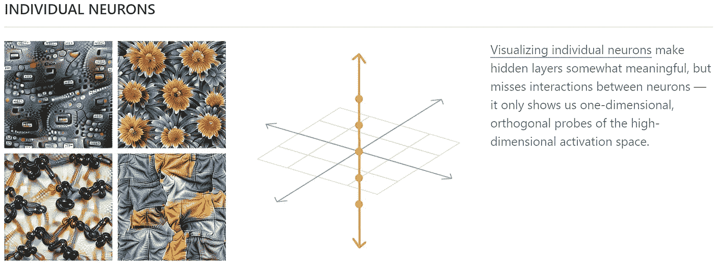
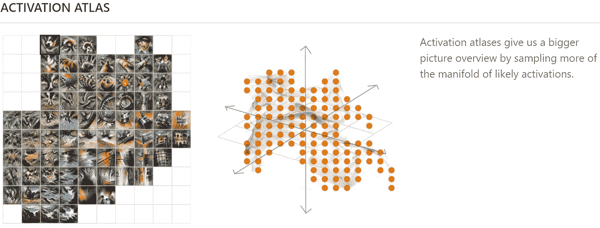
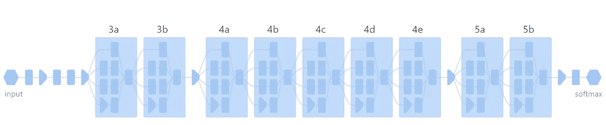
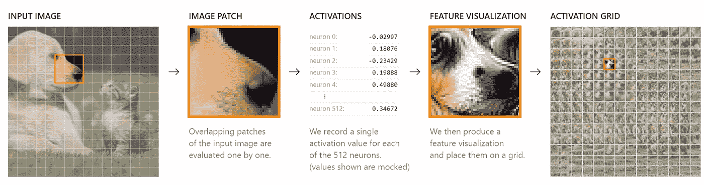
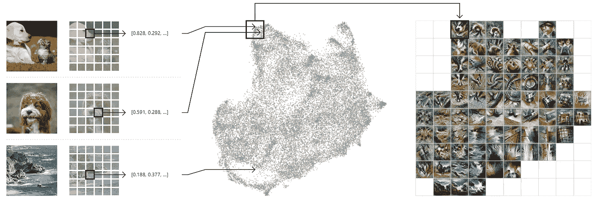

# Activation Atlases 是谷歌和 OpenAI 使用的机器学习可解释性模型

> 原文：<https://pub.towardsai.net/activation-atlases-is-a-machine-learning-interpretability-model-used-by-google-and-openai-1059aaef6472?source=collection_archive---------0----------------------->

## [人工智能](https://towardsai.net/p/category/artificial-intelligence)

## 这种新方法使用巧妙的可视化来模拟人类对图像的理解。

来源:https://openai.com/blog/introducing-activation-atlases/

> 我最近创办了一份专注于人工智能的教育时事通讯，已经有超过 10 万名订户。《序列》是一份无废话(意思是没有炒作，没有新闻等)的 ML 导向时事通讯，需要 5 分钟阅读。目标是让你与机器学习项目、研究论文和概念保持同步。请通过订阅以下内容来尝试一下:

 [## 序列

### 订阅人工智能世界中最相关的项目和研究论文。受到 102，000 多人的信任…

thesequence.substack.com](https://thesequence.substack.com/) 

可解释性是深度神经网络的最大挑战之一，尤其是那些处理图像等非结构化数据集的深度神经网络。理解一个图像分类模型如何建立它的知识几乎是不可能的。虽然图像分类模型已被证明比人类等效系统更有效，但缺乏可解释性限制了它的适用性，因为我们无法审计或有效地解决这些模型。两年前，来自 Google 和 OpenAI 的研究人员发表了一篇论文，提出了一种将图像分类方法的中间表示可视化的方法。

这篇名为“[用激活图谱探索神经网络](https://distill.pub/2019/activation-atlas)”的研究论文介绍了一种叫做激活图谱的技术，这种技术可以帮助我们理解神经网络在呈现图像数据集时“看到”了什么。激活图谱借用了神经科学的一些想法，试图理解神经网络的中间图像表示。当我们通过眼睛接收视觉感官信号时，信息由大脑的新皮层区域处理。不同类型的视觉信号激活不同组的神经元，这些神经元连接在一起激活对感知物体的知识。实际的知识不是由单个的神经元构建的，而是由相互连接的神经元群构建的。

神经元连接在一起构建特定知识表示的类比非常适用于图像分类模型。图像分类可解释性的最初工作集中于理解由单个神经元创建的表示，尽管这是有帮助的，但当试图理解由网络层创建的表示时，结果是有限的。其他技术，如成对激活，侧重于探索神经元之间的联系，但经常失败，因为图像分类模型的维数很高。

# 激活图谱

Google 和 OpenAI 提出的技术源于去年在论文[“可解释性的构建模块”](https://distill.pub/2018/building-blocks/)中介绍的方法调用特性可视化。从概念上讲，特征可视化是一种研究思路，它试图通过让我们“透过眼睛看”网络来回答这个问题。它始于对[的研究，将单个神经元](https://distill.pub/2017/feature-visualization/)可视化，并试图确定它们对什么做出反应。因为神经元不是孤立工作的，这导致将特征可视化应用于神经元的简单组合。将特征激活应用于神经元组提出了识别该方法需要应用于哪些神经元的挑战。显而易见的答案似乎是研究给定输入激活的神经元。然而，这种方法具有局限性，它不能提供网络的完整视图，而只能提供针对特定输入而激活的部分。

图片来源:谷歌大脑

让我们用一个基于人脑的基本类比来解释这一点。想象一下，当我们阅读不同的单词时，我们试图了解大脑皮层的哪些区域被激活。在这种情况下，特征可视化等同于研究字母表中不同字母的神经激活。虽然这些信息仍然相关，但它并没有提供一个完整的画面，因为这些字母可以以多种方式组合成不同的单词，从而导致不同的互联神经元激活。

Activation Atlas 建立在特征可视化的原则之上，但对其进行了扩展，以提供网络的全局视图。激活图谱提供了神经元常见组合的可视化，而不是关注由输入图像触发的激活。在我们的单词识别示例中，激活图谱将显示常见单词组合的激活，从而提供如何知道知识是在网络中创建的更全面的视图。

从技术角度来看，激活图谱是通过从一百万张图像中收集我们神经网络每一层的内部激活来构建的。这些激活由一组复杂的高维向量表示，通过 UMAP 投影到有用的 2D 布局中，这是一种降维技术，保留了原始高维空间的一些局部结构。下图说明了单个神经元的特征可视化和激活图谱之间的差异。

图片来源:谷歌大脑

为了测试激活地图集的想法，谷歌和 OpenAI 创建了一个名为 InceptionV1 的卷积神经网络(CNN)。该架构由许多层组成，我们称之为“混合 3a”、“混合 3b”、“混合 4a”等。，有时简称为“3a”。每一层都依次建立在前面的层之上。

图片来源:谷歌大脑

要将激活地图集应用于 InceptionV1，第一步是将图像输入网络，并运行至感兴趣的层。该框架收集激活次数。如果一个神经元被它所展示的东西所激发，它的激活值将是正的。结果如下图所示:

图片来源:谷歌大脑

当使用一个单一的形象，激活地图集的好处并不立即明显相比，它的一些前辈。激活地图集的主要贡献之一是它们可以无缝地应用于数百万图像的数据集。为了验证这一点，谷歌和 OpenAI 用 100 万张图像的随机数据集测试了 InceptionV1。在这个过程中，该模型收集每个图像的一个随机空间激活，然后通过 UMAP 将它们减少到二维。然后绘制它们，相似的激活放置在彼此附近。最后，该模型绘制一个网格并平均落在一个单元内的激活，并对平均激活运行特征反演。整个过程如下图所示:

图片来源:谷歌大脑

为了在不同的图像分类模型上测试激活图集，谷歌和 OpenAI [发布了一个非常引人注目的演示](https://distill.pub/2019/activation-atlas/app.html)。对于每个神经网络，你可以从字面上看到模型的解释。此外，代码[也可以直接用于不同的 Jupyter 笔记本](https://colab.research.google.com/github/tensorflow/lucid/blob/master/notebooks/activation-atlas/activation-atlas-simple.ipynb)。

就神经网络的可解释性而言，激活图谱是我见过的最具创造性的作品之一。通过提供整个网络的可见性，激活图谱提供了对神经网络的进化知识构建过程的独特可见性，并提供了一种“查看黑盒内部”的清晰机制。