# 神经网络中的激活函数

> 原文：<https://pub.towardsai.net/activation-function-in-neural-networks-e5b95ab2e478?source=collection_archive---------2----------------------->

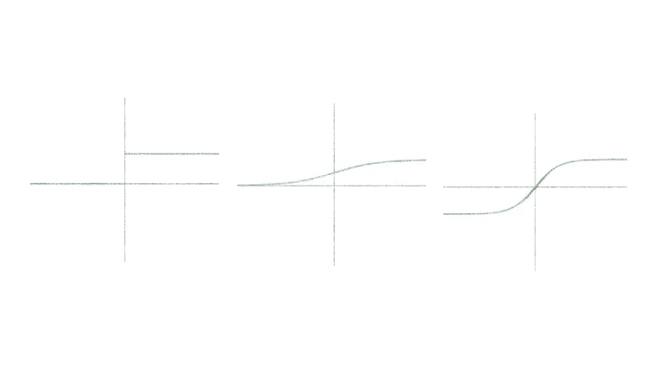

作者图片

激活函数决定一个神经元是否应该被激活，有时，它也被称为**传递函数**。激活函数的主要作用是将来自前几层的总加权输入转换成馈送给下一层神经元的输出。

让我们看看神经网络中神经元的架构。

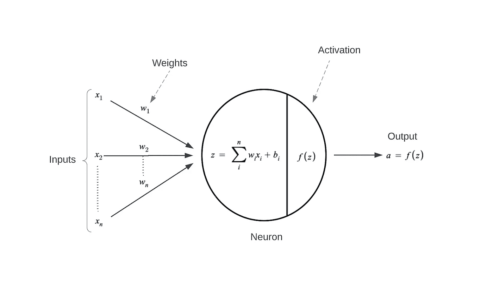

作者图片

激活函数的主要目的是给线性模型添加非线性。在转发传播过程中，它在每一层都引入了一个额外的步骤。如果我们不放置激活函数，每个神经元将充当一个线性函数，进而将整个网络转化为线性回归模型。

# 激活功能的类型

让我们回顾一下神经网络中常用的激活函数。

## 1)二元阶跃激活函数

层中的神经元应该被激活还是不被激活取决于特定的阈值。

将馈送给激活函数的输入与阈值进行比较。如果输入大于它，那么神经元被激活，否则它被去激活。

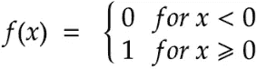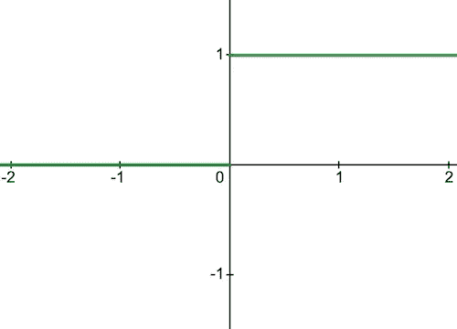

二元阶跃函数|作者图片

下面是二元阶跃函数的导数

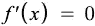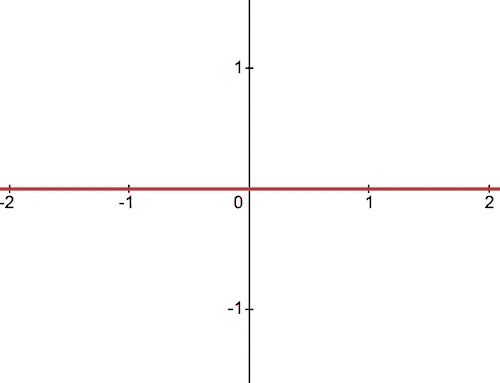

二元阶跃函数的导数|作者图片

以下是二元阶跃函数的一些限制:

*   不能用于多类分类问题。
*   函数的梯度为零，这在反向传播过程中造成阻碍。

## 2)线性激活函数

线性激活函数，也称为**无激活**或**恒等函数**，激活与输入成比例。该函数只是简单地给出它被赋予的值。

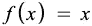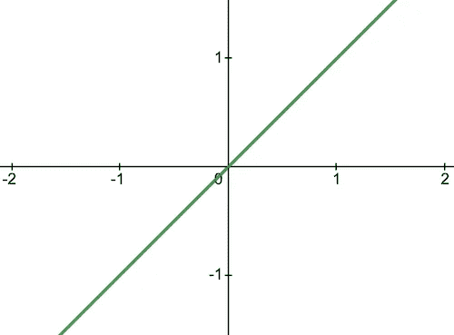

线性函数|作者图片

下面是一个线性函数的一阶导数

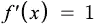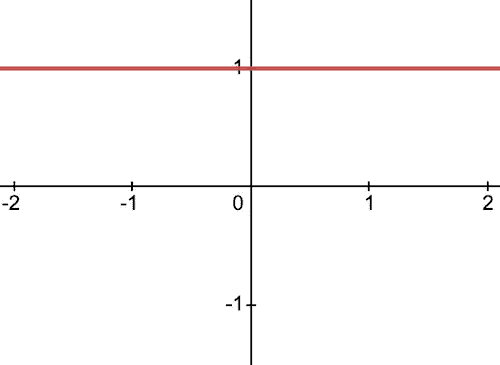

线性函数的导数|作者图片

以下是线性函数的一些限制:

*   不可能使用反向传播，因为函数的导数是常数，与输入无关。
*   无论神经网络有多少层，最后一层仍将是第一层的线性函数。所以，一个线性激活函数把神经网络变成了一个单层网络。

## 3)乙状结肠激活功能

该函数将任何实数值作为输入，并输出 0 到 1 范围内的值。输入越大(越正)，输出值越接近 1，而输入越小(越负)，输出越接近 0。

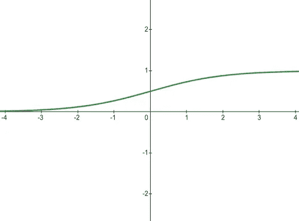

Sigmoid 激活功能|作者图片

这是一个 sigmoid 函数的导数

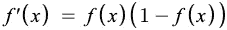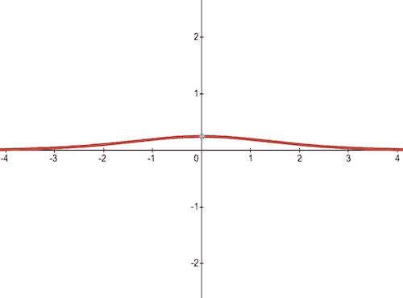

Sigmoid 激活函数的导数|图片由作者提供

*   它通常用于我们必须预测概率作为输出的模型。
*   该函数是可微分的，并且提供了平滑的梯度。

以下是 sigmoid 函数的一些限制:

*   梯度值仅在-3 到 3 的范围内有意义，在其他区域图形变得更加平坦。
*   对于大于 3 或小于-3 的值，函数将具有非常小的梯度。当梯度值接近零时，网络遭受 ***消失梯度*** 问题。
*   逻辑函数的输出不是围绕零对称的，*，即值总是正的，*，这使得训练困难。

# 4) Tanh 激活功能

双曲正切函数与 sigmoid 函数非常相似，不同之处在于输出范围为-1 至 1。在 Tanh 中，输入越大，输出值越接近 1，而输入越小，输出越接近-1，而不是 sigmoid 中的 0。

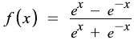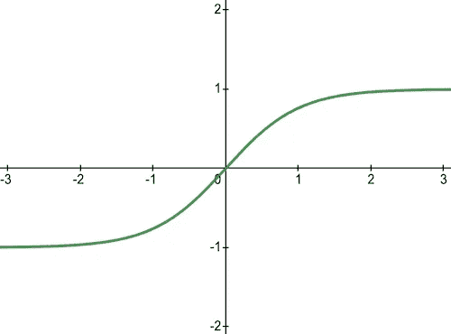

Tanh 激活功能|作者图片

这是双曲正切函数的导数

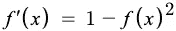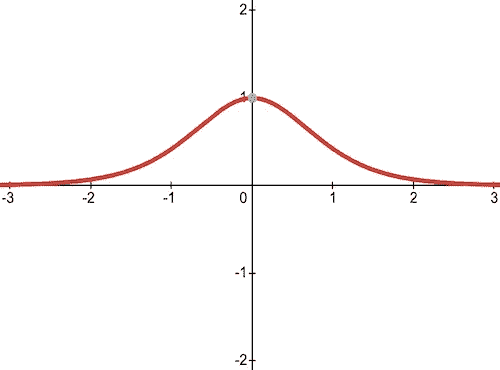

Tanh 激活函数的导数|图片由作者提供

*   tanh 激活函数的输出是以零为中心的，它有助于将数据置于中心，并使下一层的学习更加容易。

以下是双曲正切函数的一些限制:

*   当梯度值接近零时，网络遭受 ***消失梯度*** 问题。
*   与 sigmoid 函数相比，该函数的梯度更陡。