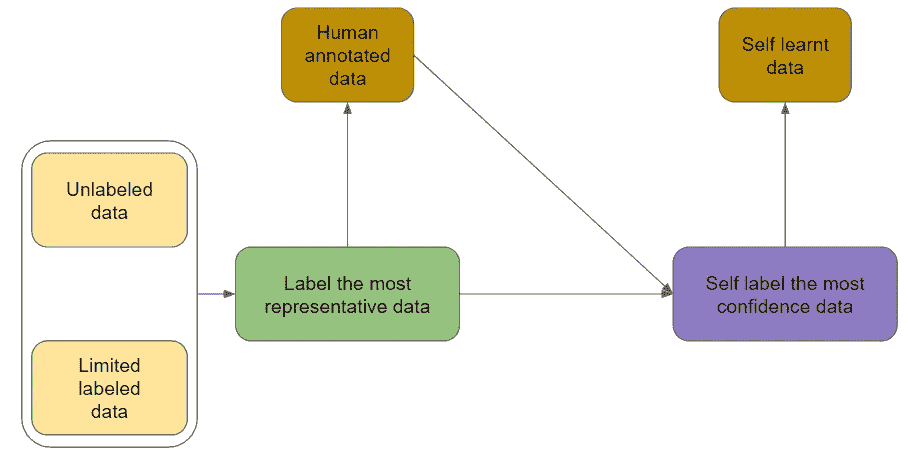

# 主动学习和半监督学习将你的未标记数据转化为带注释的数据

> 原文：<https://pub.towardsai.net/active-learning-and-semi-supervised-learning-turn-your-unlabeled-data-into-annotated-data-6e5c0f58c9f3?source=collection_archive---------1----------------------->

## [机器学习](https://towardsai.net/p/category/machine-learning)

## 主动学习和半监督学习


由 [Unsplash](https://unsplash.com?utm_source=medium&utm_medium=referral) 上的 [Vadim Fomenok](https://unsplash.com/@vadimpng?utm_source=medium&utm_medium=referral) 拍摄的照片

**主动学习**是让学习者(如学生)主动参与学习过程的教学策略之一。与传统的学习过程相比，学习者不只是坐着听，而是与教师一起互动。学习进度可以根据学习者的反馈进行调整。所以，主动学习的周期很重要。如果你不熟悉主动学习，你可以访问这个[帖子](/active-learning-builds-a-valuable-dataset-from-scratch-cb4f66ff902c)。

**半监督学习**是一种结合标记数据和未标记数据进行模型训练的方法。这种方法的假设是`continuity assumption`、`cluster assumption`和`manifold assumption`。简而言之，如果数据点彼此靠近，则它们共享相同的标签。

# 混合学习

韩等(2016)提出结合主动学习和半监督学习进行声音分类。当然，我们可以将它应用于其他领域，如文本、视频等。从业者利用主动学习方法来估计标签的最有价值的数据点。然而，他们更进一步，通过引入半监督学习来估计每轮迭代后未标记的大多数置信度。

## 概观

你可以看看下面的流程图来理解前面提到的方法是如何工作的。下面是伪:

1.  我们一开始就有大量的未标注数据和有限的标注数据。
2.  通过正常的主动学习过程来执行数据标注。
3.  拟合初始标记数据和新的注释数据，以训练分类模型并对其进行分类。
4.  如果置信度高于预定义的阈值(比如 85%)，我们会将标签分配给这些数据。
5.  重复步骤 2 至步骤 4，直到退出点。例如，获得 500 个标注数据或模型性能达到一定的准确度。



主动学习+半监督学习

## 最大置信抽样

故事还没有结束。其中一个突出的问题是我们如何控制自学的数据。通过设置一个高门槛，我们可以确保候选人应该最有可能属于一个特定的类别。但是，我们不应该盲目地相信它，因为有几个原因。

首先，可能会造成数据不平衡。如果模型在一个或几个类别中做得非常好，那些自学习的数据将属于那一个或几个类别，并在几次迭代后导致数据不平衡。

为了控制进度，我们应该逐步获取自学资料。与其挑选那些高于阈值的数据点，不如对它们进行随机采样。

# NLPatl 编写的 Python 代码

[NLPatl](https://github.com/makcedward/nlpatl) 在主动学习中提供半监督学习。你只需要让你的数据适合它，你就可以注释最有价值的数据点和自学的数据点。让我们准备好弄脏你的手。我将用几行代码演示如何在 NLP 中应用主动学习。你可以访问这个[笔记本](https://colab.research.google.com/drive/1dr1GY_vO_oOMixj4clzcMR7jLsNpbbvg#scrollTo=YCK94D1X7KBm)获取完整版本的代码。

```
# Initialize entropy sampling apporach to estimate the most valuable data for labeling
learning = SemiSupervisedLearning(
  sampling=sampling,
  embeddings_model=embeddings_model,
  classification_model=classification_model
)# Label data in notebook interactively
learning.explore_educate_in_notebook(train_texts, num_sample=2)
```

# 参考

*   W.韩，，阮，李，舒勒，俞，朱。[混合学习环境中用于声音分类的半监督主动学习](https://journals.plos.org/plosone/article/file?id=10.1371/journal.pone.0162075&type=printable)。2016

# 喜欢学习？

我是湾区的数据科学家。专注于数据科学、人工智能，尤其是 NLP 和平台相关领域的最新发展。在 [LinkedIn](https://www.linkedin.com/in/edwardma1026) 或 [Github](https://github.com/makcedward) 上随意联系 [me](https://makcedward.github.io/) 。