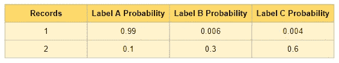

# 主动学习从零开始构建有价值的数据集

> 原文：<https://pub.towardsai.net/active-learning-builds-a-valuable-dataset-from-scratch-cb4f66ff902c?source=collection_archive---------2----------------------->

## [机器学习](https://towardsai.net/p/category/machine-learning)

## 主动学习导论


[米米·蒂安](https://unsplash.com/@mimithian?utm_source=medium&utm_medium=referral)在 [Unsplash](https://unsplash.com?utm_source=medium&utm_medium=referral) 上的照片

**主动学习**是一种让学习者(如学生)主动参与学习过程的教学策略。与传统的学习过程相比，学习者不仅仅是坐着听，而是与教师一起互动。学习进度可以根据学习者的反馈进行调整。所以，主动学习的周期很重要。

如果你已经熟悉主动学习，可以跳到最后一节如何使用 [NLPatl](https://github.com/makcedward/nlpatl) (NLP 主动学习)python 包来实现。

# 目标

我们能把这个框架应用到机器学习领域吗？这是可能的，但我们需要澄清什么是主动学习的目标。在训练分类模型时，我们通常在最开始就缺乏标记数据。当然，我们可以随机选择记录并贴上标签，但这太贵了。

主动学习的假设是，我们可以通过某些方式估计代表性记录，并由主题专家(SME)对其进行标记。因为我们只需要最有代表性的记录，所以不需要大量的标记数据。机器学习模型应该能够从那些有价值的记录中发现模式。获取足够的数据来训练你惊人的模型可以节省金钱和时间。

因此，关键点是估算代表记录的**策略**和来自中小企业**的输入**。

# 战略

有很多评估记录价值的策略。我将从引入主动学习的三种方法开始。我将首先介绍这个想法，然后逐一举例说明。**边际抽样**是指计算最高概率和次高概率之间的差值。**熵抽样**旨在利用所有概率输出(**边际抽样**仅使用最大的两个结果)来识别最不确定的记录。最后一种方法不同于前面提到的方法，因为它使用无监督学习来识别最有价值的记录。你可以称之为**整群抽样**。

从解释开始，我们有下面的样本记录。假设我们有一个分类模型并预测了概率。



资料组

## 边际抽样

**边际抽样**是指计算最高概率和次高概率之间的差值。假设如果两个最高概率之间的差异大，则分类模型具有更高的不确定性。从上面的例子来看，记录 2 具有更高的值(0.3 = 0。6-0.3)，而不是记录 1(0.984 = 0.99–0.006)。因此，边际抽样方法选择记录 2 而不是记录 1 来标记。

## **熵采样**

**熵抽样**旨在利用所有概率输出来识别最不确定的记录。而不仅仅是计算最高概率的差异。这种方法通过利用所有概率来计算熵。根据上面的示例，记录 2 的值(0.898)高于记录 1 的值(0.063)。因此，熵采样方法选择记录 2 而不是记录 1 来标记。

## 聚类抽样

**聚类抽样**与上述策略不同。**边缘采样**和**熵采样**的前提是有一个初始标记的数据集和训练一个简单的分类模型。如果开始时没有任何带标签的数据集，可以考虑使用这种方法。基本上，它利用迁移学习将文本转换为嵌入(或向量)，并适合无监督算法，以找到最具代表性的记录。例如，您可以应用 KMeans 来查找集群并标记它们。

# NLPatl 编写的 Python 代码

幸运的是，您不需要自己实现这个框架，但是 [NLPatl](https://github.com/makcedward/nlpatl) python 包已经可以使用了。有了主动学习的想法，然后准备动手。我将用几行代码演示如何在 NLP 中应用主动学习。你可以访问这本[笔记本](https://colab.research.google.com/drive/1dr1GY_vO_oOMixj4clzcMR7jLsNpbbvg#scrollTo=YCK94D1X7KBm)获取完整版本的代码。

下面的示例代码显示了如何使用**熵采样**来估计最有价值的记录。

```
# Initialize entropy sampling apporach to estimate the most valuable data for labeling
learning = EntropyLearning(
  embeddings_model=embeddings_model,
  classification_model=classification_model)# Train sample classification model first
learning.learn(train_texts, train_labels)# Label data in notebook interactively
learning.explore_educate_in_notebook(train_texts, num_sample=2)
```

下面的示例代码显示了如何使用**聚类抽样**来估计最有价值的记录。

```
# Initialize clustering sampling apporach to estimate the most valuable data for labeling
learning = ClusteringLearning(
  embeddings_model=embeddings_model,
  clustering_model=clustering_model)# Label data in notebook interactively
learning.explore_educate_in_notebook(train_texts, num_sample=2)
```

# 参考

*   z 舒扬，T 海特托拉，T 维尔塔宁。[通过聚类未标记数据进行声音事件分类的主动学习](https://trepo.tuni.fi/bitstream/handle/10024/129132/MALR_TUTCRIS.pdf?sequence=1)。2017

# 喜欢学习？

我是湾区的数据科学家。专注于数据科学、人工智能，尤其是 NLP 和平台相关领域的最新发展。在 [LinkedIn](https://www.linkedin.com/in/edwardma1026) 或 [Github](https://github.com/makcedward) 上随时联系 [me](https://makcedward.github.io/) 。