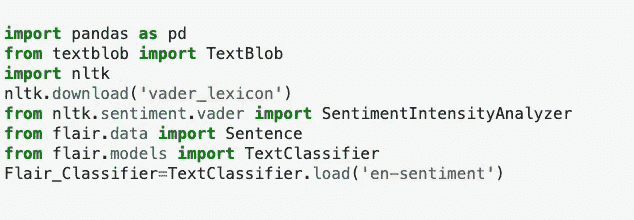
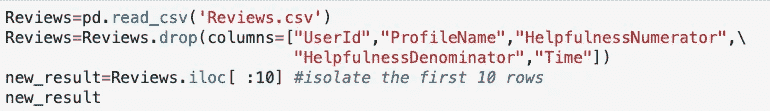
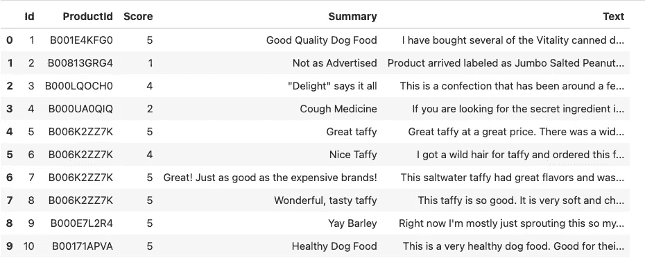
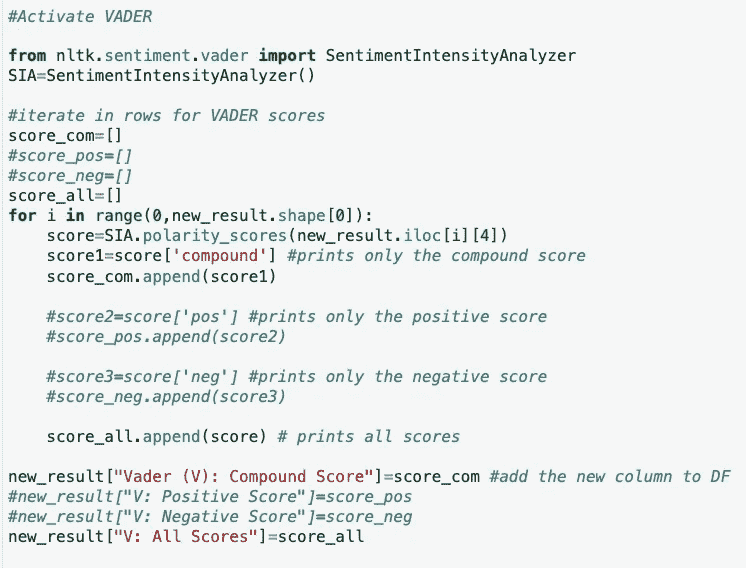
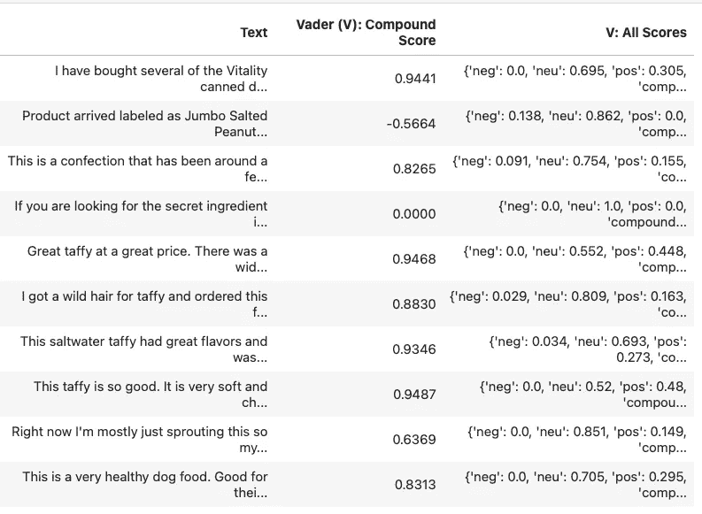
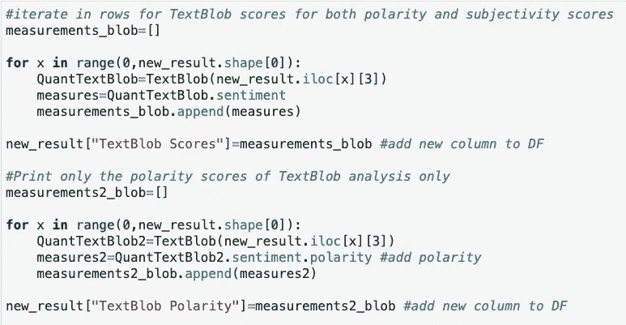
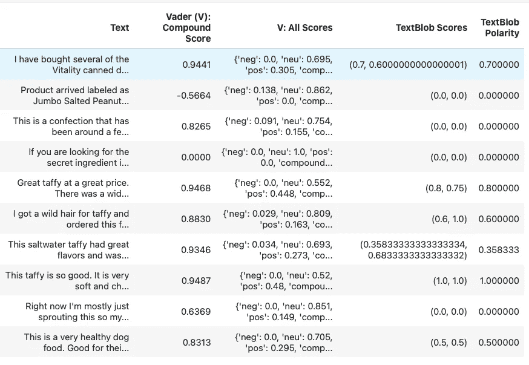
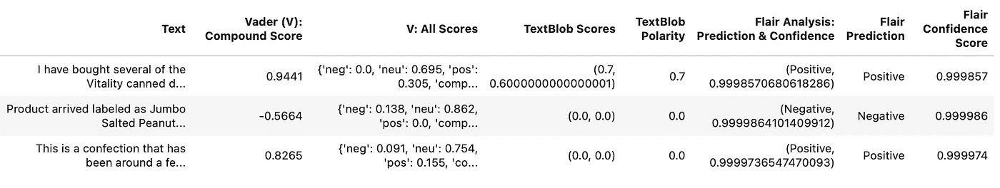
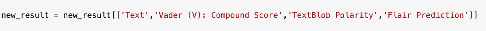
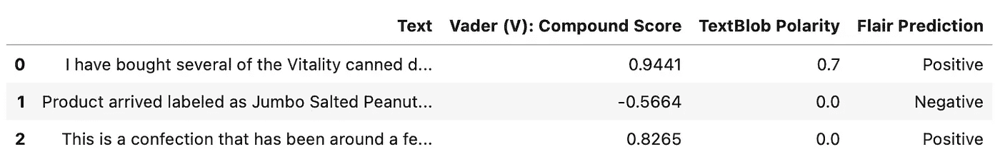

# 事实上，你需要所有 3 对 1 的结果:NLP 情绪分析与 VADER，文本和天赋

> 原文：<https://pub.towardsai.net/actually-you-need-all-3-for-1-outcome-nlp-sentiment-analysis-with-vader-textblob-and-flair-51226744a05e?source=collection_archive---------1----------------------->

来自 Unsplash。“我们所观察到的物质实体和力只不过是空间结构的形状和变化。”欧文·薛定谔

**你的 NLP 用例:** (1)分析自由文本评论；(2)量化他们的情绪(每个自由文本评论),从最负面到最正面，以及(3)发布他们，从而最终用户可以以这种格式阅读他们。

此外，当最终用户查看评论时，他们希望看到您为每个评论引用的算法/NLP 量词的结果。

对于数据科学家来说，这种分析的一个有趣的实现模型是集成(1)VADER；(2)TextBlob；和(3)天赋。

从一开始，VADER 就很快向你发布输出结果，其中有趣地包含了积极因素、消极因素、中性因素和复合得分。使用 TextBlob，您可以交叉引用情感幅度(极性得分和主观性)。使用 Flair，您可以将二元正/负与 TextBlob 相关联，以验证情感方向。

让我从头到尾阐明并实现一个完整的产品。

因此，基于我的方法(我们将在后面围绕它包装一个框架):

*   天赋揭示情感方向(积极或消极)；
*   TextBlob 从最高到最低测量 Flair 方向的大小，无论它是正的还是负的；和
*   VADER 被用作比较十分分析(0.x)的参考，以交叉检查 TextBlob 的复合得分:例如，与 TextBlob 在类似情绪(积极到积极)方向上的 0.60 和更高的得分相比，VADER 的 0.60 和更高的得分累积起来是多少？

我们来编码吧！

驻留在 Github 上的整个 Python JupyterLab 文件将包含在本文的末尾。

1.  导入 VADER、TextBlob 和 Flair:

2.找到用于分析的 Excel 文件。对于我的例子，让我们从这里获取“亚马逊美食评论”CSV 文件:[https://www . ka ggle . com/datasets/snap/Amazon-Fine-Food-Reviews](https://www.kaggle.com/datasets/snap/amazon-fine-food-reviews)

3.分离出我们需要的几行，并将数据分割成 500，000 多行(参考上面的 Kaggle 文件)中的前 10 行进行分析:

从 500，000 多行减少到 10 行，并删除了一些不必要的行。

这是我们将要分析的 10 行数据。

4.对每一行反复运行 VADER 分析，并将结果打印在两个新列中:(1)一列用于分离“复合”分数，以及(2)一列用于所有分数。我们没有明确地打印正面或负面的分数。

激活 VADER 的 Python 代码

输出，在一列中打印 VADER 的复合分数，在另一列中打印所有 VADER 的分数。

将复合分数从 VADER 中分离出来非常重要，因为我们将使用它来针对其他算法进行分析。

5.放到 TextBlob 上。对每行迭代运行 TextBlob 分析，并在新列中打印结果:

我为您创建了两个单独的循环，以便在您通过 Github 审查它时，使它适应您的用例管理

添加了两个新列。

你对进行进一步研究的理解和/或个人兴趣，关于 TextBlob 的极性分数如何能够或不能够，或者可能或可能不符合 VADER 的复合分数，不是我正在探索的潜在观点。让我们继续前进。

**Polarity** 是 TextBlob 对于情感分数的输出；这是 VADER 使用的**复合词**(基于其正面/负面/中性的总体评价)。

6.最后，进入天赋。让我们实现它:同样，我们将在新的列中打印它的结果。我对此有不同的看法，因为我喜欢将“正面”和“负面”作为一个列输出，将 Flair 的“信心”分数作为另一个列输出，并将所有分析作为另一个列输出(正面/负面和信心分数)，从而产生 3 个新列:

三种不同的功能——有意让您为您的用例选择您想要的功能

Flair 分析的三个新列现在打印在各自的列中

7.让我们在删除了本练习中不再需要的列(列越来越多，越来越忙)之后，再来查看一下现有的列:

删除了审核结果时不需要的列

我们有了:VADER 的复合得分；TextBlob 的极性得分；和天赋的情绪

8.在这一点上，你有许多选择，以至于你更喜欢采取的总体方向。自由文本类型的上下文对于您如何评估结果至关重要。我发现的一种为用例工作的方法是这个序列(在这个时序中):(1)首先通过 Flair 预测过滤(选择一个情感并通过所有评论中的情感过滤)；(2)通过 TextBlob 极性从低到高(反之亦然)排序 next 以及(3)参考 VADER 的观点来评估输出。这就是它变得有趣的地方，因为 Flair 和 TextBlob 可以在相反的两端相遇:当 Flair 说它是负面的，Textblob 可能会发现它是正面的。根据自由文本的类型，Vader 在准确性上可能会超过 TextBlob，反之亦然。

同样，在某些用例中，VADER 比 TextBlob 更好，因为每个用例都是独特的。在另一篇文章中，我将演示何时选择 VADER 而不是文本块，反之亦然。

我在这里写了更多关于 TextBlob 的细节:

 [## 如何量化情感以测量量级:使用 TextBlob 的 NLP

### 作为确定某事是积极还是消极的一部分，构建一个分析实现可能会很方便…

medium.com](https://medium.com/mlearning-ai/how-to-quantify-sentiment-to-measure-magnitude-nlp-with-textblob-27861559f7a5) 

你可以在 Github 上找到 Python 编译的完整代码:【https://bit.ly/3zdpsKI。

如果你觉得这很有用，请不要忘记订阅我的时事通讯。