# 时间序列预测的自适应学习

> 原文：<https://pub.towardsai.net/adaptive-learning-for-time-series-forecasting-b34e640b865b?source=collection_archive---------0----------------------->

时间序列预测应用在从能源到医疗保健等各种行业中的重要性不言而喻。因此，我们直接进入正题。我们在处理时间序列数据集时可能面临的复杂而困难的挑战之一是它们在统计特征上的多样性，这可能会导致它们的分布发生变化，从而导致各种行为，使它们难以通过模型来理解。本文提供了一个两阶段模型来处理时间协变量移位(TCS)；为了简单起见，我们称之为 ADaRNN(自适应学习和 RNN 的结合)。你可以找到所有章节的详尽解释；同时，你可以看到数学公式，以便更好地理解。坦率地说，这是我们第一次可以从分布的角度研究时间序列数据集。

[来源](https://giphy.com/gifs/MentoringMinds-lcj8Wjb92d4cBj45hg)

## 问题)

时间序列的特征应该是随时间而变化的，所以我们称这类数据(作为时间的函数)**非平稳**。我们不能处理静态数据；我的意思是，如果数据不随着时间的推移而改变，那还有什么意义呢(*真的很简单*！) ?？！！所以，这种不稳定的事实相当于在一段时间内有不同的分布。这是时间序列捕捉的一个要点。为了更好的理解，你可以看看下图:

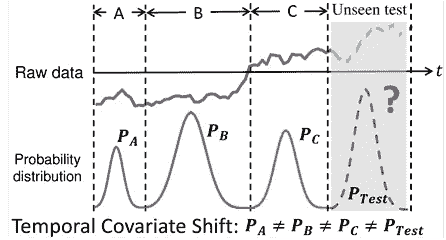

图一。[ [来源](https://arxiv.org/pdf/2108.04443.pdf)

图 1 中的数据集是一个多变量时间序列数据集，分为三个时段 A、B、C 和 Test。我们很容易看到这些分布是不平等的。

## 解决方案)

阿达恩

## 解读)

我们可以将 RNNs 视为最流行的算法架构之一，因此我们可以从使用其类型中最流行的开始。为了防止这篇文章更长，我不打算详细描述 RNNs 不过可以给[斯坦福深度学习单](https://stanford.edu/~shervine/teaching/cs-230/cheatsheet-recurrent-neural-networks)关于 RNNs。

> 别担心，我知道应用变形金刚有很多进步，但这只是一个开始；我们稍后再讨论。

嗯，嗯，嗯；我告诉过你 AdaRNN 有两个步骤:

1.  **时间分布特征化(TDC)算法**
2.  **时间分布匹配(TDM)算法**

总而言之:

**TDC** 将训练数据集分成 K 个最多样化的区间。(具有最大分布间隙)然后: **TDM** 利用 RNN 减少发散分布。

> 正如我所说，这是我们第一次从分布角度考虑时间序列！！那么这意味着什么呢？

## 分配

通常，有两种主要的分发方法:

1.  **领域综合(DG)算法**
2.  **域自适应(DA)算法**

总而言之:

**DG** 表示模型在处理未知数据和处理几个相互关联的不同领域时的表现，而 **DA** 则试图在包含大量异常或意外数据行为的输出数据上改进模型。这两个不同之处在于，一个访问**测试数据集**而另一个不访问。然而，本文中的情况并非如此，因为我们用我们的方法解决了这个问题。:)

# 恰当的例子

## 一般来说

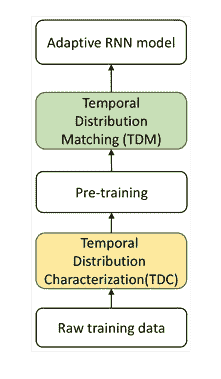

图二。AdaRNN 架构[ [来源](https://arxiv.org/pdf/2108.04443.pdf)

你可以很容易地看到两个**颜色框**表达了这个模型的两个主要步骤， **TDC** 和 **TDM** ，第一个**通过将它分解为过程来指定分布**，随后**调整分布**以馈给主模型 **M** 用于**预测**。最后，用自适应 RNN 模型进行预测。

一分！！合理的是学习/练习/锻炼，让自己做好最坏情况的准备；所以，对于 AdaRNN 来说是真的，研究人员用困难的任务(我指的是分配)训练模型。

## TDC(时间分布特征化)

TDC 的基本原理是最大熵原理；它试图最大限度地利用时间序列中的共享知识，是如何做到的？？通过在广泛的分布范围上训练模型；换句话说，具有最大数量的非相似分布。逻辑很简单，如果模型可以处理这一点，它将能够管理未来/看不见的数据。请看图 3:

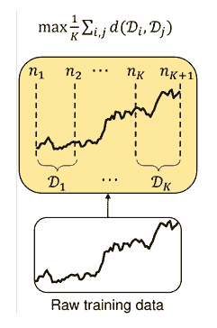

图 3。时间分布特征(TDC) [ [来源](https://arxiv.org/pdf/2108.04443.pdf)

从数学角度来看，我们有等式 1:

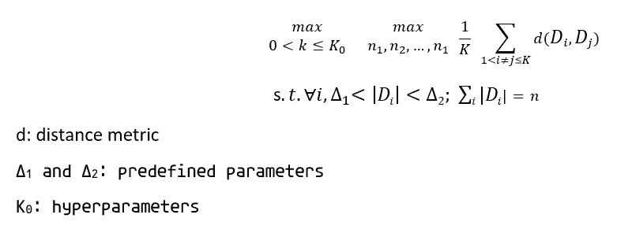

等式 1。

我们使用**超婴儿车**来防止**过度分割**，使用**预定义婴儿车**来防止**琐碎解决方案**。

> 让我们不要在数学上迷惑自己。🤯😅

等式 1 的目标是最大化距离 d(它可以是从欧几里得到 etc 的任何类型的距离函数。)如果我们选择一个好的距离度量，我们可以通过使用**动态规划**来完成 TDC 的目的地。

在这项研究中，研究人员将数据集分成 N=10 个比例，我们不能再分成更小的比例。

*   **K** 的显著**大**或**小**值会导致**没有期望的**型号**性能**。

## TDM(时间分布匹配)

我们使用 TDM 通过使用各种分布周期来研究共享的公共知识。其损失函数可表示如下:

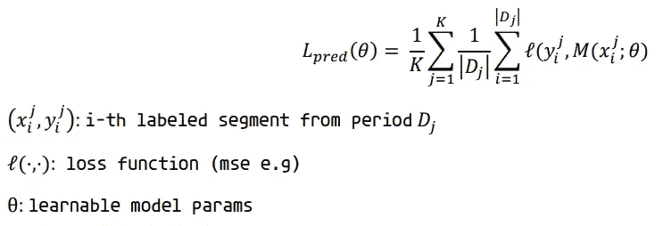

等式 2。

在这项研究中，分布的正则化是在 RNN 模型的最终输出上实现的。等式 3 是 pare (Di，Dj)的最终隐藏状态的周期式分布匹配:

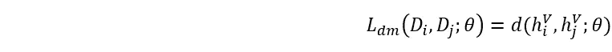

等式 3。

然而，对于隐藏状态，这个正则化项在依赖于时间时丢失。为什么？？因为每个隐藏状态单独地包括关于分布的全部信息的一部分。

> 因此，这是一个问题！！不是吗？？我们能做什么？？🤔

嗯，在构建分布匹配正则化子的过程中，我们必须考虑每个 ***隐藏的*状态**。那么这意味着什么呢？？首先，看看 TDM 架构:

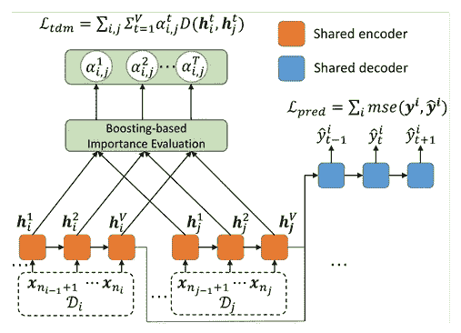

图 4。时间分布匹配(TDM) [ [来源](https://arxiv.org/pdf/2108.04443.pdf)

TDM 的要点是同时预测时间序列数据和匹配 RNN 单元之间的分布。有一个名为*重要性向量*的参数，用于装备模型以减少分布差异。等式 4 给出了时序分布匹配的损失:

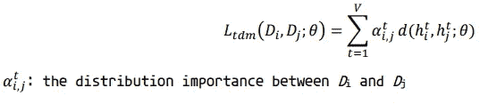

Eq 4。

通过使用等式 4 和 2，我们可以导出等式 5 ( **我们的模型**的终端目标函数):

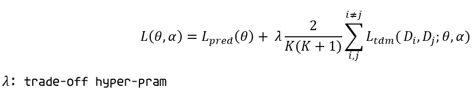

Eq 5。

> 我不会详细描述它数学原理；但是，你可以通读主要论文。

# 资料组

模型评估(分类和回归)使用了不同行业的四个时间序列数据集(**人类活动识别、空气质量预测、家庭用电量、**和**股价预测**)。您可以在表 1 中看到数据集大小的汇总。

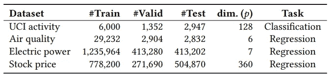

表 1。[ [来源](https://arxiv.org/pdf/2108.04443.pdf)

# 结果

AdaRNN 与其他深度/机器学习模型进行了比较，包括:

1.  传统的(ARIMA、先知、GRU 等。)
2.  最新款(条纹等。)
3.  变形金刚(电影名)

您可以在表 2 中看到 ADaRNN 与其他模型的结果:

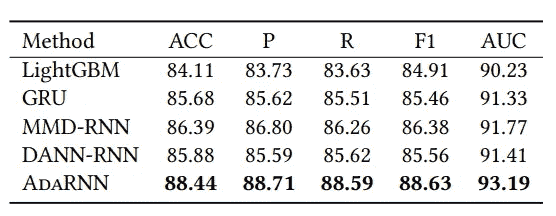

表二。[ [来源](https://arxiv.org/pdf/2108.04443.pdf)

**五个指标**被用于**评估**，包括 **ACC(准确度)、P(精度)、recall (R)、F1 和 AUC(曲线下面积**)。

如您所见，AdaRNN 与同类产品相比显示出更好的结果。

在本研究中，该方法被应用于每个自我注意块中的变压器(AdaTransformer)。如表 3 所示，与原始版本(Vanilla Transformer)相比，AdaTransformer 的结果更好:

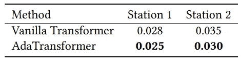

表 3。[ [来源](https://arxiv.org/pdf/2108.04443.pdf)

## **结尾**

> 在以后的文章中，我将向您展示如何为我们的模型编写 TDM 和 TDC 代码，以及如何实现 AdaRNN。

> 来源是[这个](https://arxiv.org/pdf/2108.04443.pdf)。
> 
> 你可以**在 **Twitter** [这里](https://twitter.com/reza__yazdanfar)或者 **LinkedIn** [这里](http://www.linkedin.com/in/rezayazdanfar)联系**我。最后，如果你觉得这篇文章有趣并且有用，你可以在**媒体**上**关注**我以获取更多来自我的文章。