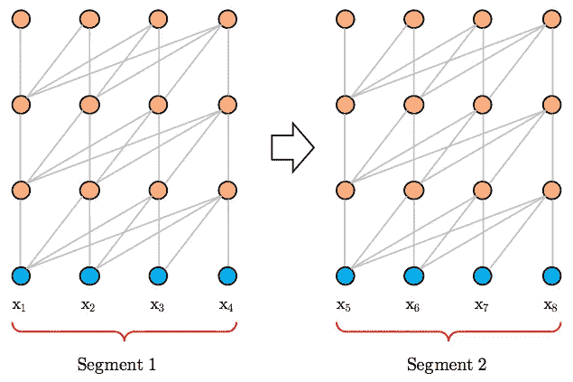
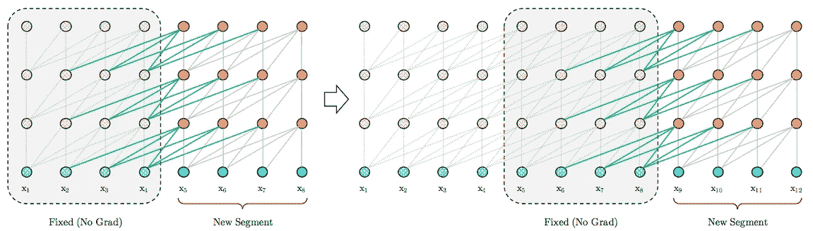

# 利用 Transformer-XL 解决自然语言处理问题中 RNN 的局限性

> 原文：<https://pub.towardsai.net/address-limitation-of-rnn-in-nlp-problems-by-using-transformer-xl-866d7ce1c8f4?source=collection_archive---------0----------------------->

照片由[乔·加德纳](https://unsplash.com/@josephgardnerphotography?utm_source=medium&utm_medium=referral)在 [Unsplash](https://unsplash.com?utm_source=medium&utm_medium=referral) 拍摄

## 通过使用 Transformer-XL | [朝向 AI](https://towardsai.net) 解决 rnn 的限制

## 递归神经网络的局限性

递归神经网络(RNN)提供了一种学习输入序列的方法。缺点是很难优化，由于消失梯度问题。引入 Transformer (Al-Rfou 等人，2018)是为了克服 RNN 的局限性。通过设计，定义了固定长度的数据段以减少资源消耗。

但是，还有一个问题叫做上下文碎片。如果输入序列大于预定义的段长度，则需要将输入序列分开，并且不能跨段捕获信息。戴等人(2019)引入 Transformer-XL 来克服这一限制

# 香草变压器

为了减少计算资源，输入序列被固定长度分割。戴等人将其命名为香草变压器。

在普通变压器架构下，信息不能跨部门共享(戴等人，2019 年)

第一个限制是信息不能跨网段共享。虽然`Transformer`受消失梯度问题的影响较小，但如果输入序列的长度固定，它会限制其能力。第二个限制是由填充引起的。由于需要固定长度的输入，如果输入的长度短于预定义的长度，则需要填充。它不尊重句子和语义的界限。

# 变压器-XL

Transformer-XL(超长)的诞生是为了解决普通变压器的局限性。

在计算下一个片段时，将使用前一个片段的隐藏状态序列，而不是在片段之间断开连接。理论上，我们可以添加多个先前的段，使得当前的段可以跨段到达更多的信息。

另一个输入特性是位置编码。利用相对位置编码而不是绝对位置来防止误导。因此，任何单词都有每个单词的相对距离，这有助于改进模型训练。

Transformer-XL 架构(戴等，2019)

# 拿走

*   克服了以前 NLP 模型的一些限制，如最大信息长度。
*   如果使用 PyTorch，您可以使用[humping Face 的 PyTorch-transformers](https://github.com/huggingface/pytorch-transformers) 库来训练模型。对于 Keras 的用户，你可能想试试这个[库](https://github.com/kpot/keras-transformer)。

# 喜欢学习？

我是湾区的数据科学家。专注于数据科学、人工智能，尤其是 NLP 和平台相关领域的最新发展。在 [LinkedIn](https://www.linkedin.com/in/edwardma1026) 或 [Github](https://github.com/makcedward) 上随时联系 [me](https://makcedward.github.io/) 。

# 参考

*   R.f-r-fou、d-Choe、n-Constant、M. Guo 和 L. Jones。[具有更深自我关注的角色级语言建模](https://arxiv.org/pdf/1808.04444.pdf)。2018
*   Z.戴、杨振宁、杨、卡波内尔、乐庆伟和萨拉胡季诺夫。 [Transformer-XL:超越固定长度上下文的注意力语言模型](https://arxiv.org/pdf/1901.02860.pdf)。2019