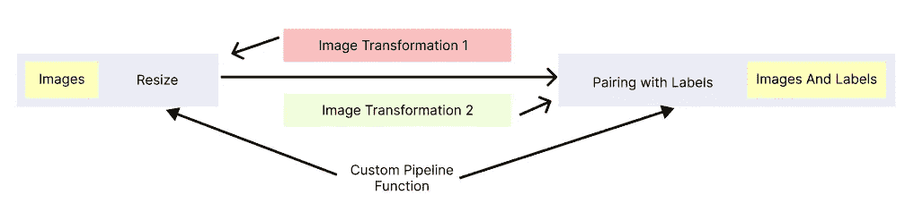

# Python 中的高级概念— I

> 原文：<https://pub.towardsai.net/advanced-concepts-in-python-i-85949fb9cc1c?source=collection_archive---------3----------------------->

## 详细介绍迭代器、生成器、协同程序和迭代器协议


克里斯里德在 [Unsplash](https://unsplash.com?utm_source=medium&utm_medium=referral) 上的照片

两年多来，Python 一直是我的首选语言。一般来说，这是一种非常简单的语言。但是，有些概念有时令人难以置信。
因此，我开始了这一系列的博客来简化和编码这些概念，使它们更加连贯。

## 涵盖的主题

1.  迭代器
2.  可重复的
3.  发电机
4.  协同程序
5.  迭代器协议

## 迭代器

Python 中的迭代器是一次发出一个值流的对象。为了访问流中的下一个值，我们对对象调用“ ***__next__()*** ”方法。
你可以把 Python 中的迭代器想象成一把枪。项目符号是值，而“__next__”方法是触发器。你按下扳机(__next__)，它射出子弹(数值)。

**关于迭代器需要记住的要点** a .迭代器对象在迭代过程中会记住自己的状态。
b .迭代器只能向前移动，如果序列中的元素用尽，会引发 StopIteration 错误。
c .迭代器一旦元素用尽就不能重用。
d .循环可以迭代迭代器对象。

自定义迭代器的代码

在单元格 1 中，我创建了一个“CustomIterator”类，并在其中添加了“__iter__”和“__next__”方法。__iter__ 返回自身的实例，而 __next__ 保持状态并返回迭代器中的下一个元素。
在单元格 6 中，我一直迭代到前四个元素，但是当我稍后在单元格 7 中对同一对象运行 for 循环时，它从第五个元素开始迭代到最后一个元素。所以，迭代器对象不能重用。

像 zip、enumerate，甚至在 python 中打开的文件上的函数都返回一个迭代器对象。

```
z = zip(["asd","sdf"],[1,2])
next(z)## **Output**
("asd",1)
```

## 可重复的

Iterables 是 Python 中的对象，其元素可以被循环迭代。Python 中内置的数据结构序列称为 Iterables。列表、元组、集合和字典都是可迭代的。

```
lst = [1,2,3,4,5]
for i in lst:
    print(lst)## ***Output***
1
2
3
4
5
```

***如何检查一个对象是否可迭代？*** 每个 Iterables 类都会有一个“ ***__iter__()*** ”方法来创建 iterator 对象。要检查一个对象是否是可迭代的，调用它的" ***__dir__()*** "方法，可以在返回的列表中看到一个" __iter__ "

```
lst = [1,2,3,4,5]
print(lst.__dir__())
```

** *所有迭代器都是可迭代的，但不是所有可迭代的都是迭代器*。

## 发电机

Python 中的生成器是一个通过“ **yield** 关键字返回一串值的函数。它返回一个生成器迭代器对象。所以，你可以调用它的“__next__”方法来获取下一个值。


生成值的生成器函数

在上面的 gif 中，你可以把那台机器想象成一个生成器，那些邮件就是值。每当调用“__next__”时，它将生成下一个值。

像迭代器一样，生成器也遵循惰性加载策略。它不会将所有的数据都加载到内存中并霸占它。因此，在处理像深度学习中的海量图像数据集这样的大数据时，生成器非常有用。

生成器函数的代码

在单元格 1 中，我创建了一个生成器函数“custom_generator ”,它对一个范围内的每个值进行平方，然后逐一返回。
在单元格 4 中，我使用了一个生成器表达式来获得一串值的立方体。

**生成器表达式** 这是在一行中实现生成器的另一种方式。看起来像是“**综合**”与生成器函数性质相同。

```
# List Comprehension
lst_comp = [x**3 for x in range(10)]
print(lst_comp)# Generator expression
gen = (x**3 for x in range(10))
print(gen.__next__())
print(gen.__next__())
print(gen.__next__())## **Output** [0,1,8,...,729]
0
1
4
```

如果我们不使用生成器函数，那么可以这样做:

```
def **not_generator_function**(n):
    square_list = []
    for i in range(n):
        square_list.append(i)
    return square_listlst = **not_generator_function**(10)
print(lst)## ***Output*** *[0,1,4,....,81]*
```

现在，假设范围是万亿，这个函数会使内存崩溃，因为它会一次加载内存中的所有数据。所以，更好的选择是创建一个生成器函数。

## 协同程序

协程是可以在执行过程中暂停的函数，稍后可以从该点继续执行。
协程有几个用例，如网络调用、数据预处理管道、协作式多任务处理等。
我们来举个例子。你有一个大规模的影像数据集，你想使用不同的预处理步骤。



协程图

**自定义管道功能**拍摄图像并调整大小。然后，该功能暂停并转到“**图像变换 1”**功能和**“图像变换 2”**功能，并应用变换。然后，它恢复**自定义管道函数**来将这些转换后的图像与标签配对。这是一个可以使用协程的实际场景。

协程使用“ **yield** 暂停函数，使用“ **next** 继续函数的执行。

Python 中的协程

在上面的代码中，你可以看到当我们在函数上调用“ **next** 时，函数执行开始，然后在到达“yield”时停止。当函数中不再有“ **yield** ”时，它会引发 StopIteration。

协程允许我们将值发送到函数中最后一个暂停的检查点。为了传递值，我们使用“ **send** 关键字，但是“ **send** 关键字只能在函数执行在“ **yield** 处暂停时使用。

我们对协程有了基本的了解。现在，让我们创建一个有多个协同程序同时工作的管道。我创建了三个协程，然后通过根据需要在协程之间切换来修改整个管道中的值。

协同流水线

“ **cor_main** ”是主协程管道，它采用参数“a”。协程在“x = yield”处停止，然后我给它发送一个值，这个函数然后产生“x+a”。然后从另外两个协程“**转换 1** ”和“**转换 2** ”传递过来。
然后将转换后的值传递给主协程，以“z = yield”，主协程产生的最终值是“x+a+z”。

**yield from
“ **yield from** ”和“yield”很像，只是用了类固醇。用一句话来解释一个简单的生成器很有帮助。**

“产量”的代码

在单元格 2 中，您可以看到，我没有在“ **yield_main** ”函数上循环，而是使用“yield from”来解包生成器。Yield 也可用于扩展 iterables，如单元格 5 所示。在单元格 7 中，我定义了一个“data_sink”生成器来获取值并打印出来。从“data_source”函数接收值，然后用包含“yield from”的函数包装“data_sink ”,它充当“data_sink”函数的子生成器。

* *“yield from”在 python 3.3 中添加

## 迭代器协议

***免责声明*** *:本部分可选。我写这篇文章是因为我发现这很有趣。所以，我想和你们分享一下。* 迭代器协议规定了迭代器和可迭代对象的工作方式，以及“__next__”如何给出后续值，并在迭代器用尽时引发异常。事实上，对可重复项的理解和解包是在幕后进行的。

有趣的是，python 中的 for-in 循环不使用索引来遍历 iterables。让我们创建一个自定义的 for-loop，不带“for loop ”,带迭代器协议，这样你就能更好地理解这个概念了。

Python 中的自定义 For 循环

在单元格 1 中，我创建了一个函数“ **custom_loop** ”，它将一个可迭代对象作为参数，然后用“ **__iter__()** ”将可迭代对象转换为迭代器。我使用了一个无限 while 循环，当“ **StopIteration** 被引发，并且在 try 块“ **__next__()** ”被调用以获得后续值时，该循环中断。
在下一部分，除了我使用“yield from”进行迭代之外，其他几乎相同。

因此，为了说明这一点，迭代器协议是统治 python 迭代器世界的魔法。

这是这个系列的第一部分的结束。在下一部分，我将讨论一级函数、高阶函数、作用域和闭包。
查看我的《机器学习中的统计学》系列点击 [***此处***](https://towardsdev.com/statistics-for-machine-learning-i-b0be71b2050f) ***。***

> 一个程序员的生活一言以蔽之:
> **google_it()** 如果**卡住了**否则继续