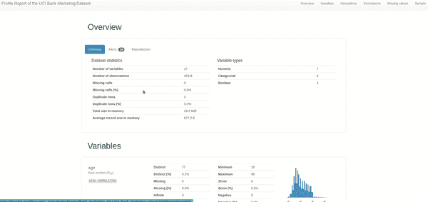
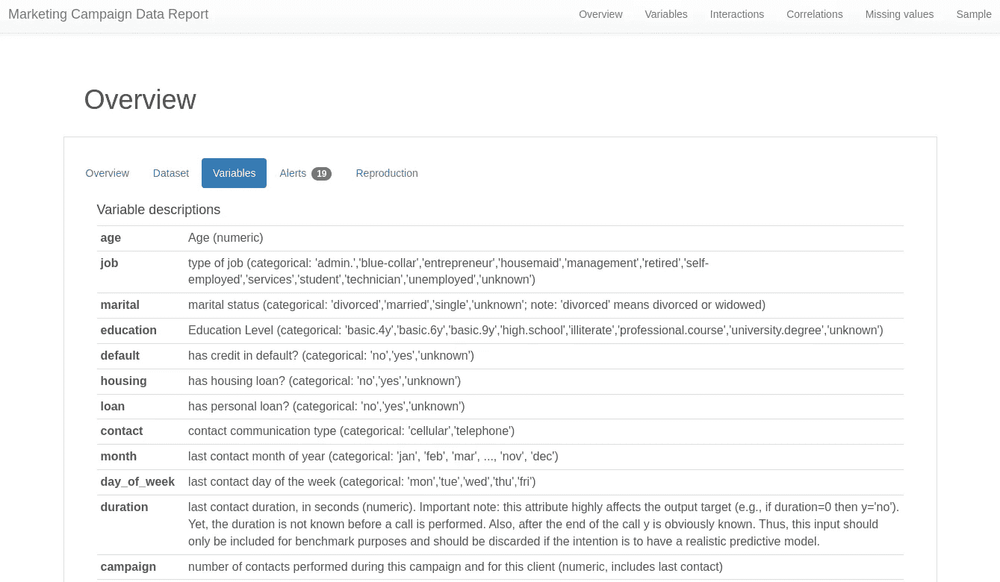

# 使用 Pandas Profiling 简化高级 EDA

> 原文：<https://pub.towardsai.net/advanced-eda-made-simple-using-pandas-profiling-35f83027061a?source=collection_archive---------0----------------------->

## 挖掘标准数据分析之外的内容

作者通过 [Canva](https://www.canva.com/) 创建的图像

熊猫概况分析一直是我的*秘密*工具，在几分钟内，在几行代码下，理解数据并揭示有意义的见解。

每当我得到一个新的数据集时，我会首先生成一个分析报告并检查数据。只有这样，我才会开始探索性的数据分析阶段。但是随着我更多地使用这个库，我学到了一些高级用法，这对我作为数据科学家的项目非常有帮助。

在本文中，首先，我们将挑选一个简单的用例，分析数据集，深入探究该库的一些鲜为人知的高级特性，并探索如何将其用于您的下一个项目。

# 使用简单示例的标准用法

让我们选择一个葡萄牙银行机构的营销活动用例。这些数据是关于银行打给客户的直接营销电话，我们的任务是预测客户是否订阅定期存款。

你可以从 [UCI 数据库下载我们将要分析的相关数据。](https://archive.ics.uci.edu/ml/datasets/bank+marketing)

照片由 Pexels 上的 [Kampus 制作](https://www.pexels.com/photo/stock-market-data-display-on-computer-monitor-8353775/)

让我们启动一个名为 reporting-env 的 conda 环境并安装这个库。指定版本是一个很好的做法，因为它将确保结果总是可重复的。

一旦安装并导入了库，您只需要读取数据并调用`ProfileReport()`函数来生成概要分析报告。

代码看起来很简单:

您会看到[一个与此类似的报告](https://pandas-profiling.ydata.ai/examples/master/bank_marketing_data/uci_bank_marketing_report.html):

由作者录制的屏幕 gif

以下是该报告所涵盖要点的总结:

1.  **数据集概述:**这是了解数据一目了然时最有帮助的部分。当我们开始清理数据时，我们需要关注警报部分，因为我们会进一步挖掘每个警报。
2.  **变量或列:**数据中每列的统计信息概述，如平均值、最大值、最小值、相异值、分位数和直方图。
3.  **交互&变量之间的相关性:**虽然单独理解每一列很重要，但机器学习完全是关于变量之间的相关性和交互。这两个交互图让我们了解了变量和几个相关指标之间的交互模式，如 Pearson 的、Cramer 的和 Kendall 的相关分数。
4.  **缺失的价值:**对于大多数发现数据质量差是数据科学开发生命周期中最大痛苦的数据科学家来说，这一部分是救星。除了我们在概述部分看到的警报之外，这一部分还显示了每一列中缺失值的数量。一般来说，在数据清理过程中，我会参考这些列来估算或删除这些列。
5.  **样本:**没什么特别的，只是前十行和后十行的数据，如果你想看的话。
6.  **重复行:**当出现重复行时，报告会在一个表格中列出所有重复的行。从数据质量的角度来看至关重要。

作为一个标准用户，你可以使用上面的方法。请记住，数据概要分析不是最终步骤，而是启动您对数据的深入理解的初步步骤。

通常，在对数据进行初始分析后，我会仔细查看警报，看看是否出现了任何数据质量问题，并要求我清理数据。我将分析数据分布，并绘制不同变量相对于目标列的变化。

如果我在图上看到一个模式，我会通过任何统计测试来验证这个假设。我们的想法是从数据中发掘尽可能多的洞察力，以解决数据科学问题。

# 熊猫概况的高级用法

当您开始为您处理的每个项目使用该库时，您希望使用该库中可用的高级特性。我用过并发现有用的有:

## 1.数据分析的最小模式

Pandas Profiling 包含一个最小的配置文件，其中最昂贵的计算(如变量之间的相关性和交互)在默认情况下被关闭，并显示最重要的概述和变量部分。

首先，让我们看看如何使用这个特性。

你可能想知道为什么我们会使用最小模式。这就是我不得不这么做的原因，也是你想这么做的原因。

*   **大型数据集:**这是我如何发现这个特性的，因为当大型数据集需要太多时间来创建输出时，这是软件包中推荐的步骤。如果您在普通笔记本电脑上工作或无法扩展计算资源，此功能将非常有用。它减少了所有计算密集型操作，并提供了一个更简单的报告版本来帮助我们开始。
*   **当我们只对涉及变量的特征感兴趣时:**数据并不总是用于机器学习建模目的，还用于数据分析、数据管道、商业报告等。如果不需要变量之间的相关性和交互(通常是计算密集型的)，为什么不坚持最小模式呢？
*   **基于单变量数据分析的业务规则和期望的创建:**企业通常必须为更好的数据质量管理建立规则和期望。在这种情况下，使用最小概要版本更容易。如果几个部门都需要做这项工作，计算量就会大大增加。

## 2.处理敏感数据

由于一些隐私法规的存在，共享包含数据样本的数据报告(如上面的记录所示)可能不可行。

在这种情况下，Pandas Profiling 提供了一种配置，其中只有聚合数据信息被添加到报告中，而没有单独的记录。

以下是生成报告时启用敏感模式的方法:

当然，这并不能保证隐私，所以如果我们要对外分享，我们仍然需要检查报告。

例如，如果数据只有重复的行，那么聚合的信息仍然会泄漏单个记录。为了解决这个问题，我们可以在第二次创建报告时删除报告中的样本和重复行。

作为免责声明，我要补充的是隐私和数据共享可能会很棘手，所以在完全依赖库之前，请不要忘记查看[文档](https://pandas-profiling.ydata.ai/docs/master/pages/use_cases/sensitive_data.html)。

## 3.使用数据集元数据功能

在我们完成数据探索阶段后，我们可能希望与我们的团队分享它，甚至在线展示它。数据集元数据功能对我们的数据分析没有太大帮助，但对我们如何*共享*分析后的报告有帮助。

除了对数据集的引用和链接，我们还可以将变量描述从数据字典转移到 overview 部分下的一个单独的选项卡中。

对于我们之前挑选的营销数据集，您可以这样做:

查看数据描述是如何复制粘贴并在报告中显示的，以便任何人都可以轻松查看。

下面是该报告的变量选项卡的外观:

作者图片

当我在做分析的时候，这一步并没有什么帮助，但是当我在大约六个月之后不得不回到一个项目进行模型再培训的时候，这一步确实很有帮助。

## 4.自定义报告的指标和外观

随着我们的数据科学团队的成熟，我们建立了一些方法来确定哪些指标对于特定用例是必不可少的，共享报告时应该使用什么调色板，等等。您可以从[文档页面](https://pandas-profiling.ydata.ai/docs/master/pages/advanced_usage/available_settings.html)了解更多关于可用定制的信息。

例如，您可能只评估皮尔逊系数，而不需要其余的相关性指标。因此，简单地禁用其余的将节省大量的重复计算。您可能还希望更改度量阈值，超过该阈值将创建一个 alter。

# 最后的想法

它继续让我着迷于开源的力量，以及这些工具让我们的数据科学家的生活变得多么容易。

如果有什么东西我想让你带走的话，那就是探索更多的开源库:它们是由像你我这样的人创建的，他们知道数据科学家的痛点，并努力让他们的生活变得更容易。

我希望这篇文章能让您了解这样一个开源工具以及如何使用它。

我知道可能有更多的大熊猫特征，我还没有探索。你想添加哪些鲜为人知的高级功能？大家在评论里分享一下知识吧。

[*现在就免费加入以数据为中心的 AI 社区*](http://slack.ydata.ai/) *，你可以直接向 Pandas-Profiling 库的开发者请求功能和提问。*