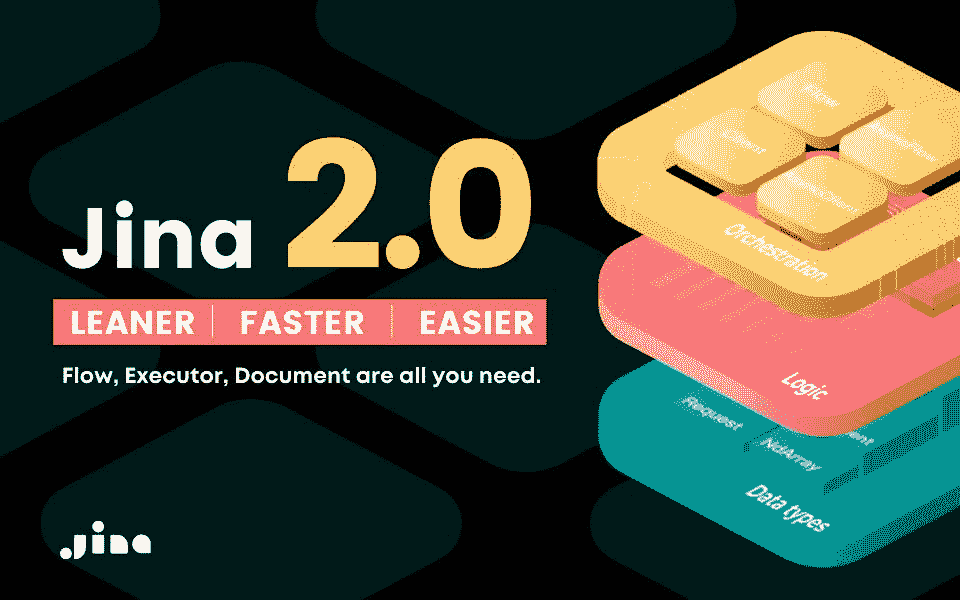

# 用纪娜 2.0 推进神经搜索

> 原文：<https://pub.towardsai.net/advancing-neural-search-with-jina-2-0-bb9c12c574c0?source=collection_archive---------2----------------------->

## [深度学习](https://towardsai.net/p/category/machine-learning/deep-learning)

## 随着信息时代的到来，智能搜索海量信息的能力已经成为我们日常生活中不可或缺的一部分…

挑战传统——用纪娜 2.0 引领搜索的未来！

# 先决条件

要了解神经搜索的基础知识以及它与传统搜索的不同之处，请浏览我之前的博客“纪娜驱动的下一代[”。它解释了云原生开源公司纪娜如何在神经搜索领域开创先河。它基于语义搜索的思想，解释了构建智能搜索应用程序所需的纪娜框架的基本构件。](/next-gen-search-powered-by-jina-dca6953ca068)

# 回复:神经搜索

简单回顾一下，神经搜索背后的想法是利用最先进的深度神经网络从数据堆中智能地检索上下文和语义相关的信息。神经搜索系统可以超越简单的文本搜索，允许您搜索所有格式的数据，包括图像、视频、音频，甚至 pdf。

# 神经搜索的应用

*   一个**问答聊天机器人**可以由神经搜索驱动:首先索引所有硬编码的问答配对，然后语义映射用户对话到这些配对。
*   智能扬声器可以由神经搜索驱动:通过应用 STT(语音到文本)识别，然后将文本语义映射到内部命令。
*   一个**推荐系统**可以由神经搜索驱动:以数字向量的形式嵌入用户项目信息，并找到特定用户/项目的前 K 个最近邻居。

神经搜索创造了一种理解世界的新方法，并为我们提供了在互联网上对大量数据进行智能信息检索的能力。**纪娜**是一个云原生神经搜索平台，站在创造搜索未来的最前沿！

# 纪娜 2.0 —有什么变化？

**纪娜 1.x v/s 纪娜 2.0**

**纪娜 1.x** 是一个复杂的怪物，有很多样板代码，没有那么多透明性，但是**纪娜 2.0** 拥抱了“ ***显式高于隐式*** ”的原则。为了拥抱神经搜索的力量，并让更多的观众可以使用它，纪娜推出了更容易学习、更容易采用和更快学习的 2.0 版本。

纪娜 1.x 更难学习，很难习惯不同的组件，并以一致的方式将它们放入应用程序中。所有这些单独的组件都被抽象为一个简单的层，只有一个流和执行器，所有中间层(包括 pod 和 peas)都隐藏在幕后，使您可以只关注真正重要的内容。

在构建智能搜索系统的旅程中，要开始使用纪娜 2.0，你只需要知道三个概念- **文档**、**执行者**和**流程**，使用用户友好的 pythonic 界面，你将很快上手。

# 纪娜 2.0 的基本组件

`Document`、`Executor`、`Flow`是纪娜的三个基本概念。

*   一个 [**文件**](https://github.com/jina-ai/jina/blob/master/.github/2.0/cookbooks/Document.md) 是纪娜的基本数据类型
*   一个 [**执行人**](https://github.com/jina-ai/jina/blob/master/.github/2.0/cookbooks/Executor.md) 就是纪娜处理文件的方式
*   一个 [**流程**](https://github.com/jina-ai/jina/blob/master/.github/2.0/cookbooks/Flow.md) 就是纪娜如何精简和缩放执行者

## 文件

`Document`是纪娜操作的基本数据类型，它与数据的类型/格式无关。在纪娜，文本、图片、音频、视频都被视为文件。文档数据类型的超集是`DocumentArray` ***，*** ，它将多个单独的文档包装起来，充当它们的容器。

您可以将一个`DocumentArray`视为由多个句子组成的文本文件，其中每个句子代表一个`Document`。A `DocumentArray`是纪娜遗嘱执行人的一等公民，担任遗嘱执行人的输入输出。对于数据人员来说，您可以通过简单类比著名的 Numpy 库来理解“文档”。

> Document = np.floatDocumentArray = np.ndarray

## 执行者

`Executor`是纪娜最小的算法单位，用于处理文档，将图像编码成向量，将向量存储在磁盘上，对结果进行排序，所有这些都被公式化为执行器。Executor 提供了直观的界面，让 AI 开发者和工程师能够真正专注于算法。一些常见的遗嘱执行人如下:

*   **Crafter** : Crafter 用于将文档预处理成块。
*   **编码器**:编码器从手工艺者处获取输入的预处理过的文档卡盘，并将其编码成嵌入向量。
*   **索引器**:索引器将编码的向量作为输入，并以键值的方式索引和存储向量。
*   Ranker : Ranker 在索引存储上运行，根据一定的排名对结果进行排序。

`Executor`通过`@requests`修饰的函数就地处理`DocumentArray`。以下是纪娜遗嘱执行人的特征:

*   一个`Executor`应该直接从`jina.Executor`类派生出子类。
*   一个`Executor`类是一个具有共享状态的函数包(通过`self`)，允许它包含任意数量的具有任意名称的函数。
*   用`@requests`装饰器装饰的函数将根据它们的`on=`端点被调用。

在纪娜，主要有两种方法来设计一个执行程序，所以让我们看一个简单的例子，看看如何使用 Python 和 YAML 创建一个执行程序:

*   **使用 Python**

要在 python 中创建一个 executor，您只需要从纪娜核心导入本地 executor 类，并创建一个相同的子类。在`**MyExecutor**`子类下，您可以通过在这些函数上附加`**@requests**`装饰器来定义许多函数，以使它们在流中可访问。

在定义了 executor 子类之后，您可以创建一个流程，并通过请求的端点`**/random_work**` **调用 executor，下面的**是展示如何使用 executor 的代码片段:

*   **使用 YAML**

执行器可以从 YAML 文件加载并存储到其中。下面是上面创建的 python executor 的副本，您可以将该文件保存为“exec.yml”。

保存 exec.yml 文件后，您可以使用该文件构造一个执行器，并将其添加到新的或现有的纪娜流中:

## 流动

纪娜是如何精简和扩展执行者的，它代表了高层次的任务，如索引、搜索、训练等。它充当上下文管理器，并协调一组执行器来完成一项任务，例如，如果您想要索引数据，您需要一系列执行器，如 crafter、encoder、indexer，它们相互协同工作，以实现所需的结果。

`Flow`是一项服务，允许多个客户端通过 gRPC / REST / WebSocket 从公共或私有网络访问它。

Flow 遵循一种懒惰的构造模式，所以直到您使用`with`打开它，它才会真正运行。只需从 jina 核心库导入流，然后向其中添加执行器，就可以创建流。要运行一个流程，您只需通过`with`打开它，并发送数据请求，如下例所示:

# 参考

1.  【https://github.com/jina-ai/jina 
2.  [https://github.com/jina-ai/jina/tree/master/.github/2.0/cookbooks](https://github.com/jina-ai/jina/tree/master/.github/2.0/cookbooks)
3.  [https://www.thinkwithgoogle.com](https://www.thinkwithgoogle.com/intl/en-apac/consumer-insights/consumer-trends/evolution-search/#:~:text=The%20world%20has%20changed%20dramatically,become%20more%20complex%20than%20ever)

如果你想了解更多，或者想让我写更多关于这个主题的东西，请随时联系我们。

我的社交链接:[LinkedIn](https://www.linkedin.com/in/shubhamsaboo/)|[Twitter](https://twitter.com/Saboo_Shubham_)|[Github](https://github.com/Shubhamsaboo)

*如果你喜欢这篇文章或觉得它有帮助，请花一分钟按一下拍手按钮，它会增加文章对其他媒体用户的可见性。*