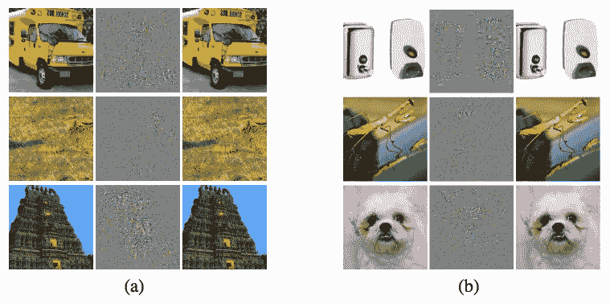
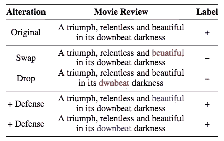
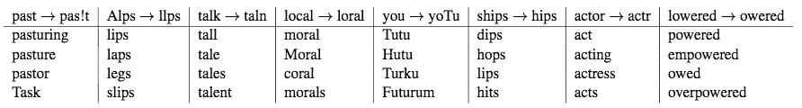
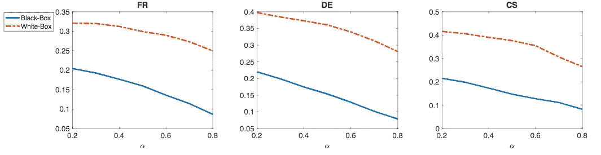
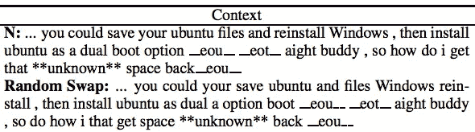

# 文本深度神经网络中的对抗性攻击

> 原文：<https://pub.towardsai.net/adversarial-attacks-in-textual-deep-neural-networks-245dc90029df?source=collection_archive---------0----------------------->

## 在 DNNs | [中对 AI](https://towardsai.net) 进行对抗性攻击

## 什么是对抗性攻击？

在 [Unsplash](https://unsplash.com?utm_source=medium&utm_medium=referral) 上 [Solal Ohayon](https://unsplash.com/@svkj?utm_source=medium&utm_medium=referral) 拍摄的照片

对立的例子旨在使目标模型在预测上出错。导致模型表现不佳的原因可能是有意的，也可能是无意的。例如，当我们使用 Gmail 并使[智能回复](https://ai.google/research/pubs/pub45189)无法提供撰写电子邮件的建议时，可能会出现打字错误。

无论是有意还是无意的对抗性攻击，评估对抗性例子已经成为构建健壮的深度学习模型和理解模型缺点的趋势。这个故事将讨论对抗性攻击，以及我们如何产生对抗性的例子来避免危险。在下一篇文章中，我们将介绍更多关于模拟对抗性攻击的细节。

# 图像对抗性攻击

第一个对立的例子来自计算机视觉领域。通过改变足够小的像素，在人眼不能区分原始图像和对手图像之间的差异时，对分类图像进行错误建模。

在下图中，我们有两组(a 组和 b 组)例子来演示原始图像和对立图像之间的差异。左栏是原始图像，而右栏是敌对图像。噪声(中间一栏)就是差异。

用于图像分类的对立图像(Szegedy 等人，2014 年)

# 文本对抗性攻击

文本对抗性攻击不同于图像对抗性攻击。主要区别是:

*   **离散与连续输入:**文本输入是离散特征，而图像输入是连续特征。
*   **可感知与不可感知:**我们可以修改一些像素，做一个模型来错误分类，而人类却不容易区分。另一方面，我们只能修改人类能够注意到的字符或单词。
*   **语义 vs 无语义:**图像的微小变化不会改变图像的语义。然而，当改变句子中的一个单词时，textual 的意思可能完全不同。

角色级别对抗性攻击的示例(Pruthi 等人，2019 年)

词级对抗性攻击的例子(易卜拉希米等，2018)

# 有针对性和无针对性的攻击

*   **有针对性:**使目标模型将对立的例子分类到特定的错误类别。
*   **无针对性:**使目标模型将对立的例子分类到除正确类别之外的任何标签。

# 白盒和黑盒攻击

*   **白盒:**白盒攻击需要访问模型信息，包括网络架构、参数、输入、输出和其他模型属性。这种方法非常有效，因为它可以访问任何东西。
*   **黑盒:**除了输入输出，不能访问任何模型信息。换句话说，它只能通过输入来收集预测结果。

白盒攻击和黑盒攻击的成功率。白盒攻击的性能优于黑盒攻击。(易卜拉希米等人，2018 年)

# 生成对立示例的示例

*[热翻转](https://arxiv.org/pdf/1712.06751.pdf)由易卜拉希米等人(2018)引入。它在字符级别上执行原子操作。它提供交换、插入和删除操作来生成对立的例子。易卜拉希米等人将这种技术应用于白盒攻击。*

****合成和自然噪声****

*[Belinkov et al. (2017)](https://arxiv.org/pdf/1711.02173.pdf) 介绍了字符级操作(如交换相邻操作、键盘错别字)和单词级操作(如拼写错误)。 **Swap** 、 **Mid** 、 **Rand、**和 **Key** 建议生成合成数据。*

*   **交换*:交换两个字母。例如，将*噪音*改为*噪音。**
*   **中期*:洗牌字符顺序除了第一个和最后一个。例如，将*噪音*改为*噪音*。*
*   **Rand* :洗牌所有角色顺序。例如，将*噪声*改为*噪声**
*   **键*:人类常见的错别字。例如，将*噪声改为*噪声。*

****过灵敏和过稳定****

*[牛等(2018)](https://arxiv.org/pdf/1809.02079.pdf) 提出了两种验证过敏过稳模型的策略。引入了几个字级操作来验证模型性能。*

*   **随机交换*:随机交换相邻单词。*
*   **停用词丢失*:停用词携带的信息较少，会随机丢失。*
*   **数据级释义*:用相似的意思替换单词。*
*   *生成级释义:生成一个新句子，同时保持相同的意思。*
*   **语法错误*:故意用错误的 on 替换正确的单词/短语。*
*   **加否定*:加否定，引起相反的意思。*
*   **反义词*:类似*加否定*但使用反义词。*

**

*随机互换效应(牛等，2018)*

# *拿走*

*   *对立的例子有助于建立一个强大的深度学习模型。*
*   *前面提到的方法都在这个[库](https://github.com/makcedward/nlpaug)中实现。*

# *喜欢学习？*

*我是湾区的数据科学家。专注于数据科学、人工智能，尤其是 NLP 和平台相关领域的最新发展。在 [LinkedIn](https://www.linkedin.com/in/edwardma1026) 或 [Github](https://github.com/makcedward) 上随意联系 [me](https://makcedward.github.io/) 。*

# *延伸阅读*

*   *[您的 NLP 模型能够防止恶意攻击吗？](https://medium.com/hackernoon/does-your-nlp-model-able-to-prevent-adversarial-attack-45b5ab75129c)*
*   *NLP 中的数据扩充库( [nlpaug](https://github.com/makcedward/nlpaug) )*

# *参考*

*   *C.塞格迪、w .扎伦巴、I .苏茨基弗、j .布鲁纳、d .埃汉、I .古德菲勒和 r .弗格斯。神经网络的有趣特性。2014*
*   *Y.别林科夫和 y .比斯克。[合成和自然噪音都打断神经机器翻译](https://arxiv.org/pdf/1711.02173.pdf)。2017*
*   *J.和窦。[关于字符级神经机器翻译的对立例子](https://arxiv.org/pdf/1806.09030.pdf)。2018*
*   *J.饶、劳德和窦。 [HotFlip:用于文本分类的白盒对抗示例](https://arxiv.org/pdf/1712.06751.pdf)。2018*
*   *T.牛和班萨尔。[对话模式的对抗性过度敏感和过度稳定策略](https://arxiv.org/pdf/1809.02079.pdf)。2018*
*   *D.普鲁西、b .丁格拉和 Z. C .利普顿。[利用强大的单词识别功能对抗对抗性拼写错误](https://arxiv.org/pdf/1905.11268.pdf)。2019*
*   *页（page 的缩写）尼卡拉、侯赛因、杜布诺夫和库尚法尔。[序列分类神经网络的对抗性重编程](https://arxiv.org/pdf/1809.01829.pdf)。2019*
*   *W.张，盛庆洲，阿尔哈兹米和李。[对自然语言处理中深度学习模型的对抗性攻击:一项调查](https://arxiv.org/pdf/1901.06796.pdf)。2019*