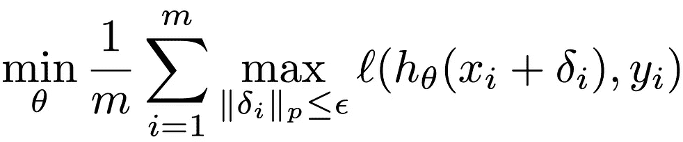
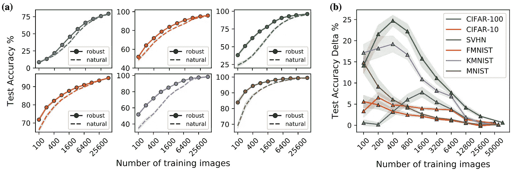
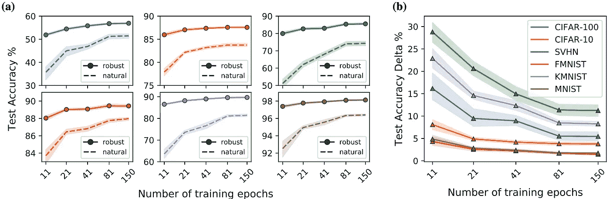
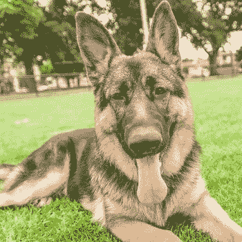
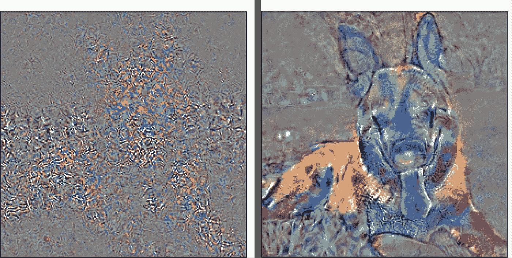
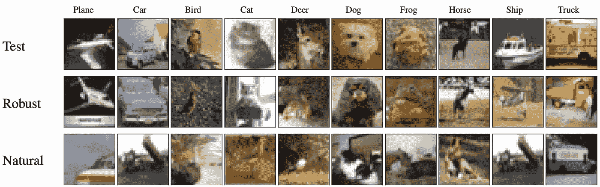

# 对抗训练的深网转移得更好

> 原文：<https://pub.towardsai.net/adversarially-trained-deep-nets-transfer-better-af54c82580f6?source=collection_archive---------2----------------------->

## [机器学习](https://towardsai.net/p/category/machine-learning)

# 有什么实际影响？

我们发现了一种新的方法，在将学习快速转移到*的背景下，使用对抗训练的深度神经网络(DNNs)在图像分类任务上实现更高的精度*——即使在 ***有限的训练数据*** 可用时。你可以在*[***https://arxiv.org/abs/2007.05869***](https://arxiv.org/abs/2007.05869)阅读我们的论文。***

# **什么是对抗性训练？**

**对抗性训练通过在每个输入图像 *xᵢ* 上添加对抗性扰动 *δᵢ* 来修改典型的 DNN 训练过程，目的是生成对对抗性攻击鲁棒的 dnn。特别地，对于具有 *m* 个输入图像的 DNN，损失函数 *ℓ(* ⋅ *)* ，由 *θ* 参数化的模型预测响应 *h(* ⋅ *)* ，以及 iᵗʰ图像 *yᵢ* 的真实标签，对抗训练的优化目标在等式 1 中进行了数学描述。更多详情，请参见我们的论文 中 [**的第 3 节:“讲解对抗性训练过程”。**](https://arxiv.org/abs/2007.05869)**

************

**等式 1:对抗性训练中的优化目标**

# **什么是 DNNs 背景下的迁移学习？**

**迁移学习通常在 ImageNet 等丰富的数据集上训练 dnn，然后用目标数据集重新训练(**微调**)一些最后的层。经验上，这种方法允许我们获得比从零开始训练的 DNNs 更高的精度，正如 Yosinski 等人首先展示的那样。艾尔。在 [*中，深度神经网络中的特征有多大的可转移性？*](https://arxiv.org/abs/1411.1792) [2]。此外，与从零开始训练的 DNNs 相比，这种更高的精度获得得更快。**

# **是什么激励了我们？**

**齐普拉斯等人解释了两个关键观点。艾尔。 [*鲁棒性可能与准确性不一致*](https://arxiv.org/abs/1805.12152)【1】:**

1.  **对抗训练的 dnn 通常比自然训练的模型具有更低的测试准确度。然而，**
2.  **正如我们在下面的“为什么这样做”一节中解释的那样，经过对抗性训练的 dnn 往往具有更符合人类的特征。因此，我们想知道:**

> **当这些人类对齐的表示被微调到新的数据集时，有没有可能使对抗性训练的模型比自然训练的模型更有优势？**

# **我们的实验是什么，我们的结果是什么？**

**我们全面研究了通过自然微调 ResNet-50 模型获得的测试准确性，这些模型最初是在 ImageNet 上以对抗或自然方式训练的。在对 6 个不同变量的 14，400 个模型进行微调后，我们得出结论**经过对抗性训练的 dnn 比自然训练的 dnn 学习得更快，数据更少**。在某些情况下，我们看到训练图像减少了 4 倍，训练速度加快了 10 倍，以达到与自然训练的源模型相同的精度基准。**

****图 1(a)和图 2(a)** 显示了每个目标数据集上的测试精度分别作为用于微调的训练图像和训练时期的数量的函数。**图 1(b)和 2(b)** 显示了测试精度增量，定义为稳健性减去目标数据集上的自然测试精度。 **(a)** 和 **(b)** 都由数据集一致着色，阴影区域显示 95%置信区间，点是多个随机种子的平均值。更多详情，请参见我们论文 中 [**的第 5 节:“结果与讨论”。**](https://arxiv.org/abs/2007.05869)**

****

**图 1:对抗训练的模型比自然训练的模型用更少的数据传输得更好**

****

**图 2:对抗性训练的模型比自然训练的模型学得更快**

# **还有人研究过这个吗？**

**据我们所知，只有两篇论文直接研究了这一现象:**

1.  **[*在*](https://arxiv.org/pdf/1905.08232.pdf)*【3】中，沙法希等人。艾尔。发现对抗性训练的模型比自然训练的模型传递得更差。然而，这个看似矛盾的结论可以用一个事实来解释:他们使用了比我们大得多的鲁棒性水平:他们使用ε=5，而我们使用ε=3。***
2.  ***微软研究院和麻省理工学院在他们最近的论文 [*中得出了类似的结论:对抗性强的 ImageNet 模型传输得更好吗？*](https://arxiv.org/abs/2007.08489)【4】和 Salman 等人的一篇相关 [blogpost](https://gradientscience.org/transfer-learning/) 他们专注于不同网络架构的影响、固定特征转移，以及对比对抗性鲁棒性和纹理鲁棒性。***

# **为什么会这样？**

****

**图 3:德国牧羊犬的形象**

**为了深入了解为什么强大的迁移学习有效，我们可以看看人类的感知。当我们感知现实生活中的物体时，我们从被观察物体的语义属性来推断物体的标签。因此，举例来说，当被赋予识别图 3 中的物体的任务时，大多数人识别出高耳朵、拉长的鼻子和棕色皮毛图案暗示该物体是德国牧羊犬。这种认知方法的强大之处在于，它允许人类学会识别大量的物体。学会识别德国牧羊犬后，人们可能会增强识别狼的能力，因为它们有共同的视觉特征。**

**考虑一下，图 3 中的狗图像被输入一只自然训练的 DNN 和一只敌对训练的 DNN。每个网络如何在内部表现这种形象？这可以在图 4 中可视化，图 4 示出了给定狗的输入图像的像素中的小变化的损失函数的灵敏度。损失函数衡量我们模型的预测有多“好”。左图显示了一个非常不规则和不平滑的表示，而右图显示了一个人类可以识别为狗的表示。直观地，我们可以说，对抗性训练的模型看到了森林(即，诸如耳朵、眼睛、手臂等特征。)，而自然训练的模型在树(即图像像素)中丢失。**

****

**图 4:对抗性训练的模型包含人类一致的表示。这些图像是利用损失函数对自然训练(左)和对抗训练(右)的 DNN 模型的输入图像的像素的微小变化的敏感性而创建的。**

**我们也可以从 ***影响函数*** 的角度来考察这一现象，如 Koh 和梁的《【通过影响函数理解黑箱预测》论文[5]中所述，其实质是问:**

> **训练数据集中的哪些图像对分类该输入图像最有帮助？**

**由于对抗性训练的模型包含人类对齐的特征，我们期望输入图像的最有影响力的图像实际上看起来与输入图像相似。我们获得了与这一理论相一致的结果。**

****

**图 5:对抗性训练的源模型在目标数据集中有更直观的有影响力的图像。最上面一行包含测试图像，10 个类别中各有一个。剩余的行包含训练集中最有影响力的图像，分别用于预训练的鲁棒模型和预训练的自然模型**

**图 5 示出了转移的 DNN 的测试图像的集合，其中针对对抗和自然训练的源模型示出了目标数据集中最有影响力的训练图像。很明显，与自然训练的源模型相比，鲁棒模型产生看起来更类似于测试图像的最有影响力的图像。图 6 扩展了图 5 中所示的概念，以定量测量对抗训练的 DNN 比自然训练的 DNN 好多少。特别是，它表明高影响力的图像在鲁棒模型中更经常被正确分类。这些结果表明，相似的图像在对立训练的源模型的特征空间中聚集在一起，这表明对立训练的模型具有更好地与人类认知一致的内部特征表示。更多详情，请参见我们的论文 中 [**的第 6 节:“使用影响函数解释表征”。**](https://arxiv.org/abs/2007.05869)**

****

**图 6:与自然训练的图像相比，对抗性训练的源模型的最有影响力的图像的类别更经常地匹配目标图像的类别。(a)示出了使用训练图像匹配目标的前 1 到前 100 个有影响力的图像的比例，而(b)进行了相同的操作，但是使用测试图像作为目标**

# **你怎么能使用这个？**

**与许多其他复杂和不规范的培训程序相比，**我们的** **对抗性** **迁移学习程序易于实施**。**

**第一步是通过第三方或通过 scratch 对抗性 SGD 训练来获得对抗性训练的 ImageNet 模型(有关更多详细信息，请参见我们论文**中的第 3 节:“对抗性训练过程的解释”)。我们建议使用 README.txt 中链接的[鲁棒性库](https://github.com/MadryLab/robustness)中的模型。接下来，重新初始化最后一个完全连接的层，然后使用目标数据集微调模型，如我们的论文 的第 4 节所述。****

****最后，我们想分享一些我们在微调 14，000 多个模型时学到的技巧和诀窍:****

*   ****如果训练数据较少，请微调较少的层以避免过度拟合****
*   ****考虑使用我们的超参数作为起点，并执行网格搜索，以提高约 1–3%的精度****
*   ****具有ℓ-2 标准的对抗性训练模型对我们最有效****
*   ****请记住，这种方法即使在低数据状态下也应该工作得相当好****

****要查看与我们的研究相关的代码，请查看我们的 [GitHub](https://github.com/utrerf/robust_transfer_learning) 。****

# ******下一步是什么？******

****从**实用**的角度来看，我们感兴趣的是找到进一步提高迁移学习准确性和/或减少对抗性训练源模型所需的计算开销的方法。不同的源模型和架构会对迁移学习过程的行为产生很大的影响。此外，虽然 ImageNet 作为源数据集在迁移学习中已经变得很常见，但该数据集存在许多问题，可能与迁移学习不一致。ImageNet 的一些问题包括图像中的重叠标签、数据集长度不足、低分辨率照片和过时的图像(按照今天的标准)。一些数据集试图解决这些问题。2019 年，腾讯发布了一个包含 1800 万张图像和 1.1 万个类别的公开数据集，成为世界上最大的带注释的图像数据集。****

****从理论角度来看，我们应该首先探究为什么会出现这种现象。即使我们已经通过影响函数的透镜观察了健壮的迁移学习行为，我们也不能明确地解释为什么对抗性训练的模型迁移得更好。这种现象可能与基于表征的学习和/或半监督学习有关。也许我们可以利用这些相关领域的一些理论来获得更深入的理解，解释为什么经过对抗性训练的 dnn 传输得更好。****

# ******致谢******

****我要感谢我的博客合著者 Evan Kravitz，以及来自 Benjamin Erichson、Rajiv Khanna 和 Michael Mahoney 的有益评论和编辑。我们还要感谢 CLTC 对这一项目的部分支持。****

# ****来源****

****[1]季米特里斯·齐普拉斯、什巴尼·桑图尔卡尔、洛根·恩斯特罗姆、亚历山大·特纳和亚历山大·马德瑞。 [*鲁棒性可能与准确性*](https://arxiv.org/abs/1805.12152) 不一致。ICLR (2019 年)。
**与我们工作的相关性—** 当在相同的源数据集(即未转移)上进行评估时，对抗性训练的模型表现不如自然训练的模型。然而，“稳健模型学习到的表示往往更符合显著的数据特征和人类感知”。****

****[2]杰森·约辛斯基、杰夫·克鲁恩、约舒阿·本吉奥和霍德·利普森。 [*深度神经网络中特征的可转移性如何？*](https://arxiv.org/abs/1411.1792) NeurIPS (2014)。**** 

****[3]阿里·沙法希、帕萨·萨阿达特帕纳、诸宸、阿明·吉亚西、克里斯托夫·斯图德。 [*对抗性强的迁移学习*](https://arxiv.org/pdf/1905.08232.pdf) *。* ICLR(2020)。
**与我们的工作相关—** 研究敌对训练的 dnn 的迁移学习的第一篇论文表明，对敌对扰动具有高容忍度(即ε=5)的 dnn 的迁移不如自然训练的模型[表 3]。****

****[4]哈迪·萨勒曼、安德鲁·易勒雅斯、洛根·恩斯特罗姆、阿希什·卡普尔、亚历山大·马德瑞。 [*对抗性强的 ImageNet 模型传输得更好吗？*](https://arxiv.org/abs/2007.08489) ArXiv (2020)
**与我们工作的相关性—** 最近的工作进一步验证了我们的结论，即通过分析不同的网络架构宽度、微调整个 DNN 和固定特征转移，对抗性训练的模型转移得更好。****

****[5]庞维高和佩西梁。 [*通过影响函数*](https://arxiv.org/abs/1703.04730) *理解黑盒预测。* ICML (2017)。
**与我们的工作相关—** 提供了我们用来更好地理解为什么对抗性训练模型转移得更好的影响函数框架。****