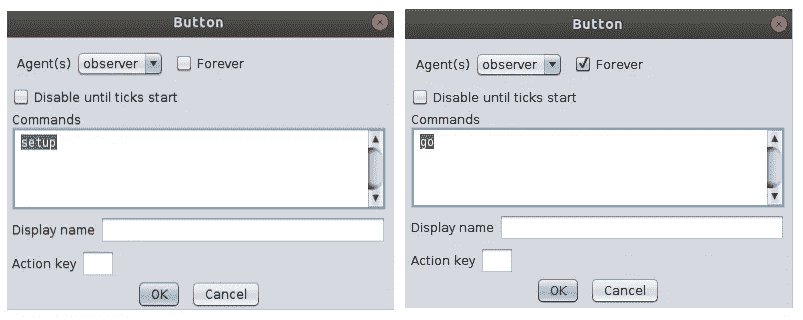
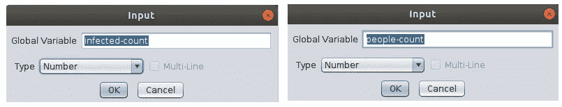
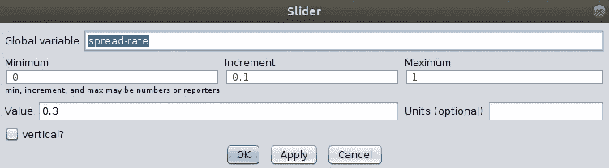
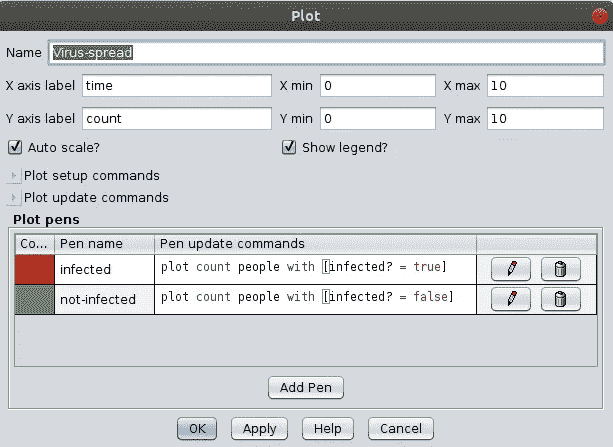
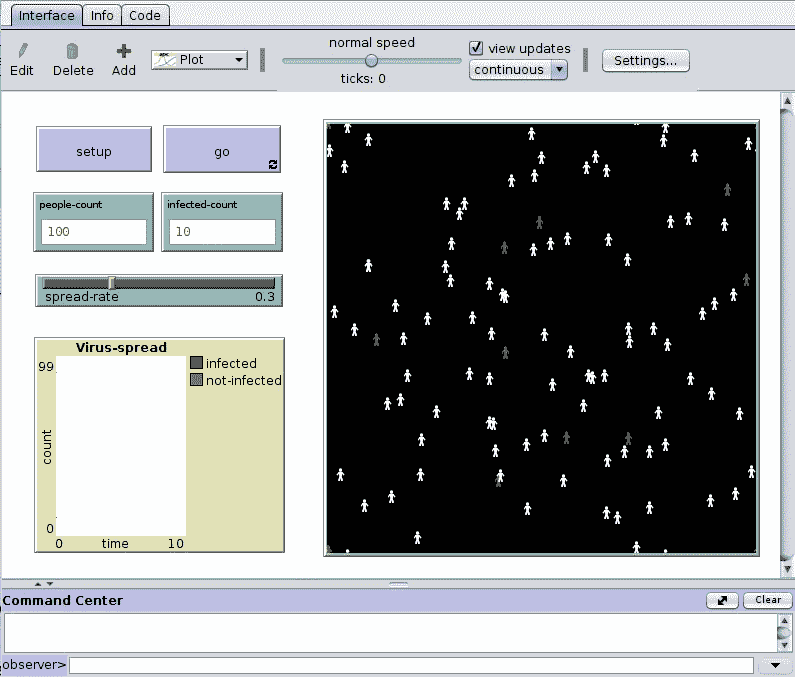

# NetLogo 中基于代理的建模

> 原文：<https://pub.towardsai.net/agent-based-modelling-in-netlogo-afcaada5e0bd?source=collection_archive---------3----------------------->


来源

基于代理的建模是一种模拟技术，它专注于建立一个系统模型，该系统具有一组称为代理的自主决策实体。每个个体代理可以基于一组针对他们的情况或属性提供的规则来做出决策。使用 ABM 技术，人们已经认识到，个体之间简单的相互作用会产生更复杂的模式。一些例子是交通堵塞，一群鸟以 V 字形飞行，住房模式，等等。

你可能见过一群鸟呈 V 字形飞行。你们大部分人大概都想过，领路鸟在前面，其他鸟跟在后面。事实并非如此。发生的情况是，不同的鸟在基于鸟群飞行方向的独立运动的基础上飞行时，不是同一只鸟呆在它们的位置上，而是占据不同的位置，避开其他鸟，并且不会远离邻居鸟。

同样，ABM 计算方法使我们能够模拟复杂的系统。ABM 模型由代理组成，代理具有属性。在 [NetLogo](https://ccl.northwestern.edu/netlogo/) 中，每个代理在电脑屏幕上都有一个图形表示。让我们尝试使用 NetLogo 构建一个病毒在社会中传播的简单场景。在社会中，有些人(代理人)可以被确定为受感染和未受感染。所以当代理人相互作用时，被感染的代理人可能会将病毒传播给其他代理人。因此，让我们建立一个简单的模型，根据一套简单的规则来看看病毒是如何在社会中传播的。

代理的属性:

*   “状态”用于存储感染还是未感染

规则:

*   每个个体随机移动
*   根据传播速度，如果未被感染的个体在被感染个体的半径范围内，则病毒被感染

首先，让我们使用 NetLogo 中的“接口”来构建模型的接口。在这里，我使用了两个名为“setup”的按钮来设置环境，并使用“go”按钮来永久运行模型。



然后，让我们创建名为“感染人数”和“人数”的输入



滑块用于更改全局变量值“扩散率”



转到 NetLogo 中的“代码”选项卡。因为我们使用了一个全局变量“counter”并创建了一个新的 breed 类型，所以我们必须在代码的顶部定义它。这里的品种类型是“人”，我们可以用它来调用所有“人”代理集。此外，我们必须定义它的属性。

```
globals[counter]breed[people person]people-own[infected?]
```

让我们看看在“设置”过程中我们必须做些什么。我们必须首先清除环境，然后用代理设置环境并重置 ticks。所以代码看起来像这样。

```
to setup
 clear-all
 initialize-people
 reset-ticks
end
```

如果您使用“检查”按钮“检查”代码，将会得到一个错误，因为您尚未编写“初始化人员”过程。我们必须在 setup 下面单独写。编写“initialize-people”过程，根据提供的人数创建人员类型的代理。代理将是“人”的形状和随机的 x，y 坐标。人们会被感染吗？基于初始“感染次数”的属性 true 或 false

```
to initialize-people 
  set counter infected-count
  create-people people-count[
    set shape "person"
    setxy random-xcor random-ycor
    (ifelse (counter > 0)
      [set color red
        set infected? true]
      [set color white
        set infected? false])
    set counter counter - 1
  ]
end
```

然后在“开始”过程中，我们必须写下模型运行时我们期望做什么。所以我会简单地让人们随意移动，传播疾病。我不会把重点放在感染者的恢复上，当所有人都感染了这种疾病时，这种模式就会停止。

```
to go
 (ifelse any? people with [color = white] [
   move-people
   spread-disease
 ]
 [stop])
 tick
end
```

我们必须编写两个独立的程序来运行这个模型，分别命名为“移动-人”和“传播-疾病”。首先，让我们看看 move-people 方法。它会要求人们从 0 到 50 之间随机选择一个整数。然后代理右转这个度数。然后要求在 0 到 50 之间选择一个随机数，并左转该度数。然后以指定的步长值向前移动。

```
to move-people
 ask people [
  rt random 50
  lt random 50
  forward 0.1
 ]
end
```

在“传播疾病”程序中，当非感染者遇到感染者时，他/她将根据提供的“传播率”感染疾病。

```
to spread-disease
 ask people [
  if any? people with [infected? = true] in-radius 0.5 [
   if random 100 < spread-rate * 100 [
    set color red
    set infected? true
   ]
  ]
 ]
end
```

回到“interface”选项卡，让我们创建一个图表来显示模型运行时每个时间点的感染人数和未感染人数。



所以在做了所有的修改后，最终的界面会如下图所示。



在运行模型之前，不要忘记在输入框中填入输入值。

我希望你们都已经理解了使用 NetLogo 的基于代理的建模。如果你想阅读和学习更多关于使用 NetLogo 的 ABM 模拟，请查看下面提供的参考资料。

**参考文献**

[1] [NetLogo](https://ccl.northwestern.edu/netlogo/) 首页

[2]对基于主体的建模的介绍用 NetLogo 对自然、社会和工程复杂系统建模