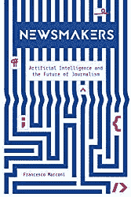
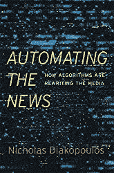

# 艾与新闻业的未来

> 原文：<https://pub.towardsai.net/ai-and-the-future-of-journalism-591b1c9ea6b8?source=collection_archive---------0----------------------->

## 将来的

## 人工智能如何影响新闻编辑室、记者和媒体。

内容是网络上一切活动的根源。我们浏览信息，搜索新闻，产品，总是在寻找一些东西。书面内容——文本、文档、聊天记录——对于理解我们如何操作至关重要，而且我认为，对于人工通用智能的最终创造也是必不可少的。这就是为什么在过去的一年里，我一直在研究如何将人工智能应用于新闻业。这篇文章总结了我最近的一些发现。

人工智能和新闻业的未来

# 人工智能媒体项目

首先，我已经通过 [PetaCrunch](http://petacrunch.com) 项目冒险进入人工智能新闻业(针对公关发布的 [PetaPR](http://petapr.com) ，在此之前，我写了关于[合成内容](https://medium.com/swlh/synthetic-content-9cf5838d8e80)，这是进入这个方向的第一步)。PetaCrunch 的目标是了解记者工作流程中的真正瓶颈，如发送电子邮件、接收材料、发布故事。我的论点是 99.9%的非调查性新闻可以自动化——也就是说，收集数据是最难的部分。在与 PetaCrunch 接触六个月后，我基本上可以确认这个论点。

PetaCrunch 和 PetaPR 成为关注商业新闻和采访的半自动媒体。值得注意的是 [PetaCrunch](http://petacrunch.com) 只发布原创内容；也就是说，与企业高管和初创企业创始人的面试是通过电子邮件进行的。电子邮件处理的自动化使我们能够联系成千上万的企业。我们针对那些获得资金的人，询问他们的计划，并进行一次简短的采访。我们对世界各地的公司进行了 1000 多次采访。所有这些都是在三个月内完成的。这向我展示了全自动化所缺少的东西，并引出了 [Contentyze](http://contentyze.com) 。

PetaCrunch 仍然做得很好，如果你[跟随链接](http://petacrunch.com)你可以自己看到它。然而，这只是迈向一个普遍方向的一步:大规模的内容创作。

# 人工智能内容营销

内容对于任何新闻媒体来说都是至关重要的。你应该能够定期发布相关新闻，如果你想有访客，并将其货币化。如果你想一想书面内容的范围，它包括从低级别的当地天气新闻、体育新闻、商业交易到高级别的调查性新闻，以及相关的观点文章(想想《纽约客》)。

你仍然不能使后者自动化。然而，您完全可以开始自动化较低的级别。已经有一些工具可以让你在足球比赛结束后立即发布全自动的新闻，或者关于交通或城镇新商业的新闻。很可能你已经在阅读自动新闻了，却没有意识到。老实说，这对记者来说非常好，他们可以专注于更具创造性的任务。

它是如何工作的？**任何新闻都是将数据源连接到模板算法**的问题。一个数据源为你提供一个关于特定利基的数据流，一个模板算法给你一个基于这个数据的文本(使用机器学习术语的‘提示’)。模板算法各不相同，从纯软件工程到深度学习语言生成模型。

> 对技术了解得越深，自动化程度就越高。

# 新闻业的未来

理解了 AGI 和文本生成是相关的，我的目标是尽可能多地自动化内容创建。我想把它做成一个更大的平台，这就是 [Contentyze](http://www.contentyze.com) 的由来。我设想一个通用的平台，根据你提供的数据源给你提供文本。因此，记者的角色将纯粹与处理数据和选择消息来源有关——少写或不写。

通过 [Contentyze](http://contentyze.com) ，我计划为媒体机构、新闻机构和营销公司建立一套通用的工具。我们还没有到达那里，但是我们正在接近那里。在 2-3 年内，新闻业将以前所未有的水平进行颠覆。去年是一段疯狂的旅程，我现在只能看到我在这些想法上走了多远:从[合成内容](https://medium.com/swlh/synthetic-content-9cf5838d8e80)，通过 [PetaCrunch](http://petacrunch.com) 到 [Contentyze](http://contentyze.com) 以及更远的地方(故事的这一部分现在还不得而知)。

最后，内容生成与新闻业密切相关，但它远不止于此。最后，我们通过内容讲述我们的故事:无论是新闻、商业文件还是我们的日常交流。这就是为什么语言理解是任何更复杂的人工智能系统努力完成的核心功能。

这篇短文将在未来发挥作用。

这个故事没有真正的结局，因为它现在才展开。

敬请关注。

# 如何在新闻业中使用人工智能

为了将来的参考——主要是为我自己，但如果你能使用它，那就更好了——我想记下一些我认为有用的或想尽快阅读的文本、材料和书籍。

首先，有一个博客[机器人作家 AI](https://robotwritersai.com/) ，由一名科技记者运营，他记录了最近各种组织如何应用人工智能的用例。值得一读，尤其是更多参考资料和精彩评论。

最近有两本书讲述了人工智能是如何改变新闻业的:

## [1。新闻人物:人工智能和新闻业的未来](https://amzn.to/3c1zYpW)

[新闻人物:人工智能和新闻业的未来](https://amzn.to/3c1zYpW)

## [2。自动化新闻:算法如何改写媒体](https://www.amazon.com/gp/product/0674976983/ref=as_li_tl?ie=UTF8&camp=1789&creative=9325&creativeASIN=0674976983&linkCode=as2&tag=petacrunch-20&linkId=3a9cab5009db51578d4018e75d315b6a)

[新闻自动化:算法如何改写媒体](https://www.amazon.com/gp/product/0674976983/ref=as_li_tl?ie=UTF8&camp=1789&creative=9325&creativeASIN=0674976983&linkCode=as2&tag=petacrunch-20&linkId=3a9cab5009db51578d4018e75d315b6a)

这两本书都是由学者和调查应用程序编写的:从社交媒体机器人到自动化新闻写作和调查中使用的分析。

还有一份由 LSE 和 Google News Initiative 做的关于人工智能在新闻业的报告，你可以在这里找到。

我会在这里添加更多的来源，因为我会意识到他们。如果你有任何建议，请告诉我。