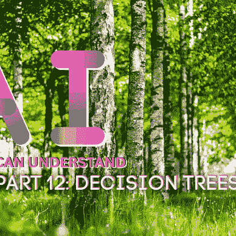
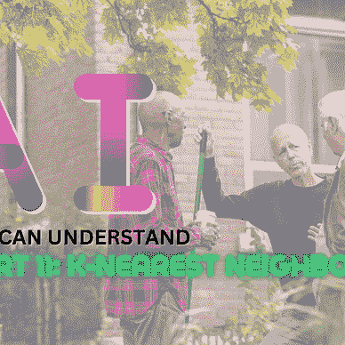

# 任何人都能理解的人工智能:第 7 部分-Q-学习

> 原文：<https://pub.towardsai.net/ai-anyone-can-understand-part-7-q-learning-f9b12300544b?source=collection_archive---------2----------------------->

## *一定要看完剩下的* [AI 任何人都能看懂](https://medium.com/@MoneyAndData/list/ai-for-anyone-to-understand-a5db7a67e622) *系列*

# 简化解释

Q-learning 是 AI 通过试错来学习的一种方式。它尝试不同的行动，看看它们产生了什么结果，然后从结果中学习，找出在不同情况下采取哪些行动是最好的。


照片由 [Kostiantyn Li](https://unsplash.com/@leekos?utm_source=medium&utm_medium=referral) 在 [Unsplash](https://unsplash.com?utm_source=medium&utm_medium=referral) 上拍摄

# 深入解释

Q-learning 是一种流行的强化学习算法，常用于人工智能(AI)应用中。简单来说，强化学习是一种机器学习，它涉及训练代理在一个环境中采取行动，以最大化回报。

Q-learning 是一种强化学习，它使用 Q 表来存储在给定状态下要采取的最佳行动的信息。Q 表最初是空的，随着代理经历新的状态并接收奖励，Q 学习算法随时间更新该表。

Q-learning 的一个关键方面是它基于贝尔曼方程的概念，即一个状态的期望值是当前奖励加上下一个状态的贴现值的总和。这意味着 Q 表存储了在给定状态下采取特定行动的预期长期回报。

在实践中，Q-learning 可以用来训练 AI 智能体玩游戏，导航迷宫，或根据环境做出其他决定。例如，一个 Q-learning 智能体在玩国际象棋游戏时，最初可能会随机移动，但随着时间的推移，它会学习哪些移动最有可能导致胜利，并相应地调整其行为。


[charlesdeluvio](https://unsplash.com/es/@charlesdeluvio?utm_source=medium&utm_medium=referral) 在 [Unsplash](https://unsplash.com?utm_source=medium&utm_medium=referral) 上拍摄的照片

## 优势

Q-learning 的主要优点之一是它可以用来解决大型或连续状态空间的问题。这是因为 Q 表是增量更新的，而不是每次都从头开始重新计算。这允许 Q 学习算法有效地从经验中学习并适应变化的环境。

总的来说，Q-learning 是人工智能研究和应用的强大工具，它将继续成为研究和开发的活跃领域。随着人工智能技术的不断进步，我们可以期待在各个领域看到越来越多的 Q-learning 应用，从游戏和机器人到医疗保健和金融。

Q-learning 的另一个重要方面是，它可以与深度学习等其他技术相结合，以创建更强大的人工智能系统。例如，深度 Q 学习算法使用神经网络来逼近 Q 表，允许它处理更大和更复杂的状态空间。

## 限制

Q-learning 的一个潜在限制是，它可能需要很长时间才能收敛到最优解，尤其是在复杂的环境中。这使得 Q 学习难以应用于需要快速决策的实时应用。然而，深度学习和并行计算等技术的最新进展有助于克服这一挑战，使 Q-学习在许多应用中更加实用。

尽管有其局限性，Q-learning 仍然是一种广泛使用的有效的强化学习算法，它仍然是人工智能领域的一个重要研究领域。随着我们继续开发更先进的人工智能技术，我们可以期待在未来看到更多令人兴奋的 Q-learning 应用。

Q-learning 可以**用于解决广泛的问题**，从玩游戏到在复杂的环境中做出决策。它可以与深度学习等其他技术相结合，创建更强大的人工智能系统。虽然 Q-learning 有一些局限性，但人工智能技术的最新进展已经帮助克服了许多挑战。

总之，Q-learning 是一种广泛应用于人工智能应用的鲁棒强化学习算法。它基于贝尔曼方程的概念，即一个状态的期望值是当前回报加上下一个状态的贴现值之和。这使得 Q-learning 能够有效地从经验中学习，并适应不断变化的环境。

# 行动中的学习

```
import numpy as np

# Initialize Q-table with all zeros
Q = np.zeros((6,6))

# Set learning rate and discount factor
alpha = 0.1
gamma = 0.9

# Define the environment
# The agent starts in state (2, 2) and the goal is to reach state (5, 5)
# The possible actions are up, down, left, and right
def get_possible_actions(state):
  actions = []
  if state[0] > 0:
    actions.append("up")
  if state[0] < 5:
    actions.append("down")
  if state[1] > 0:
    actions.append("left")
  if state[1] < 5:
    actions.append("right")
  return actions

# Define the reward function
# The reward is -1 for all non-goal states, and 0 for the goal state
def get_reward(state):
  if state == (5,5):
    return 0
  else:
    return -1

# Define the function to update the Q-table
def update_Q(state, action, next_state):
  Q[state[0]][state[1]] = (1 - alpha) * Q[state[0]][state[1]] + alpha * (get_reward(next_state) + gamma * max(Q[next_state[0]][next_state[1]]))

# Set the starting state
state = (2,2)

# Train the agent
while state != (5,5):
  # Get the possible actions
  actions = get_possible_actions(state)

  # Choose a random action
  action = np.random.choice(actions)

  # Take the action and get the next state
  if action == "up":
    next_state = (state[0] - 1, state[1])
  elif action == "down":
    next_state = (state[0] + 1, state[1])
  elif action == "left":
    next_state = (state[0], state[1] - 1)
  elif action == "right":
    next_state = (state[0], state[1] + 1)

  # Update the Q-table
  update_Q(state, action, next_state)

  # Set the next state as the current state
  state = next_state

# Print the final Q-table
print(Q)
```

在这个例子中，代理从状态(2，2)开始，目标是通过向上、向下、向左或向右移动到达状态(5，5)。Q 表用全零初始化，代理在采取行动和接收奖励时更新该表。训练后，Q 表将包含在每个状态下采取每个行动的预期长期回报。

## 初学者理解代码

1.  该代码导入了 NumPy 库，该库用于处理数组和矩阵。
2.  Q 表被初始化为一个 6x6 的零矩阵，它将用于存储在每个状态下采取每个行动的预期长期回报。
3.  学习率和折扣因子分别设置为 0.1 和 0.9。学习率决定了 Q 表基于新的体验更新了多少，折扣因子决定了与即时奖励相比，代理人对未来奖励的重视程度。
4.  定义了环境，包括起始状态(2，2)、目标状态(5，5)和可能的动作(上、下、左、右)。
5.  定义了奖励函数，对于所有非目标状态返回-1，对于目标状态返回 0。这定义了代理因采取不同行动而获得的奖励。
6.  定义了更新 Q 表的函数。该函数将当前状态、动作和下一个状态作为输入，并基于贝尔曼方程更新 Q 表。
7.  起始状态设置为(2，2)，代理开始训练。
8.  在每次迭代中，代理获得可能的动作，选择一个随机动作，采取动作并获得下一个状态，更新 Q 表，并将下一个状态设置为当前状态。这个过程一直持续到达到目标状态。
9.  训练结束后，打印出最终的 Q 表。此表包含在每个状态下采取每个行动的预期长期回报。

总的来说，这段代码实现了一个简单的 Q-learning 算法来训练代理在网格中导航并到达目标状态。当代理经历新的状态并收到奖励时，它更新它的 Q 表，并且它学习采取最有可能导致最高奖励的行动。

# 关键要点

1.  Q-learning 是一种流行的强化学习算法，常用于人工智能(AI)应用中。
2.  Q-learning 基于贝尔曼方程的概念，即一个状态的期望值是当前奖励加上下一个状态的贴现值之和。
3.  Q-learning 可以用来训练人工智能代理玩游戏，导航迷宫，或根据其环境做出其他决定。
4.  Q-learning 可以与深度学习等其他技术结合起来，创造出更强大的人工智能系统。
5.  尽管有其局限性，Q-learning 仍然是一种广泛使用的有效的强化学习算法，它仍然是人工智能领域的一个重要研究领域。

**围绕让人工智能更容易理解，本系列还有更多的工作要做**


[安德鲁·奥斯](https://medium.com/@MoneyAndData?source=post_page-----f9b12300544b--------------------------------)

## AI 任何人都能理解

[View list](https://medium.com/@MoneyAndData/list/ai-anyone-can-understand-a5db7a67e622?source=post_page-----f9b12300544b--------------------------------)12 stories[](https://medium.com/@MoneyAndData/subscribe) [## 每当安德鲁·奥斯汀发表文章时，就收到一封电子邮件。

### 每当安德鲁·奥斯汀发表文章时，就收到一封电子邮件。通过注册，您将创建一个中型帐户，如果您还没有…

medium.com](https://medium.com/@MoneyAndData/subscribe) 

如果你开始爱上 Medium 来寻找一个好的内容来源，你也可以通过我的推荐链接得到一个 Medium 来支持我:[https://medium.com/@MoneyAndData/membership](https://medium.com/@MoneyAndData/membership)