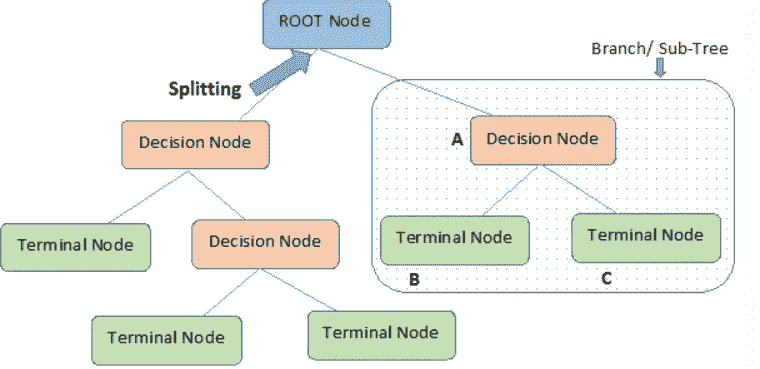

# 救援中的人工智能:索赔预测

> 原文：<https://pub.towardsai.net/ai-at-rescue-claims-prediction-b420e5ec6ea9?source=collection_archive---------0----------------------->

## **概述**

保险业是诸如逻辑回归等标准算法的早期采用者之一。保险行业最近在利用预测分析来分析索赔的可能未来方面出现了激增。这些算法的结果为索赔管理者提供了决策支持。

下面是保险和再保险行业中的一些使用案例:

1.  建立一个风险记分卡来标记风险最大的索赔，以便索赔经理可以关注这些索赔并制定策略来减轻风险
2.  更好地组织索赔数据，以了解客户在整个生命周期中的经历
3.  预测一年或一个季度的预期索赔数量

我在这篇博客中描述的用例是预测一辆特定车辆一年中的预期索赔数量。一旦您指明了索赔，您还可以将它们从风险较低标记为风险最高。

这个也可以用在其他行业，没必要局限在汽车行业。

Unsplash.com[摄影](https://unsplash.com/photos/arotxe540N4)

**数据预处理**

为了产生准确的预测，您必须从多个来源获取数据，并执行特征工程和数据争论来创建您的最终输入。以下是开始建模过程时可能需要的属性/数据集列表:

1.  政策细节(数量、日期、期限等。)
2.  保费和损失信息(保费金额、损失等。)
3.  车辆信息(编号、描述、制造年份、位置信息、商业用途等。)
4.  历史索赔信息(索赔数量、原因代码等。)

*可选属性:*

1.  人口普查信息(该地区的人口、收入等。)
2.  驾驶员信息

此外，建议有一个良好的历史(也许 4 至 5 年)，因为这样的数据集往往是稀疏的。

此时将数据集分为定型、测试和维持也很重要。您将根据**训练**数据构建模型，根据**测试**数据调整超参数，并根据**维持**数据执行模型验证。

我们将从一个简单的模型开始，如决策树，然后向更复杂的算法发展，如梯度推进模型。

**建模**

1.  **决策树**

决策树是一种简单但广泛使用的分类算法。对于我们的用例，我们将使用决策树回归器。决策树利用二元规则来得出决策(目标值)。它使用 MSE(均方误差)来决定将节点分成一个或多个子节点。它选择具有最低 MSE 的值。决策树做出的最终预测是该叶/终端节点中因变量(索赔数量)的平均值。

***重要参数***

使用 sklearn 可以很容易地在 R 或 Python 中实现该模型。一些参数如下:

1.  标准:测量分割质量的函数(我们用例的均方差)
2.  最大特征数:用于最佳分割的特征数
3.  学习率:每棵树的贡献会缩水多少
4.  最大深度:单个回归估计量的最大深度。最大深度限制了树中节点的数量。

***优点***

1.  容易理解
2.  需要更少的数据准备

***缺点***

1.  过度拟合
2.  不稳定(数据的微小变化会导致完全不同的结果)
3.  对于连续变量不太准确

**2。梯度推进模型**

它基于多个弱学习者组合形成一个强学习者的思想。该算法的目标是减少每一步的误差。当目标变量是连续的(如在我们的用例中)，我们将使用**梯度推进回归器。**因为这里的目的是减少损失函数，所以这里使用的损失函数将是 MSE(均方误差)。简单地说，损失函数将基于实际索赔数和预测索赔数之间的误差。

***重要参数和超参数整定***

该模型可以很容易地用 R 或 Python 实现。一些属性如下:

1.  损失函数
2.  学习率:每棵树的贡献会缩水多少
3.  估计器的数量:要执行的提升阶段的数量。梯度增强对过度拟合相对稳健，因此较大的数量通常会产生更好的性能。
4.  最大深度:单个回归估计量的最大深度。最大深度限制了树中节点的数量。

GBM 建模的一个基本特征是可变重要性。您可以通过对输出使用 summary 函数来实现这一点。作为这一过程的一部分而生成的表和图将提供训练集中最关键的变量或导致决策过程的变量。

由于 GBM 容易过度拟合，因此有必要进行超参数调整。这通常在您的测试集上实现。这将为您提供每个参数的理想数字，在它开始过度拟合之前，应该在您的模型中指定这些参数。它通过尝试选择测试数据集性能开始下降的拐点来避免过度拟合。相比之下，随着模型开始过度拟合，训练数据集的性能会继续提高。

您可以通过在列车上计算 MSE(均方误差)或 RMSE 来测试您的模型的性能，测试并保存数据并比较结果。

***优点***

1.  处理缺失值
2.  更好的模型性能
3.  通过超参数调整提供灵活性

***缺点***

1.  倾向于过度拟合
2.  计算成本高

我希望这能帮助你理解 ML 算法是如何帮助你预测索赔和减轻损失的。

感谢我所有的关注者和读者。希望大家喜欢 AI at rescue 系列。

请订阅并关注更多此类内容:)

**参考文献**

 [## 预测分析在索赔管理中的广泛应用| Gen Re

### 问题:2018 年 5 月| P/C 通用行业|下载 PDF |英文 Bill Lentz，P/C 索赔主管-工人'…

www.genre.com](https://www.genre.com/knowledge/publications/iinapc1804-en.html)  [## 基于机器学习集成分类器的保险索赔预测

### 问题是

medium.com](https://medium.com/analytics-vidhya/insurance-claim-prediction-using-machine-learning-ensemble-classifier-14652907a65e)  [## 用深度学习预测汽车保险理赔

### 学习数据科学的部分乐趣在于看到它与您通常的角色和职责的关联有多快…

medium.com](https://medium.com/@JamesDietle/part-of-the-fun-of-learning-data-science-is-seeing-how-quickly-it-can-relate-to-your-usual-roles-ceb7b0ff5f13)  [## 梯度推进算法:初学者完全指南

### 在本文中，我将讨论梯度推进算法背后的数学直觉。更普遍的是…

www.analyticsvidhya.com](https://www.analyticsvidhya.com/blog/2021/09/gradient-boosting-algorithm-a-complete-guide-for-beginners/)  [## 了解梯度增压机

### 动机:

towardsdatascience.com](https://towardsdatascience.com/understanding-gradient-boosting-machines-9be756fe76ab)  [## 机器学习的梯度推进算法简介-机器学习…

### 梯度推进是构建预测模型的最强大的技术之一。在这篇文章中，你会发现…

machinelearningmastery.com](https://machinelearningmastery.com/gentle-introduction-gradient-boosting-algorithm-machine-learning/)  [## 梯度增强|超参数调谐 Python

### 使用 Python 学习梯度增强算法中的参数调整了解如何在中调整偏差-方差权衡…

www.analyticsvidhya.com](https://www.analyticsvidhya.com/blog/2016/02/complete-guide-parameter-tuning-gradient-boosting-gbm-python/)  [## sk learn . ensemble . gradientboostingregressor

### 回归的梯度推进。GB 以向前分阶段的方式建立了一个附加模型；它允许…

scikit-learn.org](https://scikit-learn.org/stable/modules/generated/sklearn.ensemble.GradientBoostingRegressor.html#sklearn.ensemble.GradientBoostingRegressor)  [## 梯度推进机器

### 梯度增强机器(GBM)是一种非常流行的机器学习算法，已经被证明是成功的…

uc-r.github.io](http://uc-r.github.io/gbm_regression#proscons)  [## 深入解释决策树回归器

### 决策树算法已经成为最常用的机器学习算法之一，无论是在像 Kaggle 这样的竞赛中，还是在

gdcoder.com](https://gdcoder.com/decision-tree-regressor-explained-in-depth/)  [## sk learn . tree . decision tree regressor

### 决策树回归器。了解更多信息。参数标准{“平方误差”、“弗里德曼误差”、“绝对误差”…

scikit-learn.org](https://scikit-learn.org/stable/modules/generated/sklearn.tree.DecisionTreeRegressor.html)