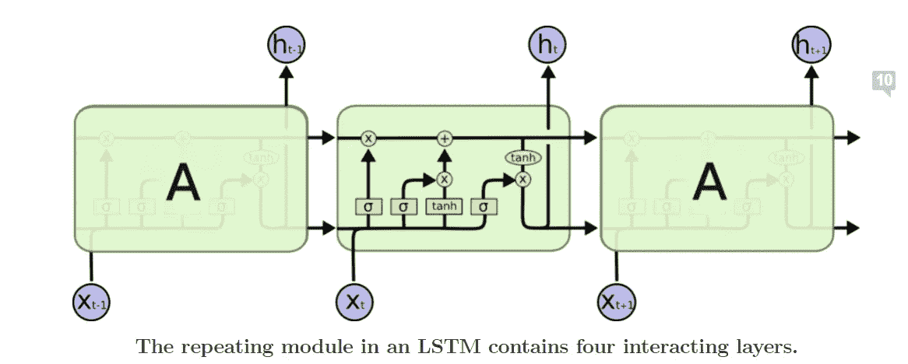
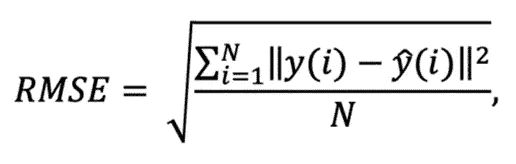

# 人工智能救援:需求预测

> 原文：<https://pub.towardsai.net/ai-at-rescue-demand-forecasting-a6a3cbbc63c4?source=collection_archive---------1----------------------->

需求预测是预测分析的一个领域，它根据历史数据和其他相关变量预测客户需求，以推动供应链决策过程。

机器学习模型可以帮助你预测准确的需求。有许多模型可供您使用，但是根据行业和手头的数据来定制模型是非常重要的。

这个博客是一个关于利用人工智能进行需求预测的端到端指南，包括准备数据、选择模型和测量它们的准确性。

图片由 Martech.org 拍摄

**准确需求预测的影响**

1.  最大限度减少产品浪费
2.  降低库存成本
3.  协助计划产品的生产
4.  通过在需要时准确提供产品来增强客户体验

**准备您的数据**

我们都知道“垃圾进，垃圾出”这个概念因此，不可避免地要准备好您的数据，以便它可以被 ML 或统计模型吸收。

以下是数据集中执行需求预测所需的一些主要属性:

1.  唯一 ID(客户/患者)
2.  产品名称
3.  售出的数量。

***注:*** *这个可以因行业而异。您必须确保数据集中的比例一致。示例:它可能是特定产品的 SKU*

4.时间戳

一旦你有了数据集，在你继续你的 ML 模型之前观察一些事情是至关重要的:

1.  趋势:观察趋势是为了判断需求是增加还是减少。假设你观察到一些无法解释的高点或低点。在这种情况下，在执行任何模型之前分析这些异常值是至关重要的，因为这可能会在数据集中产生不必要的偏差。
2.  季节性:季节性受一年中特定时间的影响。例如，零售公司在假日期间观察到销售高峰，这是周期性的，即每年的同一时间重复出现。这里需要注意的重要一点是，像 COVID 这样的一些事件影响了人们囤积的销售，但这只是其中之一，所以我们不能认为这是一种季节性模式。
3.  噪声:这是时间序列数据集中的常见现象。您可能会观察到一个特定的趋势，但同时，您可能会看到一些随机点(异常值),这是任何业务理由都无法解释的。

**机器学习模型**

构建任何人工智能驱动的解决方案的黄金法则是从普通模型开始，并分析它是否适合你的数据。本节将涵盖普通和高级 ML 算法:

1.  **ARIMA**

ARIMA 是一种预测时间序列数据的统计技术。它代表自回归综合移动平均线。如果任何机器学习模型根据过去的权重预测未来的值，那么它就是自回归的。让我们进一步细分一下:

1.  AR(自回归):表示使用以前的数据来预测下一个值
2.  I(积分):用前一个值减去给定值，使时间序列平稳
3.  MA(移动平均线):利用误差项本身来预测未来值

ARIMA 的参数如下，应根据您的数据明智选择:

1.p:模型中滞后观测值(先前数据)的数量

2.d:原始观测值有差异的次数

3.问:移动平均线的阶数

在 R 或 python 中，您可以使用 Auto-Arima 为上述超参数指定一个范围，它会选择最适合您的数据集的 AIC 和 BIC 值。

***优点***

1.  容易理解
2.  短期预测的理想选择

**局限性 **

1.  在长期预测中表现不佳
2.  它不能用于季节性时间序列

**2。霍尔特-温特法**

Holt Winter 的方法被称为三重指数平滑，因为时间序列行为的三个组成部分(如值(平均值)、趋势(斜率)和季节性)被表示为三种类型的指数平滑。该模型通过计算这三种影响的合力来输出预测。

该模型所需的参数是:

1.  (ɑ，β，γ)每个平滑一个
2.  一季的长度
3.  一季中的周期数

平滑跨季节应用，例如，进入该季节的第三点的季节分量将用来自上一季节的第三点、两个季节前的第三点的分量指数平滑，等等。在数学符号中，我们现在有四个等式(见脚注):

ℓx=α(yx−sx−L)+(1−α)(ℓx−1+bx−1)

bx=β(ℓx−ℓx−1)+(1−β)bx−1

sx=γ(yx−ℓx)+(1−γ)sx−L

y^x+m=ℓx+mbx+sx−L+1+(m−1)modL

霍尔特的温特方法是指数加权移动平均法(EWMA)的延伸。EWMA 不适用于具有线性趋势的时间序列。Holt-Winters 方法使用指数平滑对过去的值进行编码，然后用它们来预测未来的典型值。

***优点***

1.  由于考虑了季节性和趋势，对实际数据提供了准确的预测，这在正确的世界数据中是不可避免的

***局限性***

1.  当我们的时间框架数量很少时，该模型可能不是最佳拟合，例如数据点为 10 或 1 的时间框架可能实际差异为 9，但相对差异约为 1000%。

**3。脸书的先知**

prophet 是一个用 R 和 Python 编写的库，用来预测时间序列。捕捉 COVID 案例的上升和下降等变化点是非常重要的。您还可以灵活地控制这些变化点的力量。

这些参数包括:

1.  增长:选择“线性”还是“逻辑”趋势
2.  变更点:适应潜在变更点的日期列表(如果未指定，则自动)
3.  n_changepoints:如果没有提供变更点，请提供要自动包含的变更点的数量
4.  changepoint_prior_scale:用于改变自动变点选择的灵活性的参数

***优点***

1.  控制不确定性、趋势、变化点和假日效应的灵活性
2.  即使对数据科学/预测知之甚少或一无所知的人也易于理解和使用

**局限性 **

1.  低精度
2.  无法检测过去和未来数据之间的因果关系
3.  缺乏预测弱季节性数据的能力

**4。LSTM 的**

长期短期记忆 RNN 氏症以学习长期序列而闻名。它不依赖于预先指定的窗口滞后观测作为输入。由于消失梯度问题，rnn 遭受信息损失。尽管如此，LSTMs 不会受到这个问题的困扰，因为递归权重数组被身份函数所取代，并由一系列门(如输入、输出和遗忘门)来控制。

在准备该模型之前，需要进行几个数据准备步骤:

让数据集保持稳定:你可以通过简单的技术，比如差分，来做到这一点。

根据激活函数的比例变换数据

***优点***

更高的精度

图片由 colah.github.io 提供

**验证您的模型/测量精度**

根据行业和数据，您可以使用不同的计算方法来测量模型的准确性。一些标准措施如下:

**1。** **MAPE**

MAPE(平均绝对百分比误差)用百分比来衡量误差的大小。MAPE 不应用于低容量数据，因为它会呈现极值。

(1/n∑|实际-预测|/|实际|) *100

**2。**T22【RMSE】

均方根误差是评估预测质量最常用的方法之一。它显示了使用欧几里得距离测量实际值时，预测值与实际值之间的差距。这是 LSTM 预测的一个很好的衡量标准。

n 是数据点的数量，y(i)是第 I 次测量，y(̂(i)是其对应的预测。

n 是数据点的数量，y(i)是第 I 次测量，y(̂(i)是其相应的预测

快乐阅读！

**参考文献:**

[https://machine learning mastery . com/ARIMA-for-time-series-forecasting-with-python/](https://machinelearningmastery.com/arima-for-time-series-forecasting-with-python/)

[https://www . analyticsvidhya . com/blog/2021/07/ABC-of-time-series-forecasting/](https://www.analyticsvidhya.com/blog/2021/07/abc-of-time-series-forecasting/)

[https://www . rdocumentation . org/packages/forecast/versions/8.16/topics/auto . ARIMA](https://www.rdocumentation.org/packages/forecast/versions/8.16/topics/auto.arima)

[https://grisha . org/blog/2016/02/17/三重指数平滑-预测-第三部分/](https://grisha.org/blog/2016/02/17/triple-exponential-smoothing-forecasting-part-iii/)

[https://www . capital one . com/tech/machine-learning/understanding-ARIMA-models/](https://www.capitalone.com/tech/machine-learning/understanding-arima-models/)

[https://medium.com/swlh/facebook-prophet-426421f7e331](https://medium.com/swlh/facebook-prophet-426421f7e331)

[https://analyticsindiamag . com/why-are-people-bashing-Facebook-prophet/](https://analyticsindiamag.com/why-are-people-bashing-facebook-prophet/)

[https://machine learning mastery . com/time-series-forecasting-long-short-term-memory-network-python/](https://machinelearningmastery.com/time-series-forecasting-long-short-term-memory-network-python/)

 [## 我如何衡量预测的准确性？

### 衡量预测准确性对于基准测试和持续改进您的预测流程至关重要，但在哪些方面…

www.forecastpro.com](https://www.forecastpro.com/2020/08/24/how-do-i-measure-forecast-accuracy/) 

[https://www . analyticsvidhya . com/blog/2018/05/generate-accurate-forecasts-Facebook-prophet-python-r/](https://www.analyticsvidhya.com/blog/2018/05/generate-accurate-forecasts-facebook-prophet-python-r/)