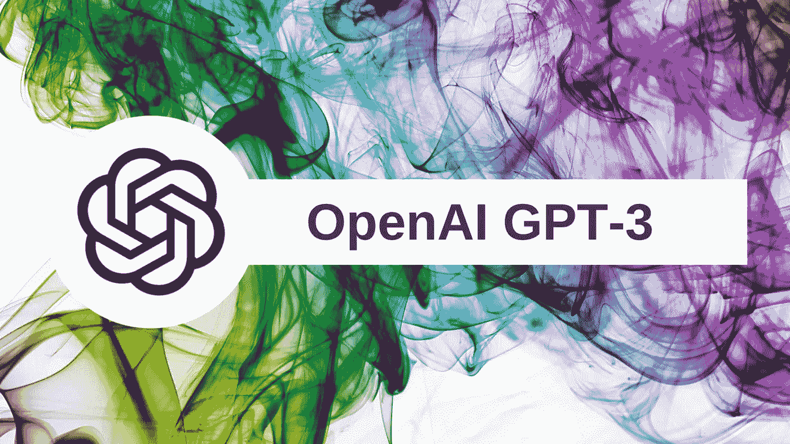
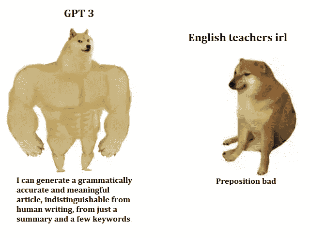
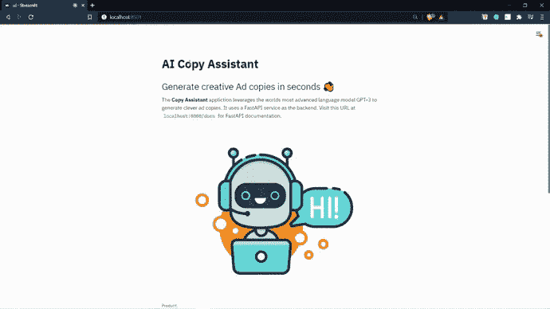
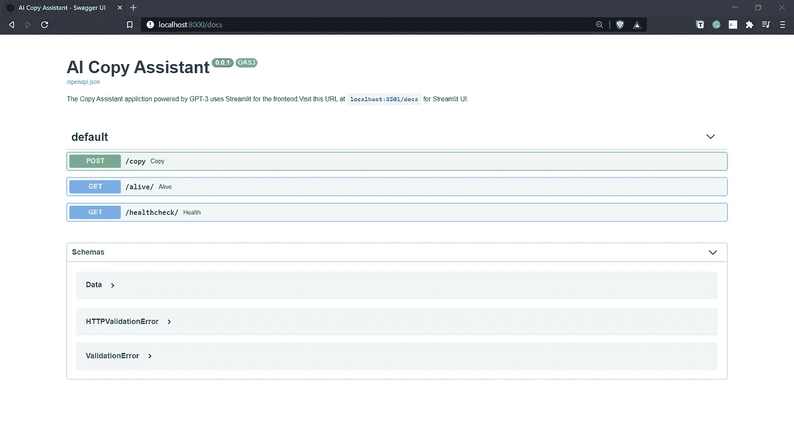

# 由 GPT-3 驱动的人工智能复印助手

> 原文：<https://pub.towardsai.net/ai-copy-assistant-powered-by-gpt-3-d5b175a025e1?source=collection_archive---------2----------------------->

## [自然语言处理](https://towardsai.net/p/category/nlp)，[意见](https://towardsai.net/p/category/opinion)

## 利用世界上最先进的语言模型，在几分钟内生成创意制作的专业营销文案。

好主意不需要很多其他人来实现——GPT-3 版的海军拉维康德

# 先决条件

我以文章的形式收集了这些点，请按照相同的顺序浏览下面的文章，将这些点连接起来，并了解 ***复制助手背后的关键技术栈——由 GPT-3*** 提供支持的应用程序:

1.  [FastAPI——超越烧瓶的美妙方式！](https://medium.com/towards-artificial-intelligence/fastapi-the-spiffy-way-beyond-flask-b00f4f883e1d)
2.  [Streamlit —革命性的数据应用创建](https://medium.com/towards-artificial-intelligence/streamlit-revolutionizing-data-app-creation-e269177d9112)
3.  [GPT 三号简介](https://medium.com/towards-artificial-intelligence/email-assistant-powered-by-gpt-3-ba39dfe999d3)

# GPT-3 v/s 人脑

GPT 3 号获得了科技界的大量关注，因为它能够执行令人信服的类似人类的自然语言任务。一些人甚至认为，GPT-3(由 OpenAI 开发)是迈向人工通用智能(AGI)的第一步，人工通用智能是理解或执行人类可以完成的任何任务的能力。除了机器可以拥有的所有能力之外，人类和人工智能之间最大的区别因素是独立思考的能力。基于神经科学领域令人屏息的报道，实验表明“*语言外观*和“思考能力”之间存在对比差异。

自然语言和思想不是一回事，但仍然紧密相连。许多人认为语言或表达是思想的最高层次。但是 GPT-3 向我们展示了语言可以随着一个活生生的灵魂的需要而明确地产生。在当今世界，生成类似人类的语言所需要的只是大量的数据。

GPT-3 站在巨人(*nanos gigantum humeris insidentes*)的肩膀上，因此今天它能够产生高度连贯和上下文相关的结果，拥有广泛的词汇，由于前所未有的庞大知识库，在响应中具有类似人类的触觉。

“人工智能的未来不仅仅是装满桶，它的目标是培养对技术的热情。”

# 应用程序演练

现在，我将一步一步地向您介绍人工智能复印助手应用程序:

在创建任何 GPT-3 应用程序时，首先要考虑的是培训提示的设计和内容。提示设计是启动 GPT-3 模型以给出有利的上下文响应的最重要的过程。

> 根据经验，设计训练提示的目的是从模型中获得零反应，如果这不可能，就用几个例子，而不是提供一个完整的语料库。训练提示设计的标准流程应该是这样的:**零镜头→少量镜头→基于语料库的启动。**

为了设计 copy assistant 应用程序的培训提示，我策略性地使用了以下数据点作为培训提示的组成部分:

*   **产品:**向文案助理介绍产品，或者简单说明我们需要生成广告文案的产品。
*   **受众:**关于特定产品的目标群体或受众的极简相关信息将有助于 GPT-3 提出适当的上下文响应。
*   **Promotions:** 该组件为用户提供了灵活性，可以包含相应产品的促销优惠(如果有),或者如果没有任何促销优惠，则简单地指定没有。这将有助于模型生成精确定向的广告副本。
*   **标题/标题:**它包括一个吸引人的标题/标题，由几个词组成，可以吸引观众对产品的兴趣。
*   **广告文案/描述:**它包括一两行关于产品的描述，这些描述吸收了上述所有数据点，以生成有创意且高效的广告文案。

Streamlit 支持的 UI(全部用 Python 编写)

FastAPI 的魔力→即时 API 文档

让我们来看一个实例，以真正理解 GPT-3 在制作广告文案方面的威力。在下面的例子中，我们将通过向人工智能复制助手提供最少的指令来生成几封电子邮件。

人工智能复印助手在发挥作用..！

# 结论

GPT-3 将重新定义我们目前看待创意艺术的方式，如撰写广告文案、电影剧本、歌词或绘画。它将冒险进入创意空间，在一定程度上，人工智能生成的艺术将与人类创造的艺术作品难以区分。GPT-3 是我们今天拥有的最接近人工通用智能的东西，在某种程度上，它是迈向 AGI(人工通用智能)的基础步骤。

## 参考

1.  [https://en.wikipedia.org/wiki/GPT-3](https://en.wikipedia.org/wiki/GPT-3)
2.  [https://openai.com/blog/openai-api](https://openai.com/blog/openai-api/)
3.  https://the conversation . com/GPT-3-new-ai-can-write-like-a-human-but-not-mistake-that-for-thinking 神经科学家-146082
4.  [https://lacker . io/ai/2020/07/06/giving-GPT-3-a-turing-test . html](https://lacker.io/ai/2020/07/06/giving-gpt-3-a-turing-test.html)

如果你想了解更多，或者想让我写更多关于这个主题的东西，请随时联系我们。

我的社交链接:[LinkedIn](https://www.linkedin.com/in/shubhamsaboo/)|[Twitter](https://twitter.com/Saboo_Shubham_)|[Github](https://github.com/Shubhamsaboo)

*如果你喜欢这篇文章或觉得它有帮助，请花一分钟按一下拍手按钮，它增加了这篇文章对其他媒体用户的可见性。*