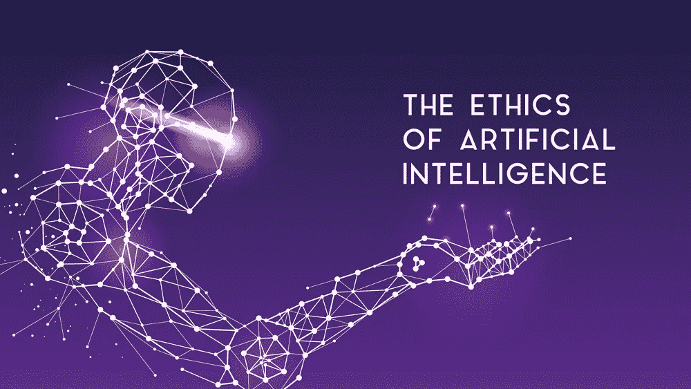
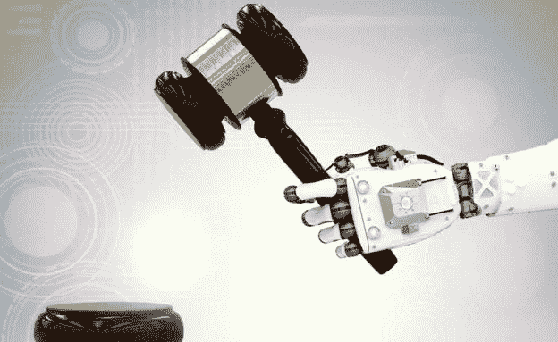
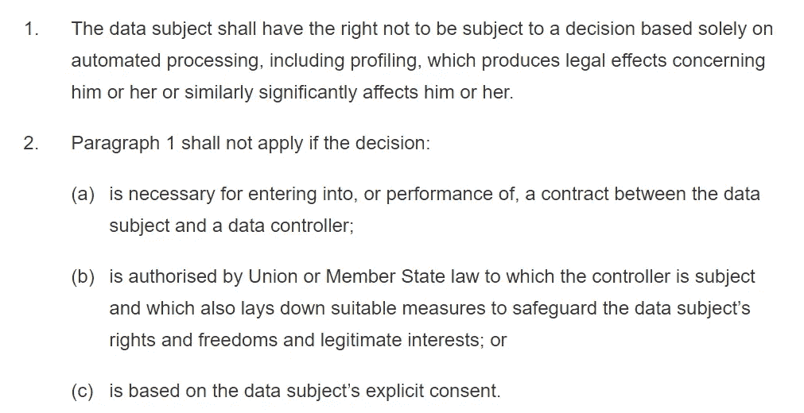
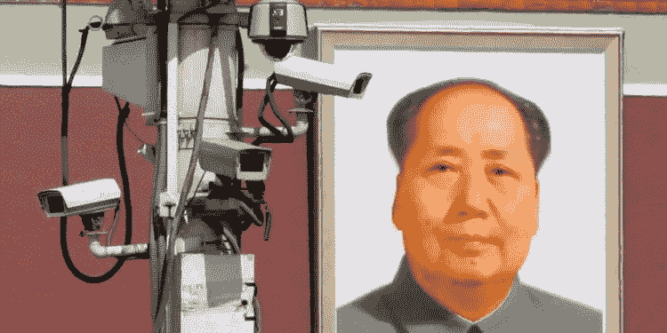

# 人工智能与伦理——我们将何去何从？

> 原文：<https://pub.towardsai.net/ai-ethics-where-do-we-go-from-here-46dde2b25344?source=collection_archive---------1----------------------->

## AI &伦理学，走向未来| [走向 AI](https://towardsai.net)

当我们谈论人工智能时，伦理的话题经常出现。“我们如何教会人工智能做出道德决策？”“谁来决定人工智能做什么是道德的？”还有一个大问题:“如果一个人工智能做了一些被认为不道德的事情，谁来负责？”

我们肯定不能让人工智能承担责任吧？它只是一台机器。是程序员吗？他们只是按照经理给他们的说明来创造一些东西。那么，经理呢？但他们只是在创造客户订购的产品。是客户吗？但是他们没有完全理解人工智能是如何做决定的。

所以…没有人？这似乎不太对。这是否意味着我们必须相信人工智能不会被不道德地使用？

在这一点上，什么算不道德？许多从事人工智能工作的公司都有自己的“道德准则”，向我们保证他们在做正确的事情，到目前为止，我们似乎都很好。但实际上，我们只是相信他们的话。

# 但是……难道没有相关的法律吗？

不，没有。

就目前情况而言，还没有法律来管理人工智能或其他类似的技术。你可能会想“为什么不呢？他们真的应该在这方面努力。”但是耐心点，他们正在努力！

法律需要几个月甚至几年的时间来制定，而技术几乎每天都在进步。所以你可以看到为什么立法者努力跟上。你如何制定一项法律来管理一个甚至还没有想出来的东西？

有一些法规，如 GDPR，来保护欧盟内部人员的数据权利。

好吧，我知道那一大堆法律术语有多无聊，但它很重要。第一段说的是，没有人可以让一台独立工作的计算机(例如人工智能)对他们做出决定。

看到最后一部分了吗？

*第 22 条第 2 款 c 部分*

上面说如果一个人同意了，我刚才说的保护就不适用。听起来很合理，对吧？但是想想你经常放弃这种同意。现在每个在线服务都有自己又长又复杂的服务条款，我们从来没有读过。在手机或电脑上使用任何应用程序或网站都被视为“明确同意”该应用程序或网站。要么你签字放弃你的权利，要么你根本不使用这项服务。

这就是为什么我们真的应该一直阅读服务条款。一旦你点击同意，你告诉公司你可以接受他们拿走第 22 条第 1 款赋予你的任何权利。

举个例子，你只需要看看最近几周风靡一时的潮流——face app。使用该应用程序，查看您同意的条款和条件中的这一小部分细则。

> 您授予 FaceApp 一项永久、不可撤销、非排他性、免版税、全球范围、全额支付、可转让的可再许可许可，以使用、复制、修改、改编、发布、翻译、创建衍生作品、分发、公开执行和显示您的用户内容以及以所有已知或以后开发的媒体格式和渠道提供的与您的用户内容相关的任何名称、用户名或肖像，而无需向您支付任何补偿

基本上，为了看你长大后可能的样子，你给了这个随机的俄罗斯公司你自己的脸的权利…永远。

这似乎是一个非常糟糕的情况，对很多人来说，的确如此。但对更多人来说，这只是常态。

# 对人工智能的另一种看法

在大多数西方国家，当涉及到公司和人工智能时，我们重视个人隐私和透明度，几乎高于一切。这反映在公司为自己制定的道德准则中。

在中国，情况就不同了。他们把集体利益看得和个人利益一样重要。在很大程度上，他们认为对大多数人来说最好的就是最好的。

因为这种方法，你看到了中国在人们日常生活中使用技术的方式的进步。他们不仅在街道监控系统中内置了面部识别，而且现在在一些城市，他们还启动并运行了步态分析，尽管这仍然是一项相对较新的技术(至少是一项相对较新的*工作*技术)。

中国很多商店现在让你用脸而不是卡付款，[甚至地铁也在试行](http://bit.ly/faceTrain)。方便吧？我可以想象在早上忘记你的脸比忘记你的钱包要困难得多。

# 那么…哪个更好呢？

我会用一个问题来回答这个问题(然后我会给*那个*问题一个模糊的、开放式的回答)。什么更好？

从个人隐私和控制个人数据的角度来看，“西方方式”可能更好，而中国和其他多个东方国家采取的方式更好，纯粹是为了技术本身的发展和进步。

这导致缺乏隐私。中国政府知道每个公民在哪里，他们在做什么，他们和谁在一起。对许多人来说，这样使用技术似乎与开放自由的民主不相容。

必须在个人隐私和这些技术带来的便利之间做出权衡。在大多数情况下，我们重视个人隐私。东方国家在同样的权衡中做出了不同的选择。

就我个人而言，我重视个人隐私。当然，那是因为我是伴随着西方的理想长大的。我真的不能说它更好，特别是当我看到能够将人工智能应用到日常生活中以使事情变得更简单的吸引力时，对于政府、公司和使用该技术的人们来说。

# 那我们该怎么办？

亲爱的读者，这是个好问题，谢谢你的提问。

问题是，我不知道。我们作为一个全球社区，*需要*决定(并尽快)需要制定哪些规则和法律，以确保有人负责，并划定界限，标志着什么是过分的。我们是要从西方还是东方的人工智能伦理观来制定法律？

我说过，我个人很重视我的隐私。但是，为了向前迈进，我相信我们需要接受这样一个事实，最终，我们需要融合我们的理想，共同努力，找到一种更好的方式来管理人工智能并向前迈进。随着科技的进步，世界变得越来越小，这两种根本不同的伦理学方法不可能共存。

唯一的出路就是在一起