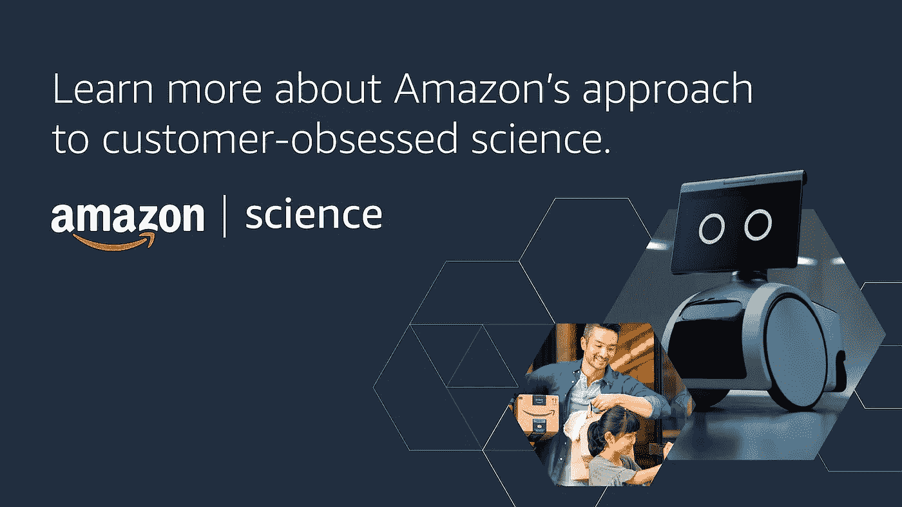

# 人工智能的事实和神话，一篇由 ML 研究者写的关于社会困境的文章，还有+！

> 原文：<https://pub.towardsai.net/ai-facts-and-myths-an-essay-by-ml-researchers-on-the-social-dilemma-and-ae888d4155ed?source=collection_archive---------3----------------------->

## [**迅**](https://towardsai.net/ai/newsletter)

## 人工智能(AI)时事通讯《走向人工智能#17》

***如果你阅读这封邮件有困难，请在*** [***网络浏览器***](http://news.towardsai.net/d21) ***上查看。***

每个人。我希望你一切都好。在这一期中，我们深入研究了一篇关于社会困境的 ML 研究论文，一些让你的人工智能假日购物更好的令人兴奋的交易，人工智能的误解和自然语言生成的挑战(NLG)，所有重要神经网络的更新图表，以及 ML 研究论文本月亮点。

感谢我们在**亚马逊科学**的朋友带给你这一期:

有兴趣在亚马逊工作吗？查看亚马逊科学网站，了解该公司对客户痴迷的科学的独特方法，以及它如何帮助吸引人工智能、机器学习和相关领域的一些最聪明的头脑。查找亚马逊科学家和学者的博客帖子和研究论文，包括他们将参加哪些会议，以及如何合作。 [**查看可用岗位**](https://www.amazon.science/careers?utm_source=email&utm_medium=newsletter&utm_campaign=towards_AI) 。

在我们开始之前，我想让你知道，我们已经决定在美国东部时间每个工作日晚上 8 点后发布**最新的机器学习研究**。根据你的观点，似乎你对人工智能、CV、NLP、T35 和其他方面的研究更加渴望。所以 [**敬请期待**](https://towardsai.net/subscribe)；我们会让你了解我们的最新决定，让你了解最新情况。

好吧，我们开始吧。

## ML 研究人员关于“社会困境”的文章

[**似曾相识多了？**](https://www.thesocialdilemma.com/) 卡耐基梅隆大学的研究人员在博客“ [**当监管成为创造:算法、微内容以及平台和创造者之间的消失的区别**](https://blog.ml.cmu.edu/2021/10/01/when-curation-becomes-creation-algorithms-microcontent-and-the-vanishing-distinction-between-platforms-and-creators/) ”上提出了实施平衡伦理、经济、个人权利和专有数据的正确政策和法规的挑战。这篇详尽的文章展示了在互联网上发布和传播的每一条内容之间的灰色地带，以及我们可以做些什么。

## 人工智能-假期交易

吼吼吼！我希望这些不会让你太厌烦。但是！如果你正在寻找一个新的人工智能装备，我们刚刚更新了我们对 [**深度学习笔记本电脑**](https://towardsai.net/p/news/best-laptops-for-machine-learning-deep-learning-data-science-ml-f55602197593) 或 [**人工智能工作站**](https://towardsai.net/p/news/best-workstations-for-deep-learning-data-science-and-machine-learning-ml-4a6e43213b9e) 的购物建议。所以请看看吧，一如既往，我们欢迎所有的反馈——如果您收到了反馈(并且启用了浏览器 cookies ),那么您就是在支持我们，我们真诚地感谢您的反馈。

## 人工智能的误解和 NLG 的挑战

人工智能的公共观点可能会被严重误导。这篇博客文章深入探讨了 [**人工智能的事实和神话**](https://snorkel.ai/artificial-intelligence-ai-facts-and-myths/) ，重点介绍了斯坦福大学研究员 Abigail See，其中展示了公众对人工智能的理解中一些真正令人兴奋的问题，以及 [**自然语言生成**](https://snorkel.ai/artificial-intelligence-ai-facts-and-myths/) 的挑战，以及生成模型的未来——越来越成为我们日常生活的一部分。

## 神经网络拓扑

我们刚刚更新了关于 [**类型的神经网络**](https://towardsai.net/p/machine-learning/main-types-of-neural-networks-and-its-applications-tutorial-734480d7ec8e) 及其应用的图表，从感知机一直到复杂的神经网络，如神经图灵机(NTM)，到生成对抗网络(GANs)，以及深度卷积逆图形网络。

## ML 研究论文每月亮点

德国应用科学大学的 Wolfgang Konen 和 Samineh Bagheri 发表了一篇名为“[**N 人游戏的最终适应强化学习**](https://arxiv.org/abs/2111.14375) 的酷论文，该论文集中了游戏的基于 N 元组的强化学习算法，特别是处理 TD-、SARSA-和 Q-学习的新算法。论文的所有可复制的开源代码都可以在 [**Github**](https://github.com/WolfgangKonen/GBG) 上获得。

无论如何，我非常感谢你的时间。如果你喜欢时事通讯？如果你还没有订阅**或者 [**与你的朋友和同事分享**](https://news.towardsai.net/d21)——这是真诚的感谢。**

**谢谢你加入我们！直到下一次，**

**[**罗伯托**](https://www.linkedin.com/in/robiriondo/) 和 [**车队冲向艾**](https://towardsai.net/about)**

> **对于以前的问题，请查看我们的 [**AI 简讯**](https://towardsai.net/p/category/newsletter) 存档。**

** [## 帮助将人工智能和技术初创公司扩展到企业|走向人工智能

### 《走向人工智能》每月通过我们的定制软件为数百万科技读者提供服务。我们拥有成千上万的人工智能和…

sponsors.towardsai.net](https://sponsors.towardsai.net/)  [## 店铺↓ |走向 AI

### 全球领先的人工智能&科技新闻&媒体公司

ws.towardsai.net](https://ws.towardsai.net/shop)  [## 加入我们吧↓ |面向人工智能成员|数据驱动的社区

### 向着 AI 加入。通过成为会员，你不仅将支持人工智能，但你将有机会…

members.towardsai.net](https://members.towardsai.net/) 

*关注我们的地方:*

*[***脸书***](https://www.facebook.com/towardsAl/)***】|***[***推特***](https://twitter.com/towards_ai?lang=en)***]|***[***insta gram***](https://www.instagram.com/towards_ai/)***]|***[***LinkedIn***](https://www.linkedin.com/company/towards-artificial-intelligence)***