# 人工智能代表一切

> 原文：<https://pub.towardsai.net/ai-for-everything-d05ff00cbe27?source=collection_archive---------3----------------------->

## [人工智能](https://towardsai.net/p/category/artificial-intelligence)

## 今年的 Ai4 会议—第一天

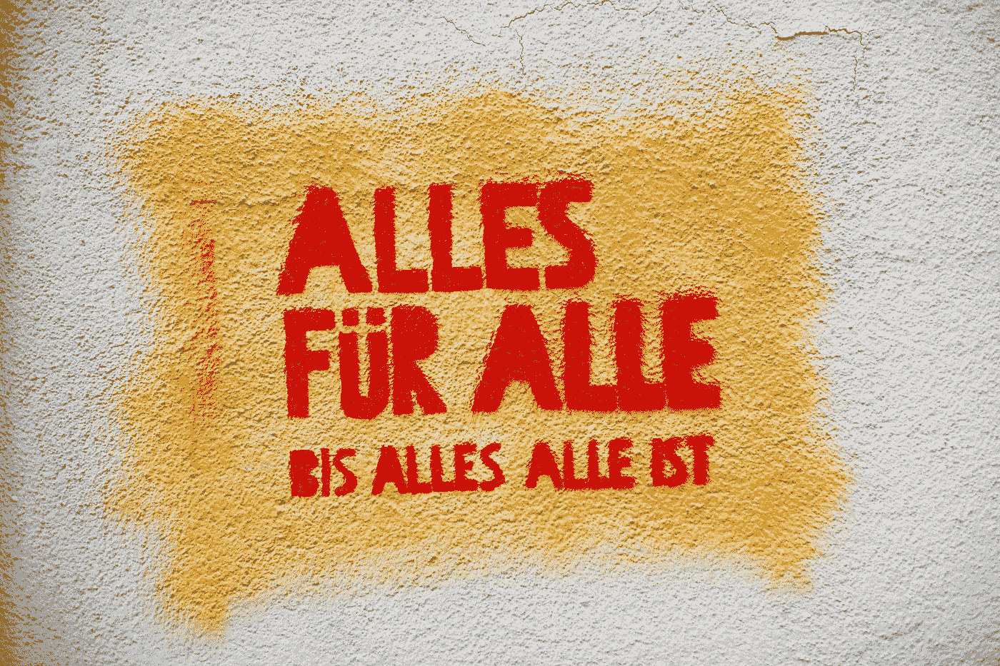

墙上的城市街头艺术涂鸦:“一切为了每个人，直到一切都消失了”，德语:“Alles für alle bis alles alle ist”(由[马库斯·斯皮斯克](https://unsplash.com/@markusspiske?utm_source=unsplash&utm_medium=referral&utm_content=creditCopyText)在 [Unsplash](https://unsplash.com/s/photos/ai-for-everything?utm_source=unsplash&utm_medium=referral&utm_content=creditCopyText) 上拍摄)

回到 11 月，我有机会参加并撰写了关于 Ai4 医疗保健会议的文章。今年的发布会有点不同。它将于 9 月 1 日和 2 日在拉斯维加斯举行，并将合并以前单独的会议— Ai4 医疗保健、Ai4 金融、Ai4 零售等。

与 2020 年的所有事情一样，今年它已经通过平台 [Dealroom Events](https://dealroomevents.com/) 转移到虚拟形式，这对我来说是一件新鲜事，非常简洁。Ai4 的一个关键理念是能够见面、建立关系网，并了解人工智能行业正在发生的事情。Dealroom 似乎是建立在允许对大型团体进行网络和流媒体对话的基础上的。

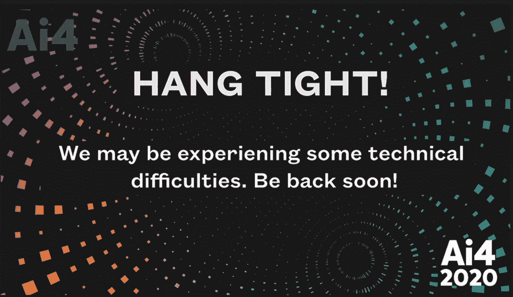

不幸的是，会议一开始就出现了系统故障，让许多与会者(包括我自己)困惑不解，不知道问题出在哪一边。就我个人而言，我忍不住笑着想象我们未来的自己使用“经典 2020”这样的短语来描述这些时刻。聊天中的许多评论确实取笑了技术会议上的技术问题——我最喜欢的建议是自动生成字幕，再多几个时代来准备模型，以及唇读模型。从好的方面来看，它确实引发了一场关于人工智能不同用例的非常棒的附带对话。

# 主题演讲

对于主题演讲，我在下面展示摘要。

## 压迫的算法:搜索引擎如何强化种族主义

Safiya Noble 讨论算法中的偏差。她是《压迫的算法》的作者。随着新的需求增加了对数字技术的投资，信息的前景正在迅速转变。然而，批判学者继续证明有多少技术是由不公正、脱离现实或缺乏定位的价值观塑造和注入的。技术掌握着种族、性别和阶级政治。

## 通过智能工作流在您的整个企业中实施人工智能——mad Hu Kochar

人工智能帮助您释放数据的价值，并让您能够设计具有预测性的智能工作流，从而让您做出更好的决策。借助预构建的 Watson 应用程序，加快了客户服务、财务规划、风险管理和 IT 运营等关键领域的价值实现速度。加入我们的主题演讲，了解如何将沃森融入您的工作流程，并了解已经将人工智能投入工作的客户。

## 经验医学的新时代:认知治疗技术的未来——亚当·加扎利

我们全球医疗保健系统的一个基本挑战是开发和分配有效的治疗方法，以提高患有各种精神和神经疾病的人的认知能力。Gazzaley 博士将描述使用定制设计的闭环视频游戏来实现健康个体的认知益处([Nature 2013](https://www.nature.com/articles/nature12486)；[自然人类行为 2019](https://www.nature.com/articles/s41562-019-0611-9?proof=trueIn) )和患者([柳叶刀 2020](https://www.thelancet.com/journals/landig/article/PIIS2589-7500(20)30017-0/fulltext) )。这种方法现在已经发展到产生第一个 FDA 批准的针对 ADHD 的数字治疗，以及第一个 FDA 批准的作为任何临床条件的医疗设备的视频游戏。他将与您分享他的研究计划的下一阶段，该计划将数字交付的互动体验与机器学习、虚拟现实、生理记录和非侵入性脑电刺激的创新相结合，以增强认知。

# 跟踪会谈

这次会议的特点是多轨道，每一个侧重于人工智能的一个特定的分区。我把时间花在医疗保健和 NLP 上，因为这是我的兴趣所在。会谈涵盖了从非常面向产品到非常技术性的所有内容。它们是按时间顺序排列的。

## 环境临床智能如何改变提供者-患者体验— Robert Budman

使用语音记录医患互动有助于减轻医生的文书工作负担和输入笔记的时间。环境自然语言理解将能够提高医疗办公室的准确性、操作效率和吞吐量。Nuance 的 DAX 旨在通过安全的移动应用程序提供这样的体验，并可用于许多视频聊天和远程医疗服务。

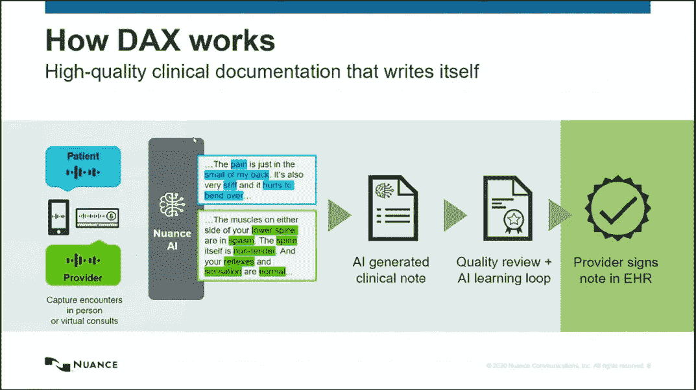

资料来源:Budman，2020 Ai4 会议

该系统还允许医生实时发送订单。一个例子是一个视频，医生能够以不中断医患互动的方式实时为模拟患者订购石膏和药物。这有助于为提供者和患者提供更好的体验。

## 在有噪声的数据上训练对话代理——刘小菲

这次演讲的重点是对话代理的数据收集和注释、对话设计以及社交机器人的模仿学习。社交机器人可以被认为是语音助手和自主设备的混合体。他们需要接近和接触人们，遵循模糊的社会规则——同时保持人类想要与之互动的个性。

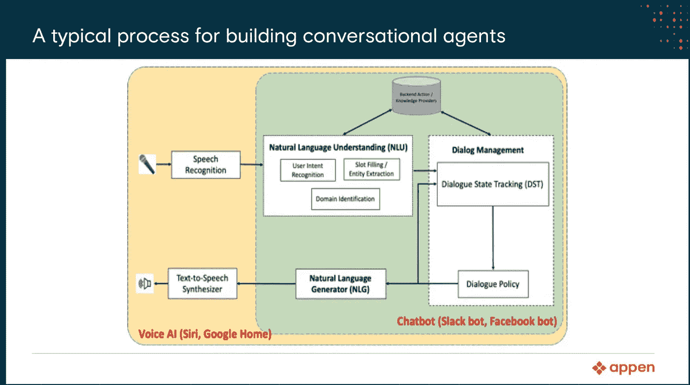

构建对话代理的典型过程。(来源:刘，2020 Ai4 大会)

自然，这给创建机器人带来了一些挑战，包括无法收集人类意图，难以模拟现实世界的对话流，以及数据收集噪音大且成本高。

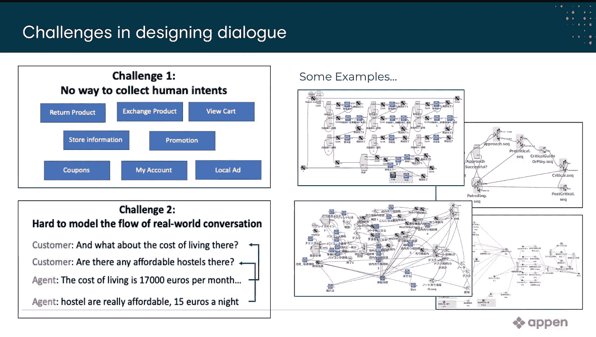

设计对话的挑战 1 和 2。刘，2020 Ai4 大会

噪声数据可能是数据集的很大一部分。幻灯片 3 中的示例包含 47%的噪声数据。数据通常包含填充词，例如，嗯，嗯/啊等。阿彭能够使用人工智能支持的系统和双层支付系统来提高标签数据的质量。

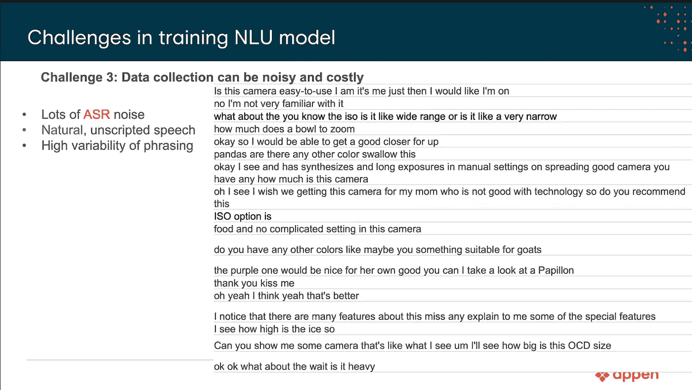

设计对话的挑战 3。(来源:刘，2020 Ai4 大会)

可以通过远程操作连续创建离线内容来规避其中的一些挑战，但是，这是昂贵的，并且创建了糟糕的用户体验。

可以通过原位的人与人的交互来进行改进，并训练机器人在没有注释的情况下学习这种真正的交互吗？是的，这是可以做到的，而且它做得很好，尽管在训练数据中存在一些挑战，例如，只有 53%的案例研究是无噪声或非常小的错误，并且人类提出的问题有自然的变化，例如，“分辨率是多少？”，“多少兆像素？”。

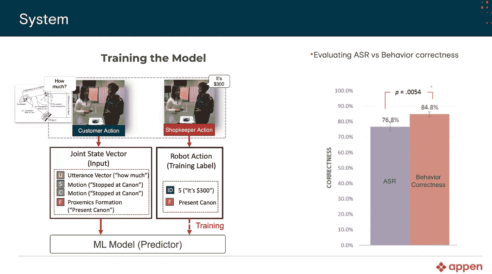

使用 ASR 和行为正确性的社交机器人的性能比较。(来源:刘，2020 Ai4 大会)

## 自然语言处理—医疗保健领域的挑战和机遇— Enrico Santus

如何从堆积如山的非结构化和无组织的数据中做出数据驱动的决策？机器学习的一个热门领域专注于自然语言处理——获取口语或书面语，并产生一些有用的信息。

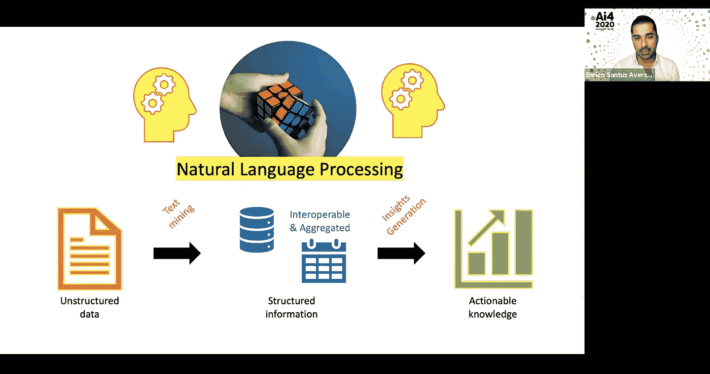

概述如何将数据从非结构化数据转化为可操作的知识。(来源:Enrico Santus，2020 Ai4 大会)

Santus 讨论了他的团队如何能够从研究中提取信息，并使数据更易于在回顾性研究中进行分析。他还描述了改善 CRT(心脏再同步治疗)患者选择的工作。CRT 研究能够确定 26%的患者没有从 CRT 操作中获得额外的益处。

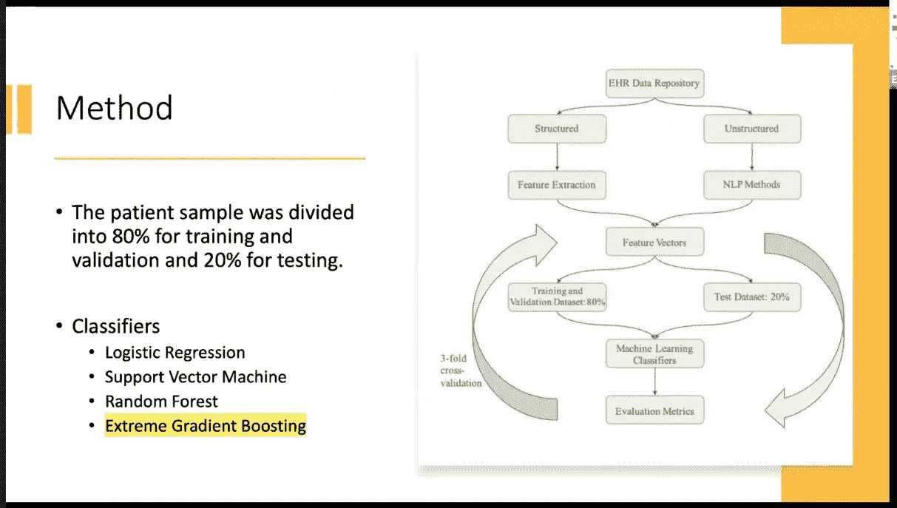

CRT 研究方法(资料来源:Enrico Santus，2020 Ai4 会议)

## 用于从非结构化病理学报告中自动提取癌症数据的深度学习— Ross Mitchell

癌症治疗中日常使用的许多信息都存储在非结构化的病理报告中:

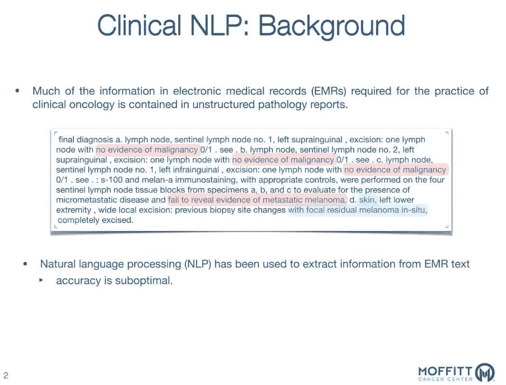

注释临床数据的例子。(来源:米切尔，2020 Ai4 大会)

BERT ( [来自 Transformers](https://arxiv.org/abs/1810.04805) 的双向编码器表示)已经能够帮助提高解析这种类型数据的能力。Mitchell 的目标是使用 BERT 提取肿瘤部位和组织学，因为这是许多下游任务的关键信息。这需要克服三个主要问题:适应伯特提取准确的网站和组织描述，处理不同的术语，和 ICD-O3 代码。[注意:在接下来的演示中，我遇到了一些间歇性的技术故障，细节可能会有些偏差，但总体情况是准确的。]

为了克服第一个障碍并教会 BERT 语言，谷歌的 BERT 接受了 PubMed Abstracts 的训练，以产生 BioBERT。使用斯坦福大学的问答数据集、BioASQ 问答和莫菲特 CTR 数据进行了额外的调整。

处理不同的术语是一项挑战。例如，代码 8070/3 倾向于“鳞状细胞癌，NOS ”,但在现实世界中有 161 个短语被使用。SEER 编码材料和 Moffett CTR 短语库用于处理重言式。ICD-O3 码+首选项和备选项用于训练 DistilBERT，该 distil Bert 然后可以以容错方式翻译成 ICD-O3 码。

病理学报告测试集的结果:

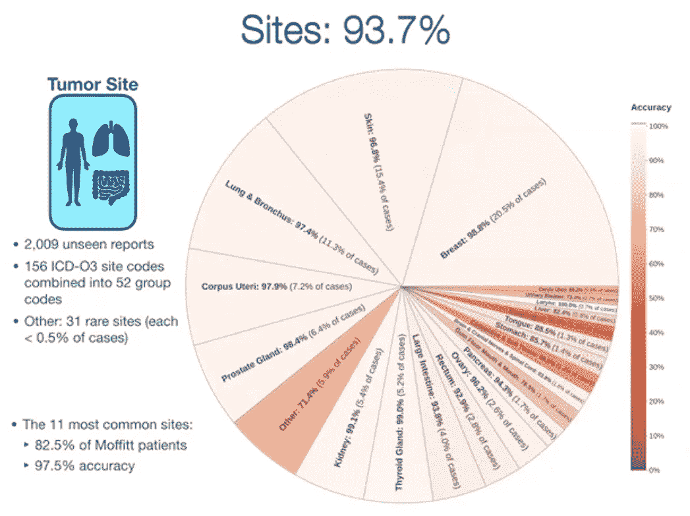

米切尔，2020 Ai4 大会

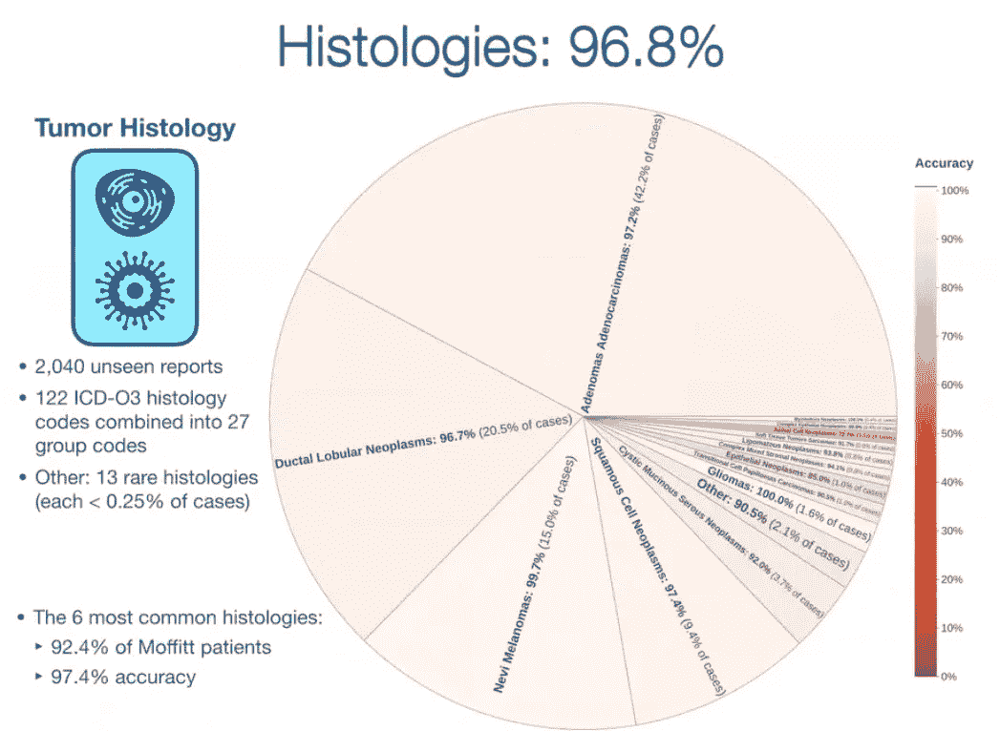

米切尔，2020 Ai4 大会

这个特别的演讲有一份准备中的手稿。

# 会议

与面对面会议的一个很大区别是如何建立联系。这次是使用 DealRoom 的平台(见下文)来安排会议。

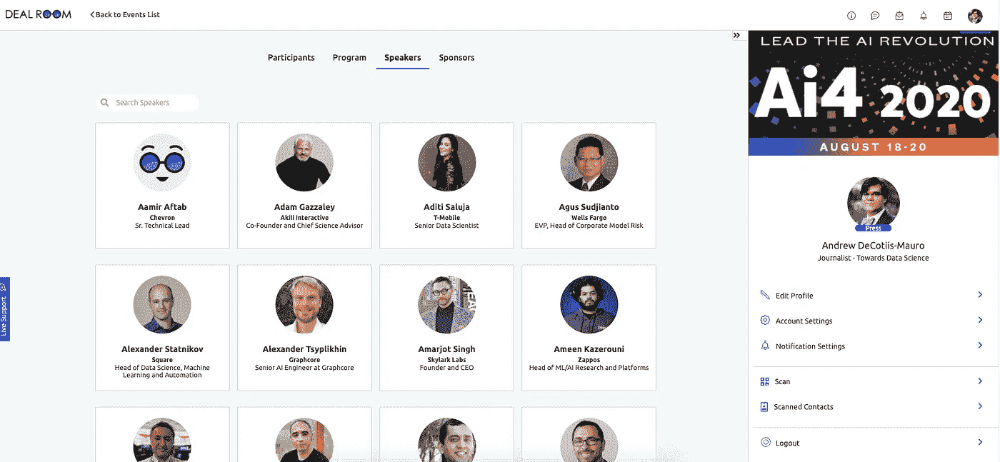

当面，我能够停下来问“什么风把你吹来了？”几乎每个我路过的人。很自然，这在虚拟世界中要困难得多，人们有动力花时间去做其他事情。然而，DealRoom 平台为网络会话提供了一个私人聊天室，这使得在 20 分钟内进行更深入的对话变得更加容易，因为所有的干扰都消失了。

# 结论

总的来说，由于新冠肺炎的影响，今年的会议与往年有所不同。网络仍然存在，并且很容易利用。第一天的主题演讲有点小问题，但是赛道演讲质量很高，长度刚好 20 分钟。