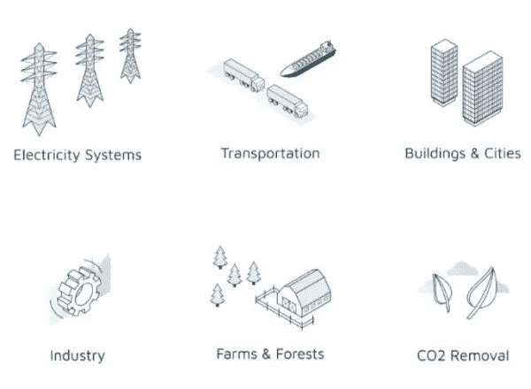
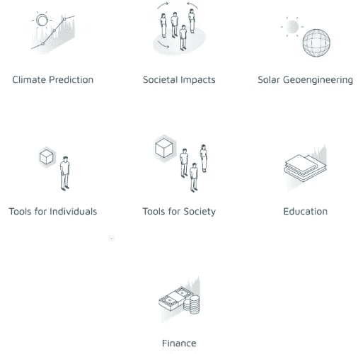
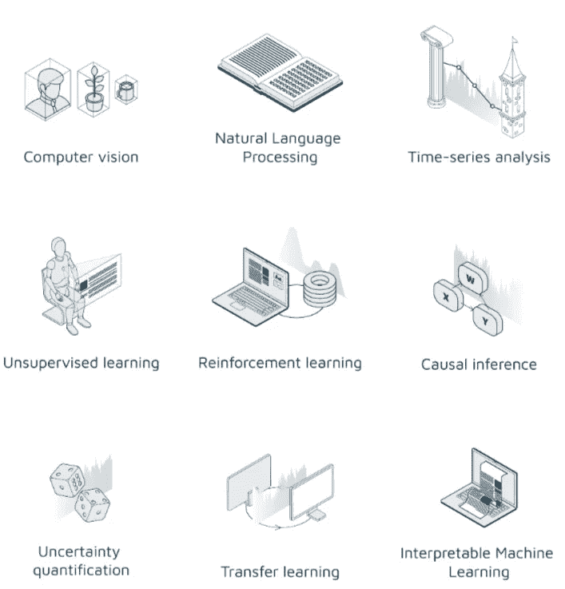

# 人工智能的好处:用数据科学解决气候变化的探索性方法

> 原文：<https://pub.towardsai.net/ai-for-good-an-exploratory-approach-to-tackling-climate-change-with-data-science-18bf0bd6c4ae?source=collection_archive---------1----------------------->

# 技术和气候变化

技术已经成为给人类带来空前繁荣的工具。它让我们能够以不断提高的效率提取资源、转化和运输资源。它带来了当代的全球经济，在这个过程中转变了 75%的土地。然而，这种繁荣在一定程度上是以我们的星球及其生态系统为代价的，这现在对我们和地球上所有其他物种构成了生存威胁。

事实上，尽管一些著名的公众人物可能会声称，但最近有消息显示，[科学界事实上低估了气候变化的发展及其影响](https://blogs.scientificamerican.com/observations/scientists-have-been-underestimating-the-pace-of-climate-change/)。我们可能会以比预期更快的速度达到被广泛引用的全球气温上升 2 摄氏度的数字，到那时，生态系统中的反馈循环可能会使任何缓解努力徒劳无功。随着我们的星球变暖，我们已经尝到了未来几十年可能会发生什么的滋味——干旱、火灾、洪水、风暴、[都在变得更加严重。随着越来越多的人从受影响最严重的地区迁移到与气候相关的地方，以及第六次动植物大灭绝，现在被称为人类世灭绝，因为其根源是人类活动。](https://climate.nasa.gov/effects/)

国际社会，一个由相关政府行为者、学术界、非政府组织、社会企业和活动家组成的网络，正在通过减缓和适应努力应对气候变化。**减排**需要通过电力系统、工业、农业、林业和城市的创新来减少温室气体排放。**适应**认识到无论我们采取何种缓解措施，气候变化都是不可避免的，并采用各种解决方案来更好地预测新出现的风险，以规划复原力和灾害管理。

正在应用技术来协助这些努力。**机器学习(ML)** 和**人工智能(AI)** 处于技术创新的前沿，尚未得到充分利用。这一领域的发展速度是指数级的，甚至从业者也无法预测未来几十年将会发生什么。事实上，一些在 5 年或 10 年前被认为几乎无法克服的问题现在已经得到解决。毫无疑问，人工智能和人工智能是强大的工具，可以用来对抗我们星球面临的最大威胁。

然而， **ML** 加强这些努力的未开发潜力需要沟通。一方面，我们有一个热切的 ML 从业者社区，另一方面，我们有众多的利益相关者对抗气候变化。虽然 ML 从业者可能会发现很难找到他们的解决方案最有影响力的领域，但气候变化社区的利益相关者可能缺乏资源来确定可能最有助于推进其各自事业的 ML 解决方案。

# 用机器学习应对气候变化及其挑战

最近，来自学术界、非政府组织和私营部门的 22 名学者和从业者合作发表了一篇论文《用机器学习应对气候变化》，试图解决这个问题。它提出了一个全面概述的应用，以应对气候变化的各个领域的 ML。这项工作对于 ML 从业者和利益相关者来说都是一个宝贵的资源，并且可以作为一种可能的灵感。

作者将论文分为 13 章，每一章都涉及气候变化解决方案的不同领域:

然后，针对每个领域讨论 ML 的相关领域，包括:

虽然这些列表可能并不详尽，但它们为 IT 行业和气候变化利益相关者提供了一个起点。深入研究这篇论文有助于进一步理解气候变化努力中的挑战和不同的 ML 解决方案。该论文具有直观的吸引力，因为作者进一步分类了每个特定领域受益于 ML 解决方案的可能性。

然而，尽管潜力变得清晰，但也不是没有警告。作者提请注意这样一个问题，即杰文斯悖论。当效率的提高产生了对服务的更大需求，从而抵消甚至恶化了预期的积极成果时，就出现了杰文斯悖论。例如，ML 可以在精确农业中找到应用。然而，这种精确度的提高，虽然有望降低任何特定农业企业的 GHG 影响，但事实上可能会导致更大程度上整体采用集约农业，而支持不太集约的可持续农业模式。

类似的问题也困扰着新技术在可持续发展方面的应用。最近的历史充满了这样的例子，解决方案被应用到没有整体方法的问题上，这种方法可以让我们预见到不希望的结果。例如，生物燃料生产在十年前开始流行，当时西方国家强制要求在生物燃料中使用植物油。快进到今天，对生物燃料的推动导致了印度尼西亚大规模的森林砍伐，雨林被改造成了棕榈油农场。也许一个不那么以技术为中心的方法可以在一开始就防止这些问题。

# 我们的方法

因此，在 Appsilon Data Science，我们提倡使用一种**探索性方法**来利用 ML 解决气候变化问题。科技公司可以通过展示技术为应对气候变化的利益相关者提供灵感，但问题应该由该领域的从业者以合作的方式来定义。技术社区应该欢迎来自政府、非政府组织和其他行为者的询问，而不是为 ML 解决方案寻找令人兴奋的应用。为此，Appsilon 发起了一个[**AI for Good**](https://appsilon.com/ai-for-good/)**倡议，我很荣幸能成为它的领导者。**

**感谢阅读。你可以在推特上找到我**