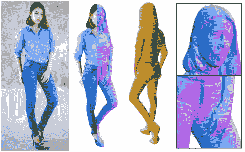
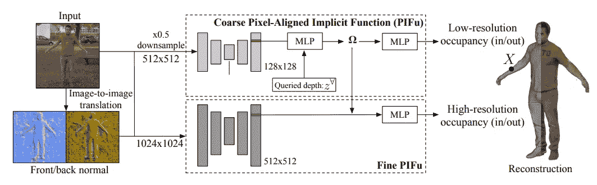
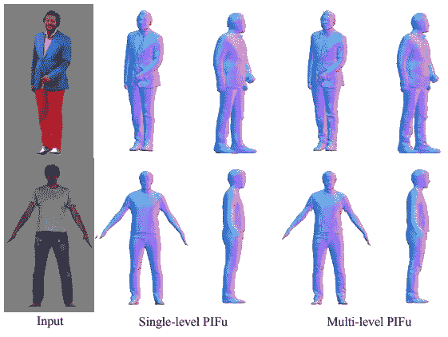
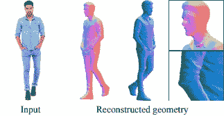
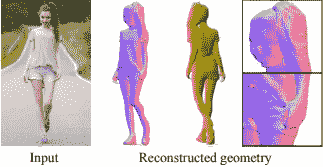
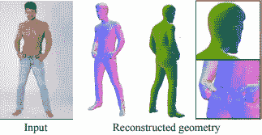
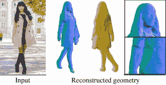
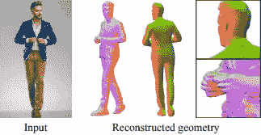
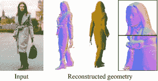

# 人工智能从 2D 图像中生成人的 3D 高分辨率重建

> 原文：<https://pub.towardsai.net/ai-generates-3d-high-resolution-reconstructions-of-people-from-2d-images-introduction-to-pifuhd-d4aa515a482a?source=collection_archive---------1----------------------->

## [计算机视觉](https://towardsai.net/p/category/computer-vision)

## 这个人工智能从 2D 图像中生成人的 3D 高分辨率重建！它只需要一张你的照片就能生成一个看起来和你一模一样的 3D 头像，甚至从背后看也是如此！

这篇新论文最酷的一点是，他们在 google colab 上做了一个演示，你可以很容易地在自己身上尝试，正如我将在本文中展示的那样！但首先，让我们看看他们是如何做到的。

脸书和南加州大学的研究人员最近发表了一篇名为“PIFuHD:高分辨率 3D 人体数字化的多级像素对齐隐函数”的新论文。简而言之，它使用某人的 2D 图像来重建同一个人的 3D 高分辨率版本。主要目标是实现穿着衣服的人的高保真三维重建，包括手指、面部特征和衣服褶皱等详细信息，正如我们在这张图片中看到的。因为当前的方法不使用完整的高分辨率图像，所以它们由于存储器要求而缩小图像，并且丢失了重要的信息来创建 3D 的这种高分辨率细节。

皮福德通过将问题公式化为两个步骤来实现这一点。首先，该模型在较低分辨率、缩小的整张图像上进行训练，以专注于整体推理。这样，它可以覆盖图片的更大的空间背景。然后，使用该上下文信息，该模型通过在较高分辨率上观察图像和该第一输出来估计该人的详细几何形状。粗略级别通过对图像进行下采样并将其馈送到皮夫模型中来捕获全局 3D 结构，而高分辨率细节则通过在类似的轻量级皮夫网络中使用那些第一 3D 输出作为高分辨率输入来添加。因为精细级别将来自第一级别的特征作为 3d 嵌入，所以它不需要以更高的分辨率看到整个图像，从而允许在没有背景的情况下馈送这个人的高分辨率图像的可能性。具有较低分辨率的背景信息和较高分辨率的模型解决了先前方法遇到的计算时间问题。

正如您在此图中所看到的，需要多级皮夫来获得高分辨率的 3D 模型，而单级皮夫可以在需要时更快地创建精确的模型。这种新方法是精确的，使用这种双向模型使得今天的内存限制成为可能。以下是使用这种技术得到的一些更令人印象深刻的结果…

你甚至可以在自己身上试试！他们做了一个公开演示，你可以简单地上传你的图片，并在 google colab 上看到结果，而不需要任何 GPU！只需要一分钟左右。如果你还怀疑的话，就自己试试看。下面是该演示的链接。令人难以置信的是，除了这张二维图像，他们没有任何其他知识就能做到这一点。当然，这只是这篇新论文的一个简单概述。我强烈建议阅读这篇文章，并尝试演示和/或代码，更多信息请访问下面的链接。

**论文**:[https://arxiv.org/pdf/2004.00452.pdf](https://arxiv.org/pdf/2004.00452.pdf)
演示:[https://colab . research . Google . com/drive/11z 58 bl 3 meszo 6 kfqkahma 35g 5 JM H2 wgt](https://colab.research.google.com/drive/11z58bl3meSzo6kFqkahMa35G5jmh2Wgt)
**GitHub 代码**:[https://github.com/facebookresearch/pifuhd](https://github.com/facebookresearch/pifuhd)