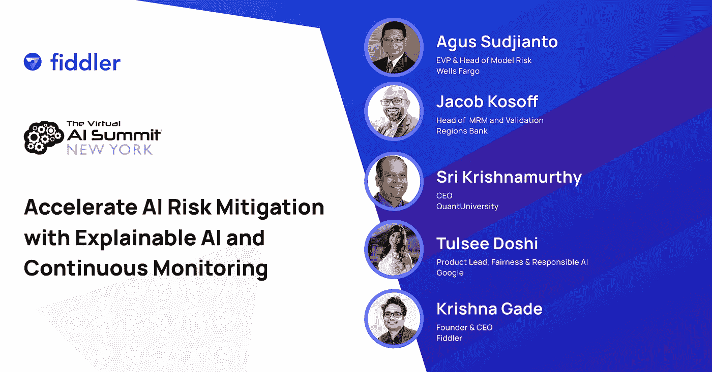

# 金融领域的人工智能:通过 XAI 和持续监控加速人工智能风险缓释

> 原文：<https://pub.towardsai.net/ai-in-finance-panel-accelerating-ai-risk-mitigation-with-xai-and-continuous-monitoring-de3796eb45a1?source=collection_archive---------2----------------------->

## [人工智能](https://towardsai.net/p/category/artificial-intelligence)

在 2020 年 12 月在纽约举行的人工智能金融峰会上，Fiddler AI 与一群来自金融服务和科技行业的模型风险专家就负责任的人工智能的状态进行了小组讨论。下面是讨论的摘要。你可以在这里观看完整的小组讨论[。](https://www.youtube.com/watch?v=1vq3DhE3A6U&t=1s)

专题小组:通过 XAI 和持续监控加速人工智能风险缓解

# 金融中的 AI 是如何改变模型风险管理的传统做法的？

模型风险管理(MRM)是银行业的一项成熟实践，但由于人工智能的进步，它也在快速发展和变化。“我们用模型经营银行，”Agus Sudjianto(富国银行执行副总裁兼模型风险主管)说，这一说法得到了 Jacob Kosoff(地区银行 MRM & Validation 主管)的呼应，他补充说，他的团队中 30%的模型现在是机器学习模型，而不是传统的统计方法。来自硅谷的创新，如 TensorFlow、PyTorch 和其他主要用于深度学习的框架，已经进入华尔街，加速了人工智能在金融业的应用。

MRM 的目标，也称为模型安全，是为了避免当模型不可避免地出错时可能造成的财务和声誉损害。机器学习模型带来了新的挑战:它们本来就非常复杂，即使在模型部署之前发现了问题，底层数据的变化也可以完全改变模型的行为。

MRM 团队必须对这些新要求做出响应，并成为如何在金融领域构建值得信赖的人工智能系统的思想领袖。在银行，“不仅仅是提高传统上使用统计模型的定量分析师的技能，”Sri Krishnamurthy(quant university 首席执行官)说。“他们必须考虑从开发到生产的整个工作流程，并建立不同的框架。”硅谷也从整体的角度来处理这些问题。Tulsee Doshi(谷歌产品负责人，公平和负责任的人工智能)解释说，负责任的人工智能原则涵盖了从科学卓越到公平、隐私和安全的所有内容，已被纳入谷歌的发布审查流程，并越来越多地需要应用于产品开发的每个阶段。

# 今天，在金融领域实施负责任的人工智能有哪些策略？

小组成员分享了他们用来在模型开发过程中建立检查和平衡的一些方法。在谷歌，Doshi 说，环境就是一切:“一个模型如何部署在一个特定的产品中，这些用户是谁，他们如何使用这个模型是风险管理过程中非常重要的一部分。”例如，Doshi 解释说，像文本到语音这样的 ML 技术可以有一些积极的应用，特别是在可访问性方面，但也有潜在的实际危害。我们没有开源一个可以广泛用于任何用例的文本到语音转换模型，“我们希望意识到上下文在哪里有意义，并对这些用例进行优先排序。”然后，团队将设计适合这些用例的指标。

银行面临着高风险和严格的监管准则，建立正确的护栏至关重要。“过去，数据科学家的重点是模型性能和 AutoML……对我们来说，专注于这一点非常危险，”Sudjianto 说。在富国银行，“每 3 个模型开发人员，我们就有 1 个独立的模型评估人员”向组织链的不同部分汇报，以避免利益冲突。在阐明模型的用途、可能出错的地方以及风险偏好之后，团队将评估错误预测的所有潜在根本原因，从数据到建模框架，再到训练。“这就是可解释性如此重要的原因，”Sudjianto 说。

要在金融机构负责任地实施人工智能，拥有正确的文化是必不可少的。科索夫说，MRM 团队需要“愿意挑战权威，愿意挑战高管，愿意说‘你的模型是错误的’”。自上而下，公司的每个人都必须明白“这不是合规性练习，也不是监管练习”，实际上，MRM 是保护价值的关键。

正如 Krishnamurthy 解释的那样，有时文化变革也意味着认识到“这不全是关于技术的。”对于刚刚开始脱离更传统的统计模型的机构来说，专注于拥有最新、最复杂的深度学习系统工具可能是危险的:“你将学习如何使用工具，但你不会有概念基础。”相反，团队可能需要后退一步，清楚地定义他们模型的目标，并确定他们是否拥有安全使用黑盒 ML 系统所需的知识。

# 团队如何对抗算法偏差？

银行习惯于与偏见作斗争，以建立公平的贷款实践——但随着金融机构全面实施更多人工智能系统，它们正面临新的算法偏见。这些场景让我们的小组成员夜不能寐，担心一个模特的错误会引起新闻媒体和政府机构的关注。

例如，正如 Sudjianto 所指出的，有些营销模式看起来很无辜，但实际上触及了受到严格监管的隐私和歧视问题；NLP 也是一个主要的地雷(“语言本质上具有很强的歧视性”)。Kosoff 和 Krishnamurthy 给出了更多潜在偏见的例子，如欺诈检测更有可能标记特定邮政编码的交易，或少数族裔客户获得不同的自动化呼叫中心体验。

为了克服偏见，团队需要在发布之前考虑广泛的因素，例如模型的用例、限制、数据、性能和公平性度量。谷歌使用“模型卡”来捕捉所有这些信息。“它迫使你记录并报告你正在做的事情，这有助于任何下游团队选择该模型并在外部或内部使用它，”Doshi 说。但是，即使是发布前的最佳实践也不能防止生产环境中一些不可预见的变化的风险。“我们不知道我们会看到哪些我们没有想到或没有衡量标准的错误，”Doshi 说。

这就是持续监控的用武之地。Kosoff 分享了一个例子，说明在新冠肺炎危机期间，监督是如何至关重要的。“对于借记卡或信用卡交易中的欺诈，最具预测性的变量是卡存在或卡不存在”-但在 2020 年 2 月和 3 月期间，随着客户转向在线进行大部分或全部购物，ML 系统突然检测到大量欺诈。

# 在 3-5 年内，我们可以期待什么样的变化？

在接下来的 3-5 年里，我们无疑会看到越来越复杂的建模技术的爆炸——这反过来会给监控和验证带来更大的压力。那么在不久的将来，我们可以期待负责任的人工智能空间会有什么样的变化呢？

Doshi 指出，随着来自欧盟的白皮书和来自美国、新加坡和其他政府的运动，“我们将看到越来越多的监管出现，围绕可解释性和可解释性实际建立适当的流程。”计算机科学教育也很可能发生转变，这样学生毕业时将接受模型风险管理和可解释性的培训。

科索夫可以想象未来会有一种“驾照”,证明某人对风险有足够的了解，可以建立模型。作为这一方向的一个步骤，Regions Bank 正在探索让所有新模型开发人员在前 6 个月加入模型风险团队的想法。在加入他们的永久团队后，“他们将接受更多的培训，更有资格，他们将了解银行的更多方面，他们将对公平以及我们在模型风险和模型评估中谈到的一切有深刻的理解。”

Krishnamurthy 指出，目前很少有模型真正走出了探索阶段，但在未来几年，“生产故事将开始得到巩固。”Krishnamurthy 还认为，“一些噪音将会平息”:最初将深度学习模型扔向一切的方法将被对局限性更清醒的理解所取代。最后，延续始于 2020 年家庭订单的趋势，面向 ML 的云工具将变得更加突出。

在 Sudjianto 看来，测试仍然是最大的差距之一:“人们谈论反事实测试、健壮性测试——它仍然在学术界……在现实世界中，它是不可扩展的。”机构需要培训个人成为相当于 ML 的可靠性和安全性工程师，他们还需要工具来快速、大规模地运作，并提前发现故障。正如 Sudjianto 所说，“监测不能再是被动的了。”

**小组成员**:

Agus Sudjianto，富国银行执行副总裁兼模型风险主管

Jacob Kosoff，区域银行 MRM &验证主管

Sri Krishnamurthy，量子大学首席执行官

Tulsee Doshi，产品负责人，公平和负责任的人工智能

Fiddler 创始人兼首席执行官 Krishna Gade

附注:我们建造了[提琴手](http://fiddler.ai)来填补这些工具上的空白，并帮助团队建立对人工智能的信任。团队可以轻松地将他们的模型和数据集导入 Fiddler，并对他们的模型进行持续的监控和解释，为生产中的 ML 创建一个记录系统。随着负责任的人工智能领域的不断发展，我们很高兴在这个话题上分享更多。如果你有兴趣看看 Fiddler 能做什么，你可以在这里注册一个免费的演示。

*原载于 2021 年 2 月 26 日*[*https://blog . fiddler . ai*](https://blog.fiddler.ai/2021/02/ai-in-finance-panel-accelerating-ai-risk-mitigation-with-xai-and-continuous-monitoring/)*。*