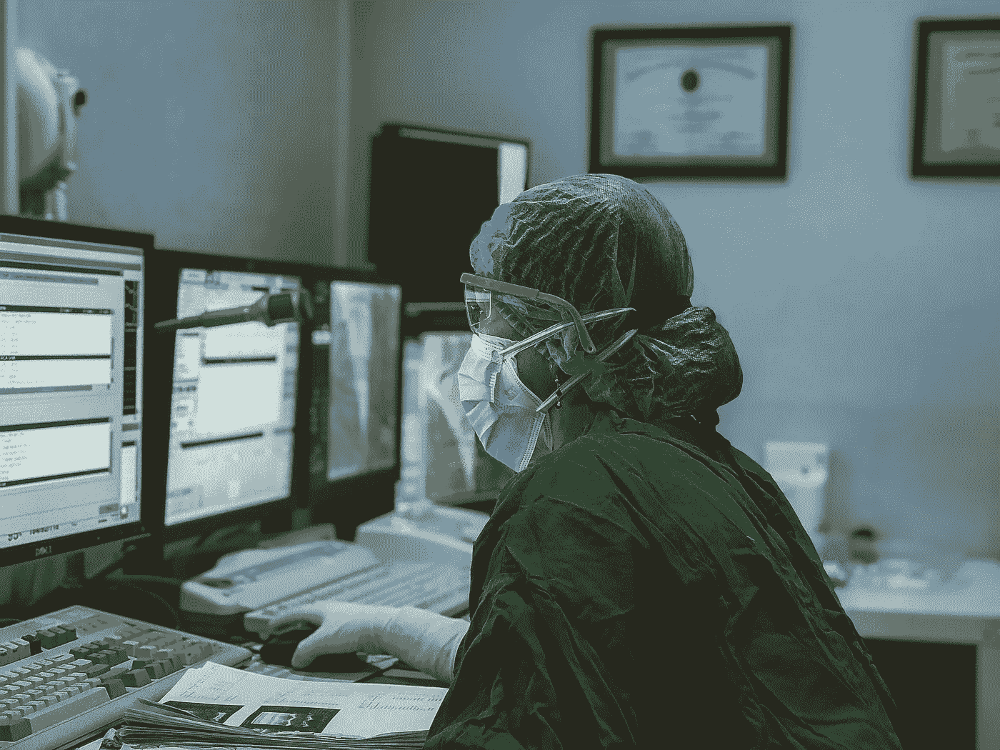
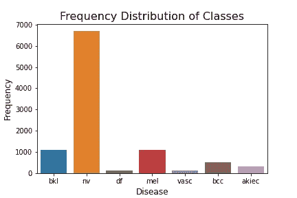
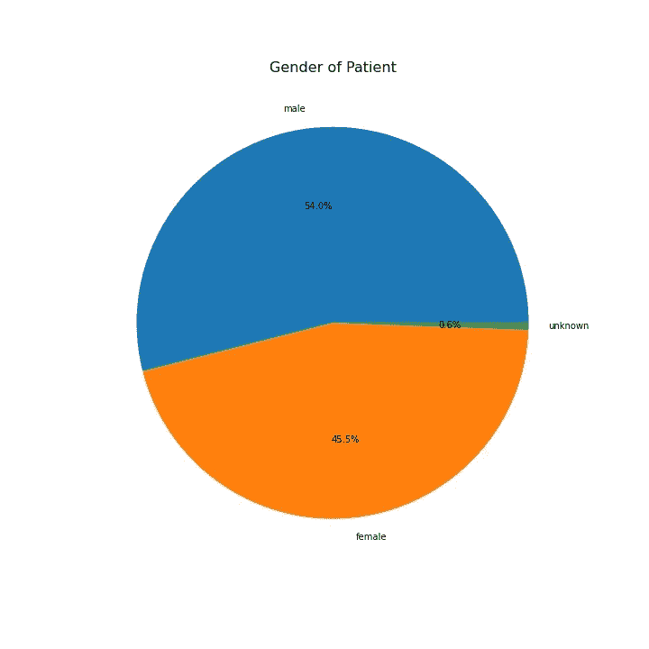
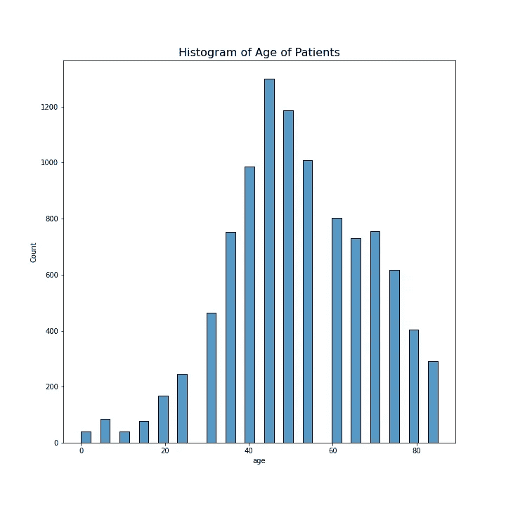
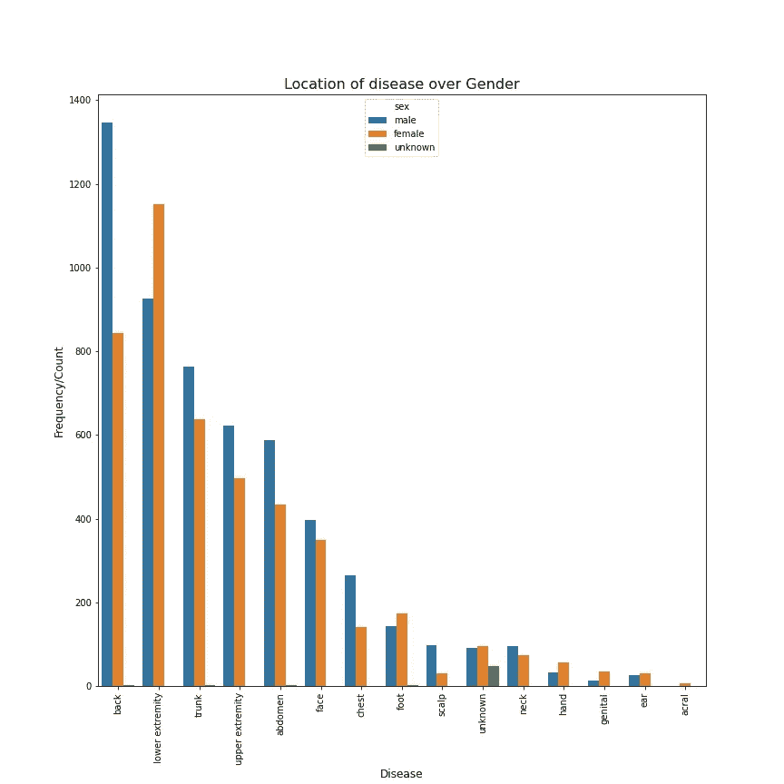
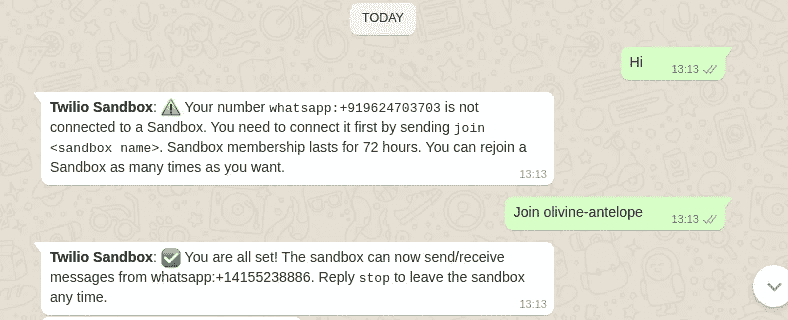
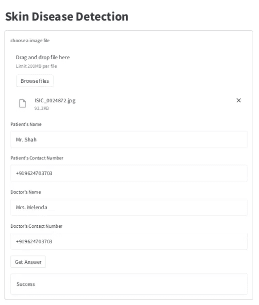
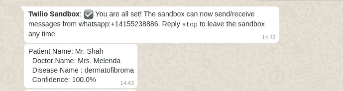

# 医学中的人工智能

> 原文：<https://pub.towardsai.net/ai-in-medicine-e9f5fc8727b7?source=collection_archive---------2----------------------->

## [人工智能](https://towardsai.net/p/category/artificial-intelligence)

## 使用人工智能实现医学测试自动化



照片由 [Irwan iwe](https://unsplash.com/@haloirwan?utm_source=unsplash&utm_medium=referral&utm_content=creditCopyText) 在 [Unsplash](https://unsplash.com/s/photos/medical-report?utm_source=unsplash&utm_medium=referral&utm_content=creditCopyText) 上拍摄

近年来，人工智能已经在全球几乎每个领域实现了几个流程的自动化。具体来说，人工智能最近拥抱了医学科学，因为 COVID 疫情让世界震惊。从预测病毒的传播到检查胸部和肺部的 x 光片，AI 以各种可能的方式帮助人类。

但是，当涉及到依赖人工智能和数据科学时，医学仍然被认为是最敏感的领域。原因非常简单:**人工智能的一个小错误可能会导致一条生命的损失**。

可能出现两种主要情况:

1.  患者被诊断患有该疾病，并且他/她没有受到影响。
2.  患者未被诊断患有该疾病，但他/她受到了影响。

这两种情况都将导致大灾难。这个问题的一个解决方案是，人工智能模型必须得到大量高质量的数据，这些数据涵盖了所有独特的测试场景和异常情况。其次，我们应该让人工智能发挥作用，但不要冒着减少人类参与的风险。这是为了监视和观察人工智能运行的本质，并相应地调整它。一旦人工智能模型达到被认为完全可靠的阶段，那么它们应该在真实的病人身上进行测试。行业级别的从业者大多不相信在这种敏感场景下依赖 AI 模型的准确性。相反，他们信任诸如召回率、精确度和 F1 分数等指标。

这篇博客将描述构建一个 web 应用程序的端到端过程，该应用程序接受皮肤图像作为输入，检测皮肤病，然后通过 WhatsApp messenger 向患者和医生发送医疗报告。

# 目录:

1.  数据源
2.  探索性数据分析
3.  模特培训
4.  Whatsapp 配置
5.  创建 Web 应用程序
6.  结论

# 数据源

用于训练模型的数据集是[皮肤癌 MNIST: HAM10000](https://www.kaggle.com/kmader/skin-cancer-mnist-ham10000) 。它包括 7 类癌症的 10015 幅图像。超过 50%的病变通过组织病理学得到确认，其余病例的基本事实要么是随访检查(跟进*)、*专家共识(共识)，要么是通过体内共聚焦显微镜(共聚焦)得到确认。数据集的一个问题是它没有我们的应用程序所必需的类“**无疾病**”。我选择了另一种方式来处理这种情况，您将在接下来的部分中看到。

# 探索性数据分析

1.  **课程频率**

很明显，数据集是高度不平衡的，其中黑色素细胞痣(nv)的频率大约是最低频率(黑色素瘤)的 70 倍。这就需要通过对除了具有最大频率的类之外的数据集进行过采样来平衡数据集。



来源:图片由所有者提供

**2。皮肤病的性别分布**

这个饼图描绘了疾病的概率是不分性别的。有一些特定种类的癌症更可能发生在特定的性别身上，但不是在这种情况下。进一步的分析可能包括个别癌症类别的性别分布。



疾病在性别上的分布

**3。患者年龄直方图**

使用 seaborn 的 histplot 绘制患者年龄直方图。这将揭示受影响最大的年龄组。从图中可以明显看出，40 岁到 60 岁的人受癌症的影响最大。



患者年龄直方图

**4。超过性别的疾病位置**

该图将描绘所有性别最常受这些类型癌症影响的身体部位。很明显，男性受“背部”影响最大，女性受“下肢”影响最大。



受癌症影响最大的位置(身体部位)

# 模特培训

在训练模型之前，我们需要修复不平衡的数据。我使用了过采样技术，它创建了属于少数类的数据点的副本(除了具有最高频率的类)。

此外，在将数据集拆分为训练数据集和测试数据集之后，请确保对数据集(训练数据集)进行过采样。在拆分数据集的过程中，为训练分配 90%的数据，而剩余的数据则用于在训练数据集上对模型进行训练后对其进行测试。**仅在训练数据集上执行过采样。**

可以使用两种技术来开发模型架构:定制架构和微调预训练模型。一些著名的预训练模型是 VGG-16、Resnet50 和 InceptionV3。在使用预训练模型时，最后几个图层将被更改，以使其可根据当前数据集进行调整。在这个项目中，我创建了一个自定义架构，包括卷积层、最大池层和密集层的几个堆栈。在从图像中提取特征时，每一层都扮演着特定的角色。

**卷积层**:它在一幅图像上应用内核，提取垂直线、水平线等特征。内核可以被想象成大小为 K×K 的窗口，其中 K 通常是奇数。它以步幅 S 在图像上移动，并且可以在图像的边界放置填充 P，以提取图像边界处的重要特征。图像 I 上卷积层的输出可以计算为:

输出大小= (I-K+2P)/S+1

**Max Pooling Layer** :它在图像上移动内核，提取具有最大值的特征。例如，大小为 3*3 的内核将覆盖九个像素。将考虑具有最大值的像素。

**密集层**:密集层是一个简单的神经元层，其中每个神经元接收来自前一层所有神经元的输入。它与人工神经网络中使用的方法相同。该层用于分类。

虽然我已经创建了一个定制的架构，但是我相信在大多数情况下，预先训练的模型比定制的架构更好。本文末尾提到的 Github 存储库中提供了模型性能的更多细节。

# Whatsapp 配置

Whatsapp message 被配置为向患者和医生发送医疗报告。Twilio 是一个平台，它提供了一组 API 来通过多种媒介发送可编程的短信。它为每个新用户提供 15 美元的基本余额。

配置 WhatsApp messenger 的步骤:

a.登录 Twilio，进入“可编程短信”

b.前往“设置 Whatsapp”

c.遵循平台上提到的一系列步骤。

**注意:**复制并保存首页提到的令牌和账号 ID。

**Twilio** 库用于通过 Whatsapp 发送医疗报告。令牌和帐户 ID 存储在名为 **credentials.py** 的单独文件中



Whatsapp messenger 的配置

# 创建 Web 应用程序

为了创建一个网络应用，我使用了 S[stream lit 的](https://streamlit.io/)开源框架。对于那些不知道 streamlit 的人来说，它可以在几分钟内将 python 脚本转换成 web 应用程序。尤其是对于像我这样对前端技术没有什么经验的人来说。安装时使用，

```
pip install streamlit
```

我已经创建了一个基本的 web 应用程序，它有一个表单，必须填写才能看到结果。它要求用户提供详细信息，如皮肤照片、患者姓名、联系电话、医生姓名和联系电话。如“数据集”部分所述，这个数据集没有一个名为“无疾病”的类，而这个类是非常必要的。所以如果模型的置信度下降到 80%以下，那么就认为是“无病类”。



简化 web 应用程序

web 应用程序将在屏幕上返回流程的状态，无论是“成功”还是“失败”。此外，它会通过 WhatsApp messenger 将报告发送到患者和医生的联系电话。信息的快照可以在下面的图片中看到。



Whatsapp messenger

# 结论

在这篇文章中，你一定已经了解了深度学习是如何通过自动化医学皮肤测试来拥抱医学科学的。这是这样一个应用程序的基本原型，但是还有很多需要考虑的。对于数据科学爱好者来说，Streamlit 是一个非常简单和灵活的开源软件，使我们能够在没有明确的前端技术知识的情况下开发 web 应用程序。

您可以在这里找到演示视频和所有资源。

[](https://github.com/DhruvGangwani/Streamlit-web-app) [## GitHub—DhruvGangwani/Streamlit-we b-app:使用图像分类进行皮肤病检测…

### content app . py::Flask API test _ images::包含用于测试模型/best_model.h5::训练好的模型进行分类的图像…

github.com](https://github.com/DhruvGangwani/Streamlit-web-app)