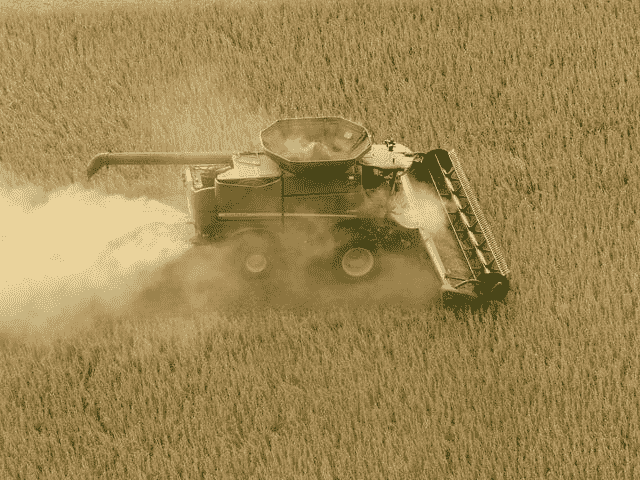

# 人工智能实践:农业

> 原文：<https://pub.towardsai.net/ai-in-practice-agriculture-b8e94241f483?source=collection_archive---------6----------------------->

## [人工智能](https://towardsai.net/p/category/artificial-intelligence)

## 天气预报、疾病预测和分发

民主化和采用人工智能使食品供应可靠和高效不仅可以增加工业化农场参与者的收入，还可以通过直接接触消费者来帮助小农场主体面地提高生活水平。

照片由[阿曼达·伊斯利](https://unsplash.com/@amandaeasley11?utm_source=unsplash&utm_medium=referral&utm_content=creditCopyText)在 [Unsplash](https://unsplash.com/s/photos/iot-agriculture?utm_source=unsplash&utm_medium=referral&utm_content=creditCopyText) 上拍摄

# 农场到岔口

农业不仅仅是在农场种植东西。有无数的因素在围绕种植水果、蔬菜、谷物、养牛或把产品直接运送到你家门口的活动生态系统中起着至关重要的作用。

根据联合国的估计，截至 2021 年 1 月，世界人口为 78 亿，预计到 2057 年将达到 100 亿。鉴于不断增长的人口和全球快速城市化导致的自然资源枯竭和环境压力，人工智能对于养活不断增长的人口变得非常重要。

值得注意的是，食品生产不是唯一的问题，包装、分销和消费都同样重要。例如，仅在美国，据美国农业部统计，仅食物垃圾一项就约占食物供应的 30-40%。

> [***美国有多少食物浪费？***](https://www.usda.gov/foodwaste/faqs)
> 
> *根据美国农业部经济研究局的估计，2010 年零售和消费层面的粮食损失为 31 %,相当于价值约 1330 亿英镑和 1610 亿美元的粮食。如此大量的垃圾对社会产生了深远的影响:原本可以帮助贫困家庭填饱肚子的健康食品被送到了垃圾填埋场。土地、水、劳动力、能源和其他投入被用于生产、加工、运输、准备、储存和处理废弃的食物。*

食品运输链中涉及的变量数量使其成为一个非常具有挑战性但又非常值得解决的问题。我们将专注于三个关键领域，人工智能技术目前在这些领域发挥着重要的变革作用，并且在未来具有广阔的发展前景。

# 天气预报

过去、现在和未来对湿度、光照和温度的预测是帮助农场决策的输入。精确的天气监测和可操作的数据可以推动以下活动:

1.  美国国家海洋和大气管理局(NOAA)和当地农场气象站提供的卫星气象数据为农民做出日常决策提供了非常精确的实用信息。
2.  如果预测有降雨发生，那么农民可以通过不给农场浇水和改进灌溉计划来节约用水。如果雨水会被冲走，降雨量对决定是否施肥至关重要。
3.  湿度预测有助于对收获和饲料储存做出决定。风和阳光数据有助于以非常精细的方式使用可再生能源，并可以节省大量电力成本。

# 疾病预测

降低商品价格的竞争压力，杀虫剂和杀真菌剂成本的增加使得尽快跟踪和修复感染变得至关重要。了解潜在的疾病爆发有助于做出积极的决策，而不是在爆发后采取被动的行动。例如:

1.  湿度、温度和图像处理的结合可以预测草莓中霉菌的形成。根据预测，选择性施用预防性杀菌剂可以防止霉菌的发展。
2.  智能手机在田间捕捉的图像可以映射到预处理的图像集，几乎即时传递植物的健康信息。除了健康诊断之外，其他有价值的信息，如杀虫剂的推荐、当地疾病的流行情况以及其他农民采取的措施也非常有用。
3.  对感染开始的预测可以提醒当地农民、企业和管理部门提高警惕并采取行动，从而防止大规模损失。

# 分配

农产品生产只是食品供应链的一部分。根据 2010 年美国农业部的研究，生产和消费之间的差距是大约****价值 1610 亿美元的食物的浪费。营养价值的损失、保持农产品新鲜所需的额外防腐剂及其对健康的影响使得高效的食品配送成为必要。解决这个问题的一些有趣的想法是:****

1.  **建立一个平台，满足本地区域的供需缺口。让顾客了解当地农民即将生产的季节性食品，有助于产生兴趣和订单，激励农民成为平台的一部分并直接销售。**
2.  **数字平台使小型、中型和大型农民能够参与同一个分销渠道，尤其是在网络本地化的情况下。**
3.  **减少包装、储存和运输所需的燃料，不仅有助于提高食物的营养价值，还能减少废物和碳排放，从而保护地球。**

# **人工智能实践:**

## **[IBM:为农业做出更快、更明智的决策](https://www.ibm.com/products/agriculture#:~:text=IBM%20Agriculture%20helps%20overcome%20obstacles,and%20decades%20of%20IBM%20research.)**

*****农业企业正处于数字化转型的风口浪尖。*** *IBM Agriculture 通过将人工智能(AI)、数据分析和预测洞察力的力量与独特的农业物联网(IoT)数据、资深食品和农业企业行业领导者的专业知识以及 IBM 数十年的研究相结合，帮助克服数字化转型的障碍。***

***结果是一个定制的低成本解决方案平台，帮助整个生态系统的利益相关者做出更快、更明智的农业决策。***

## **[Azure Beats:人工智能驱动的农业生态系统洞察](https://www.microsoft.com/en-in/campaign/azure-farmbeats/)**

*****Azure farm beats*******支持构建数据驱动的数字农业解决方案。*** *Azure FarmBeats 是一个专门构建的、特定于行业的云平台，构建在 Azure 之上，能够从数据中获得可操作的见解。使用 Azure FarmBeats，您可以****

1.  ****汇总不同来源的农业数据****
2.  ****融合来自传感器、无人机&卫星*的不同农业数据集***
3.  ****使用融合数据集快速构建 AI/ML 模型****
4.  ****打造您自己定制的数字农业解决方案****

## ***[AgroStar:基于云的移动应用](https://cloud.google.com/customers/agrostar)***

******将数据和技术与农艺相结合，帮助农民取胜。***[*AgroStar*](https://corporate.agrostar.in/)*推出了一款基于云的移动应用，帮助提高农作物产量，并鼓励印度小农采用最佳做法。****

****2008 年，作为一个销售农具的内部电子商务平台，该公司转向* [*谷歌云平台*](https://cloud.google.com/) *(GCP)以扩大其产品。****

****它现在使用* ***基于云的分析*** *并且正在部署* ***ML 模型*** *以五种语言***提供及时的建议，从种子优化、作物轮作、土壤营养到虫害控制。*****

# ****摘要****

****农业正从古老的传统做法中脱颖而出，成为运转良好的尖端农业技术产业。****

****高级分析为农民、经销商和消费者带来的价值是惊人的。及时访问信息可以保持较低的运营成本，同时增加收入并使流程高效可靠。****

# ****参考资料:****

1.  ****[美国农业部食物垃圾](https://www.usda.gov/foodwaste/faqs)****
2.  ****[IBM:为农业做出更快、更明智的决策](https://www.ibm.com/products/agriculture#:~:text=IBM%20Agriculture%20helps%20overcome%20obstacles,and%20decades%20of%20IBM%20research.)****
3.  ****[Azure Beats:人工智能驱动的农业生态系统洞察](https://www.microsoft.com/en-in/campaign/azure-farmbeats/)****
4.  ****[AgroStar:基于云的移动应用](https://cloud.google.com/customers/agrostar)****

*****原载于 2021 年 1 月 18 日*[*https://www . emerging . careers*](https://www.emerging.careers/blog/2021/01/18/ai-in-practice-agriculture)*。*****