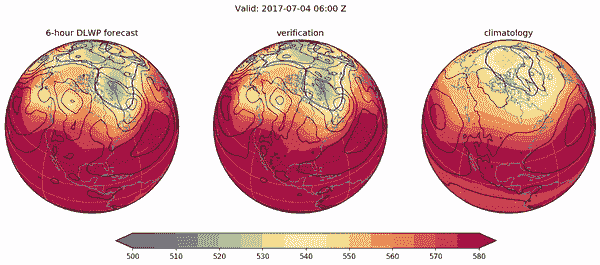
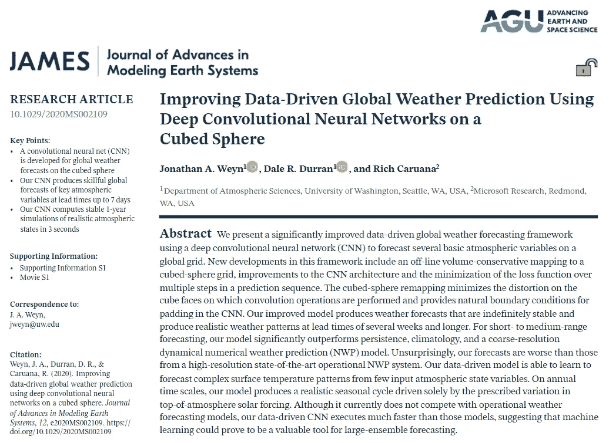
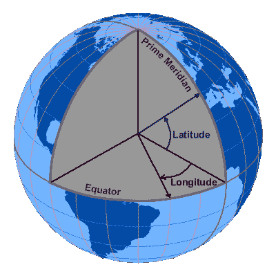
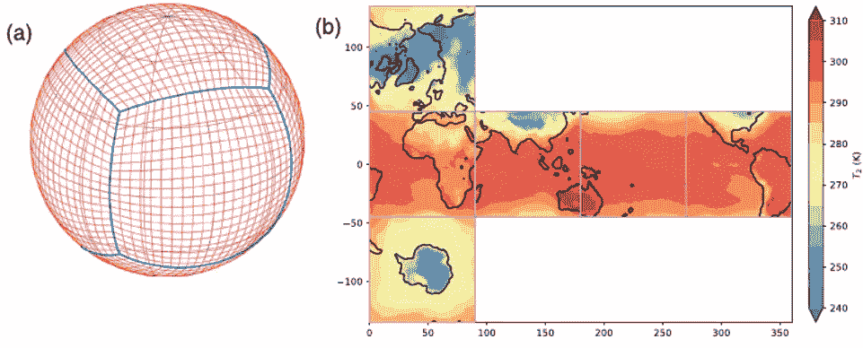
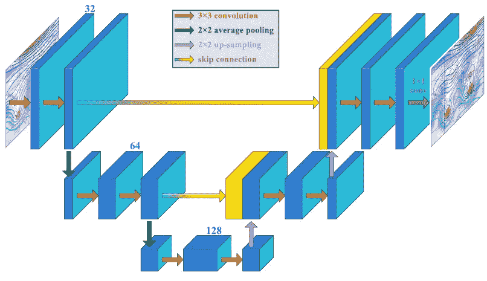

# 人工智能正在预测更快、更准确的天气预报

> 原文：<https://pub.towardsai.net/ai-is-predicting-faster-and-more-accurate-weather-forecasts-5d99a1d9c4f?source=collection_archive---------2----------------------->

## [人工智能](https://towardsai.net/p/category/artificial-intelligence)，[新闻](https://towardsai.net/p/category/news)

## 如果我们可以通过分析过去 40 年的天气模式来预测未来，用人工智能取代这一切，会怎么样？

左边是新论文《深度学习天气预测》预报。中间是 2017-18 年的实际天气，右边是当天的平均天气。图片来源:J. A. Weyn，D. R. Durran 和 R. Caruana，“在立方体球体上使用深度卷积神经网络改进数据驱动的全球天气预测”

## 介绍

目前传统的天气预报方法使用我们称之为“数值天气预报”的模型。它使用大气和海洋的数学模型，根据当前条件预测天气。它于 20 世纪 20 年代首次推出，并于 20 世纪 50 年代使用计算机模拟产生了现实的结果。这些数学模型用于预测短期和长期预测。但它的计算量很大，并且不能像深度神经网络那样基于大量数据进行预测。这是它如此有前途的部分原因。这些当前的数值天气预测模型已经使用机器学习作为后处理工具来改进预测。天气预报正受到机器学习研究人员越来越多的关注，已经产生了令人鼓舞的结果。

## 报纸

“在立方体球体上使用深度卷积神经网络改进数据驱动的全球天气预测”是华盛顿大学研究人员与微软研究院合作发表的一篇最新论文。他们提出了一种新的天气预报框架，使用卷积神经网络(CNN)在几周或更长的时间内产生稳定的预报和现实的天气模式。该模型在中短期预测方面甚至明显优于许多其他技术。但正如他们所说，在数值天气预测方面，它目前无法与当前的业务天气预报系统竞争，但这种数据驱动的 CNN 要快得多，并且一直在改进。表明机器学习绝对是天气预报中的一个有价值的工具，并最终可能取代当前的方法，提供更快更准确的预测。如果你不熟悉 CNN 的概念，我强烈邀请你看看我制作的这个视频，它解释了 CNN 是什么以及它们是如何工作的。

他们称他们的方法为深度学习天气预测(DLWP)。它将初始大气状态作为输入，并预测给定未来时间的大气状态。它是通过从天气的历史观测中学习来做到这一点的。当然，这些历史观察值是在训练阶段提供给网络的数据。这允许它“使用”它的知识来进行预测。

## 关于 DLWP 方法的更多详细信息

图片由丹尼斯·沃德/www.windows2universe.org[UCAR](http://www.windows2universe.org)提供

这分三步实现。第一步是绘制预测图。如你所知，地球最常用的坐标系统是经纬网。但是这个坐标系对于神经网络来说有一个问题，因为存在奇点。的确，两极都是直接从 0 经度度跳到 180 经度度。这使得在这个网格中使用深度学习网络变得非常困难。

图片来源:J. A. Weyn，D. R. Durran 和 R. Caruana，“在立方体球体上使用深度卷积神经网络改进数据驱动的全球天气预测”

相反，正如论文标题所说，他们使用“立方体球体”方法来近似地球上的数据。这是美国国家海洋和大气管理局在他们的全球预测模型中使用的。您可以在这里看到一个示例，其中显示了距地面 2 米处的空气温度。左边的第一个图显示了立方体球体网格，蓝色的线是这个“立方体”的每个面之间的边界。并且为了更精确，每个面也具有 48 个网格单元。就在旁边，您可以看到这个立方体被展平的可视化表示。这就是神经网络有趣的地方。这种技术允许他们只在每个立方体表面单独工作，使他们能够使用二维卷积，就像随处可见的普通 CNN 架构一样。这也意味着该模型为立方体的每个面学习不同的权重和不同的偏差。这并不完全正确。他们对以赤道为中心的四个面使用相同的网络，对两个极地面使用另一个网络。这里，通过“相同的网络”,我的意思是这些立方体面在网络内部共享相同的权重。当然，由于大气运动在南极是顺时针方向，在北极是逆时针方向，所以北极表面上的数据在发送到网络之前会翻转，然后再翻转回来。

图片来源:J. A. Weyn，D. R. Durran 和 R. Caruana，“在立方体球体上使用深度卷积神经网络改进数据驱动的全球天气预测”

神经网络的架构是他们方法的第二步。他们在工作中使用的特定模型是计算机视觉领域，尤其是图像分割任务中的一种流行网络类型，即您在这张图片中可以看到的 U-Net 架构。它基本上是两个卷积神经网络架构放在一起，第二个以编码-解码过程的方式反向工作。这里，每个红色的箭头代表一个在每个立方体球面上操作的二维卷积。绿色和紫色箭头表示平均池，用于在第一个网络中对图像进行下采样以减少参数，并在第二个网络中对输出进行上采样以恢复到原始大小。蓝色到黄色的线表示跳过连接。在 U-Net 架构中经常使用它来跳过神经网络中的一些层，并将一层的输出作为下一层的输入。这主要用于在训练时为梯度给出一个替代路径，以消除消失梯度问题，这种问题出现在网络太深，在反向传播过程中通过所有层后梯度最终变为零的情况下。这导致网络的早期层不再更新，因此无法从数据中学习，也无法收敛到一个好的解决方案。

图片来源:J. A. Weyn，D. R. Durran 和 R. Caruana，“在立方体球体上使用深度卷积神经网络改进数据驱动的全球天气预测”

最后，他们将这些预测与序列预测技术相结合，以改进和稳定中长期预测。这里，当前时间和当前时间减去 6 小时的两个输入字段都被输入到上一步中讨论的 CNN 算法中，产生 12 小时的预测。这意味着产生两个输出预测:当前时间加 6 小时和当前时间加 12 小时。然后，它们被反馈到相同的算法中，以预测接下来的两步，以此类推。该模型通过计算均方差来计算每一步中已知数据与其预测值之间的误差，从而得到改进，如红色所示。这个均方误差基本上是两个值之间距离的度量，告诉我们预测与预期输出有多远。总误差是所有这些误差的总和，然后在训练阶段将其最小化，以产生中/长期预测的最佳可能输出。

## 结论

左边是新论文《深度学习天气预测》预报。中间是 2017-18 年的实际天气，右边是当天的平均天气。图片来源:J. A. Weyn，D. R. Durran 和 R. Caruana，“在立方体球体上使用深度卷积神经网络改进数据驱动的全球天气预测”

这是我们最后的天气预报。如果你有任何问题，请在评论中留下，我一定会回答你。他们的工作是公开的，他们在 GitHub 上的代码链接和他们的论文都在描述中。为了更好、更深入地理解他们的技术，我肯定会邀请你去阅读它。本文中用于天气预报的数据也是公开的。这可能是一个非常有趣的项目，如果你正在寻找一个，因为你已经可以从他们的结果开始，并试图改善他们！

**观看视频**

如果你喜欢我的工作并想支持我，我会非常感谢你在我的社交媒体频道上关注我:

*   支持我的最好方式就是跟随我上**。**
*   **订阅我 [**YouTube 频道**](https://www.youtube.com/channel/UCUzGQrN-lyyc0BWTYoJM_Sg) 。**
*   **在[**LinkedIn**](https://www.linkedin.com/in/whats-ai/)**上关注我的项目。****
*   **一起学习 AI，加入我们的 [**Discord 社区**](https://discord.gg/learnaitogether) ，*分享你的项目、论文、最佳课程，寻找 Kaggle 队友，等等！***

## **参考**

> **论文包括:J. A. Weyn，D. R. Durran 和 R. Caruana，“使用立方体球体上的深度卷积神经网络改进数据驱动的全球天气预测**”,《地球系统建模进展杂志》，第 12 卷，第 9 期，2020 年 9 月，ISSN:1942–2466 . doi:10.1029/2020 ms 002109。【在线】。可用:[http://dx.doi.org/10.1029/2020MS002109](http://dx.doi.org/10.1029/2020MS002109)。
> **代号**:[https://github.com/jweyn/DLWP-CS](https://github.com/jweyn/DLWP-CS)
> **CNN 解说视频**:[https://youtu.be/YUyec4eCEiY](https://youtu.be/YUyec4eCEiY)****