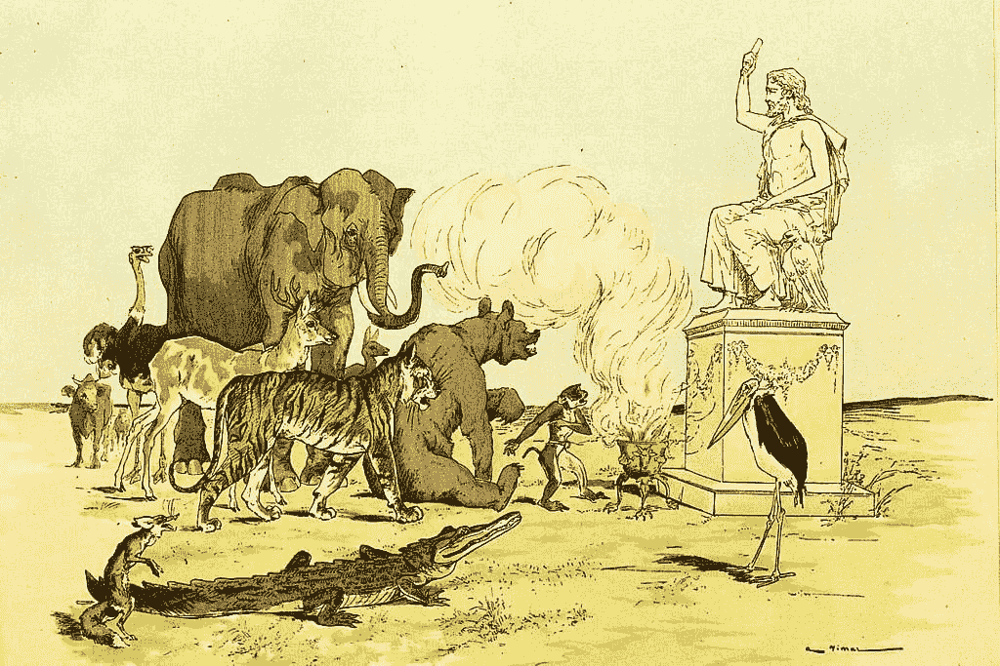
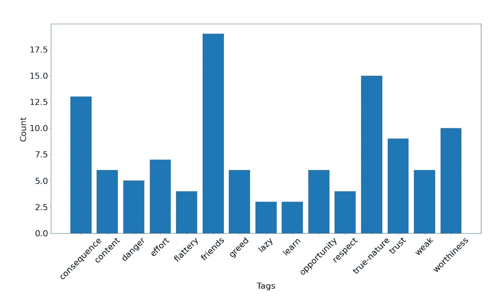

# 人工智能正在阅读寓言，这可以改变它的学习方式。

> 原文：<https://pub.towardsai.net/ai-is-reading-fables-and-this-can-change-the-way-it-learns-541aef4b7c7f?source=collection_archive---------2----------------------->

资料来源:2007 年 1 月 1 日出版的《盖尔奇夫·维马尔-拉封丹寓言》。la Besace-PICRYL 公共域图像

## 南加州大学信息科学研究所(ISI)的研究人员正在使用具有道德含义的寓言来开发人工智能中类似人类的推理。

寓言是教导一个教训或传递一个道德的短篇故事。它们不仅具有很高的娱乐性，而且在突出和展示性格特征方面发挥着重要作用。

几个世纪以来，寓言在交流共同的历史、强化文化价值观以及唤起人们对重要传统的关注方面发挥了至关重要的作用。

通常，寓言提供了一个进入类比推理丰富世界的简单入口，类比推理是从政治到医学等领域的基础，例如，当医生利用以前的案例研究设法为病人确定护理计划时。

当孩子们了解其他文化传统时，会拓宽他们的世界观。因此，寓言激发孩子们更多地了解他们的文化传统，或者对他们的家族遗产和个人历史感到好奇，这并不罕见。

现在，南加州大学信息科学研究所(ISI)的一组研究人员正在将这种思维方式应用于人工智能。他们使用经典寓言和带有道德教训的短篇故事来测试和评估能够像人类一样思考的人工智能。让我们一起探索这项开创性的研究。

故事的道德分配。来源:通过类比维度理解叙事

# 了解研究

这个周末，我正在阅读一篇题为“**通过类比维度理解叙事**”的论文，作者是**南加州大学信息科学研究所(ISI)** 的一组研究人员，他们描述了通过寓言教授人工智能进行创造性类比的过程。

你可能知道，像我这样从事人工智能工作的人已经工作了很多年，致力于将人类自然拥有的推理水平纳入人工智能系统，我可以告诉你，模仿我们人类认为理所当然的类比推理是一个非常困难的挑战…

当前的 AI 依赖于将现有知识应用于新的场景，这意味着 AI 无法支持类比推理，部分原因是类比推理依赖于人类如何辨别缺乏表面相似性的项目或场景之间有意义的联系。

关键是人类的类比推理将不同的概念统一起来，从我们每天遇到的无数刺激中提取意义。

这意味着，作为人类，我们不是仅仅从外表上寻找联系，而是在现有的和新的场景之间建立创造性的联系。

来源:有代码的论文— [通过类比维度理解叙事](https://paperswithcode.com/paper/understanding-narratives-through-dimensions)

# 为什么重要？

人工智能模型目前缺乏类比推理机制，这就是为什么它们难以理解、解释或概括新的刺激，这也是为什么这种研究可以代表一种突破，如果它使我们能够创建类比推理能力的框架，这将使人工智能能够评估语言的相关性和意义，这可能有许多现实世界的应用。

例如，人工智能聊天机器人可以用来教授学生新概念，或者根据消费者营销数据创造新产品。像这样的应用可以极大地影响我们的社会，减少交通流量，找出我们的基础设施有什么问题，并制作更好的高速公路模型。

这项研究尝试了不同的方法来教 AI 识别**伊索寓言**中的相似之处，这是一个伊索寓言的在线集合，包括总共 655+个寓言，以表格格式索引，并列出了道德。大多数寓言由乔治·费勒·汤森牧师(1814-1900)和比尔斯，A·(1842-1914)翻译成英文；其余的来自法国的让·德·拉封丹，由几个优秀的网络灵魂翻译成英文。

研究团队使用**自然语言处理(NLP)** 方法来查看寓言，并根据文本中的单词及其解释创建故事对…

在论文中，研究人员解释了他们必须处理的问题。例如，虽然人类理解关于一只偷窃的狐狸和一个囤积的商人的故事具有相同的贪婪主题，但人工智能系统识别这些共同特征非常具有挑战性。但是该团队能够生成一个人们思考类比的不同方式的列表，这是朝着创造能够通过相似性进行推理的人工智能的目标迈出的积极一步。

# 结论

类比推理比我们通常认为的更加开放，其他因素在本文中没有充分探讨，如先验知识如何影响类比推理任务。

当我们遇到一个未知的情况时，我们用自己的亲身经历把未知和已知联系起来。然而，由于每个人类都有独特的知识和技能，因此所谓的类比推理不可避免地因人而异。

这项研究表明，我们需要继续探索人类类比推理的细微差别，以改善我们如何设计未来的人工智能技术。

此外，这项研究为开发新的人工智能能力提供了一个充满希望的开端，这些能力可能会改善许多领域，从教育和公共政策到艺术和城市设计。

# 你可能想读的其他文章。

*   [**我们正在见证人工智能的下一次进化吗？**](/are-we-witnessing-the-next-evolution-of-artificial-intelligence-264f251ea06d)
*   [**这 10 个算法可以改变你的生活——如果你和数据一起工作**](/these-10-algorithms-can-change-your-life-if-you-work-with-data-ff544657922d)
*   [**快速浏览稳定扩散的开源架构。**](https://medium.com/codex/a-quick-look-under-the-hood-of-stable-diffusion-open-source-architecture-2f07fc1e729)
*   [**5 种非常实用的方式人工智能可以帮助提高你公司的生产力**](/5-very-practical-ways-ai-can-help-to-improve-your-companys-productivity-f4d5dcd0b30c)
*   [**这 9 篇研究论文正在改变我今年对人工智能的看法。**](https://medium.com/illumination/these-9-research-papers-are-changing-how-i-see-artificial-intelligence-this-year-cd8ba548f785)

# 链接、资源和参考资料

*   寓言的例子——你的字典。[https://examples.yourdictionary.com/examples-of-fables.html](https://examples.yourdictionary.com/examples-of-fables.html)
*   香农·黑尔|阅读火箭。[https://www.readingrockets.org/hale](https://www.readingrockets.org/hale)
*   学术副主任寄语—2020 年 9 月 18 日。[https://www . SVS . org . uk/news-article/message-from-academic-副组长-18-9-2020/](https://www.svs.org.uk/news-article/message-from-academic-deputy-head-18th-september-2020/)
*   机器可以从寓言中学习— USC Viterbi |工程学院。[https://viterbischool . USC . edu/news/2022/07/machines-can-learn-from-fables/](https://viterbischool.usc.edu/news/2022/07/machines-can-learn-from-fables/)
*   机器可以学习寓言| EurekAlert！。[https://www.eurekalert.org/news-releases/959806](https://www.eurekalert.org/news-releases/959806)
*   伊索寓言……[https://www.aesopfables.com/](https://www.aesopfables.com/)
*   通过类比维度理解叙事——[https://arxiv.org/abs/2206.07167](https://arxiv.org/abs/2206.07167)

# 你愿意支持我吗？

为了获得无限的故事，你还可以考虑注册**成为中等会员，只需 5 美元。此外，如果您使用我的链接* [*注册*](https://medium.com/@jairribeiro/membership) *，我将收到一小笔佣金(无需您额外付费)。**

* [## 通过我的推荐链接加入媒体- Jair Ribeiro

### 阅读我分享的每一个故事(以及媒体上成千上万的其他作者)。你的会员费直接支持其他…

medium.com](https://medium.com/@jairribeiro/membership)*