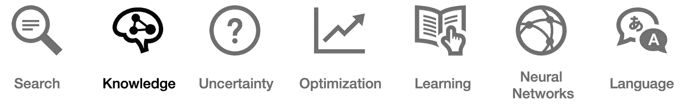

# 关于知识的 21 个词，每个精通人工智能的领导者都必须知道

> 原文：<https://pub.towardsai.net/ai-knowledge-1020a00eb45d?source=collection_archive---------3----------------------->

## 人工智能

## 你能解释这些吗？检验你的知识！


*【这是* ***系列*** *的第二部。继续之前，请确保您阅读了关于* [*搜索算法*](https://medium.com/towards-artificial-intelligence/ai-search-e0cb610237f6) *的内容。未来课题包括*[](https://medium.com/towards-artificial-intelligence/ai-uncertainty-4ac6810899ac)**[*优化*](https://medium.com/towards-artificial-intelligence/ai-optimization-b8735dc09448)*[*机器学习*](https://medium.com/towards-artificial-intelligence/ai-learning-2eaea82ee6d)*[*神经网络*](https://medium.com/towards-artificial-intelligence/26-words-about-neural-networks-every-ai-neural-networks-1085bd972fd5) *，以及* [*语言*](https://medium.com/towards-artificial-intelligence/ai-language-1d266caa72c6) *。】*****

****

**[***互联网的一秒钟内***](https://www.internetlivestats.com/) 产生 *2，902，666* 封电子邮件、在 Youtube 上观看的 *81，649* 个视频、8，936 条推文、4，581 个 Skype 电话、1，686*1*个 Tumblr 帖子以及另一个 *90 个帖子***

**当你读到这些数字的时候，它们已经过时了，因为我们每天都在创造新的记录。那是在新冠肺炎改变我们使用互联网的方式之前！**

> **我们每天创建超过 2.5 万亿字节的数据。**

**人工智能如何从如此庞大的数据中找到意义？它是如何存储和构建信息的？**

**这个问题的答案是 ***知识*** 表征和推理。本文简要定义了与知识相关的 ***主要概念和术语*** ，并展示了如何用各种不同的逻辑语言从简单的句子中表示和推断信息。**

# **知识**

****基于知识的代理:**根据内部知识表示进行推理的代理**

****句子:**用知识表示语言对世界的断言**

****逻辑联系:**通过逻辑中的句子对智能体的世界、目标和当前情况的知识表示；例如:**

```
**¬   not
∧   and
∨   or
→   implication
↔   biconditional**
```

****模型:**给每个命题符号分配一个真值**

****知识库:**基于知识的代理所知道的一组句子**

****蕴涵:**句子之间的关系，其中“在句子α为真的每个模型中，句子 *β* 也为真。”**

```
**α ⊨ β**
```

**推理:从旧句子中推导出新句子的过程**

****模型检查:**检查系统的有限状态模型是否满足给定规范的方法(也称为属性**检查)****

****知识工程:**在特定情况下，模仿具有专业知识的人的判断和行为的过程**

****假言:**包括消去法、双重否定消去法、蕴涵消去法、双条件消去法、德摩根定律、分配性质**

****德摩根定律:**一对变换规则，是有效的推理规则:**

```
**¬(P ∨ Q)  =  (¬ P ∧ ¬ Q)**
```

****分配性:**两个有效的替换规则:**

```
**P ∨ (Q ∧ R)  =  (P ∨ Q) ∧ (P ∨ R)**
```

****交换律:**另一个变换法则:**

```
**P ∧ Q  =  Q ∧ P**
```

****结合律:**和另一个转换规则:**

```
**(P ∧ Q) ∧ R  =  P ∧ (Q ∧ R)**
```

****逆正法则:**还有最后的转化法则，承诺:**

```
**P — Q  =  ¬ P — ¬ Q**
```

****定理证明:**使用演绎推理在符号逻辑中提供证明的正式方法**

**字面量的析取**

****合取范式(CNF):** 由分句连接而成的逻辑句子，例如:**

```
**(A ∨ B ∨ C)  ∧  (D ∨ ¬E)  ∧  (F ∨ G)**
```

****一阶逻辑:**形式系统的集合，在非逻辑对象上使用量化变量，并允许使用包含变量的句子**

****泛量化:**量词的一种，逻辑常数，解释为“给定任何”或“对于所有”，用以下符号表示:**

```
**∀x.**
```

****存在量化:**量词的一种，逻辑常数，解释为“至少有一个”或“对于某些”，用以下符号表示:**

```
**∃x.**
```

**既然你已经能够解释最基本的*知识*相关术语，你就有希望更自在地自己进一步探索这些概念。**

**这使你进入了成为一名成熟的人工智能领导者的第二阶段。继续探索 ***其他至关重要的话题*** ，包括 [*搜索*](https://medium.com/towards-artificial-intelligence/ai-search-e0cb610237f6)[*不确定性*](https://medium.com/towards-artificial-intelligence/ai-uncertainty-4ac6810899ac)[*优化*](https://medium.com/towards-artificial-intelligence/ai-optimization-b8735dc09448)*[*机器学习*](https://medium.com/towards-artificial-intelligence/ai-learning-2eaea82ee6d)[*神经网络*](https://medium.com/towards-artificial-intelligence/26-words-about-neural-networks-every-ai-neural-networks-1085bd972fd5)[*语言*](https://medium.com/towards-artificial-intelligence/ai-language-1d266caa72c6) 。***

****

*****喜欢读什么？*** ***渴望了解更多？*** *跟我上* [*中*](https://medium.com/@yannique) *或*[*LinkedIn*](https://www.linkedin.com/in/yannique/)*。***

*****关于作者:*** Yannique Hecht 作品在结合策略、客户洞察、数据、创新等领域。虽然他的职业生涯一直在航空、旅游、金融和技术行业，但他对管理充满热情。Yannique 专门开发 AI &机器学习产品商业化的策略。**