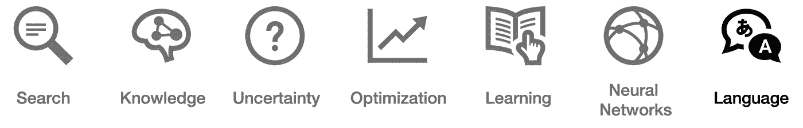
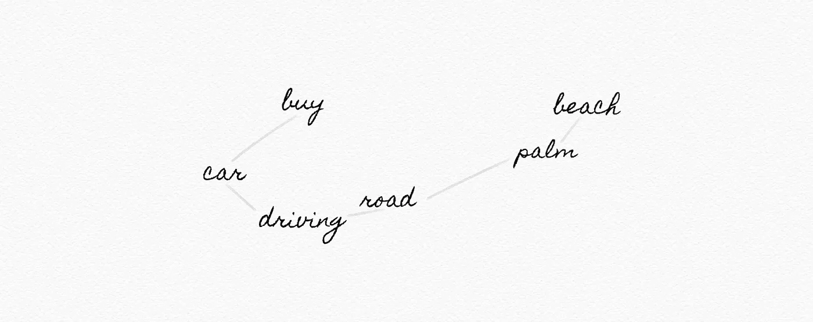
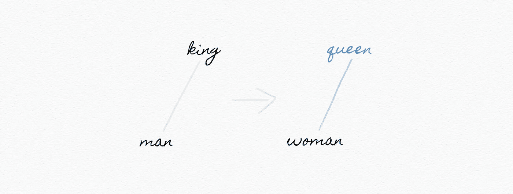

# 关于语言的 34 个词，每个精通人工智能的领导者都必须知道

> 原文：<https://pub.towardsai.net/ai-language-1d266caa72c6?source=collection_archive---------2----------------------->

## 人工智能

## 你能解释这些吗？检验你的知识！


*【这是* ***系列*** *的第 7 部。确保你阅读了关于* [*搜索*](https://medium.com/towards-artificial-intelligence/ai-search-e0cb610237f6)[*知识*](https://medium.com/towards-artificial-intelligence/ai-knowledge-1020a00eb45d)[*不确定性*](https://medium.com/towards-artificial-intelligence/ai-uncertainty-4ac6810899ac)[*优化*](https://medium.com/towards-artificial-intelligence/ai-optimization-b8735dc09448)*[*机器学习*](https://medium.com/towards-artificial-intelligence/ai-learning-2eaea82ee6d)*[*神经网络*](https://medium.com/towards-artificial-intelligence/26-words-about-neural-networks-every-ai-neural-networks-1085bd972fd5) *和* [】](https://medium.com/towards-artificial-intelligence/ai-learning-2eaea82ee6d)**

****

**为了真正改变人类与计算机的交互方式，我们需要让计算机能够阅读、理解并从书面和口头语言中获取意义。在 AI 中，这个领域被称为**自然语言处理(NLP)** 。**

****潜在的** **NLP 应用包括:****

*   **自动摘要**
*   **信息提取**
*   **语言识别**
*   **机器翻译**
*   **命名实体识别**
*   **语音识别**
*   **文本分类**
*   **词义消歧**

**诚然，这些术语都相当枯燥乏味...但是背后隐藏着很多令人兴奋的可能性！自己看:**

**谷歌双工:人工智能助理打电话给当地企业预约**

> **预约周二上午 10 点到 12 点之间的任何时间理发。**

**机器如何将这种声音翻译成它能理解并采取行动的东西？**

**还有，它如何解释上下文？**

**为了帮助你回答这些问题，本文简要定义了围绕 ***语言*** 的核心概念和术语。**

# **语言**

****自然语言处理:**(或 NLP)人工智能的一个主要领域，通过允许计算机阅读、理解和从语言中获取意义来处理人类和计算机之间的交互**

**语法:在一种语言中，为创造结构良好的句子而对单词和短语进行的排列**

**语义:单词、短语或文本的意思**

****形式语法:**一种语言中生成句子的规则系统**

****上下文无关语法:**一组有限的递归语法规则，例如:**

```
**N → he | Anthony | computer | ... 
D → the | a | an | ...
V → took | helped | searched | ...
P → to | on | over | ...
ADJ → blue | busy | old | ... N        V        D       N
|        |        |       |
he   searched    the   computer NP -> N | DN NP
         /  \
        D    N
        |    |
       the computer**
```

****N-gram:** 来自文本样本的 N 个项目的连续序列**

****字符 n 元语法:**来自文本样本的 n 个字符的连续序列**

****单词 n 元语法:**来自文本样本的 n 个单词的连续序列**

****Unigram:** 一个文本样本中的 *1* 项的连续序列**

****二元模型:**来自文本样本的两个项目的连续序列**

****三元模型:**一个文本样本中 3 个项目的连续序列**

```
****The bolded words** are one of the possible trigrams in this sentence.
The **bolded words are** one of the possible trigrams in this sentence.
The bolded **words are one** of the possible trigrams in this sentence.
The bolded words **are one of** the possible trigrams in this sentence.
The bolded words are **one of the** possible trigrams in this sentence.
The bolded words are one **of the possible** trigrams in this sentence.
The bolded words are one of **the possible trigrams** in this sentence.
The bolded words are one of the possible **trigrams in this** sentence.
The bolded words are one of the possible trigrams **in this sentence.****
```

****记号化:**将一个字符序列分割成多个片段(记号)的任务**

```
**"This is a sample sentence, for tokenization."["This", "is", "a", "sample", "sentence,", "for", "tokenization."]**
```

****单词标记化:**将一系列字符拆分成单词的任务**

****句子标记化:**将一系列字符拆分成句子的任务**

****马尔可夫模型:**用于模拟随机变化系统的随机模型**

****马尔可夫链**:描述一系列可能事件的随机模型，其中每个事件的概率只取决于前一个事件达到的状态**

****

**马尔可夫链**

****文本分类:**(或文本标记)将文本分类到有组织的组或类别中的任务**

```
**"I **love** to eat ice cream. Gianlugigi makes the **best** ice cream!"
P(Positive | "**love**", "**best**")"This ice cream was **terrible**. It was **not as good** as I thought!"
P(Negative | "**terrible**", "**not as good**")**
```

****贝叶斯法则:**(或称贝叶斯定理)一个确定条件概率的实用数学公式:**

```
**P(b|a) = [ P(a|b) P(b) ] / P(a)P(Positive) = 
number of positive samples / number of total samplesP("**love**"| Positive) = 
number of positive samples with "**love**" / number of positive samples**
```

****朴素贝叶斯:**利用贝叶斯规则对对象进行分类的算法(例如垃圾邮件过滤器)**

****加法平滑:(或拉普拉斯平滑)**一种统计技术，通过将一个值 *α* (例如 1)添加到分布中的每个值(假装你看到每个值的次数比实际多 1 次)来平滑分类数据**

****信息检索:**响应用户查询找到相关文档的任务**

****主题建模:**为一组文档发现主题的模型**

****术语频率:**术语在文档中出现的次数**

****虚词:**本身意义不大，但用来语法连接其他词的词，例如，**

```
***am, by, do, is, which, with, yet, …***
```

****实词:**独立承载意义的词，例如:**

```
***win, type, computer, …***
```

****逆文档频率:**衡量一个单词在文档中的常见或罕见程度**

```
**log(total documents / number of Documents containing word x)**
```

****Tf-idf:** 通过将*词频* ( *TF* )乘以*逆文档频率* ( *IDF* )对文档中哪些词是重要的进行排序**

```
**td-idf = term frequency * (inverse document frequency)**
```

****信息提取:**从文档中提取知识的任务**

**单词间语义关系的词汇数据库**

****

**Wordnet**

****单词表示:**将单词表示为特征因子的过程，其中向量条目代表单词含义的隐藏特征**

***【务必查看* [*努尔扎特·拉赫曼别迪耶娃*](https://medium.com/u/84da7a70e49d?source=post_page-----1d266caa72c6--------------------------------) *的* [*关于文字表述的演练*](https://towardsdatascience.com/word-representation-in-natural-language-processing-part-i-e4cd54fed3d4)*…】***

****一键表示:**用单个 *1* 表示向量的含义，其他值为 *0***

```
**king  [1,0,0,...,0]
man   [0,1,0,...,0]
woman [0,1,1,...,0]
queen ?**
```

****分布表示:**跨多个值分布的含义表示**

```
**king  [-0.55, -0.65, 0.25, ..., 0.12]
man   [-0.12, -0.44, 0.25, ..., 0.12]
woman [-0.12, -0.44, 0.75, ..., 0.12]queen ?**
```

****Word2vec:** 生成单词向量的流行模型**

****跳过语法结构:**神经网络结构，用于在给定目标单词的情况下预测上下文单词**

****

**跳过程序体系结构**

**无论你看亚马逊、阿里巴巴、苹果、百度、谷歌、微软还是小米，大科技都在抓住个人数字助理的机会，相信它们将推动商业、分析和 CRM 的未来。**

**没有一个数字助理是或声称是防弹的。相反，它们经常让我们感到沮丧，带着无法实现的期望离开。例如，[语音识别中有偏见的数据集](https://hbr.org/2019/05/voice-recognition-still-has-significant-race-and-gender-biases)只是众多障碍中的一个。**

**然而，语言领域正在飞速发展，这表明我们能够直观地与机器交流只是时间问题。**

****

**探讨类似的 AI 相关话题，包括 [*搜索*](https://medium.com/towards-artificial-intelligence/ai-search-e0cb610237f6)[*知识*](https://medium.com/towards-artificial-intelligence/ai-knowledge-1020a00eb45d)[*不确定性*](https://medium.com/towards-artificial-intelligence/ai-uncertainty-4ac6810899ac)*[*优化*](https://medium.com/towards-artificial-intelligence/ai-optimization-b8735dc09448)[*机器学习*](https://medium.com/towards-artificial-intelligence/ai-learning-2eaea82ee6d) *，以及* [*神经网络*](https://medium.com/towards-artificial-intelligence/26-words-about-neural-networks-every-ai-neural-networks-1085bd972fd5) 。***

*****喜欢读什么？*** ***渴望了解更多？*** *跟我上* [*中*](https://medium.com/@yannique) *或*[*LinkedIn*](https://www.linkedin.com/in/yannique/)*。***

*****关于作者:*** Yannique Hecht 作品在结合策略、客户洞察、数据、创新等领域。虽然他的职业生涯一直在航空、旅游、金融和技术行业，但他对管理充满热情。Yannique 专门开发 AI &机器学习产品商业化的策略。**