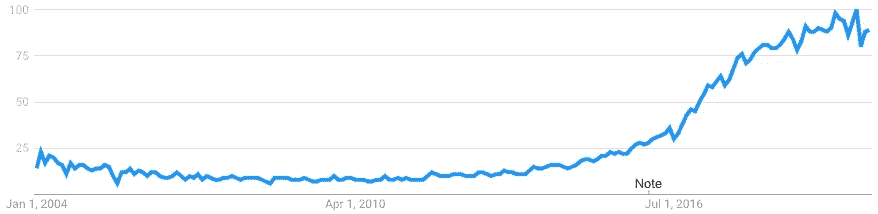
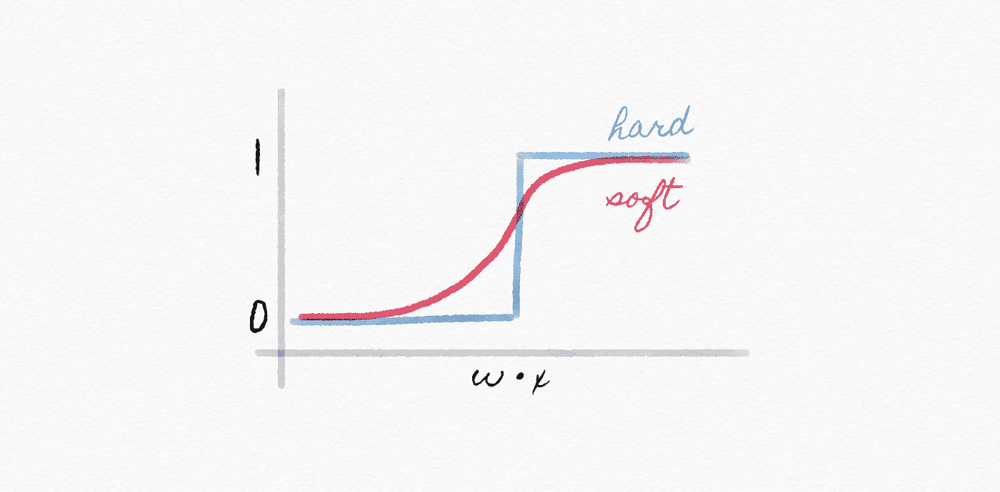
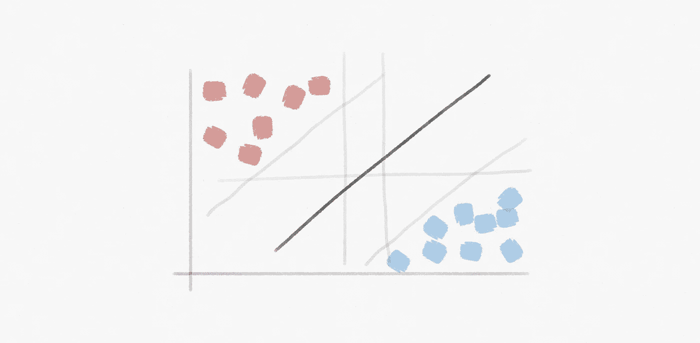
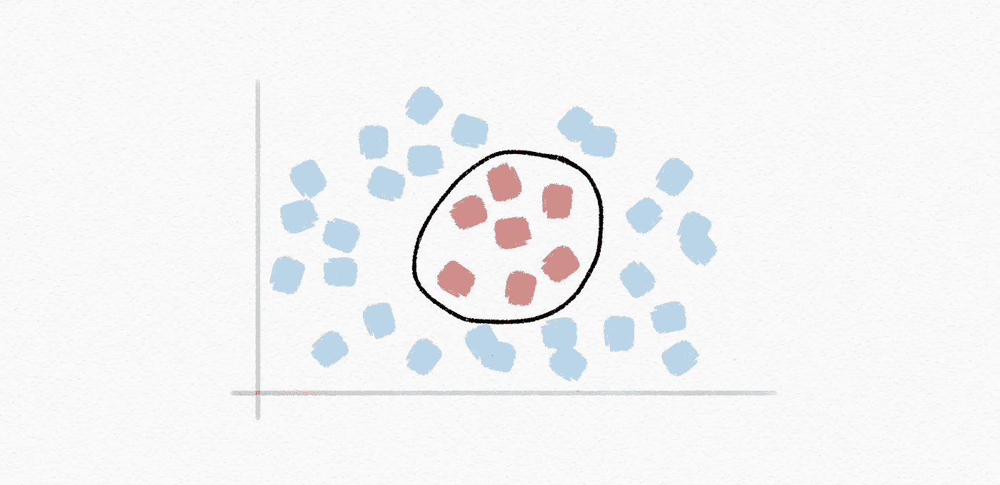
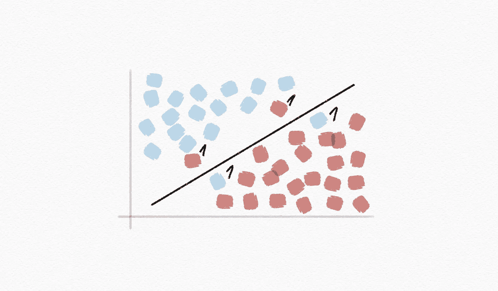
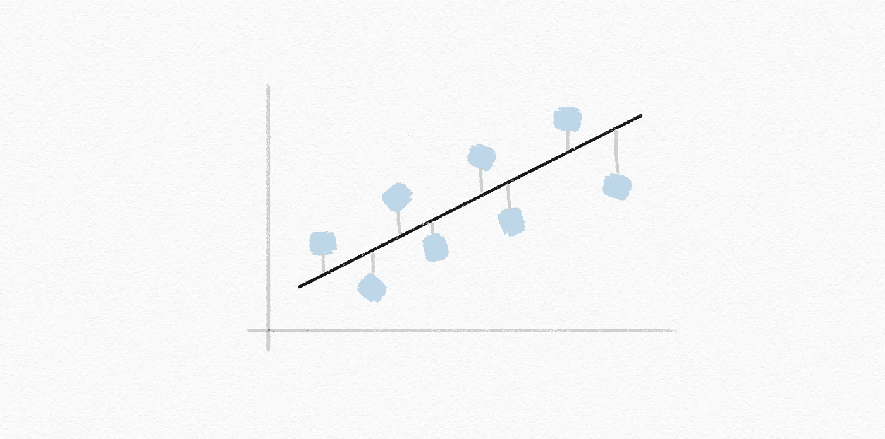
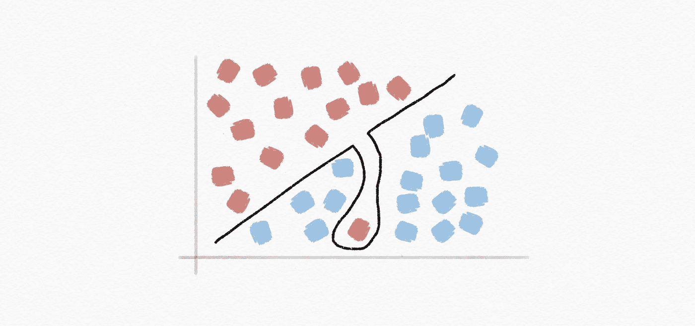
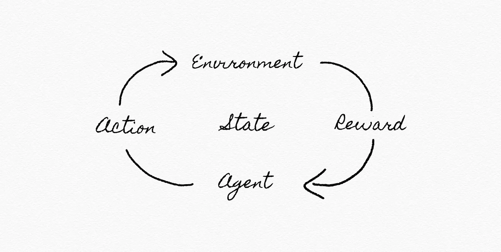
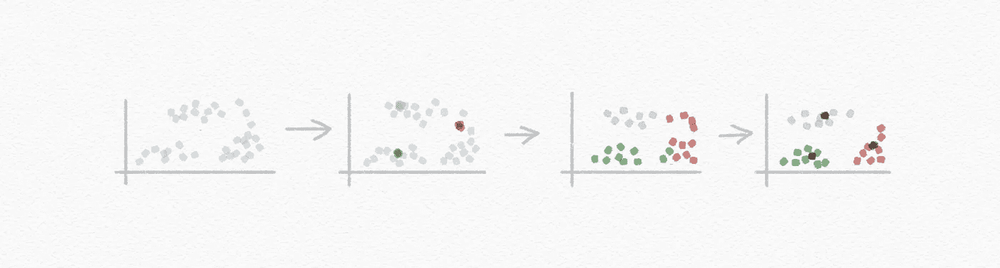

# 关于机器学习的 26 个词，每个精通人工智能的领导者都必须知道

> 原文：<https://pub.towardsai.net/ai-learning-2eaea82ee6d?source=collection_archive---------3----------------------->

## 人工智能

## 你觉得你能解释这些吗？检验你的知识！


*【这是* ***系列*** *的第 5 部。在继续之前，请确保您阅读了关于* [*搜索*](https://medium.com/towards-artificial-intelligence/ai-search-e0cb610237f6)[*知识*](https://medium.com/towards-artificial-intelligence/ai-knowledge-1020a00eb45d)[*不确定性*](https://medium.com/towards-artificial-intelligence/ai-uncertainty-4ac6810899ac) 和 [*优化*](https://medium.com/towards-artificial-intelligence/ai-optimization-b8735dc09448) *的内容。接下来的题目是* [*神经网络*](https://medium.com/towards-artificial-intelligence/26-words-about-neural-networks-every-ai-neural-networks-1085bd972fd5) *和* [*语言*](https://medium.com/towards-artificial-intelligence/ai-language-1d266caa72c6) *。】*


在过去的五年中，全球对“*机器学习*”的搜索查询激增。



[谷歌搜索趋势](https://trends.google.com/trends/explore?hl=en-US&tz=-120&date=all&hl=en-US&q=machine+learning&sni=3)，对“机器学习”的兴趣超时

或许，我们可以用这个术语缺乏明确统一的定义和边界来解释我们的好奇心。目前，最接近一致接受的版本可能听起来像“*计算机无需明确编程就能学习的能力。*

但是还有更多

我们的新闻供稿、商业期刊和知名专家用诸如*监督学习、无监督学习* g、r*e enforcement learning*以及最近最流行的*深度学习等时髦词汇轰炸我们。*

你如何区分所有这些字段？
而机器如何自我学习？

为了帮助你回答这些问题，本文围绕*学习领域，对 ***主要概念和术语*** 进行了简要的定义和解释。*

# *监督学习:*

***监督学习:**一个机器学习任务；基于示例输入-输出对学习将输入映射到输出的函数*

***分类:**监督学习任务；学习将输入点映射到离散类别的函数*

***最近邻分类:**一种算法，在给定输入的情况下，选择离该输入最近的数据点的分类*

***K-最近邻分类法:**一种算法，在给定输入的情况下，从 K 个最接近该输入的数据点中选择最常见的类别*

***权重因子:**赋予数据点的权重，以赋予其在组中较轻或较重的重要性*

***感知器学习规则:**一种方法，给定数据点 *(x，y)* ，根据以下内容更新每个权重:*

```
*w[i] = w[i] + α(actual value - estimate) × x[i]
w[i] = w[i] + α (y — h[w](x)) × x[i]*
```

**

*硬阈值与软阈值*

***支持向量机:**(或 SVM)一种流行的监督式机器学习算法，分析数据并将其分为两类，用于分类和回归分析*

**

*支持向量机*

***最大边距分隔符:**使任何数据点之间的距离最大化的边界*

**

*最大边距分隔符*

***回归:**有监督的学习任务；学习将输入点映射到连续值的函数，从而能够预测实数输出*

## *评估假设:*

***损失函数:**表示我们的假设表现有多差的函数*

***0–1 损失函数:**一个简单的指标函数，提供关于预测准确性的信息；当目标和输出相等时返回 0，否则返回 1:*

```
*L(actual, predicted) =
   0 if actual = predicted, 
   1 otherwise*
```

**

*0-1 损失函数*

***L1 损失函数:**一个用于最小化误差的损失函数，通过对真实值和预测值之间的所有*绝对*差异求和:*

```
*L(actual, predicted) = | actual - predicted |*
```

**

*L1 损失函数*

***L2 损失函数:**用于减少误差的损失函数，通过对真实值和预测值之间的所有*平方*差求和，从而惩罚单个高变化:*

```
*L(actual, predicted) = (actual — predicted)^2*
```

***过度拟合:**与特定数据集过于拟合的模型，因此可能无法推广到未来数据*

**

*过度拟合*

***正则化:**惩罚更复杂的假设，支持更简单、更一般的假设*

```
*cost(h) = loss(h) + λcomplexity(h)*
```

***维持交叉验证:**将数据拆分为训练集和测试集，以便在训练集和测试集上进行学习*

***K 倍交叉验证:**将数据拆分成 *k* 个集合，实验 *k* 次，每个集合作为一次测试集，剩余数据作为训练集*

# *强化学习:*

***强化学习:**给定一套奖励或惩罚，学习将来采取什么行动*

**

*强化学习*

***马尔可夫链:**描述一系列可能事件的随机模型，其中每个事件的概率仅取决于前一事件达到的状态*

**

*马尔可夫链*

***马尔可夫决策过程:**决策模型，代表状态、行动和奖励*

**

*马尔可夫决策过程*

***Q-learning:** 学习一个函数的方法；在状态 *s* 下执行动作 *a* 的值的估计*

```
*Q(s, a)*
```

***贪婪决策:**当处于状态 *s* 时，选择动作*a*max。问(美、俄)*

***ε-greedy:** (或ε-greedy)一种简单的机器学习算法，当在*探索性*和*开发性*选项之间做出决定时，该算法会考虑随机性:*

```
*1-ε   (exploitative, choose estimated best move)
ε     (explorative, choose a random move)*
```

**【如果你对探索 vs .剥削的争论很好奇，可以看看* [*这篇文章*](https://towardsdatascience.com/exploration-in-reinforcement-learning-e59ec7eeaa75) *作者*[*Ziad sall Oum*](https://medium.com/u/1f2b933522e2?source=post_page-----2eaea82ee6d--------------------------------)*。】**

***函数逼近:**逼近 *Q(s，a)* ，通常通过组合各种特征的函数，而不是为每个状态-动作对存储一个值*

# *无监督学习:*

***无监督学习:**给定输入数据而没有任何额外的反馈和学习模式*

***聚类:**将一组对象组织成组，使得相似的对象倾向于在同一组中*

***K-means 聚类:**一种基于重复向聚类分配点并更新这些聚类的中心来对数据进行聚类的算法*

**

*k 均值聚类*

*现在，你已经准备好继续成为一名成熟的人工智能领导者，你应该能够解释机器学习的关键术语和概念。这个领域将持续存在，并有望成为这十年中创造价值的主要来源之一。*

> *机器学习的一个突破值十个微软。*
> 
> *比尔·盖茨*

*探索类似 ***相关话题*** ，包括 [*搜索*](https://medium.com/towards-artificial-intelligence/ai-search-e0cb610237f6)[*知识*](https://medium.com/towards-artificial-intelligence/ai-knowledge-1020a00eb45d)[*不确定性*](https://medium.com/towards-artificial-intelligence/ai-uncertainty-4ac6810899ac)*[*优化*](https://medium.com/towards-artificial-intelligence/ai-optimization-b8735dc09448)[*神经网络*](https://medium.com/towards-artificial-intelligence/26-words-about-neural-networks-every-ai-neural-networks-1085bd972fd5)[*语言*](https://medium.com/towards-artificial-intelligence/ai-language-1d266caa72c6) 。**

****

*****喜欢读什么？*** ***渴望了解更多？*** *跟我上* [*中*](https://medium.com/@yannique) *或*[*LinkedIn*](https://www.linkedin.com/in/yannique/)*。***

*****关于作者:*** Yannique Hecht 作品在结合策略、客户洞察、数据、创新等领域。虽然他的职业生涯一直在航空、旅游、金融和技术行业，但他对管理充满热情。Yannique 专门开发 AI &机器学习产品商业化的策略。**