# 创业公司和非技术营销人员的人工智能营销

> 原文：<https://pub.towardsai.net/ai-marketing-for-non-technical-marketers-ddd5d4a91539?source=collection_archive---------0----------------------->

## 非技术人员实用指南

凯文·Ku 在 [Unsplash](https://unsplash.com/s/photos/machine-learning?utm_source=unsplash&utm_medium=referral&utm_content=creditCopyText) 上的照片

人工智能目前是一个“热门话题”,它有大量的媒体报道，公众的讨论也越来越多。这意味着市场营销人员和企业主需要跨越“趋势”,以保持相关性并获得更好的结果。

网上关于这个话题的大多数内容要么太专业，要么太模糊。很难找到向“创业创始人&非技术营销人员”介绍这些相对复杂的概念的内容——为什么？因为一般来说，公众对人工智能的认知是模糊的

将人工智能作为您技能的一部分，您将能够:

*   实时理解越来越多的数据。事实上，到 2025 年，全球数据将增长 61%，达到 175 兆字节。([资料来源:IDC](https://www.seagate.com/files/www-content/our-story/trends/files/idc-seagate-dataage-whitepaper.pdf) )
*   创建像网飞这样的人工智能推荐系统，每年在内容生成/推广上节省数百万美元。([来源:网飞](https://dl.acm.org/citation.cfm?id=2843948))
*   提高您对销售周期的理解，轻松将战略和支出与销售结果关联起来。[福布斯](https://www.forbes.com/sites/louiscolumbus/2019/07/07/10-charts-that-will-change-your-perspective-of-ai-in-marketing/#2b0b6af02d03)
*   使用内容个性化和来自客户洞察的预测分析。大多数首席营销官的优先事项

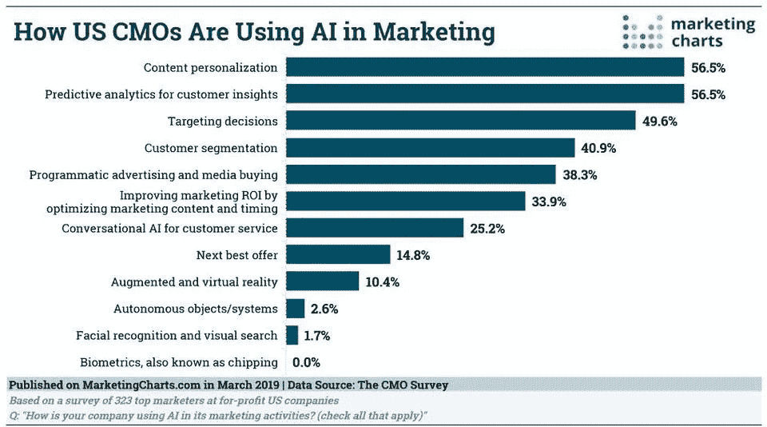

来源:CMOs' [人工智能的主要用途:个性化和预测分析。](https://www.marketingcharts.com/customer-centric/analytics-automated-and-martech-107714)

## 问题是

到目前为止，你应该考虑将人工智能作为改善营销的一个选项，但考虑到普通美国成年人每天花在网上冲浪的时间超过 11 个小时，如果你是一个非技术人员，你将花大量时间在网上搜索和阅读无用的内容，试图了解关于人工智能的一切，但以你目前的职责，你如何能够在游戏中保持领先地位，并在日常营销活动中应用人工智能？你负担不起一个月花 100 个小时阅读和过滤信息。

更不用说在那些令人沮丧的阅读无用的不可操作的内容之后，工作是你最不想做的事情。

## 解决方案

本指南消除了周围的宣传和噪音，展示了你今天可以采取什么措施来提高你的业务成果。

它会让你的生活变得更加愉快，甚至通过向你展示为你的企业成功运行人工智能营销项目的模式和策略来帮助你赚更多的钱。

# 这篇文章是如何组织的？

本文分为以下几个部分:

*   重要考虑因素:技术和营销概念
*   非技术人员对人工智能的简单定义
*   一个非常简单的框架来确定你的企业是否准备好接受人工智能(创业公司的增长营销战略框架)
*   面向非技术营销人员的人工智能流程
*   在市场营销中开始使用人工智能需要开发的应用、挑战和技能
*   易于入门的工具

## 这本指南是给谁的？

本指南面向创始人、首席执行官、首席营销官和对学习如何使用人工智能提高营销绩效感兴趣的非技术营销人员

# 重要注意事项

## 技术概念

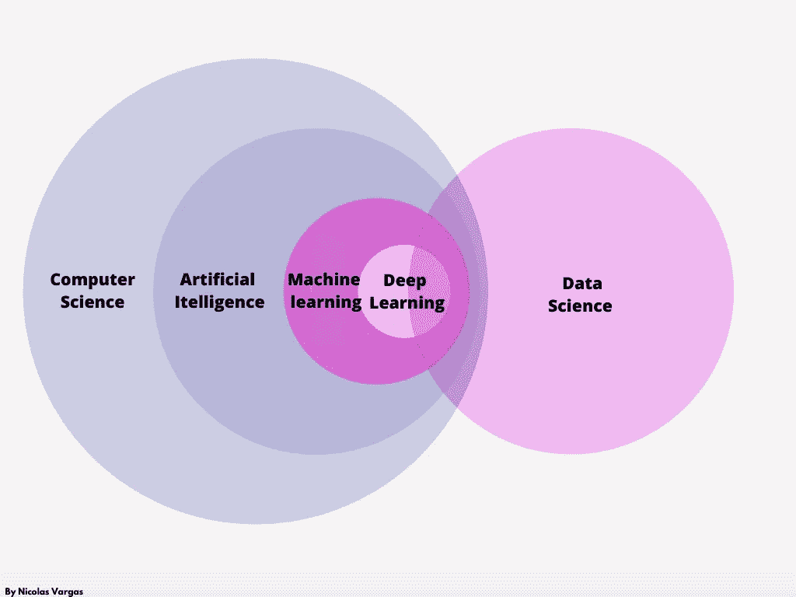

人工智能欧拉图—来源:【elementsofai.com 

*   计算机科学:研究计算机系统所有方面(软件、硬件和网络)的一门科学
*   机器学习:利用经验或数据提高其在给定任务中的性能的系统。
*   深度学习:这是机器学习的一个子领域，教计算机做人类自然会做的事情
*   数据科学:负责开发从结构化和非结构化数据中提取知识的过程和系统的科学分支

## 营销概念:创业成长营销框架

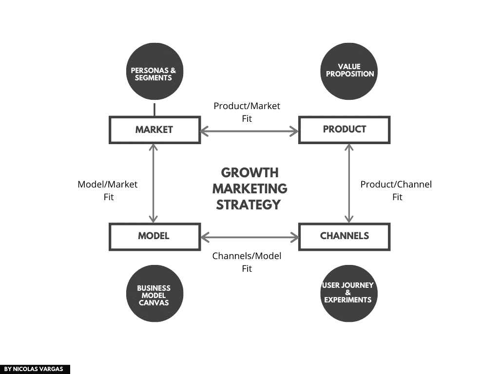

增长型营销战略(受 Brian Balfour 的[增长框架](http://growth-framework) &增长型战略的启发)

作为先决条件，有 4 个适合

*   产品/市场契合度:如果当你问你的产品会退出市场时，至少有 40%的观众没有感到不安，那么你就没有产品/市场契合度
*   产品/渠道匹配:渠道控制你产品的规则
*   渠道/模式匹配:您的客户终身价值大于 CAC
*   模型/市场匹配:你的商业模型对市场有意义吗？— Imaging 向养老金领取者提供教练服务，而你提供的唯一支付方式是比特币。

# 非技术人员的人工智能定义

人工智能是一门科学学科，负责开发像人类一样解决问题的系统。人工智能系统有两个主要特征:

1.自主性:人工智能系统应该能够在没有用户持续指导的情况下执行任务。

2.适应性:人工智能系统应该能够通过从经验中学习来提高性能。

这是你需要知道的关于人工智能的唯一技术材料，所以知道每当有人试图向你出售下一个神奇的“营销人工智能工具”，你可以很容易地忽略那些实际上不提供人工智能解决方案的人。

没有一个通用的答案

# 面向非技术营销人员的人工智能流程

当在你的业务中使用人工智能时，你需要将市场营销和数据科学结合起来，遵循以下流程

## 第一步:定义要解决的商业营销问题

## 第二步:使用人工智能画布，找出人工智能如何解决你的问题

## 第三步:确定哪种算法对你的问题更有效

## 第四步:规划好一切

## 第一步:定义要解决的商业营销问题

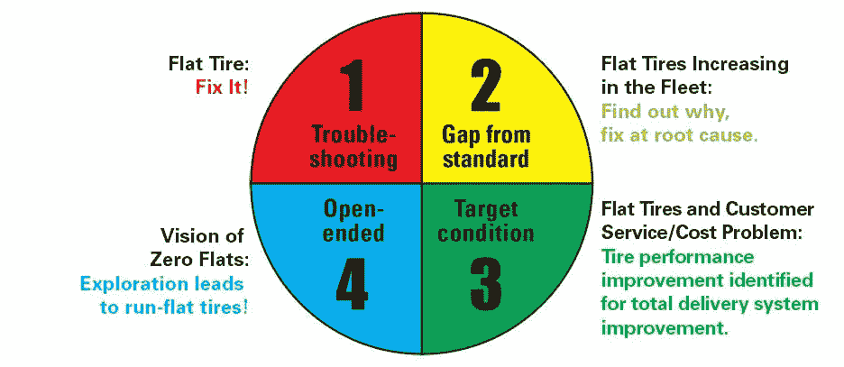

来源:[你有什么问题？](https://www.lean.org/shook/DisplayObject.cfm?o=4803)

*   **故障排除**:通过将事物恢复到已知标准来快速修复异常情况的反应过程。
*   **与标准的差距**:一个结构化的问题解决过程，通过问题定义、目标设定、分析、对策实施、检查、标准和后续活动，更加针对根本原因。
*   **目标状态**:超越现有绩效水平的持续改进(kaizen)，以达到新的更好的标准或条件。
*   **开放式和创新**:通过创造性和对愿景或理想状态的综合来无限制地追求，这种愿景或理想状态需要彻底的改进，并为客户带来超出当前水平的意想不到的产品、流程、系统或价值。

## 第二步:使用人工智能画布，找出人工智能如何解决你的问题

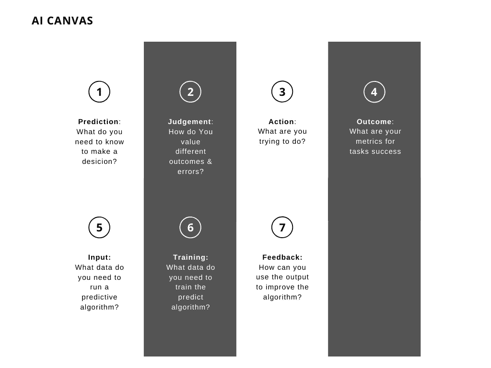

来源:[借助 AI 开始做决策的简单工具](https://hbr.org/2018/04/a-simple-tool-to-start-making-decisions-with-the-help-of-ai)

## 第三步:确定哪种算法对你的问题更有效

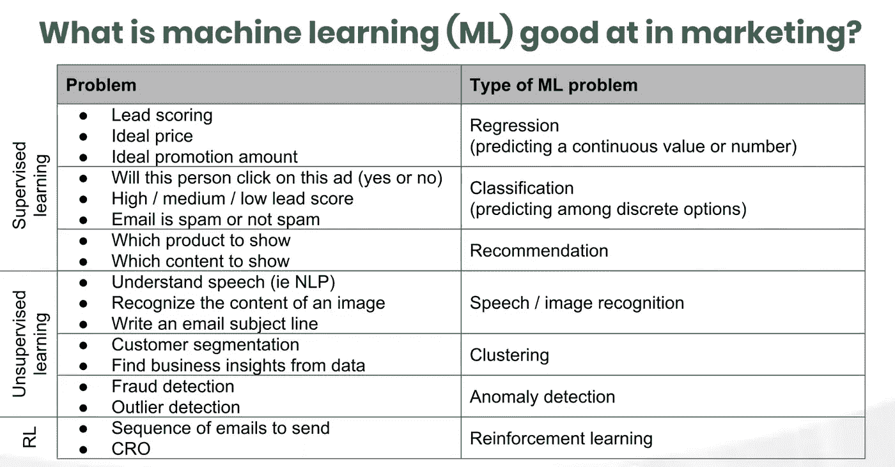

来源:[为营销人员揭开人工智能的神秘面纱:A/B 测试峰会](https://www.intellimize.com/blog/demystifying-ai-for-marketers-video/)

## 第四步:规划好一切

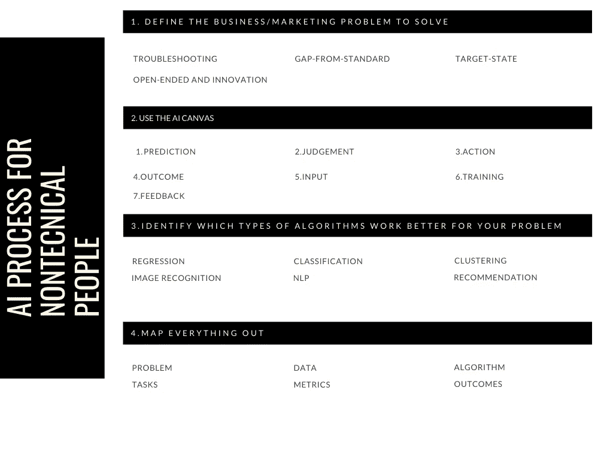

灵感来源: [Ai 画布](https://hbr.org/2018/04/a-simple-tool-to-start-making-decisions-with-the-help-of-ai) & [为营销人员揭秘 Ai](https://www.intellimize.com/blog/demystifying-ai-for-marketers-video/)

# 人工智能在市场营销中的应用

人工智能为企业提供了深入理解客户属性、预测他们的行为以及创建与他们产生共鸣的个性化活动的能力，更不用说通过 NLP(自然语言处理)实现的客户服务自动化了。

这里列出了人工智能在市场营销中最常见的应用。

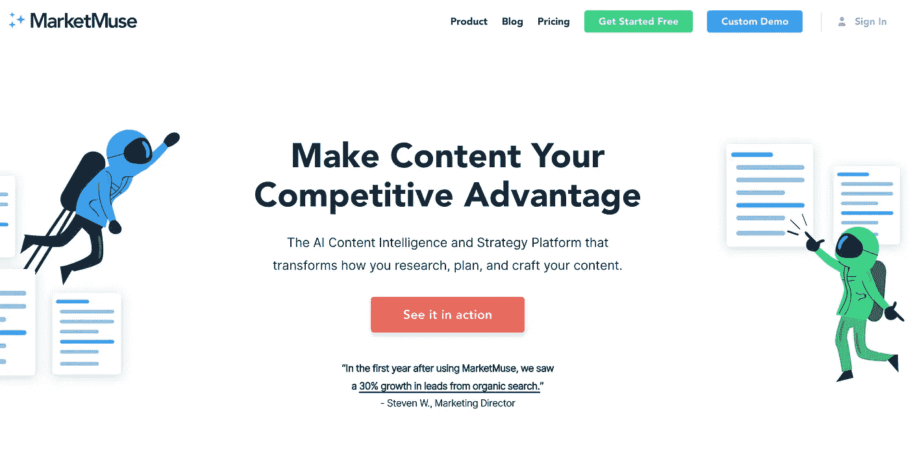

[marketmuse.com](https://www.marketmuse.com/)

**内容策略:**借助 AI 简化内容研究流程，规模化构建 Ai 驱动的内容策略。

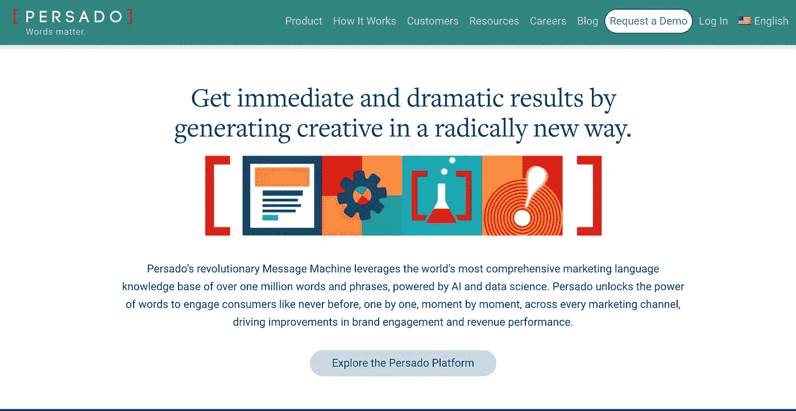

[persado.com](https://www.persado.com/)

**信息传递:**人工智能正在重塑营销创意，它应用了一个由人工智能驱动的知识库[,其中包含 25 种语言的 100 多万个标记和评分的单词、短语和图像，来创建吸引人的信息传递，与您的受众产生共鸣](https://www.persado.com/how-it-works/)

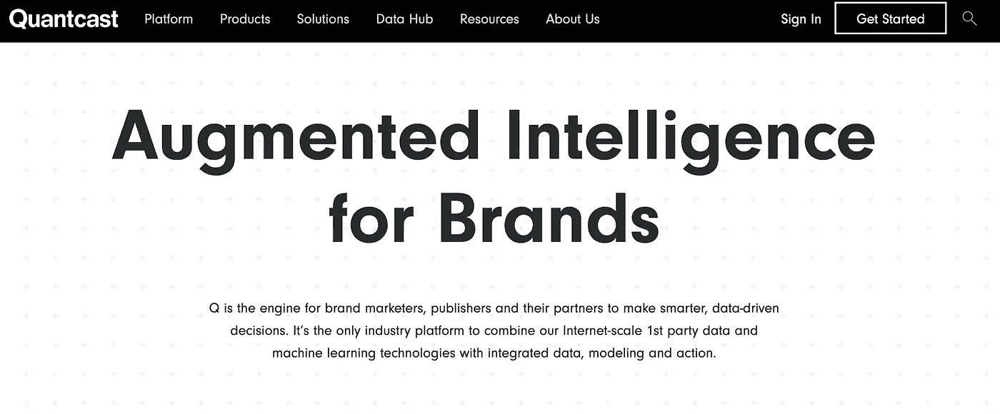

[quantcast.com](https://www.quantcast.com/)

**用户行为&需求**:品牌正在使用人工智能来理解[用户行为和需求](https://hackernoon.com/six-emerging-applications-of-ai-in-marketing-a6e7a78035e1)。每当用户使用互联网时，他们通常会留下在线足迹。营销人员可以利用用户的社交媒体对话和搜索数据来了解他们的需求。

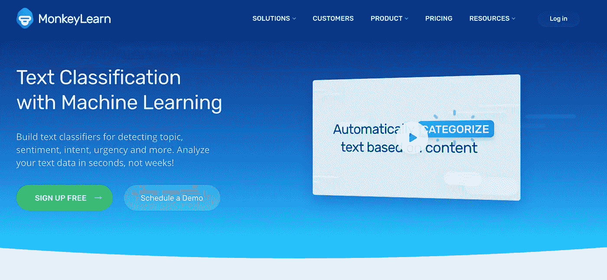

[monkeylearn.com](https://monkeylearn.com/)

**情绪分析** : AI 还可以帮助从用户数据中检测情绪和情绪。通过这些数据，可以锁定特定的用户，从而实现个性化的服务/产品推荐。

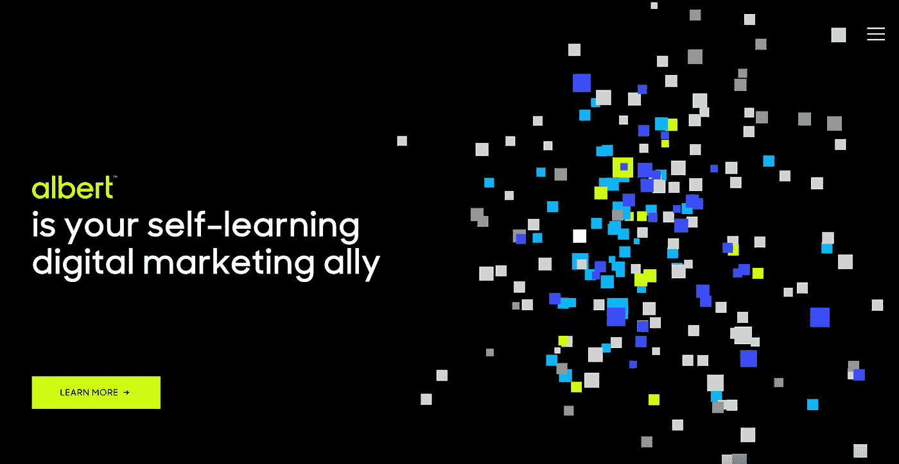

[阿尔伯特·艾](https://albert.ai/)

**用户细分和** [**营销自动化**](https://medium.com/better-marketing/the-complete-guide-to-proper-marketing-automation-4710dfb38fc3) :识别潜在买家并锁定这些潜在客户对销售人员来说是一项繁忙的任务。然而，这一过程可以通过使用人工智能轻松分割成千上万的用户属性和事件(行为)来实现自动化，从而节省时间和减少人力。

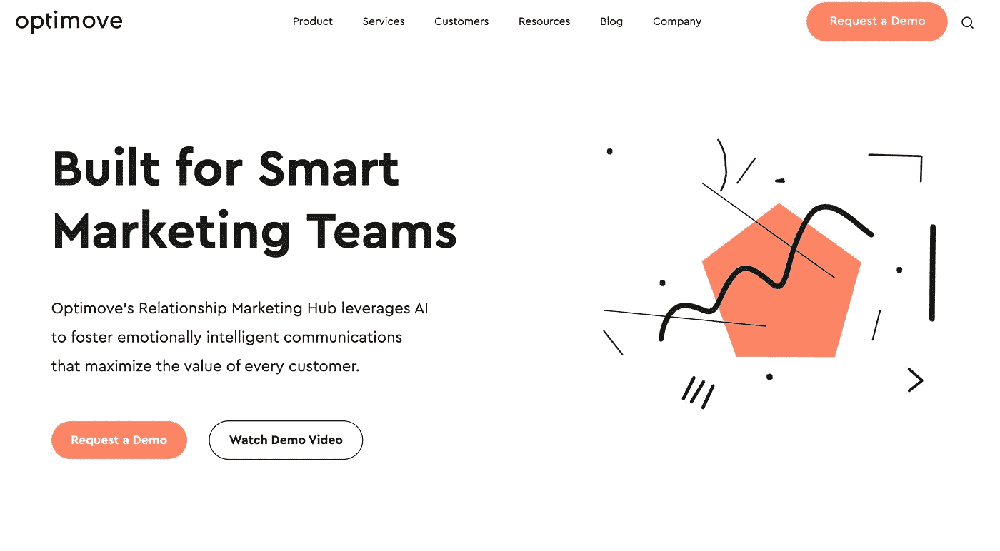

[optimove.com](https://www.optimove.com/)

**营销优化**:人工智能还可以用来优化[客户支持](https://hackernoon.com/six-emerging-applications-of-ai-in-marketing-a6e7a78035e1)、[策划内容](https://hackernoon.com/six-emerging-applications-of-ai-in-marketing-a6e7a78035e1)、power [推荐引擎](https://hackernoon.com/six-emerging-applications-of-ai-in-marketing-a6e7a78035e1)、[虚拟辅助](https://hackernoon.com/six-emerging-applications-of-ai-in-marketing-a6e7a78035e1)。

# 人工智能给非技术营销人员带来的挑战

人工智能需要很好地理解基本的科学/技术概念和营销原则。在这里，我们帮助您识别非技术人员最常见的挑战

*   根据雷伊·达里奥的说法，“原则是成功应对现实，从生活中获得你想要的东西的方法。”因此，请确保您了解上面提到的技术和营销原则。
*   **技术经验**:具有 R 或 Python 等数据科学编程语言的基本经验。大多数人都有类似 Ab 测试(一个有根据的猜测来决定赢家)和基于规则的营销这样的方法的经验。
*   **清晰性&目的**:人工智能通常无法解释它的推论和它的目的。人类需要为机器定义它们
*   AI 的 [**实现**](https://simmachines.com/applications-ai-marketing/) 是阻碍其主流采用的主要障碍。尽管许多应用程序包含机器学习，并且可以独立工作，但在某些情况下仍然需要人工监督和管理。请记住，根据您的组织规模，您可能需要外部帮助，以便从人工智能程序中受益。

# 技能

*   **营销/业务战略** —你需要能够制定高水平的计划，以在不确定的条件下实现业务/营销目标。
*   **基本的数据分析和编码技能**:人工智能帮助你处理大量的数据，但你仍然需要弄清楚如何使用这些数据来推动他们的业务向前发展。"
*   持续学习:人工智能是一门不断变化的动态科学，你需要不断学习和发展
*   **沟通技巧**:了解和使用人工智能还不够，讲故事和沟通技巧对于让企业的其他利益相关者参与进来至关重要

# 易于入门的工具

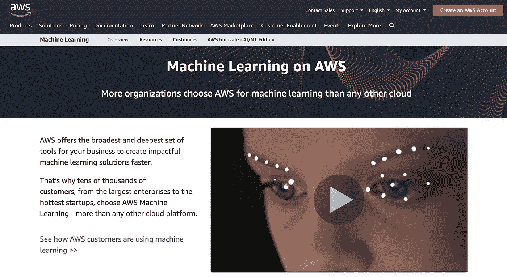

[带 AWS 的 AI](https://aws.amazon.com/ai/)

AWS 面向企业的机器学习工具集

你可以免费开始。

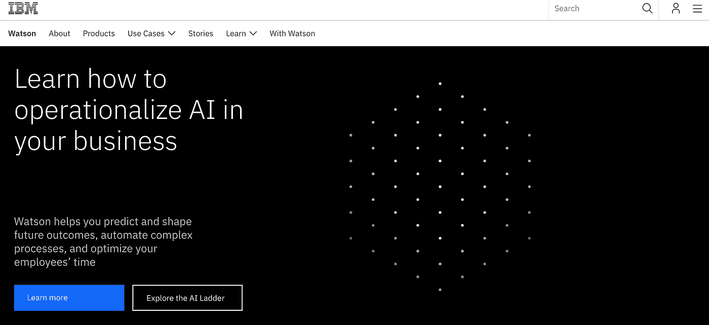

[IBM 沃森](https://www.ibm.com/watson)

IBM Watson 帮助数据科学家和分析师准备数据并[跨任何云构建大规模模型](https://dataplatform.cloud.ibm.com/docs/content/wsj/getting-started/welcome-main.html?audience=wdp&context=wdp)。

你可以免费开始。

# 行业地图

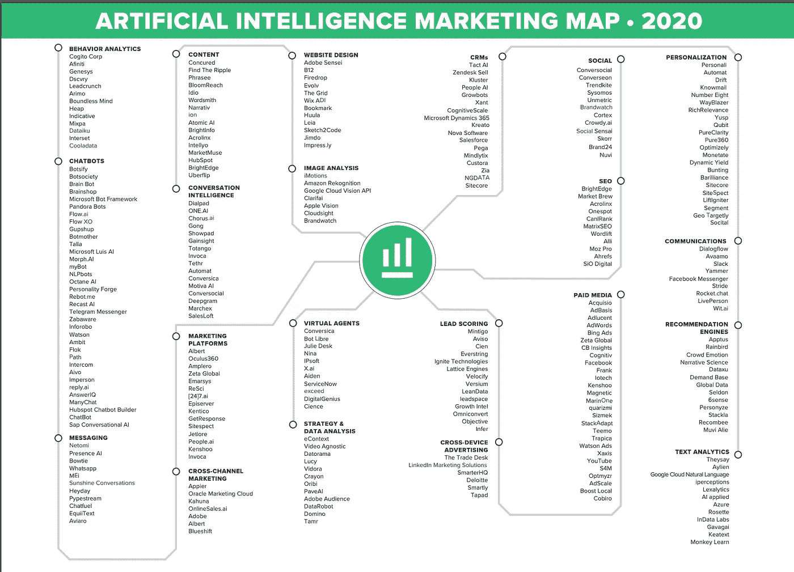

《2020 年人工智能营销地图》来源:[ovrdrv.com](https://www.ovrdrv.com/)

# 结束语

我希望这篇指南能帮助你更好地理解人工智能在市场营销中的作用。

现在我想把它交给你:

你最喜欢本指南中的哪个概念或资源？

或者也许你有一个很好的内容，你认为我应该添加。

不管怎样，请马上在下面留言告诉我。