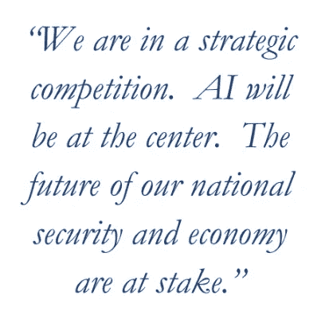
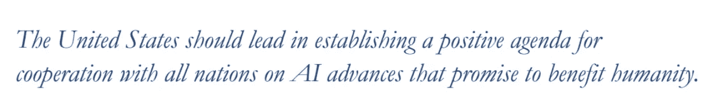

# AI 民族主义。如何阻止技术围栏

> 原文：<https://pub.towardsai.net/ai-nationalism-how-to-stop-technological-fencing-6856b387545e?source=collection_archive---------0----------------------->

## 关于人工智能和军事家如何反思技术竞争和防止技术灾难的 96 页近期报告摘要

来源:运球，由[达利博·帕伊奇](https://dribbble.com/Dalibor_Pajic)

不久前，NSCAI ( [人工智能国家安全委员会](https://www.nscai.gov/))发表了一份[中期报告](https://drive.google.com/file/d/153OrxnuGEjsUvlxWsFYauslwNeCEkvUb/view)(最终报告将于 2020 年 11 月出炉)。这是一份 96 页、239 个链接的重要文件，其中包含几个关键点。

首先，人工智能作为国家安全保障的绝对优先地位得到了形成和证明。同时，给出了所有主要术语和分类法，以及来自 AI 对美国的 [8 大威胁(包括国家和军事方面)。](https://drive.google.com/file/d/153OrxnuGEjsUvlxWsFYauslwNeCEkvUb/view)

除此之外，对事态进行了分析。

现在潜在的威胁包括俄国和 Mainland China。最后一个危险度是四倍。有鉴于此，有人提出了五种压制中国人(或任何人)前进的方法:

*   人工智能资金的增加:非军事开支应该增加 12 倍
*   人工智能驱动的商业和军事联盟的建立:军事/商业有效合作需要解决的 4 个主要挑战
*   全球人工智能人才密集搜索和招聘
*   防漏技术和创新
*   建立国际合作，对抗恶意和民族主义色彩的人工智能。值得注意的是，有人指出，美国外交应该对与中国和俄罗斯在安全促进人工智能和管理人工智能对战略稳定的影响方面的可能合作持开放态度。

总的来说，人工智能行业正在增长，新一代技术正在兴起，这些技术能够彻底改变我们生活的社会。因此，我们可以看到各国都在进行隔离。

> 我们得到的不是国家合作，而是技术竞争。

这并不是新闻——在相当长的一段时间里，许多专家预测:“人工智能民族主义”最终将改变地缘政治格局。然而，到目前为止，还没有关于停止这种国家圈地的具体计划。

[NSCAI](https://drive.google.com/file/d/153OrxnuGEjsUvlxWsFYauslwNeCEkvUb/view)

尽管有一个人——海军上将迈克·罗杰斯，一位杰出的访问学者，ICPC，分享了他关于如何重新思考技术竞争的想法。他与 ASPI 国际网络政策中心合作，出版了一本优秀的出版物——《T4:能力、竞争和交流》。我带来了这本出版物的主要思想，让你们看起来更简单。

## 技术战略

首先，已经有两大类技术——人工智能和量子计算即将改变人们生活的许多方面。其后果可能大相径庭——从“人人幸福”到“人人死亡”。

反正结果是大家都输了。这听起来可能有些夸张，但如果你回想起这是一个军人，一个现实主义者，而不是一些天真的理想主义者的话，你也会感到有点头晕。

此外，新一代技术正在塑造商业和社会。以 5G 为例。可以肯定的是，在未来三年内，将会出现下一个 6G 的新一代无线连接。

因此，拥有更发达市场的发达国家采取了守势。他们的国家战略变得带有技术民族主义的口吻，具有防御性。

这反映在以下方面:

*   新技术被视为产品，而非能力
*   国家安全和经济竞争力成为当务之急
*   过度依赖国家资源只是为了防止其他技术的入侵

在这种方法下，所有人都是输家——无论是技术领先者还是落后者，无论是自由派还是威权国家。今天的 5G 和华为的对立只是一个开始——这种技术对抗将继续过热。

## 需要做些什么来防止这种适得其反的结果？

*   应该修改战略构想
*   新技术应该被视为新能力，而不是新产品
*   协同国际合作必须成为头号国家优先事项
*   应该建立和加强有效的大规模联盟

当人工智能被用作统治和威慑的武器时，它可能像核武器一样危险。每个人都应该更有意识一点；否则，后果将不可挽回。

从好的方面来看，我们知道合作正在取得进展，并导致更显著的进步。此外，有目的定位的公司在双快的时间内成长。重要的是要记住，伟大的想法会带来全球性的变化。

我们必须记住，最终的责任在于我们，那些为技术发展做出贡献的人。我们绝不能忘记人道主义。